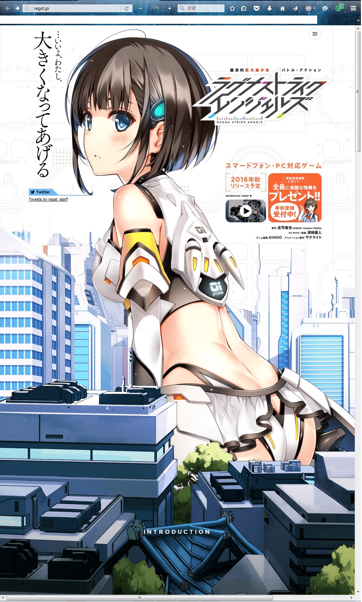
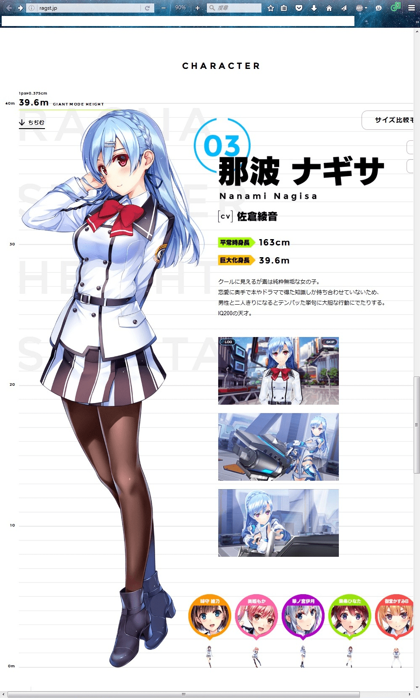
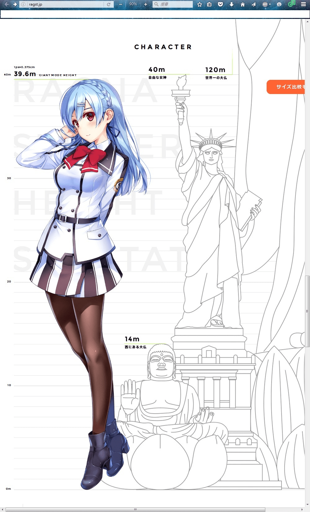

# 听说Ragnastrike Angels是秋季会出来营运

作者：田棒棒

TID：21724

<title>1</title> <link href="../Styles/Style.css" type="text/css" rel="stylesheet">

# 1

没查到。。。。。            <title>2</title> <link href="../Styles/Style.css" type="text/css" rel="stylesheet">

# 2

預定第三季開始營運不代表九月開張啊大哥 <title>3</title> <link href="../Styles/Style.css" type="text/css" rel="stylesheet">

# 3

一般都是11月30号          <title>4</title> <link href="../Styles/Style.css" type="text/css" rel="stylesheet">

# 4

这个来说目前还为时尚早 <title>5</title> <link href="../Styles/Style.css" type="text/css" rel="stylesheet">

# 5

转自 twitter，大意是说网站更新了。

> 【更新】公式サイトをリニューアルしました！
> 巨大化する女の子と言うコンセプトをより感じられるサイトに変更しました。
> 新たにカタカナの作品ロゴを作成し、キャラクター相関図などの情報も追加しています。
> ぜひご覧ください。
> [http://ragst.jp](http://ragst.jp)   #ラグスト

<title>6</title> <link href="../Styles/Style.css" type="text/css" rel="stylesheet">

# 6

*本帖最後由 ckw 於 2016-9-2 15:02 編輯*

> [taroxd 發表於 2016-9-1 12:39](https://giantessnight.cf/gnforum2012/forum.php?mod=redirect&goto=findpost&pid=306912&ptid=21724)
> 转自 twitter，大意是说网站更新了。

終於更了…？好久啊。

官網加了相關圖，每位角色巨大化後的總長（附帶與常人比例）。
還有更新了背景圖，原本主角坐姿的圖加了街道上去襯托主角巨大化後有多巨型（屋舍真的是「加上去」，拉動時圖會位移，類似立體書 。可能是想制造距離感。）
那幅圖弄得很大，橫向屏幕顯示不了全圖，直向勉強看到全身。
可是看起來不像３８ｍ

給翻不了牆的觀眾看的官方圖
38m約11層高，不止38m吧？
<ignore_js_op>

**1902.jpg** *(534.85 KB, 下載次數: 0)*

[下載附件](forum.php?mod=attachment&aid=NjM3Mzl8YjAwNDVmYzJ8MTY3NDA2NzkyMHwxODIzMHwyMTcyNA%3D%3D&nothumb=yes)

2016-9-2 14:56 上傳

近40m的妹子和人比例，人只有腳踝程度
<ignore_js_op>

**19022.jpg** *(399.26 KB, 下載次數: 0)*

[下載附件](forum.php?mod=attachment&aid=NjM3NDB8NDMyZmUzODJ8MTY3NDA2NzkyMHwxODIzMHwyMTcyNA%3D%3D&nothumb=yes)

2016-9-2 14:56 上傳

和人型景點比較（自由神像犯規，使用了執台增高）
<ignore_js_op>

**19023.jpg** *(333.68 KB, 下載次數: 0)*

[下載附件](forum.php?mod=attachment&aid=NjM3NDF8OWQxZmUzMjJ8MTY3NDA2NzkyMHwxODIzMHwyMTcyNA%3D%3D&nothumb=yes)

2016-9-2 14:56 上傳</ignore_js_op></ignore_js_op></ignore_js_op>