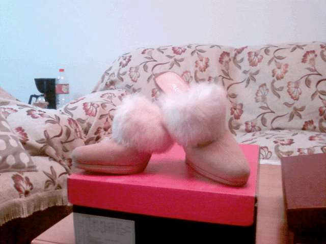

# 哇```谁想变这个mm的鞋子~

作者：hubert

TID：7152

<title>1</title> <link href="../Styles/Style.css" type="text/css" rel="stylesheet">

# 1

这是这个mm在她晒鞋子的帖子里说的，好让人浮想联翩哦。。。

    里面也是毛毛的．不穿袜子穿进去可舒服了~~我买回来我家bf第一句话就问．毛毛脏了你打算怎么打理？我想都没想就说给你舔舔~~~~~~~~~哈哈哈哈
    最喜欢那一圈毛毛了，跟很细，但难得的不累脚．一般春天穿．但见俺轻盈的走过，鞋跟留在地砖缝隙里，蹦跳着回去把鞋拔出来�����场景，很销魂啊很销魂．．．
    让它出来和大家见个面哦．摆个poss．拍个靓照哈．1~~~2~~~茄子~~~~~~ <title>2</title> <link href="../Styles/Style.css" type="text/css" rel="stylesheet">

# 2

 <ignore_js_op>[11129944_17823544.jpg](forum.php?mod=attachment&aid=MTg1Njl8MjNiOGZmMTV8MTY3NDA2ODkxNXwxODIzMHw3MTUy&nothumb=yes) *(45.39 KB, 下載次數: 17)*

[下載附件](forum.php?mod=attachment&aid=MTg1Njl8MjNiOGZmMTV8MTY3NDA2ODkxNXwxODIzMHw3MTUy&nothumb=yes)

2010-3-18 23:17 上傳 [](javascript:;) [](javascript:;)

[](javascript:;)</ignore_js_op> <title>3</title> <link href="../Styles/Style.css" type="text/css" rel="stylesheet">

# 3


要是有地方能学72变就好了，哎呀呀 <title>4</title> <link href="../Styles/Style.css" type="text/css" rel="stylesheet">

# 4

很漂亮的鞋子。

不過毛毛髒了 的確是問題- - <title>5</title> <link href="../Styles/Style.css" type="text/css" rel="stylesheet">

# 5


是啊，真要变成她的这双鞋子很有可能因为她怕把毛毛弄脏舍不得穿
好长时间呆在漂亮的鞋盒子里
闷 <title>6</title> <link href="../Styles/Style.css" type="text/css" rel="stylesheet">

# 6

这个mm的另一双鞋子 <title>7</title> <link href="../Styles/Style.css" type="text/css" rel="stylesheet">

# 7

 <ignore_js_op>[fghfhghgggggggg (8).jpg](forum.php?mod=attachment&aid=MTg1ODh8NGFjNWNhOGV8MTY3NDA2ODkxNXwxODIzMHw3MTUy&nothumb=yes) *(65.57 KB, 下載次數: 0)*

[下載附件](forum.php?mod=attachment&aid=MTg1ODh8NGFjNWNhOGV8MTY3NDA2ODkxNXwxODIzMHw3MTUy&nothumb=yes)

2010-3-18 23:45 上傳 [](javascript:;) [](javascript:;)

[.jpg")](javascript:;)</ignore_js_op> <title>8</title> <link href="../Styles/Style.css" type="text/css" rel="stylesheet">

# 8

> 原帖由 *qnjrcmzh* 於 2010-3-18 23:44 發表 [](http://giantessnight.com/gnforum/redirect.php?goto=findpost&pid=97129&ptid=7152)
> 这个mm的另一双鞋子

我要变
你也喜欢变物了?呵 <title>9</title> <link href="../Styles/Style.css" type="text/css" rel="stylesheet">

# 9

貌似有点恋足了，呵呵。
其实，我也有点恋足，我女朋友还是挺开通的。
那天我对她说，你的鞋子有没不要的，我收藏起来。
她说都脏了，也都旧了，哪还有人要。
我说我论坛里的兄弟们肯定都喜欢，收钱都会有人买呢。
她居然说，这样不错，那我不用上班了，以后就在家穿鞋，然后你去卖............
 <title>10</title> <link href="../Styles/Style.css" type="text/css" rel="stylesheet">

# 10

这个鞋子是哪里找到的呀 <title>11</title> <link href="../Styles/Style.css" type="text/css" rel="stylesheet">

# 11

 前几天俺变的~哈 <title>12</title> <link href="../Styles/Style.css" type="text/css" rel="stylesheet">

# 12

话说 我比较喜欢板鞋之类的 恩 恩 <title>13</title> <link href="../Styles/Style.css" type="text/css" rel="stylesheet">

# 13

好建議~~ <title>14</title> <link href="../Styles/Style.css" type="text/css" rel="stylesheet">

# 14

有没有想过踩到狗屎 <title>15</title> <link href="../Styles/Style.css" type="text/css" rel="stylesheet">

# 15

靴子好啊，虽然这个毛毛的也很可爱 <title>16</title> <link href="../Styles/Style.css" type="text/css" rel="stylesheet">

# 16


其实俺喜欢变后边那个鞋子