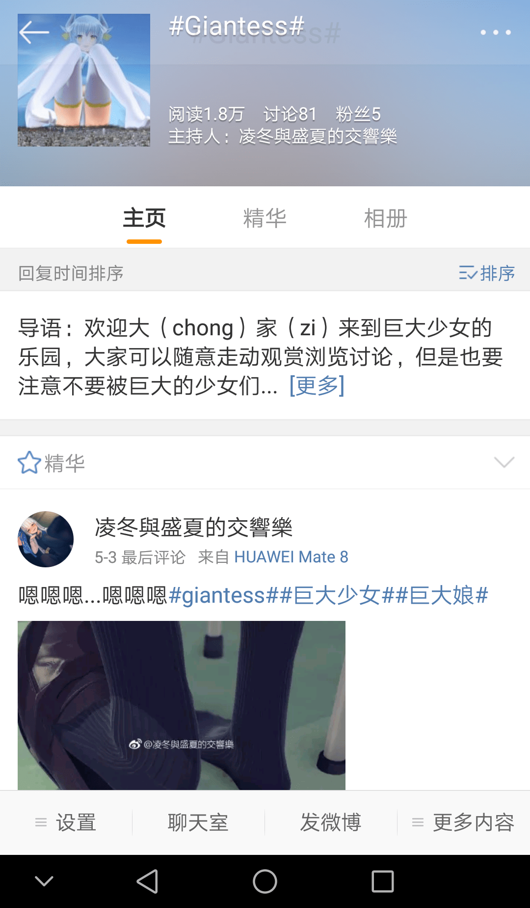
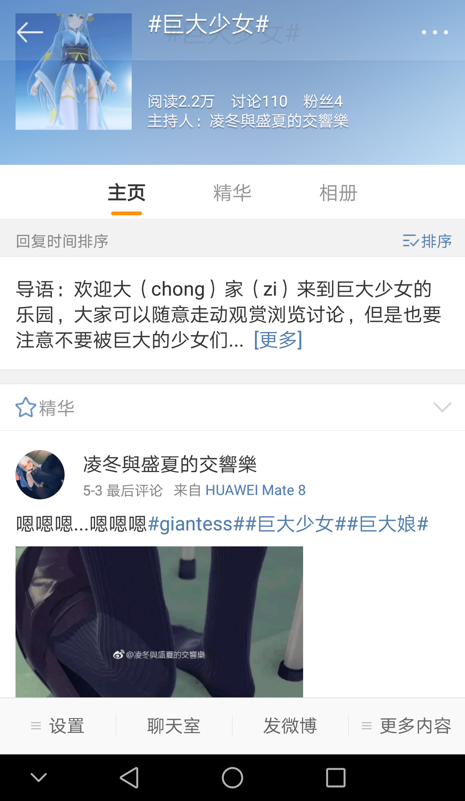

# 哈哈哈哈，微博话题试水。

作者：Luffy

TID：23295

<title>1</title> <link href="../Styles/Style.css" type="text/css" rel="stylesheet">

# 1

虽然有的图片初审不通过，但是到底还是成了话题。于是... <ignore_js_op>

**IMG_20170621_150210.png** *(512.04 KB, 下載次數: 4)*

[下載附件](forum.php?mod=attachment&aid=NjgzOTR8MWEwMDM0NjJ8MTY3NDA2NzU3MHwxODIzMHwyMzI5NQ%3D%3D&nothumb=yes)

2017-6-21 15:18 上傳

<ignore_js_op>

**IMG_20170621_150305.png** *(498.75 KB, 下載次數: 2)*

[下載附件](forum.php?mod=attachment&aid=NjgzOTN8ODgxMDEzZGR8MTY3NDA2NzU3MHwxODIzMHwyMzI5NQ%3D%3D&nothumb=yes)

2017-6-21 15:18 上傳

似乎还是可以的
<title>2</title> <link href="../Styles/Style.css" type="text/css" rel="stylesheet">

# 2

喵喵喵 ，很不错哦，关注你了 <title>3</title> <link href="../Styles/Style.css" type="text/css" rel="stylesheet">

# 3

原来这个微博是楼主啊 <title>4</title> <link href="../Styles/Style.css" type="text/css" rel="stylesheet">

# 4

我那时候看都就知道是圈内人 <title>5</title> <link href="../Styles/Style.css" type="text/css" rel="stylesheet">

# 5

看到马上去微博加关注了，话说连微博都可以扩大咱们的圈子啊 <title>6</title> <link href="../Styles/Style.css" type="text/css" rel="stylesheet">

# 6

讲真这么扩大圈子很容易进一些奇葩，到时候不仅微博被举报，这个论坛都可能炸巨大少女吧怎么死的你们就忘了吗 <title>7</title> <link href="../Styles/Style.css" type="text/css" rel="stylesheet">

# 7

立马关注博主了  但是真心搞不懂网上那些自己明明一边看着很爽 又一边举报的人的心理 <title>8</title> <link href="../Styles/Style.css" type="text/css" rel="stylesheet">

# 8

> [caoshuhao123456 發表於 2017-6-21 15:38](https://giantessnight.cf/gnforum2012/forum.php?mod=redirect&goto=findpost&pid=336433&ptid=23295)
> 喵喵喵 ，很不错哦，关注你了

喵喵喵～～到底喵什么....
<title>9</title> <link href="../Styles/Style.css" type="text/css" rel="stylesheet">

# 9

> [Lanclot 發表於 2017-6-21 16:10](https://giantessnight.cf/gnforum2012/forum.php?mod=redirect&goto=findpost&pid=336436&ptid=23295)
> 原来这个微博是楼主啊

是的，就是我啊～～～ <title>10</title> <link href="../Styles/Style.css" type="text/css" rel="stylesheet">

# 10

> [wwwnwy 發表於 2017-6-21 17:16](https://giantessnight.cf/gnforum2012/forum.php?mod=redirect&goto=findpost&pid=336440&ptid=23295)
> 我那时候看都就知道是圈内人

其实已经有一段时间了，每天看到好多浏览量
<title>11</title> <link href="../Styles/Style.css" type="text/css" rel="stylesheet">

# 11

> [devil145 發表於 2017-6-21 18:23](https://giantessnight.cf/gnforum2012/forum.php?mod=redirect&goto=findpost&pid=336444&ptid=23295)
> 看到马上去微博加关注了，话说连微博都可以扩大咱们的圈子啊

并不是扩大，只是分享一些图，可能以后还会有一些游戏，不过并不打算搬运这里的就是
<title>12</title> <link href="../Styles/Style.css" type="text/css" rel="stylesheet">

# 12

> [源青之绅 發表於 2017-6-21 19:18](https://giantessnight.cf/gnforum2012/forum.php?mod=redirect&goto=findpost&pid=336445&ptid=23295)
> 讲真这么扩大圈子很容易进一些奇葩，到时候不仅微博被举报，这个论坛都可能炸巨大少女吧怎么死的 ...

你想太多了，我又没透露这个论坛，怎么和这个论坛有关系？

第二，既然作为主持人，我就会以我的一己之见排查一切，只做分享而已。各种卖片和一切与圈无关的都会被咔嚓（主要是手机上这个论坛操作有点反人类，虽然也不冲突，看个人喜好）

第三，巨大娘怎么死的我并不知道
<title>13</title> <link href="../Styles/Style.css" type="text/css" rel="stylesheet">

# 13

> [豆汁 發表於 2017-6-21 20:03](https://giantessnight.cf/gnforum2012/forum.php?mod=redirect&goto=findpost&pid=336453&ptid=23295)
> 立马关注博主了  但是真心搞不懂网上那些自己明明一边看着很爽 又一边举报的人的心理 ...

举报什么，一没露点，二没发广告，三....我也不知道了
<title>14</title> <link href="../Styles/Style.css" type="text/css" rel="stylesheet">

# 14

> [C-aki 發表於 2017-6-21 21:28](https://giantessnight.cf/gnforum2012/forum.php?mod=redirect&goto=findpost&pid=336465&ptid=23295)
> 是的，就是我啊～～～

楼主是妹/汉子？(ㅍ_ㅍ)感觉大概率汉子，每天的浏览量都有我一份 <title>15</title> <link href="../Styles/Style.css" type="text/css" rel="stylesheet">

# 15

原来你就是这个人啊，每次没资源看的时候就在微博上搜个巨大娘，直接就能看到你。我每次还再想这个人胆好大，把这种爱好直接发到微博上 ，发的频率还挺高，还和我手机是同一个型号(ಡωಡ) <title>16</title> <link href="../Styles/Style.css" type="text/css" rel="stylesheet">

# 16

貌似微博头像是NA的图啊今天逛推特刚看到 <title>17</title> <link href="../Styles/Style.css" type="text/css" rel="stylesheet">

# 17

个人觉得还是不要张扬的好，知道的人多了不是好事。特别是微博这种上面什么人都有 <title>18</title> <link href="../Styles/Style.css" type="text/css" rel="stylesheet">

# 18

性癖这种事情并没什么见不得人的啊~自己认为见不得人的话 本来就已经输了吧~没漏点不色情的话~没关系的吧~支持大人=3= <title>19</title> <link href="../Styles/Style.css" type="text/css" rel="stylesheet">

# 19

fo啦～                        <title>20</title> <link href="../Styles/Style.css" type="text/css" rel="stylesheet">

# 20

> [Lanclot 發表於 2017-6-21 22:00](https://giantessnight.cf/gnforum2012/forum.php?mod=redirect&goto=findpost&pid=336481&ptid=23295)
> 楼主是妹/汉子？(ㅍ_ㅍ)感觉大概率汉子，每天的浏览量都有我一份

你猜咯(｢･ω･)｢嘿
<title>21</title> <link href="../Styles/Style.css" type="text/css" rel="stylesheet">

# 21

> [thanksdd 發表於 2017-6-21 23:22](https://giantessnight.cf/gnforum2012/forum.php?mod=redirect&goto=findpost&pid=336489&ptid=23295)
> 原来你就是这个人啊，每次没资源看的时候就在微博上搜个巨大娘，直接就能看到你。我每次还再想这 ...

大胆说不上，反正没给别人带来什么困扰 <title>22</title> <link href="../Styles/Style.css" type="text/css" rel="stylesheet">

# 22

> [ww69 發表於 2017-6-21 23:40](https://giantessnight.cf/gnforum2012/forum.php?mod=redirect&goto=findpost&pid=336493&ptid=23295)
> 貌似微博头像是NA的图啊今天逛推特刚看到

NA大佬的作品挺不错的嘛(｢･ω･)｢嘿
<title>23</title> <link href="../Styles/Style.css" type="text/css" rel="stylesheet">

# 23

> [suannaimm 發表於 2017-6-21 23:49](https://giantessnight.cf/gnforum2012/forum.php?mod=redirect&goto=findpost&pid=336496&ptid=23295)
> 个人觉得还是不要张扬的好，知道的人多了不是好事。特别是微博这种上面什么人都有 ...

不要怕，反正我又不会透露论坛(｢･ω･)｢嘿 ，而且，谁没事去搜巨大娘？
<title>24</title> <link href="../Styles/Style.css" type="text/css" rel="stylesheet">

# 24

> [o_0MorToy 發表於 2017-6-22 01:50](https://giantessnight.cf/gnforum2012/forum.php?mod=redirect&goto=findpost&pid=336503&ptid=23295)
> 性癖这种事情并没什么见不得人的啊~自己认为见不得人的话 本来就已经输了吧~没漏点不色情的话~没关系的吧~ ...

喵喵酱～～(๑Ő௰Ő๑)
<title>25</title> <link href="../Styles/Style.css" type="text/css" rel="stylesheet">

# 25

> [C-aki 發表於 2017-6-22 10:54](https://giantessnight.cf/gnforum2012/forum.php?mod=redirect&goto=findpost&pid=336514&ptid=23295)
> 你猜咯(｢･ω･)｢嘿

莫不成是个萌妹纸？多年前这论坛里基本没妹纸 <title>26</title> <link href="../Styles/Style.css" type="text/css" rel="stylesheet">

# 26

> [Lanclot 發表於 2017-6-22 11:17](https://giantessnight.cf/gnforum2012/forum.php?mod=redirect&goto=findpost&pid=336519&ptid=23295)
> 莫不成是个萌妹纸？多年前这论坛里基本没妹纸

多年也太夸张了吧，细心发现还是有的
<title>27</title> <link href="../Styles/Style.css" type="text/css" rel="stylesheet">

# 27

关注了，关注了 曲线传教，就看楼主了 <title>28</title> <link href="../Styles/Style.css" type="text/css" rel="stylesheet">

# 28

> [dajiangjiang 發表於 2017-6-22 12:15](https://giantessnight.cf/gnforum2012/forum.php?mod=redirect&goto=findpost&pid=336524&ptid=23295)
> 关注了，关注了 曲线传教，就看楼主了

并不是传教，本意只是提供一个小地方讨论而已
<title>29</title> <link href="../Styles/Style.css" type="text/css" rel="stylesheet">

# 29

还有这种操作.jpg 关注了关注了 <title>30</title> <link href="../Styles/Style.css" type="text/css" rel="stylesheet">

# 30

那些个说楼主是萌妹子的我并不能相信 <title>31</title> <link href="../Styles/Style.css" type="text/css" rel="stylesheet">

# 31

> [源青之绅 發表於 2017-6-21 19:18](https://giantessnight.cf/gnforum2012/forum.php?mod=redirect&goto=findpost&pid=336445&ptid=23295)
> 讲真这么扩大圈子很容易进一些奇葩，到时候不仅微博被举报，这个论坛都可能炸巨大少女吧怎么死的 ...

什么吧都炸了这个论坛也不会有事，因为这论坛本来就不是大陆的</ignore_js_op></ignore_js_op>