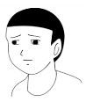

# 哎，我就是个彻头彻尾的变态啊

作者：HOHO0743123

TID：17801

<title>1</title> <link href="../Styles/Style.css" type="text/css" rel="stylesheet">

# 1

最近看了一部作品，心里很难受，来这里倒倒苦水、  我变态的程度足以让GTS同好都觉得我变态（哭）。

先说一下背景，我上海某市重点高中生，三观正，性取向正，男。  大概在很小很小的时候就觉醒了GTS， 但是其实用觉醒这个词并不恰当。 爱好GTS不如说是我与生俱来的，类似本能一样的东西。 我特别喜欢残虐系，喜欢那种巨大的力量悬殊之下的残忍。  在小学一二年级的时候就会在百度搜索 类似“踩蚂蚁” 之类的关键字， 随后渐渐主动接触GTS圈子， 而不是在无意间看到GTS的东西然后觉醒。 还有最关键的一点， 我喜欢把自己想象成施虐方，也就是GTS，而不是小人。。。。。  小学的时候曾N次有过自杀念头，想变成女的， 也有过作转性手术的念头。。。。。。。不过这些念头都非常非常谈，很快就被生活冲散了， 没有做出任何具体的行为。   以前有一个梦让我一辈子都忘不了，到现在都记得清清楚楚， 我初次梦遗的时候， 梦到自己变成女的，穿着黑色的西装短裙，踩着红色的高跟鞋， 在一个大楼电梯的上方往下降， 电梯是观光电梯，可以看到外面整个城市。。。。。。。 当时甚至一度把射X的快感误认为穿高跟鞋的快感，真心是变态到没救了。由于是喜欢踩踏，所以也会有轻微的恋足，比如说喜欢摸我妹的脚啊，让她踩背什么的。。。 不过这也不是关键。

但是LZ三观确实正常的， 以前网上传过什么虐猫视频，我是强烈反感的，但是如果踩的东西不是这么大，我的人格甚至会有轻微分裂。。。。。。
小学的时候看到一个蝴蝶，飞不起来停在地面上， 然后一个女同学跑过去，蹲下来看了下，然后踩死。。。。 LZ当时就傻眼了， 一边觉得超爽，一边觉得好残忍。 到现在有些真实感比较强的，比较长篇的作品， 我也会这样人格分裂。。。

我这确实是与生俱来的，而且和性爱什么的没关，虽然GTS和动漫以及色情有大量交集，。、 但这真心不是本体。  只能感叹一句上帝为什么对我如此不公平，哎。。。。
<title>2</title> <link href="../Styles/Style.css" type="text/css" rel="stylesheet">

# 2

同楼主
我现在拥有异常性癖总览中我已经能够接受其中的一半了
并拥有三分之一，现在请叫我绅士大人 <title>3</title> <link href="../Styles/Style.css" type="text/css" rel="stylesheet">

# 3

性转爱好现在淡了些，不过以前小学被我妈当女孩子养的时候是有的 <title>4</title> <link href="../Styles/Style.css" type="text/css" rel="stylesheet">

# 4

 楼主这种程度就敢出来说自己是绅士了吗 <title>5</title> <link href="../Styles/Style.css" type="text/css" rel="stylesheet">

# 5

晒妹贴~鉴定完毕~ <title>6</title> <link href="../Styles/Style.css" type="text/css" rel="stylesheet">

# 6

喜歡摸你妹的腳...
怎麼聽起來還蠻常摸的感覺 <title>7</title> <link href="../Styles/Style.css" type="text/css" rel="stylesheet">

# 7

只是男性对力量的追求和GTS结合后的正常心理，我和LZ很相似，只是我现在追求的macro furry了，人类已经容不下我了 <title>8</title> <link href="../Styles/Style.css" type="text/css" rel="stylesheet">

# 8

我还以为你要介绍什么作品的。。。。 <title>9</title> <link href="../Styles/Style.css" type="text/css" rel="stylesheet">

# 9

(ノ=Д=)ノ┻━┻晒妹烧死 <title>10</title> <link href="../Styles/Style.css" type="text/css" rel="stylesheet">

# 10

还是把幻想和现实分清楚一些比较好 <title>11</title> <link href="../Styles/Style.css" type="text/css" rel="stylesheet">

# 11

> [archer 發表於 2014-9-21 21:59](https://giantessnight.cf/gnforum2012/forum.php?mod=redirect&goto=findpost&pid=235134&ptid=17801)
> 楼主这种程度就敢出来说自己是绅士了吗

我也想这么说来着_(:_」∠)_
<title>12</title> <link href="../Styles/Style.css" type="text/css" rel="stylesheet">

# 12

梦到自己变成女的

看來樓主你有性轉換和偽娘的潛力啊 <title>13</title> <link href="../Styles/Style.css" type="text/css" rel="stylesheet">

# 13

把你妹的脚让我摸很多很多很多下...
你就不变态了...
哇哈哈哈哈哈哈...）叉腰大笑“ <title>14</title> <link href="../Styles/Style.css" type="text/css" rel="stylesheet">

# 14

变态的出处是《荀子·君道》，原话是“贫穷而不约，富贵而不骄，并遇变态而不穷，审之礼也。”
指的是生理、心理的不正常状态和经常做出常人无法理解或违背现存常理行为的人，实际上每一个都都会有符合变态的情节，区别只在于这个人是选择表露出来还是藏起来
楼主的这种情节算是变态但只要不在现实生活中影响到自己和别人就没什么 <title>15</title> <link href="../Styles/Style.css" type="text/css" rel="stylesheet">

# 15

> [焦承裕 發表於 2014-9-22 14:38](https://giantessnight.cf/gnforum2012/forum.php?mod=redirect&goto=findpost&pid=235177&ptid=17801)
> 变态的出处是《荀子·君道》，原话是“贫穷而不约，富贵而不骄，并遇变态而不穷，审之礼也。”
> 指的是生理 ...

老师说什么事情都要扯一些古语耶~~~
嘛嘛，楼主你有咱大GN帝国数千同类没必要伤心啦
<title>16</title> <link href="../Styles/Style.css" type="text/css" rel="stylesheet">

# 16

在圈里LZ这样也就平均水平了吧，何变态之有 <title>17</title> <link href="../Styles/Style.css" type="text/css" rel="stylesheet">

# 17

只能说是平均水平。╮(╯▽╰)╭。见多了会发现自己其实还算差点的。╮(╯▽╰)╭ <title>18</title> <link href="../Styles/Style.css" type="text/css" rel="stylesheet">

# 18

我们都是爱幻想的孩纸  =。= <title>19</title> <link href="../Styles/Style.css" type="text/css" rel="stylesheet">

# 19

谁没有些幻想呢 <title>20</title> <link href="../Styles/Style.css" type="text/css" rel="stylesheet">

# 20

*本帖最後由 克里亞 於 2014-10-16 10:24 編輯*

不至於太變態啦,思想本來就是自由的
我大概可以同意被踩這個部份.
從小到大蠻多情況都是跟姊姊一起睡
在床上賴床或平時躺床上偷懶.半打鬧的會被姐姐踩或踢
不過現在倒過來換我要拉人就是
套GTS界的話 我比較喜歡就是裸足或穿絲襪踩踏,但殘虐就不太喜歡了
踩踏方面還是比較愛好溫樓柔系.小人很討厭的再考慮踩重一點
<title>21</title> <link href="../Styles/Style.css" type="text/css" rel="stylesheet">

# 21

楼主，建议你去咨询下心里医生，这个真不开玩笑。正常的举措 <title>22</title> <link href="../Styles/Style.css" type="text/css" rel="stylesheet">

# 22

我的这种思想也是与生俱来的，同道中人啊