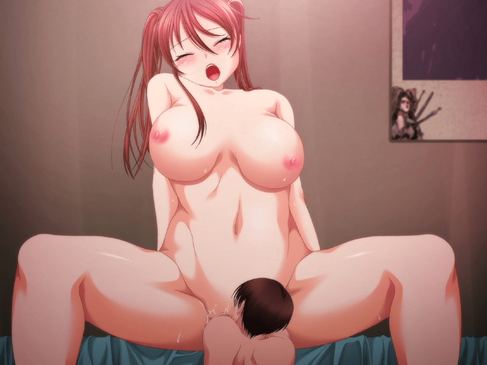

# 哪位知道此图的出处？

作者：百川归来

TID：16612

<title>1</title> <link href="../Styles/Style.css" type="text/css" rel="stylesheet">

# 1

<ignore_js_op>

**170998.jpeg** *(133.42 KB, 下載次數: 2)*

[下載附件](forum.php?mod=attachment&aid=NDIxMDJ8NDE2MjI5Mjl8MTY3NDA2NzU4NXwxODIzMHwxNjYxMg%3D%3D&nothumb=yes)

2014-4-5 20:12 上傳

求此番名字
<title>2</title> <link href="../Styles/Style.css" type="text/css" rel="stylesheet">

# 2

是游戏cg
ポケット彼女 ～白濁人形～
大多数都是sw不要太期待. <title>3</title> <link href="../Styles/Style.css" type="text/css" rel="stylesheet">

# 3

一個叫 「ポケット彼女 ～白濁人形～」 的遊戲 <title>4</title> <link href="../Styles/Style.css" type="text/css" rel="stylesheet">

# 4

二楼，也就是说这游戏不值得去玩了？ <title>5</title> <link href="../Styles/Style.css" type="text/css" rel="stylesheet">

# 5

> [firebirdy 發表於 2014-4-18 15:27](https://giantessnight.cf/gnforum2012/forum.php?mod=redirect&goto=findpost&pid=220481&ptid=16612)
> 二楼，也就是说这游戏不值得去玩了？

没有不值得玩的游戏，全看你的喜好 <title>6</title> <link href="../Styles/Style.css" type="text/css" rel="stylesheet">

# 6

> 没有不值得玩的游戏，全看你的喜好

啊，我个人不太喜欢sw。问题没问清楚，呵呵。我想说的是，如果sw太多的话，我估计就不想玩了～ <title>7</title> <link href="../Styles/Style.css" type="text/css" rel="stylesheet">

# 7

看上去像动画一样，游戏的话就只收CG就好了。 <title>8</title> <link href="../Styles/Style.css" type="text/css" rel="stylesheet">

# 8

大部分内容是缩小女，好像只有1~2张是GTS <title>9</title> <link href="../Styles/Style.css" type="text/css" rel="stylesheet">

# 9

感觉有点像deep blue的CG，不是很确定... <title>10</title> <link href="../Styles/Style.css" type="text/css" rel="stylesheet">

# 10

前面全是缩小女，最后3张是巨大女play <title>11</title> <link href="../Styles/Style.css" type="text/css" rel="stylesheet">

# 11

感觉这个图很不错啊！ <title>12</title> <link href="../Styles/Style.css" type="text/css" rel="stylesheet">

# 12

以前下载过，就是不知道怎么开始游戏 <title>13</title> <link href="../Styles/Style.css" type="text/css" rel="stylesheet">

# 13

游戏不错，谢谢分享了 <title>14</title> <link href="../Styles/Style.css" type="text/css" rel="stylesheet">

# 14

只能看看CG，，貌似没什么亮点。。 <title>15</title> <link href="../Styles/Style.css" type="text/css" rel="stylesheet">

# 15

欺负我不懂sw什么意思。。。求解啊，网上查不到 <title>16</title> <link href="../Styles/Style.css" type="text/css" rel="stylesheet">

# 16

> [c6556 發表於 2016-3-4 19:10](https://giantessnight.cf/gnforum2012/forum.php?mod=redirect&goto=findpost&pid=286144&ptid=16612)
> 欺负我不懂sw什么意思。。。求解啊，网上查不到

一般就是shrunk woman（缩小女）的意思吧，用shrunk women复数形式的话也有
<title>17</title> <link href="../Styles/Style.css" type="text/css" rel="stylesheet">

# 17

没见过，而且我不喜欢这种大尺度的。 <title>18</title> <link href="../Styles/Style.css" type="text/css" rel="stylesheet">

# 18

> [firebirdy 發表於 2014-4-19 02:08](https://giantessnight.cf/gnforum2012/forum.php?mod=redirect&goto=findpost&pid=220563&ptid=16612)
> 啊，我个人不太喜欢sw。问题没问清楚，呵呵。我想说的是，如果sw太多的话，我估计就不想玩了～ ...

sw是什么意思？还有nsfw什么东西的 <title>19</title> <link href="../Styles/Style.css" type="text/css" rel="stylesheet">

# 19

> [Hola 發表於 2016-6-19 14:49](https://giantessnight.cf/gnforum2012/forum.php?mod=redirect&goto=findpost&pid=296891&ptid=16612)
> sw是什么意思？还有nsfw什么东西的

shrunken woman,缩小女。
nsfw是not safe for work.
<title>20</title> <link href="../Styles/Style.css" type="text/css" rel="stylesheet">

# 20

> [firebirdy 發表於 2016-6-20 00:16](https://giantessnight.cf/gnforum2012/forum.php?mod=redirect&goto=findpost&pid=296973&ptid=16612)
> shrunken woman,缩小女。
> nsfw是not safe for work.

好吧，现在终于知道了 <title>21</title> <link href="../Styles/Style.css" type="text/css" rel="stylesheet">

# 21

> [sunnygoon 發表於 2014-4-5 22:22](https://giantessnight.cf/gnforum2012/forum.php?mod=redirect&goto=findpost&pid=219620&ptid=16612)
> 是游戏cg
> ポケット彼女 ～白濁人形～
> 大多数都是sw不要太期待.

SW是swallow的意思吗？                        </ignore_js_op>