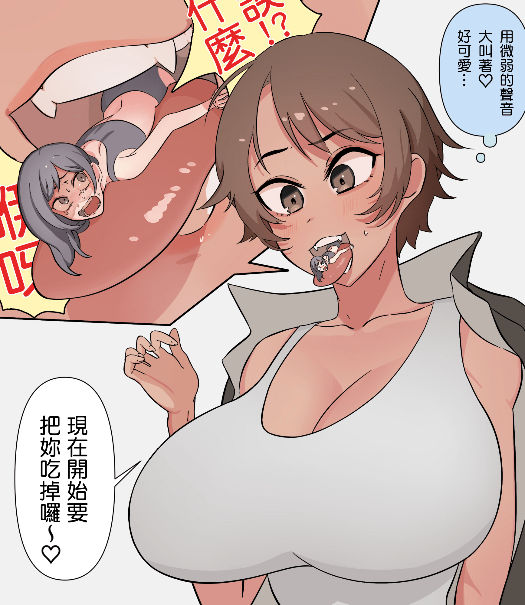
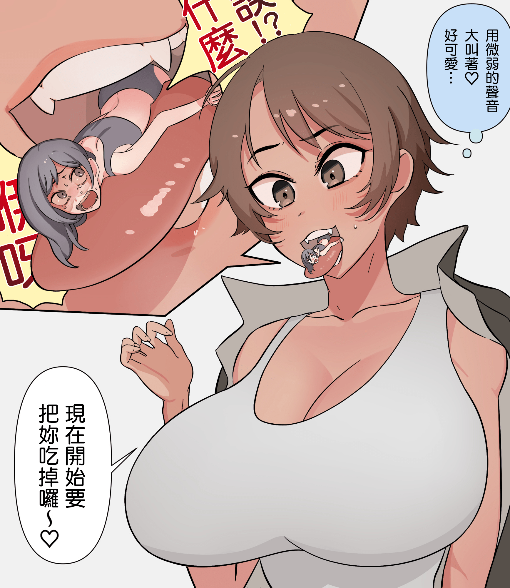
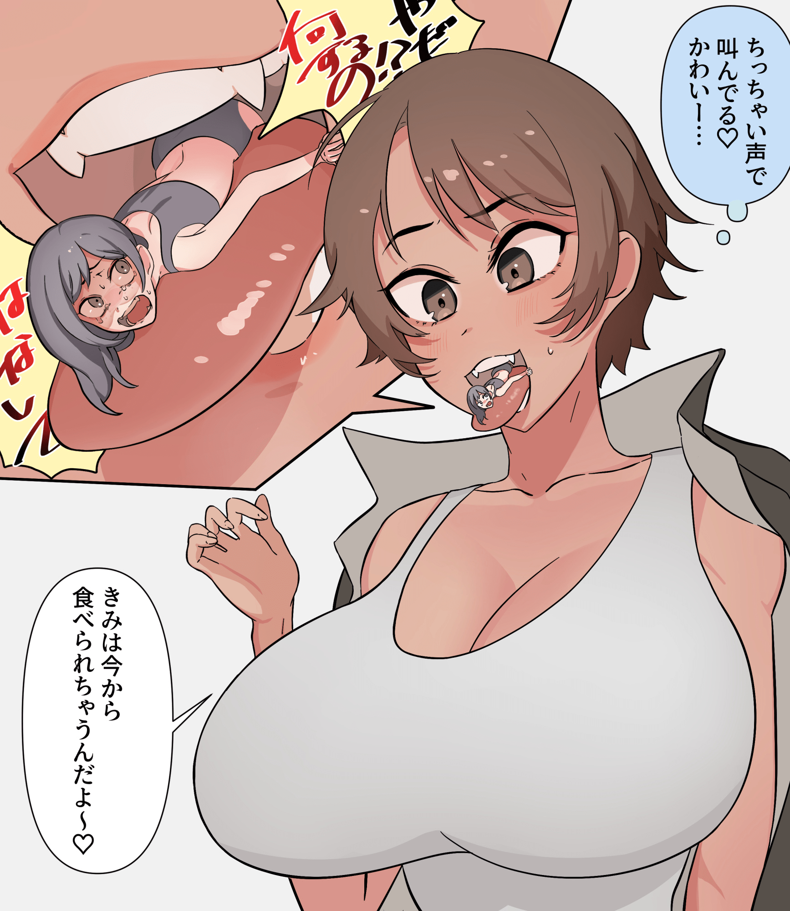

# 哪種字體比較好看

作者：violetsnow

TID：31330

<title>1</title> <link href="../Styles/Style.css" type="text/css" rel="stylesheet">

# 1

單色不錯看，但總覺得有點單調，漸層感覺也不太對，似乎有點多餘

<ignore_js_op>

**單.png** *(1.58 MB, 下載次數: 1)*

[下載附件](forum.php?mod=attachment&aid=ODk5MzJ8MTVhM2NmN2V8MTY3NDA2NTgzN3wxODIzMHwzMTMzMA%3D%3D&nothumb=yes)

2021-7-24 23:51 上傳

<ignore_js_op>

**漸.png** *(1.61 MB, 下載次數: 1)*

[下載附件](forum.php?mod=attachment&aid=ODk5MzN8OGE3Y2NjMWV8MTY3NDA2NTgzN3wxODIzMHwzMTMzMA%3D%3D&nothumb=yes)

2021-7-24 23:51 上傳

<ignore_js_op>

**原.jpg** *(726.23 KB, 下載次數: 0)*

[下載附件](forum.php?mod=attachment&aid=ODk5MzR8ODE4ZDEzMWZ8MTY3NDA2NTgzN3wxODIzMHwzMTMzMA%3D%3D&nothumb=yes)

2021-7-24 23:51 上傳

<title>2</title> <link href="../Styles/Style.css" type="text/css" rel="stylesheet">

# 2

都不错，我感觉单色的看着舒服点 <title>3</title> <link href="../Styles/Style.css" type="text/css" rel="stylesheet">

# 3

果然漫画还是黑白色的最好，看着舒服。。。。。 <title>4</title> <link href="../Styles/Style.css" type="text/css" rel="stylesheet">

# 4

会不会是字体的原因，加粗加大加草表示大喊（？ <title>5</title> <link href="../Styles/Style.css" type="text/css" rel="stylesheet">

# 5

个人感觉还是像原图那样渐变的好点诶（怎么好像选这个的不多） <title>6</title> <link href="../Styles/Style.css" type="text/css" rel="stylesheet">

# 6

感觉单色比渐变的看着更简洁，不过两个差别不大 <title>7</title> <link href="../Styles/Style.css" type="text/css" rel="stylesheet">

# 7

渐变色总感觉看起来有点怪，还是单色吧 <title>8</title> <link href="../Styles/Style.css" type="text/css" rel="stylesheet">

# 8

感觉单色好看。。。。。。。。。。。。。 <title>9</title> <link href="../Styles/Style.css" type="text/css" rel="stylesheet">

# 9

我觉得单色就可以了 不要那么花哨。                <title>10</title> <link href="../Styles/Style.css" type="text/css" rel="stylesheet">

# 10

试试描边怎么样                                        <title>11</title> <link href="../Styles/Style.css" type="text/css" rel="stylesheet">

# 11

个人观点觉得单色挺好的  。单色个人看的舒服一点。(仅个人观点) <title>12</title> <link href="../Styles/Style.css" type="text/css" rel="stylesheet">

# 12

觉得两个都差不多 单色更好看点吧</ignore_js_op></ignore_js_op></ignore_js_op>