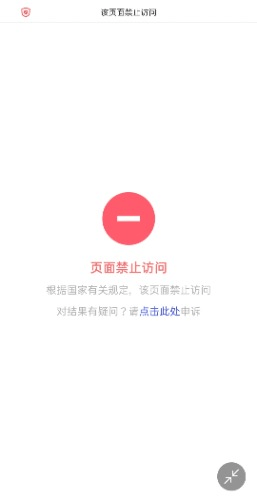

# 啊这，我无法用手机上论坛了。

作者：wjdbg

TID：30226

<title>1</title> <link href="../Styles/Style.css" type="text/css" rel="stylesheet">

# 1

*本帖最後由 蜡下翁 於 2021-1-29 03:56 編輯*

用手机上论坛就会出现这个页面就是根据国家规定禁止访问。不让我看，有没有人和我一样有类似问题的。问题已解决，换成小众浏览器或中国大陆外主流的浏览器就不会有问题。
<title>2</title> <link href="../Styles/Style.css" type="text/css" rel="stylesheet">

# 2

 <ignore_js_op>[IMG_20210128_212618.jpg](forum.php?mod=attachment&aid=ODcwMzB8M2Q3OWQ2NGZ8MTY3NDA2NjE3MHwxODIzMHwzMDIyNg%3D%3D&nothumb=yes) *(7.49 KB, 下載次數: 0)*

[下載附件](forum.php?mod=attachment&aid=ODcwMzB8M2Q3OWQ2NGZ8MTY3NDA2NjE3MHwxODIzMHwzMDIyNg%3D%3D&nothumb=yes)

2021-1-28 21:27 上傳  

</ignore_js_op> <title>3</title> <link href="../Styles/Style.css" type="text/css" rel="stylesheet">

# 3

？没有啊？看画面你是不是梯子有问题？国内网好像是禁止gn的 <title>4</title> <link href="../Styles/Style.css" type="text/css" rel="stylesheet">

# 4

> [kale 發表於 2021-1-28 21:50](https://giantessnight.cf/gnforum2012/forum.php?mod=redirect&goto=findpost&pid=458107&ptid=30226)
> ？没有啊？看画面你是不是梯子有问题？国内网好像是禁止gn的

唉，国内禁了gn真是不知道造成论坛冷清了多少

不过倒是好奇 **2020-11-24 发生了什么，竟然有9000+登录**
<title>5</title> <link href="../Styles/Style.css" type="text/css" rel="stylesheet">

# 5

挂梯子了吗？我的一切正常
话说手机改hosts有人试过吗 <title>6</title> <link href="../Styles/Style.css" type="text/css" rel="stylesheet">

# 6

浏览器的问题吧。。
你换个浏览器应该就可以了 <title>7</title> <link href="../Styles/Style.css" type="text/css" rel="stylesheet">

# 7

国内一些破浏览器屏蔽了相应的网站，换个谷歌的或者via浏览器。 <title>8</title> <link href="../Styles/Style.css" type="text/css" rel="stylesheet">

# 8

现在稍微正规的手机浏览器都自带屏蔽和谐网站，安卓推荐via苹果推荐alook。 <title>9</title> <link href="../Styles/Style.css" type="text/css" rel="stylesheet">

# 9

*本帖最後由 蜡下翁 於 2021-1-29 03:54 編輯*

发现问题根源了，是浏览器的问题。用谷歌浏览器就没有问题了。但也奇怪，之前用默认浏览器不会有问题但现在就不让访问。 <title>10</title> <link href="../Styles/Style.css" type="text/css" rel="stylesheet">

# 10

换个浏览器就行了，我用的Chrome就没事 <title>11</title> <link href="../Styles/Style.css" type="text/css" rel="stylesheet">

# 11

小米手机自带的浏览器可以进入论坛，或者你可以保存一篇论坛的帖子链接，复制粘贴一般也能进来，直接网址好像确实进不来
<title>12</title> <link href="../Styles/Style.css" type="text/css" rel="stylesheet">

# 12

> [violetsnow 發表於 2021-1-29 00:23](https://giantessnight.cf/gnforum2012/forum.php?mod=redirect&goto=findpost&pid=458126&ptid=30226)
> 其实国内被禁的网站多了去了，不差咱们gn一个网站，这样一想也许心里就平衡不少了只要舍得花钱买个 ...

有时倒不是自己进不进得去的问题(我大马人随便进），而是墙了肯定少了一些人的，没回复有时就没动力，写文的就少了
<title>13</title> <link href="../Styles/Style.css" type="text/css" rel="stylesheet">

# 13

有人知道为什么改host有时候能上有时候又不能上吗 <title>14</title> <link href="../Styles/Style.css" type="text/css" rel="stylesheet">

# 14

嘛，那种基本是因为浏览器，华为自带的玩意还能用，夸克好像也上得来 <title>15</title> <link href="../Styles/Style.css" type="text/css" rel="stylesheet">

# 15

> [wanjingle 發表於 2021-1-29 22:00](https://giantessnight.cf/gnforum2012/forum.php?mod=redirect&goto=findpost&pid=458219&ptid=30226)
> 嘛，那种基本是因为浏览器，华为自带的玩意还能用，夸克好像也上得来

我现在就是夸克浏览器挂个梯子上论坛
<title>16</title> <link href="../Styles/Style.css" type="text/css" rel="stylesheet">

# 16

可以试试下个Brave用，手机端用起来还挺好，PC还是用chrome <title>17</title> <link href="../Styles/Style.css" type="text/css" rel="stylesheet">

# 17

别用国产浏览器
别用国产浏览器
别用国产浏览器

国产浏览器有一个算一个，全都是流氓：自己内置一套网址审核系统，而且几乎100%会上传你的浏览数据。
就算是用的苹果（大陆地区）的Safari，也要去设置里关闭欺骗性网站警告，那个也是连着腾讯的审查服务