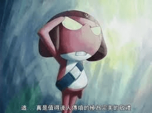

# 喜欢踩东西的女生系列作者在此认罪（不喜勿喷）

作者：毒蛋白

TID：13427

<title>1</title> <link href="../Styles/Style.css" type="text/css" rel="stylesheet">

# 1

          我说·········如果我没猜错····大家早就把我的坑给忘了······不过令我感到惊奇的是····我的文章竟然还在····这让我不禁感到有些欣慰，但也感到很羞愧···我不得不说，我犯了很重的罪——背弃了gts。

          我有了我的女友，我很爱她，她用她的温柔改变了我。她不会照顾自己，但很关心我；她不会按时吃饭，但会给我带饭；她不会玩游戏，但会陪我玩一晚上。
                 我不知道为什么突然就这样背弃了gts，但我深知作为一个gts迷是有多坚强但是又有多脆弱···一个男人，不愿有一堆围着自己转的女人，却想变小，下贱的在女神脚下做奴隶。但是在现实中，我们又不得不努力表现得很正常。gts既是对于我们生活严重的影响，又是我们这一生最大的财富。由于世人的偏见，我们这个小小的团体是被大家排斥的，我们就像一堆怪物一样，渴望着让一个巨大的女神来玩弄我们，这根本不可能！我们就像疯子一样在不停的幻想着···百度不断的删我们的贴，封我们的贴吧，一群无聊的人不断的打入我们内部，不断辱骂我们。但是，我们依旧抱成一团，拥有GN这样的灵魂的栖息之地，一起美好的幻想着被心目中的女神各种把玩，一起分享心中的喜悦。我们永远不被世人理解，但我们永远不会被打垮。我们就像一块一支无懈可击的团队，就算被上帝遗弃了，我们依然是一个团队，大家的心依旧在一起，没有任何东西会阻止我们到达灵魂所渴望的地方！

          总之，就算我背弃了gts，但是我依旧会写文章，我高考考到了我理想的学校，感谢那些祝我考好的同志~我更新会很慢，但是我依旧会更新的，至于文笔很差，写的质量不高，还请多多包涵~今晚可能就开始继续更新了。

         再次对gts爱好者表以崇高的敬意！ <title>2</title> <link href="../Styles/Style.css" type="text/css" rel="stylesheet">

# 2

不喜倒没有，但你发错区了吧 =。=
[http://giantessnight.com/gnforum ... umdisplay&fid=2](http://giantessnight.com/gnforum2012/forum.php?mod=forumdisplay&fid=2)
那里才是该发的地方…… <title>3</title> <link href="../Styles/Style.css" type="text/css" rel="stylesheet">

# 3

这不是罪，人会改变的，这没什么错。
祝你幸福。支持你 <title>4</title> <link href="../Styles/Style.css" type="text/css" rel="stylesheet">

# 4

> darkart 發表於 2012-10-6 18:47 
> 不喜倒没有，但你发错区了吧 =。=
> http://giantessnight.com/gnforum2012/forum.php?mod=forumdisplay&fid= ...

不好意思，我好久没有上了，不清楚情况。话说GN的变化真大啊！ <title>5</title> <link href="../Styles/Style.css" type="text/css" rel="stylesheet">

# 5

你虽然走了，但是我们还要坚守阵地！ <title>6</title> <link href="../Styles/Style.css" type="text/css" rel="stylesheet">

# 6

额  楼主你肿么个背弃了GTS了？ <title>7</title> <link href="../Styles/Style.css" type="text/css" rel="stylesheet">

# 7

有句话叫 妄自菲薄

<title>8</title> <link href="../Styles/Style.css" type="text/css" rel="stylesheet">

# 8

我不希望在什么女神脚下做奴隶。。我一直只喜欢做一个旁观者- - 所以我没有楼主这种纠结的心态啊 gts爱好也被很多人发现过了 别人也只当做是萝莉控这种层面的癖好而已 没有更多的 唉 主要是自己想开点啊 那么自卑干什么 <title>9</title> <link href="../Styles/Style.css" type="text/css" rel="stylesheet">

# 9

> 千本道化师 發表於 2012-10-6 20:38 
> 你虽然走了，但是我们还要坚守阵地！

我不算真正意义上的离开，我还会写文章的说。我喜欢写文章，无论是哪一方面的~所以说，即使背离了gts，但我依旧会在这论坛里写文章的！ <title>10</title> <link href="../Styles/Style.css" type="text/css" rel="stylesheet">

# 10

> karas 發表於 2012-10-7 00:17 
> 我不希望在什么女神脚下做奴隶。。我一直只喜欢做一个旁观者- - 所以我没有楼主这种纠结的心态啊 gts爱好也 ...

不是我自卑额····目前我觉得我和gts已经没有关系了，我不再喜爱这类情节了。因为有个gts爱好者曾向我诉苦，他喜欢上一个女生，但是他很自卑，不敢向那个女孩表白···这也让我很纠结。可能我以偏概全了，并不是所有的gts爱好者都像他一样。不好意思啊~ <title>11</title> <link href="../Styles/Style.css" type="text/css" rel="stylesheet">

# 11

脱团了就好了，很正常~ <title>12</title> <link href="../Styles/Style.css" type="text/css" rel="stylesheet">

# 12

楼主这 - - 想的好深好远好夸张
反正我跟女孩面前一点不自卑 反而很大男子主义 - -
舍友也知道GTS 也没鄙视我啊  0 0
楼主是考上了某985？ 恭喜恭喜 <title>13</title> <link href="../Styles/Style.css" type="text/css" rel="stylesheet">

# 13

沒啥可噴的啊
總之人參就是高高興興的接受各種的妹紙嘛~ <title>14</title> <link href="../Styles/Style.css" type="text/css" rel="stylesheet">

# 14

贴吧么。。好久不去了

另：某草你的红利点数大亮啊 <title>15</title> <link href="../Styles/Style.css" type="text/css" rel="stylesheet">

# 15

楼主你对GTS爱好者的观点，GN督府的意义都点明了我心中的疑惑。我之前想法可能和你一致，但是今天你这么说出来，真的是让吾人痛快无比。
那些不真正懂得GTS的人您大可不必搭理的，对于他们，GTS是想来就来想走就走。整天就知道写文章作画，却永远不会知道GTS存在于大家心中的意义。

我们要负责任，维护的不仅是GTS信念，更是我们存在的意义。 <title>16</title> <link href="../Styles/Style.css" type="text/css" rel="stylesheet">

# 16

<ignore_js_op>

**images.jpg** *(6.21 KB, 下載次數: 0)*

[下載附件](forum.php?mod=attachment&aid=MzEzNzB8OWYyZWU2N2R8MTY3NDA2ODU1NnwxODIzMHwxMzQyNw%3D%3D&nothumb=yes)

2012-10-13 13:48 上傳

敬禮。
不需要謝罪啊!
成為一個人生的勝利者，有空發幾篇gts文不好嗎?
有個女朋友，可以作為文章題材的靈感.........</ignore_js_op>