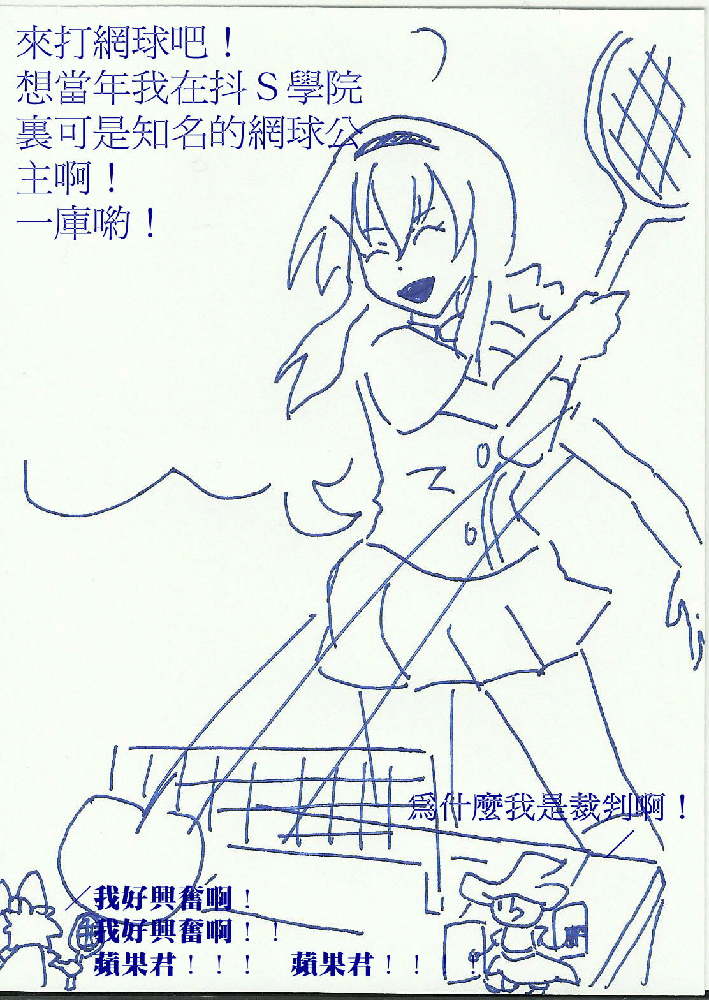

# 嗯。。。IWBTG吧的漫画。。。

作者：lyblhz

TID：14439

<title>1</title> <link href="../Styles/Style.css" type="text/css" rel="stylesheet">

# 1

*本文章最後由 shendanxiaogui 於 2013-5-21 00:36 編輯*

之前有人说过I WANNA系列适合做GTS，不过游戏本身太紧张了所以没怎么在意。。。
不过有人画漫画了。。。
<ignore_js_op>

**918df63f8794a4c2d3cc687d0ff41bd5ac6e39fa.jpg** *(508.37 KB, 下載次數: 0)*

[下載附件](forum.php?mod=attachment&aid=MzQzOTV8NGZkYzRkYTR8MTY3NDA2ODMxN3wxODIzMHwxNDQzOQ%3D%3D&nothumb=yes)

2013-5-21 00:30 上傳

我突然感觉很有氛围有木有。。。
咳咳。。。其它的话大多是I WANNA游戏系列的neta了。。。不看相关游戏实况主看不懂的所以我还是不发了。。。
------玩脱了。。。手贱点抢楼按钮什么的取消不了了。。。算了我不管了（╯－＿－）╯╧╧加个2L和3L我去睡觉了

<title>2</title> <link href="../Styles/Style.css" type="text/css" rel="stylesheet">

# 2

抢楼 啥奖励
这游戏当年玩过初代 真是难得变态啊
居然还有GTS同人。。 <title>3</title> <link href="../Styles/Style.css" type="text/css" rel="stylesheet">

# 3

别说是初带 这东西就没有哪个是简单的 而且全都是蛋疼而死 <title>4</title> <link href="../Styles/Style.css" type="text/css" rel="stylesheet">

# 4

国外有些变物口味比较重，接受不能啊。。 <title>5</title> <link href="../Styles/Style.css" type="text/css" rel="stylesheet">

# 5

> mr0112358 發表於 2013-5-23 09:12 
> 国外有些变物口味比较重，接受不能啊。。

你想回复的绝对不是我的帖子吧。。。
<title>6</title> <link href="../Styles/Style.css" type="text/css" rel="stylesheet">

# 6

> mr0112358 發表於 2013-5-23 09:12 
> 国外有些变物口味比较重，接受不能啊。。

跪求重口味变物 <title>7</title> <link href="../Styles/Style.css" type="text/css" rel="stylesheet">

# 7

我看到了“一库”
这是 盲僧 他闺女？ <title>8</title> <link href="../Styles/Style.css" type="text/css" rel="stylesheet">

# 8

> jiachufan1 發表於 2013-7-13 20:49 
> 我看到了“一库”
> 这是 盲僧 他闺女？

。。。我不玩LOL。。。
I wanna 也没有LOL角色。。。
这是IWBTG游戏相关的游戏主角、实况主和贴吧吧主。。
<title>9</title> <link href="../Styles/Style.css" type="text/css" rel="stylesheet">

# 9

> skyqiling 發表於 2013-7-23 16:39 
> 話說這個是什麼遊戲？有名字麼？

。。。。。。。。。。。。。。。。。。。。。。。。。。。。。。。。。
我很明显的在标题里写了漫画两个字吧。。。
游戏的话。。。I Wanna Be The Guy？贴吧有。。。不过和GTS不怎么有直接关系。。。。
<title>10</title> <link href="../Styles/Style.css" type="text/css" rel="stylesheet">

# 10

.
我正在思考這個主題應該搬到圖片區還是遊戲區？

話說為什麼圖片裡的巨大網球看上去像一顆蘋果？！ <title>11</title> <link href="../Styles/Style.css" type="text/css" rel="stylesheet">

# 11

> Dante 發表於 2013-7-24 01:35 
> .
> 我正在思考這個主題應該搬到圖片區還是遊戲區？

本来就是苹果啊w(ﾟДﾟ)w
I Wanna系列的精髓就是这个可大可小五颜六色选择性遵守万有引力砸得牛顿从坟墓里爬出来的苹果了啊w(ﾟДﾟ)w
顺便说下第二个精髓是刺_(:зゝ∠)_
---
这个明显是谈天区啊w(ﾟДﾟ)w你见过哪个图片区的地方是为了让大家讨论游戏才发的帖子啊
<title>12</title> <link href="../Styles/Style.css" type="text/css" rel="stylesheet">

# 12

> shendanxiaogui 發表於 2013-7-24 01:39 
> 本来就是苹果啊w(ﾟДﾟ)w
> I Wanna系列的精髓就是这个可大可小五颜六色选择性遵守万有引力砸得牛顿从坟墓 ...

.
原來如此。天哪，這到底是神馬奇妙的遊戲？.

話說我用「I Wanna」當關鍵字餵食谷歌，跑出來的不是歌曲就是奪魂鋸＝ ＝
I wanna play a game!

<title>13</title> <link href="../Styles/Style.css" type="text/css" rel="stylesheet">

# 13

> Dante 發表於 2013-7-24 01:50 
> .
> 原來如此。天哪，這到底是神馬奇妙的遊戲？.

那你还真是得试一下我大天朝自古以来自主开发船沉千世媛媛留长(发)的百度搜索引擎了。。。
跳出来的第一个链接就是i wanna be the guy_(:зゝ∠)_
<title>14</title> <link href="../Styles/Style.css" type="text/css" rel="stylesheet">

# 14

.
早點把遊戲全名講出來不就得了嗎！＝ ＝+

害我看了各種奪魂鋸！ <title>15</title> <link href="../Styles/Style.css" type="text/css" rel="stylesheet">

# 15

> Dante 發表於 2013-7-24 01:55 
> .
> 早點把遊戲全名講出來不就得了嗎！＝ ＝+

我TM...不行不能爆粗。。。
不行我还是想爆粗啊w(ﾟДﾟ)w
我就写在标题上的好吧(＃°Д°) 我的标题比你的总版规还要没存在感嘛w(ﾟДﾟ)w
IWBTG什么的用谷歌和百度还是搜搜还是萌娘都是可以查到这个游戏的啊w(ﾟДﾟ)w
话说你查到电锯惊魂什么的就算了干嘛点进去看啊w(ﾟДﾟ)w里面没有萌妹子对你喊
"HELLO，I Wanna Play a Game"的啊，就算有那也肯定是QB或者地狱少女话痨版什么的奇怪的东西的啊
<title>16</title> <link href="../Styles/Style.css" type="text/css" rel="stylesheet">

# 16

一裤油是什么意思 <title>17</title> <link href="../Styles/Style.css" type="text/css" rel="stylesheet">

# 17

抢楼？这幅图感觉有蛋蛋的忧桑 <title>18</title> <link href="../Styles/Style.css" type="text/css" rel="stylesheet">

# 18

_(:з」∠)_表示Iw玩到70级左右就上不去了 <title>19</title> <link href="../Styles/Style.css" type="text/css" rel="stylesheet">

# 19

什么东西，望楼主看看</ignore_js_op>