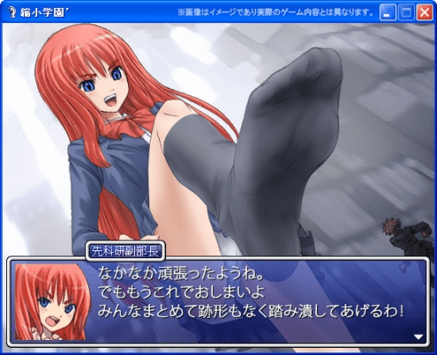

# 回味！6年前！！！！

作者：dajiangjiang

TID：18526

<title>1</title> <link href="../Styles/Style.css" type="text/css" rel="stylesheet">

# 1

那个缩小学园的元祖版！谁还藏着呢 <title>2</title> <link href="../Styles/Style.css" type="text/css" rel="stylesheet">

# 2

*本帖最後由 sdeve 於 2015-2-12 01:04 編輯*

我刷素材好多个黑夜~~！！！
<title>3</title> <link href="../Styles/Style.css" type="text/css" rel="stylesheet">

# 3

 <ignore_js_op>[3Ct004.jpg](forum.php?mod=attachment&aid=NTAyNDF8ODk4NWQ5NzN8MTY3NDA2ODI5MnwxODIzMHwxODUyNg%3D%3D&nothumb=yes) *(149.46 KB, 下載次數: 1)*

[下載附件](forum.php?mod=attachment&aid=NTAyNDF8ODk4NWQ5NzN8MTY3NDA2ODI5MnwxODIzMHwxODUyNg%3D%3D&nothumb=yes)

2015-2-12 01:03 上傳  

</ignore_js_op> <title>4</title> <link href="../Styles/Style.css" type="text/css" rel="stylesheet">

# 4

记得初代是2008年开始的，七年前了。 <title>5</title> <link href="../Styles/Style.css" type="text/css" rel="stylesheet">

# 5

最完美的还是1代，无论是剧情还是cg <title>6</title> <link href="../Styles/Style.css" type="text/css" rel="stylesheet">

# 6

忘记初代是什么时候出的了，自己没有玩过，但在youtube看过通关视频，个人也比较怀念刚开始时的缩学，但是我还是感觉缩学的品质随着更新越来越高了，之所以怀念前几代还是因为当时刚刚接触的新鲜感吧。
<title>7</title> <link href="../Styles/Style.css" type="text/css" rel="stylesheet">

# 7

本傳的CG看起來比較賞心悅目

但是外傳的故事反而更吸引我 <title>8</title> <link href="../Styles/Style.css" type="text/css" rel="stylesheet">

# 8

想一想当时我才刚上初中，刚刚接触网络 <title>9</title> <link href="../Styles/Style.css" type="text/css" rel="stylesheet">

# 9

那时候我看了一个牛仔裤的广告就入坑无法自拔了 <title>10</title> <link href="../Styles/Style.css" type="text/css" rel="stylesheet">

# 10

这个确实制作的很经典...话说要是能即时战斗就更好了...不喜欢回合制... <title>11</title> <link href="../Styles/Style.css" type="text/css" rel="stylesheet">

# 11

> [thanksdd 發表於 2015-2-12 21:31](https://giantessnight.cf/gnforum2012/forum.php?mod=redirect&goto=findpost&pid=246278&ptid=18526)
> 想一想当时我才刚上初中，刚刚接触网络

好巧好巧，我当时也是初二的样子，那个时候刚刚知道这个圈子，平时上论坛也是偷偷摸摸上的（现在也是啦喂= =#）
几乎每隔个几天来论坛看一圈，不知不觉在线也有300个小时了，慢慢都是回忆呀。
第一次玩缩小学院的时候，日文是一点不懂，能慢慢玩下来觉得自己也蛮厉害的，当然还是得感谢日本方面的各位无私的创作者及本论坛的各位dalao们=w=
这样一回想瞬间就觉得自己能来这个圈子真是太好了=v=
<title>12</title> <link href="../Styles/Style.css" type="text/css" rel="stylesheet">

# 12

> [kouweiqingxin 發表於 2015-2-12 21:54](https://giantessnight.cf/gnforum2012/forum.php?mod=redirect&goto=findpost&pid=246285&ptid=18526)
> 那时候我看了一个牛仔裤的广告就入坑无法自拔了

[http://www.tudou.com/programs/view/xvrAk5MyUS0/](http://www.tudou.com/programs/view/xvrAk5MyUS0/)是这个吧，是这个吧=w=
<title>13</title> <link href="../Styles/Style.css" type="text/css" rel="stylesheet">

# 13

> [dajiangjiang 發表於 2015-2-13 23:29](https://giantessnight.cf/gnforum2012/forum.php?mod=redirect&goto=findpost&pid=246391&ptid=18526)
> http://www.tudou.com/programs/view/xvrAk5MyUS0/是这个吧，是这个吧=w=

就是这个坑！夺走了我的节操