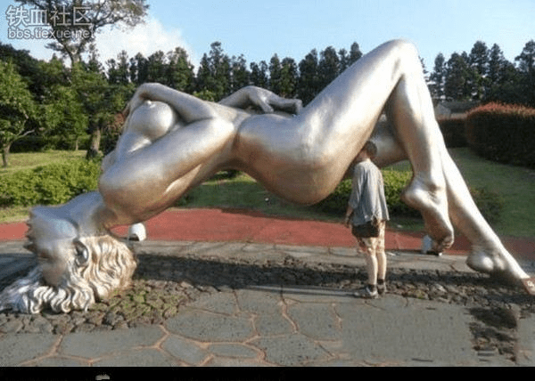
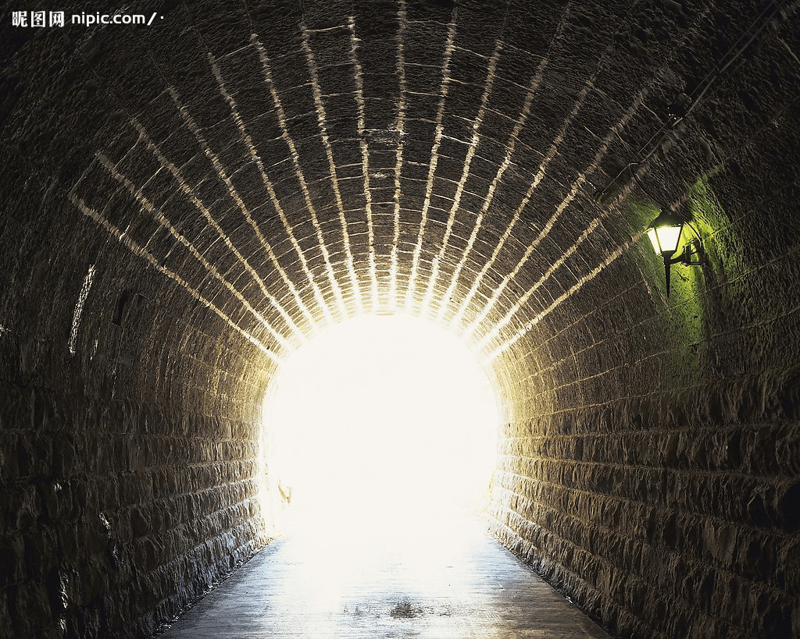
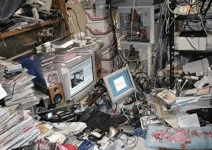

# 圖片一張、生活中的囧圖

作者：sw466

TID：12992

<title>1</title> <link href="../Styles/Style.css" type="text/css" rel="stylesheet">

# 1

不知道該發在哪裡，也不知道有人發過了沒有。就放上來了
<ignore_js_op>

**15242701.jpg** *(44.75 KB, 下載次數: 0)*

[下載附件](forum.php?mod=attachment&aid=MzAxMzJ8ZjA0NjVlZDh8MTY3NDA2ODY0NXwxODIzMHwxMjk5Mg%3D%3D&nothumb=yes)

2012-8-7 20:26 上傳

<title>2</title> <link href="../Styles/Style.css" type="text/css" rel="stylesheet">

# 2

Love Land Sculpture Park, South Korea on JeJu island. <title>3</title> <link href="../Styles/Style.css" type="text/css" rel="stylesheet">

# 3

我觉得那个男的好有勇气啊.... <title>4</title> <link href="../Styles/Style.css" type="text/css" rel="stylesheet">

# 4

太搞了，话说这是哪啊 <title>5</title> <link href="../Styles/Style.css" type="text/css" rel="stylesheet">

# 5

2楼是 ..外国朋友？..真厉害.

是韩国的一个什么公园 <title>6</title> <link href="../Styles/Style.css" type="text/css" rel="stylesheet">

# 6

这种令人羞羞的事情~ <title>7</title> <link href="../Styles/Style.css" type="text/css" rel="stylesheet">

# 7

是南韓的性愛主題公園啊~ <title>8</title> <link href="../Styles/Style.css" type="text/css" rel="stylesheet">

# 8

這...如果是彩色的，還是挺帶勁的。 <title>9</title> <link href="../Styles/Style.css" type="text/css" rel="stylesheet">

# 9

......探頭入內觀看到宇宙最大的奧秘!

↓↓↓
<ignore_js_op>

**2008520194827877_2.jpg** *(243.93 KB, 下載次數: 0)*

[下載附件](forum.php?mod=attachment&aid=MzAxOTB8MzMyYTNkNDN8MTY3NDA2ODY0NXwxODIzMHwxMjk5Mg%3D%3D&nothumb=yes)

2012-8-11 19:19 上傳

↓↓↓
<ignore_js_op>

**images.jpg** *(15.31 KB, 下載次數: 0)*

[下載附件](forum.php?mod=attachment&aid=MzAxOTF8OWY0ODkyZjN8MTY3NDA2ODY0NXwxODIzMHwxMjk5Mg%3D%3D&nothumb=yes)

2012-8-11 19:22 上傳

[ *本帖最後由 wtman 於 2012-8-11 19:23 編輯* ]</ignore_js_op></ignore_js_op></ignore_js_op>