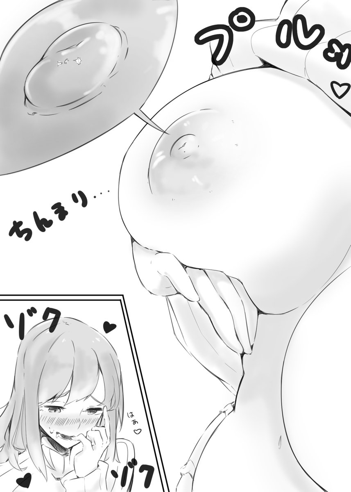

# 在GN論壇的創作資源，作者是否應該收取實際費用

作者：yangbaby

TID：26302

<title>1</title> <link href="../Styles/Style.css" type="text/css" rel="stylesheet">

# 1

這裡所討論的區域僅限GN（去其他地方收費就不管了
不知道之前是否在GN有過這種做法的作者。

起因是在原創文學版看到了這個：[https://giantessnight.com/gnforu ... ;extra=&page=49](https://giantessnight.com/gnforum2012/forum.php?mod=viewthread&tid=24461&extra=&page=49)
想看後續需要加好友，然後交錢才能繼續看（不知道是一次繳清還是，更新一次繳納一次。

這裡說的實際費用可不是論壇幣——**是真錢**。
所以想問問各位的看法，這樣做**是否應該**。

我覺得不應該：
如果一個作者在GN論壇依靠這種方法獲得收益後，其他作者看到後開始效法的話（誒，我們也是辛苦創作的，憑什麽只有你賺錢啊！）
論壇幣也沒用了，看到新文章點進去發現都是加好友付錢再看了。
作者如果覺得創作辛苦（哪個作者不辛苦），可以把付錢二維碼放出來，打賞捐贈這樣我覺得比強制付款才能看好太多了。

<title>2</title> <link href="../Styles/Style.css" type="text/css" rel="stylesheet">

# 2

其实之前有人提过这种类似的说法
我觉得最好的办法就是提供打赏功能
这样自愿支持的话不是很好嘛
 顺便还能用这个方式催更 <title>3</title> <link href="../Styles/Style.css" type="text/css" rel="stylesheet">

# 3

或者類似起點這種的訂閲模式。
如果是業餘愛好，那麽我個人建議是不推薦收費。
但是如果是指着這個吃飯，那麽收費也未嘗不可。
例如目前版里比較神隱的Vivian，她是職業畫師，靠這個吃飯，所以她的作品收費也合乎情理。
不過目前大多數的作者都是基於用愛發電的狀態，不收費或許是默認的選擇吧？ <title>4</title> <link href="../Styles/Style.css" type="text/css" rel="stylesheet">

# 4

收不收费得看作者自己意愿吧，咱们也不能强制什么
而且收钱也不一定会引起大量的效仿，毕竟目前愿意花钱的人不太多，收费虽然能赚钱，但也会损失一部分不愿意花钱的读者。
论坛向来就是靠前辈们没什么私利的贡献，来吸引新人去继续进行没什么私利的创作，维持论坛的生机。对于很多人来说，这也可以算是一种“收支平衡”吧..
所以感觉收钱或者打赏不能用“是否应该”来评判，论坛里很多人还是愿意把论坛像家一样来建设的，作者和读者自然会去反复考虑一些作品是否**值得**与真钱挂钩吧 <title>5</title> <link href="../Styles/Style.css" type="text/css" rel="stylesheet">

# 5

討論到錢就傷感情
但人都需要錢來生活
的確是可以看作者心情收費
論壇裡要提供這種功能我也不反對(又或者已經有如本文裡面私下收費的系統了)
但可以公開一點可能也能增加消費意願
以及市場流通
我認為開放收費功能是好的
畢竟不想買就別看
甚至提供donate的形式也是很不錯的
或是patreon制度
有公開作品
也有會員作品 <title>6</title> <link href="../Styles/Style.css" type="text/css" rel="stylesheet">

# 6

个人认为看作者意愿，创作也是相当需要费时费心力的。
像上面提的搞个自愿的打赏算是最合适的办法之一？
以及就算是强制收费才能看作品，这一举动也会劝退很多人的，剩下付钱的也都没人逼他们付钱的也全都是心甘情愿的。
再者说了往外看画师们大部分也都搞收费不是吗23333333
虽然以个人来说不是很喜欢这种…… <title>7</title> <link href="../Styles/Style.css" type="text/css" rel="stylesheet">

# 7

痾 「**開放收費制度**」不代表「**創作者非收費不可**」吧
你的不應該的邏輯 怎麼說呢 去讀一下個體經濟學第一章好不好 有供給不代表有需求好爆 <title>8</title> <link href="../Styles/Style.css" type="text/css" rel="stylesheet">

# 8

视情况而定，个人觉得，可收可不收，只要保证足够人气就行了，走淘宝、腾讯的方式也一样啊，没毕竟动不动就收费 <title>9</title> <link href="../Styles/Style.css" type="text/css" rel="stylesheet">

# 9

其实自己刚刚编辑了好几百字，回头审阅时，觉得太过冗长了。
简述一下自己的观点吧，
我个人觉得论坛货币付费浏览+打赏是比较合理的方式。
这也是许多娱乐载体至今仍在使用的模板。
类似买断的封闭式收费，长久来看，也是会对圈子整体流动性造成影响吧 <title>10</title> <link href="../Styles/Style.css" type="text/css" rel="stylesheet">

# 10

*本帖最後由 wajrda 於 2019-1-18 15:46 編輯*

身为读者第一反应肯定是不要
身为创作者肯定是有就很爽啦
毕竟总是要考虑群体自身利益的嘛
而两个群体之间人数悬殊
所以投票我觉得会是否的那一方赢

不过打赏是一种读者自愿的形式，爱给给，不给白嫖也不是不行。
微信私人公众号也是这样玩的。

毕竟创作者都是靠爱发电的嘛（笑）

而且万一有创作者出现了像是王苗壮、CA那样子骗了钱就跑，对读者来说简直要心态爆炸，而人家创作者说不定换个马甲又出现了，然后二度骗钱就很尴尬了。

毕竟圈子不大经不起折腾.有统一制度还是比较好。

以上不包括商业作者。

<title>11</title> <link href="../Styles/Style.css" type="text/css" rel="stylesheet">

# 11

我个人认为啊，并没有什么不太好的地方作者如何处置他自己的作品是他本身的权利，你可以不喜欢这种方式，但你并不能为他做主。

首先说收费模式，不可否认确实有这样的隐患会让别人开始效仿，但是前提条件是
你也要拥有相应的水准
如果你没有超越别人的质量和出跳的水准，你怎么担得下流失一部分读者的风险？
（相比于你在这里讨论应不应该收费这回事，我更想讨论如何保证作者对作品的权利）

作品的处置权在作者手上，你可以选择不接受，但是你没有权利说“我不许你这么做”。
你帖子的意思大概是要把所有的收费广告贴都一刀切了呗？
（那产品行销区是不是要撤版？合着只许图片收费视频收费文章就必须得免费看了？）

我从来没想过收费，就算以后可能有也会是众筹然后把钱用来约稿的模式（为此我可能还需要额外花点心思用来酬谢参与众筹的读者）
请尊重别人的劳动成果，谢谢
<title>12</title> <link href="../Styles/Style.css" type="text/css" rel="stylesheet">

# 12

其实吧，不一定要收费才赚钱，我看大家都在说，我评论一句啊，有时候免费比收费赚钱，人气累计了，自己建一个资源中心，再去收费大家也无怨言，你的劳动成果也得到了保证，不是吗？急于求成只会适得其反罢了，再次警告大家和楼主，万事多考虑考虑或许就会迎来新的曙光 <title>13</title> <link href="../Styles/Style.css" type="text/css" rel="stylesheet">

# 13

为什么不该收费？？脑通路有问题？ <title>14</title> <link href="../Styles/Style.css" type="text/css" rel="stylesheet">

# 14

文章收費比起繪師圖片收費相對爭議大的理由.大概就是文章的入門門檻太低吧.只要你願意花時間提筆(打字)要寫篇文章不是啥難事.不過要寫得好.好到讓人願意花錢可就比畫張圖難上好幾倍了
說實話樓主的擔憂是有些杞人憂天了點.因為說句難聽的就是...論壇的文章連載好(實用)到真讓人願意花錢的.恩~~~幾乎等於沒有吧.哈哈哈.感覺我一定會被人說閒話
畢竟就算寫得好.取代性也太高了.隨便去General Sizefetish uploader看篇十六夜老師文回饋值還比較大些.更不用說現在GTS的資源遠比過去來的多.
就算要花錢買資源.我也是買圖優先啊.如果你連圖都買不下手了.那文章就更不用說了

至於擔心其他人會有樣學樣什麼的.也是想太多了點.因為多數人一開始打文的目的.其實就是要個認同.發洩或虛榮而已.在沒建立好自我價值與昇華到那個能力前.
寫作者會比較擔心自己文章有沒有人願意看.而不是我這篇文章價值多少(錢).試想.如果你辛辛苦苦打了一篇文章.卻沒人願意看與討論.那種感覺是很難受的.
更不用說論壇多數寫文的就只是個興趣或慾望疏通的管道而已.會想到靠這個賺錢的基本少之又少啦(有能力做到的也少).考慮到付出的心力與時間.業餘打文賺錢真的不是啥有賺頭的差事(先被"麻煩"這詞勸退先

另外說說截至目前為止.少數讓我覺得殘念"這作者居然收錢啊...好可惜".大概只有日方的[夏目なつめ](https://gs-uploader.jinja-modoki.com/upld-index.php?uname=natsumegts) 老師吧.
他的文章色情度滿點啊(論壇也有不少他的翻譯文)...可惜現在很多都只有試讀文而已.不過就算強者如他.也是花了一段時間寫了不少文才能賺到粉絲啊.
人家想收錢也是靠實力再賺的啊.就算心底有那麼點難過.也只能摸摸鼻子.去看別的老師的創作繼續督O去了啊.你要說失落到哪裡嗎?好像也沒有耶...
大概是因為我這個人對GTS的愛不夠深吧...就算是CXX的GTS新刊代買.我到現在好像也就買了本巨大阿姨上陸而已(還是出了看了內容.硬求到的).真要我花錢去支持喔.等まるしゃも老師fantia開始收費或他願意出本再說吧...

*慣例的貼圖收尾

<ignore_js_op>

**DuYVzvLUYAAZ5vB.jpg** *(98.38 KB, 下載次數: 0)*

[下載附件](forum.php?mod=attachment&aid=NzYyMjV8MzVhMzRkMTZ8MTY3NDA2NTk2OXwxODIzMHwyNjMwMg%3D%3D&nothumb=yes)

2019-1-18 23:45 上傳

<title>15</title> <link href="../Styles/Style.css" type="text/css" rel="stylesheet">

# 15

*本帖最後由 wongvict 於 2019-1-19 01:31 編輯*

參考city的做法，如果是收費作品的一定放到商業的分版。
只要是付費才能看，一律放到商業分版。
至於那些贊助的也要看作者公開作品的程度再決定。

既然作者已經決定不再公開作品而收費才能看，我覺得應該要搬帖了。 <title>16</title> <link href="../Styles/Style.css" type="text/css" rel="stylesheet">

# 16

写文章不懂~~只说画画的事：
1 画自己喜欢的东西，自己买单。
2 画别人喜欢的东西，别人买单。
3 双方都喜欢的东西，可以商量。

至于有没有资格收费，我觉得是靠画风认同度而不是完全取决于画功。
小人书的老艺术家们画功暴强，不考虑他们会不会画咱们这东西的因素，单说风格可能对很多人来说认同度也不够。
有人来委托，至少有认同。

收不收是受托方的事，给不给看委托方。我觉得这就靠交情和当时双方各自的生活状态商量了。
你情我愿的事，彼此不强迫。 <title>17</title> <link href="../Styles/Style.css" type="text/css" rel="stylesheet">

# 17

> [vivian 發表於 2019-1-19 14:06](https://giantessnight.cf/gnforum2012/forum.php?mod=redirect&goto=findpost&pid=394754&ptid=26302)
> 写文章不懂~~只说画画的事：
> 1 画自己喜欢的东西，自己买单。
> 2 画别人喜欢的东西，别人买单。

嗯嗯，這說的就是文章區的事，沒想到VV上來了啊！
pixiv一直關注呢，是要出新刊了嗎？
<title>18</title> <link href="../Styles/Style.css" type="text/css" rel="stylesheet">

# 18

商业化运行可以明显提高产品质量 <title>19</title> <link href="../Styles/Style.css" type="text/css" rel="stylesheet">

# 19

想到啥说啥了哈：
1，两微一端公众号生活号的付费阅读趋势的上升这个可以自行调研下，说的都头头是道不再详述。
差别还是读者认可、想看、有价值的文才会去付费观看。买阅后失望也无法退款。
差别是章节预览后收费和段落预览后收费……所以亚马逊电子书还有试读呢，虽然kindle沦为压泡面版……
2，个人体会对创作者伤害最大的顺序是喷子>杠精>无理由催更=伸手>>>作者真正自身的原因。

3，个人体会创作者的动力顺序是读者之间认真的讨论>良好的读者建议>鼓励性评论>金钱的赞助支持抑或靠创作吃饭>没来由的灵感爆发随笔>>>读者的催更。

<title>20</title> <link href="../Styles/Style.css" type="text/css" rel="stylesheet">

# 20

那当然是有好过没有但是没有也不会强求那种啦..
靠爱创作的东西如果质量不到一定程度都不好意思说要收费...
当然是大制作或者是为了促进作品达到更优秀的程度所需，要收费的话也不是不可行..
至于后续要付费什么的个人觉得就是看个人意愿了，这个东西没有公证的话就是一个愿打一个愿挨..

因为本身论坛的收取论坛币以及权限都是为了防止伸手党之类的吧，我觉得LZ说的进去发现作品看后续要收费导致的论坛币无用论是不成立的...
本身分享在论坛里的作品，无论是否完整都不会损害观众的利益，论坛币顶多算是一个投石问路的东西...

大概是以前论坛币进帖子直接拿东西走人形成的习惯导致先入为主的觉得付了论坛币就能直接看到作品...
但是论坛币看帖子应该是个门槛，愿不愿意完整分享这个就是看作者的意愿...

这个东西（免费可得到的作品）就跟试用品一样...放出来的虽然是免费的，但是你要得到这个试用品还是付出得到足够的代价（论坛币），
而后续也就是吸引人的后续产品，这个不一定囊括在【支付代价（论坛币）后就可以得到】的范围里...

这样说大概就能明白了吧...支付论坛币观看帖子内的作品...而后支付真钱观看后续作品
其实只是一种商业化的行为罢了，因为GN上没有这种利益直接化的构造，所以这种比较原始的交易就...

必然会存在

毕竟不是所有人都是单靠爱来创作的嘛... <title>21</title> <link href="../Styles/Style.css" type="text/css" rel="stylesheet">

# 21

大家好，我么得爱，也很懒 <title>22</title> <link href="../Styles/Style.css" type="text/css" rel="stylesheet">

# 22

没有“单纯围观一哈”的投票选项么？
我想看下投票结果但我内心很矛盾
一方面我想随便乱看别人发的文章
另一方面我想我随便写几个字就有人给我一百万 <title>23</title> <link href="../Styles/Style.css" type="text/css" rel="stylesheet">

# 23

*本帖最後由 hubert 於 2019-3-7 18:09 編輯*

在gn中，这作者想要收钱，而读者也干愿付钱，似乎没有啥好多说啥的。
<title>24</title> <link href="../Styles/Style.css" type="text/css" rel="stylesheet">

# 24

我比较烦这种加好友买的，收费可以，在论坛里买就行了。加好友再买，说不出来的一种感觉，就像联系人买小黄片资源一样 <title>25</title> <link href="../Styles/Style.css" type="text/css" rel="stylesheet">

# 25

作为创作者来说，我觉得我的水平，写文收钱我就是个骗子。但是要是站在读者的角度，我就应该遵守作者的规矩。 <title>26</title> <link href="../Styles/Style.css" type="text/css" rel="stylesheet">

# 26

我覺得主要還是看需求關係唄
畢竟你說要賣作品，也要有其他人肯買才可以
可能令人覺得不舒服的是畢竟GN作為免費交流論壇，有人看到創作者要收錢多少感覺有些不舒服吧
但GN好像也已經成為唯一GTS資源流動的地方，鄰站只是拿資源來出售, 感覺性質多少也不同
有人借GN作渠道去賣廣告也是無可厚非
但我覺得創作者付出了自己時間和金錢(如電腦硬件)去創作，除了靠創作者本身的熱情外，金錢也可成為推動因素之一
所以我覺得收費也是可以的。

不過可能大家著眼點還是如果透過GN去接觸創作者，但創作者騙錢之後逃了的嚴重事件唄...
但我覺得只要有人的地方都會有騙子(無論是百度賣資源還是其他地方)
感覺還是要各位學懂如何將損失保障在最低唄(付訂金什麼的) <title>27</title> <link href="../Styles/Style.css" type="text/css" rel="stylesheet">

# 27

我個人覺得

有資格收費的創作者在GN裡大概不超過五個吧

大概就同好間彼此交換心得的水準

要想涉及金錢交易的話我想品質這方面還是遠遠不夠的

<title>28</title> <link href="../Styles/Style.css" type="text/css" rel="stylesheet">

# 28

个人觉得可以开放打赏机制???? <title>29</title> <link href="../Styles/Style.css" type="text/css" rel="stylesheet">

# 29

毕竟是自己辛苦成果，适当收费还是可以理解和接受的 <title>30</title> <link href="../Styles/Style.css" type="text/css" rel="stylesheet">

# 30

其实我感觉没人会跟钱过不去，只不过吃相不要太难看就好了 <title>31</title> <link href="../Styles/Style.css" type="text/css" rel="stylesheet">

# 31

不過標題不是說溫柔嗎？
居然還弄死了這麽多人，而且還有穿刺這種死法

感覺應該是前溫柔 後殘酷吧？ <title>32</title> <link href="../Styles/Style.css" type="text/css" rel="stylesheet">

# 32

支持收费，但不支持在GN这样做。又不是没有别的靠这个恰饭的平台。
GN一直都是靠爱发电，互相分享，大家聚集在一起把这里当家一样。
如果我们默许别人靠着这个平台，利用这里的人气和流量来给自己盈利，很快就有别的跟随者步入后尘。发展下去绝对就是满页的广告了。贴子要么是随便发两张图，然后说想看更多的加V。要么是什么高清资源，多少多少钱一个G。更不用说还会有骗子之类的。
本来是一个有爱的共产社区，现在要在里面加入资本的臭味。要开历史的倒车吗？ <title>33</title> <link href="../Styles/Style.css" type="text/css" rel="stylesheet">

# 33

可以收费    毕竟是作者的劳动成果   好作品  我肯定会花钱买的 希望不要太贵  。。。。。 <title>34</title> <link href="../Styles/Style.css" type="text/css" rel="stylesheet">

# 34

*本帖最後由 深巷少女与猫 於 2019-8-5 16:45 編輯*

看收费制做到什么程度。如果一个很用心且很有水平的创作者，有一天选择用产出来当主业或者比较主的副业，能有一个收费让他不必用爱发电的平台，我举双手赞成。(简单点，打钱的方式简单点)
如果大家都在用爱发电，小圈子里的大佬地位和他的贡献直接挂钩，那我也举双手赞成，我这个人就比较怀念过去，喜欢美化记忆。
但如果只是来个收费制度，然后大家赚个搬运费，到处盗作品，然后用这些小钱买别人搬运的东西。我反正不喜欢(不喜欢也要用，但你问我滋瓷不滋瓷，我是不滋瓷的啦)
<title>35</title> <link href="../Styles/Style.css" type="text/css" rel="stylesheet">

# 35

利用gn平台火了 人气旺了 然后开始借机收费 我认为gn应该向作者征收一些平台使用费差不多 我觉得收个30%不过分 <title>36</title> <link href="../Styles/Style.css" type="text/css" rel="stylesheet">

# 36

反正那个作品算烂尾了，也没有打算再买了。 <title>37</title> <link href="../Styles/Style.css" type="text/css" rel="stylesheet">

# 37

我是指故事线乱了。反正我懒的买了。
<title>38</title> <link href="../Styles/Style.css" type="text/css" rel="stylesheet">

# 38

论坛不觉得这样做好，可以建立更专业的网站，论坛里这样做很容易内讧 <title>39</title> <link href="../Styles/Style.css" type="text/css" rel="stylesheet">

# 39

如果是通过正规渠道的话，支持 <title>40</title> <link href="../Styles/Style.css" type="text/css" rel="stylesheet">

# 40

作者自己的作品收费也无可厚非吧，不过站在读者立场肯定希望免费的 <title>41</title> <link href="../Styles/Style.css" type="text/css" rel="stylesheet">

# 41

> [nslkdxdjd 發表於 2020-12-30 11:12](https://giantessnight.cf/gnforum2012/forum.php?mod=redirect&goto=findpost&pid=454987&ptid=26302)
> jm事件是咋回事啊？这怎么还能扯上反人类罪呢？挑起这事的人是得有多法盲才能说出“反人类罪”这个词的… ...

jm事件起源于清华美术腚姐。因为都是美术相关男癌就把jm漫画曝光出来和女拳师打拳。后来在女拳圈子里清华事件热度下去jm就被当做新热点挖出来了。也是因为jm画的女性太惨，女拳就联合正经女权想把jm送局子里。她们列了一大本厚厚的报告书里面十几项罪名包括什么反人类，破坏社会主义意识形态，恐吓什么的。最后被公安机关作为犯罪依据所采纳的反而是女性群体里觉得罪名最轻的淫秽色情牟利罪。但结局都一样，jm进了监狱。
所有说gts里哪怕有例如丸吞等血腥，或者说像明萌的文里面血腥踩踏的这些可能都不会真被公安机关盯住，反而是一点点的盈利最可能把人送进去。
<title>42</title> <link href="../Styles/Style.css" type="text/css" rel="stylesheet">

# 42

> [蜡下翁 發表於 2021-1-5 17:20](https://giantessnight.cf/gnforum2012/forum.php?mod=redirect&goto=findpost&pid=455885&ptid=26302)
> jm事件起源于清华美术腚姐。因为都是美术相关男癌就把jm漫画曝光出来和女拳师打拳。后来在女拳圈子里清华 ...

那这帮人还真有意思。话说正经女权里面就没有个法律顾问吗？稍微查一下她就知道什么反人类罪和什么破坏社会主义意识形态罪在中国法律里面根本就不存在，恐吓罪是要有具体的受害人才能成立的，能把这些东西写进去也是人才。
另外根据刑法第三百六十三条 制作、复制、出版、贩卖、传播淫秽物品牟利罪，第三百六十四条 传播淫秽物品罪和第三百六十七条 淫秽物品的范围，牟利和传播淫秽物品都已经属于犯罪，只是单纯的传播比牟利的罪行要轻一点而已，区别不是很大。最关键的问题还是你所生产或传播的淫秽物品是否达到了火出圈，以致被其他人盯上了的地步。
不知道你是否知晓本子界的传奇扶她奶茶，他传播的本子那可是数也数不清，可是他不仅现在活的好好的，还建立了自己的论坛，甚至连百度盘上的本子大部分也都还活着。
（因为他重新定义了Windows修复补丁……）
而且图像和视频天然的比文字更容易被人注意到…… 

<title>43</title> <link href="../Styles/Style.css" type="text/css" rel="stylesheet">

# 43

> [蜡下翁 發表於 2021-1-5 17:20](https://giantessnight.cf/gnforum2012/forum.php?mod=redirect&goto=findpost&pid=455885&ptid=26302)
> jm事件起源于清华美术腚姐。因为都是美术相关男癌就把jm漫画曝光出来和女拳师打拳。后来在女拳圈子里清华 ...

另外警察破案也是要看侦破难度和社会危害性的，如果你单纯甩给他一条链接，比如这个论坛的链接，茫茫互联网大海他上哪找人去，而且还是个被墙的网站，造不成多大影响，他们肯定懒得管。
但如果有人提供了收费渠道，那可就好追查多了，毕竟现在啥都是实名挂钩的，而且牟利比单纯的传播的罪行稍重，所以警察就会去查。当然前提也得是有外人混了进来。
单纯的传播其实也不是很安全，因为只要用的是正规的社交软件，就总有办法查到你这个人，只是稍微费点事而已。
不过……不跟钱挂钩的话警察可能确实懒得管……
不过要说起来的话……大多数时候那些人也只是把群给举报了，QQ为了不摊上事就把群炸了不留证据，警察也不会管……因此我觉得如果小心一点，不要到处宣扬的话，问题应该不大。

<title>44</title> <link href="../Styles/Style.css" type="text/css" rel="stylesheet">

# 44

嗯，这个问题嘛……我可能是不太支持创作收费的。因为本身就是靠写作赚钱的，我很清楚为了赚钱必须要商业化，逢迎读者喜好是多么不爽的一件事。
对我来说的话，写GTS就是纯粹的用爱发电。因为没收益可言，所以我能够完全按自己的喜好来写，不用管任何人的意见。这样反而能够写出有个人风格的优质作品。
而如果来写GTS文也是为了获利的话，会失去这种纯粹性的吧。反正我不喜欢。主要是收费之后，读者花了钱，肯定要一定程度上听读者的意见。甚至说，会由读者订制来写。而我是相当排斥命题化写作这种事情的。
对我来说，写作的自由性大过一切。这样子虽然没收益，但却可以完全自如的写自己想写的。而且可以想坑就坑，没有心理压力。而收费的话，就肯定不能这么随心了……
当然，以上完全是自我想法。其他大大们可能会更愿意收费的吧。
总之，我是坚持一个道理。不要把兴趣当做赚钱的方式。那会最终让你对此失去兴趣。 <title>45</title> <link href="../Styles/Style.css" type="text/css" rel="stylesheet">

# 45

為什麼不收錢？？花了時間和精力去做的資源當然要付款呀，只要收費合理就沒什麼問題呀，就當我們一起眾籌了這個項目，而作者只是執行而已。雖然經濟條件不太行，但是好的資源幾十塊錢還是可以接受的。 <title>46</title> <link href="../Styles/Style.css" type="text/css" rel="stylesheet">

# 46

如果真的质量能得到保证，那付点费也可以接受，但我在论坛看这么过多篇文章，写的好的也就十来个作者吧，而且现在大部分还都潜水或者消失了 <title>47</title> <link href="../Styles/Style.css" type="text/css" rel="stylesheet">

# 47

*本帖最後由 琉璃 於 2021-4-28 17:59 編輯*

当然可以付费，毕竟是自己产出的劳动成果，不过现有的平台不太适合付费机制，盗用什么的，毕竟这个很难申述。尤其是小说，说实话，很难维权，而且吧，小说这种东西。质量参差不起，还真没有几个能够达到出版的吧，起点什么的盗用也很多的，这个比较麻烦。不过总体来说，能够变现对作者是一大利好 <title>48</title> <link href="../Styles/Style.css" type="text/css" rel="stylesheet">

# 48

建议不要这么做。我遇到的收费的文，几乎都是按字数卖，而且都是开头写得好。结果到了后面卖的文几乎全部都是凑字数，到了后面几乎都是剧情，都没有什么GTS情节，收费后就再也写不出那种屈辱感了。 <title>49</title> <link href="../Styles/Style.css" type="text/css" rel="stylesheet">

# 49

我认为应该收取，但是投票是不应该，核心很简单，这个圈子一旦涉及到实际的金钱交易就很危险了，我认为开个打赏或者部分章节收费是可以接受的，但是论坛至少不太应该开启收费模式 <title>50</title> <link href="../Styles/Style.css" type="text/css" rel="stylesheet">

# 50

> [wuweixi1898 發表於 2021-5-8 13:30](https://giantessnight.cf/gnforum2012/forum.php?mod=redirect&goto=findpost&pid=467806&ptid=26302)
> 我认为应该收取，但是投票是不应该，核心很简单，这个圈子一旦涉及到实际的金钱交易就很危险了，我认为开个 ...

GL那貌似可以發資源或創作來賺論壇幣並提現的樣子

是說GL好像有在這邊招人的樣子，不曉得是合作還是加入漢化組
<title>51</title> <link href="../Styles/Style.css" type="text/css" rel="stylesheet">

# 51

我觉得不应该在论坛里收费，真想收费的话放别的收费渠道的链接。论坛现在的积分制度我觉得就挺好，版主也很负责，能管住很多只索取不珍惜或者不尊重作者的人，真想要资源就多和大家互动，参与进来。如果有作者想收费的话，可以发一个帖子，介绍自己的新作品，然后放上别的收费的作品链接，比如patreon，fantia之类的，这样也不会破坏论坛的制度，作者也得到相应的报酬，要是能有一个专门放收费作品介绍的板块就好了。 <title>52</title> <link href="../Styles/Style.css" type="text/css" rel="stylesheet">

# 52

在这个网站收费太难管理了，风险也高，建议来这宣传自己在其他地方的收费内容。
<title>53</title> <link href="../Styles/Style.css" type="text/css" rel="stylesheet">

# 53

居然是55开么
我建议可以这样，gn或者p站之类的地方放前半段，想看完整版去爱发电付款
感觉比较合理 <title>54</title> <link href="../Styles/Style.css" type="text/css" rel="stylesheet">

# 54

创作的作品好的话，会不由自主的想鼓励作者继续做下去，最直接的方法就是收费。毕竟自己懒得写文啊做游戏啊，总得有人做出来给大家爽不是。 <title>55</title> <link href="../Styles/Style.css" type="text/css" rel="stylesheet">

# 55

足够方便快捷的话，个人支持，金钱才是源源不断的生命力呀 <title>56</title> <link href="../Styles/Style.css" type="text/css" rel="stylesheet">

# 56

“在GN論壇的創作資源，作者是否應該收取實際費用 ”以及 “在任何論壇的創作資源，作者是否應該收取實際費用 ”
是兩個不同的概念
GN給我的感覺就是不收費的 那就別收費吧
就連漢化也不收費 實在是謝謝大佬們

畢竟我見識過其他的論壇
搬運（甚至是搬運免費的東西）就要收費了
風氣真的是難受
變成了你搶我錢滿足你自己 我搶他錢滿足我自己 這樣就不是爲愛發電了

還請讓GN論壇保持GN原有的功能 <title>57</title> <link href="../Styles/Style.css" type="text/css" rel="stylesheet">

# 57

这个东西其实也说不好，毕竟像我这样当种兴趣倒是不会去想收费的</ignore_js_op>