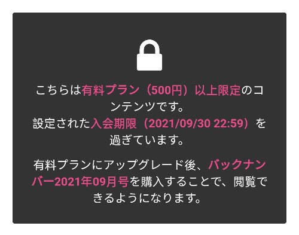

# 在fantia上订阅了某人的会员之后能获取到他的所有作品吗

作者：dlr

TID：31799

<title>1</title> <link href="../Styles/Style.css" type="text/css" rel="stylesheet">

# 1

我在犹豫要不要买一个月的honey lounge五百档会员 <title>2</title> <link href="../Styles/Style.css" type="text/css" rel="stylesheet">

# 2

这要看作者的设置了吧，比如只允许看到几个月以前的作品什么的 <title>3</title> <link href="../Styles/Style.css" type="text/css" rel="stylesheet">

# 3

应该是和作者的设置有关吧 有的平台好像是都可以看到 有的就不清楚了 <title>4</title> <link href="../Styles/Style.css" type="text/css" rel="stylesheet">

# 4

蜂蜜是不行的，他设置的是只能看这个月的 <title>5</title> <link href="../Styles/Style.css" type="text/css" rel="stylesheet">

# 5

很遗憾，蜂蜜的是不行的，大部作者都设置的是只能看当月的作品 <title>6</title> <link href="../Styles/Style.css" type="text/css" rel="stylesheet">

# 6

> [wobuzdshuosm 發表於 2021-10-6 13:28](https://giantessnight.cf/gnforum2012/forum.php?mod=redirect&goto=findpost&pid=481397&ptid=31799)
> 蜂蜜是不行的，他设置的是只能看这个月的

也就是说他的漫画只能五百日元买一个月的份吗？那他一个月的份多不多
<title>7</title> <link href="../Styles/Style.css" type="text/css" rel="stylesheet">

# 7

这是说要先加入付费会员才能购买往期吗 <title>8</title> <link href="../Styles/Style.css" type="text/css" rel="stylesheet">

# 8

 <ignore_js_op>[Screenshot_2021-10-06-14-17-24-96_c0dc27f5c07cb0fb3541d6073dfd6932.jpg](forum.php?mod=attachment&aid=OTE2MDJ8ZTk3YWNmZjl8MTY3NDA2NTg0NXwxODIzMHwzMTc5OQ%3D%3D&nothumb=yes) *(33.27 KB, 下載次數: 0)*

[下載附件](forum.php?mod=attachment&aid=OTE2MDJ8ZTk3YWNmZjl8MTY3NDA2NTg0NXwxODIzMHwzMTc5OQ%3D%3D&nothumb=yes)

2021-10-6 14:18 上傳  

</ignore_js_op> <title>9</title> <link href="../Styles/Style.css" type="text/css" rel="stylesheet">

# 9

> roundrage 發表於 2021-10-6 14:20
> 这是说要先加入付费会员才能购买往期吗

是的，想要購買往期作品，必須先入會成為會員「也就是購買本月作品後」纔可以購買往期作品。 <title>10</title> <link href="../Styles/Style.css" type="text/css" rel="stylesheet">

# 10

也就是說，你想看9月份的內容的話，需要先買10月份的內容後，纔能再購買九月份版，這之間大概需要1000日幣。 <title>11</title> <link href="../Styles/Style.css" type="text/css" rel="stylesheet">

# 11

目前好像只有冬野是随便看的。。。。。。
<title>12</title> <link href="../Styles/Style.css" type="text/css" rel="stylesheet">

# 12

不能，fantia上面购买一个月会员只能看本月的作品，同时获得购买以往作品的权利，以前的还要一个月一个月的买。而且很多作者都喜欢月底更新，如果错过那一天到了下个月一号，而你没有续上新的月租，这期作品同样不可见……不过有些作者会将以往的作品打包处理或单独售卖，这样的话不用充会员就可以直接购买了。 <title>13</title> <link href="../Styles/Style.css" type="text/css" rel="stylesheet">

# 13

P.S. fantia上面的作者产量是有限的，毕竟不能跟单行本对比，那都是数月甚至半年的积累成果。一般来说，一个月可能会更新单图，多一点的大概三四个月能更新一本30p的小册子。产量如牛的有可能一个月更新一篇短漫。支持的话真的很大程度上是为爱发电，为了作者不放弃创作，个人觉得相当于是承担了单行本购买者乃至广大白嫖绅士付给作者的饭钱了lol~ 购买之前要做好心理准备哦 <title>14</title> <link href="../Styles/Style.css" type="text/css" rel="stylesheet">

# 14

基本上就只能看到当月的，可以看看有没有专门为了回购以前的而设置的稍微便宜点的会员，我记得寺田的是有设置的