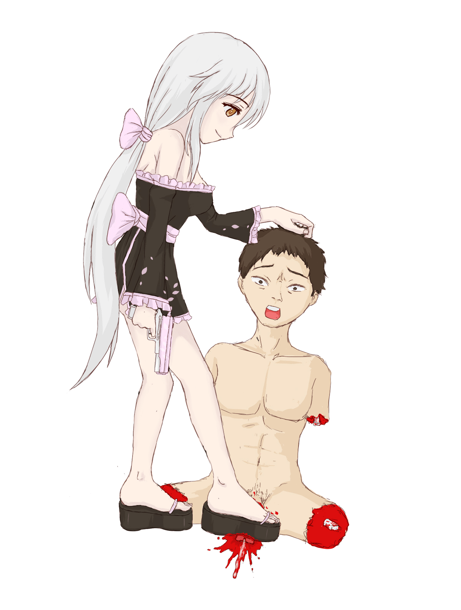

# 在下小劍終於又回來了

作者：wtman

TID：14127

<title>1</title> <link href="../Styles/Style.css" type="text/css" rel="stylesheet">

# 1

*本文章最後由 小劍 於 2013-3-20 15:05 編輯*

從我轉職當深度潛水黨開始，已經一年多，快要兩年了吧
連qq群都退了，除了偶爾偷偷上論壇看下新資源，應該是一直都沒發言過吧
其實轉職的原因很簡單，是因為真正的轉職了
第一點是畢業工作了，生活確實很忙很充實，自由時間肯定是沒有學生時代多，不過這不是重點
第二點就是轉職為正式男友了，和女友住在一起。我想這一點也是許多老前輩退出這個圈子的原因吧，結婚了，同居了，這方面的興趣真的就很不方便了。

不過現在我又是單身了。好聚好散，而且一兩年後可能還會在一起，不過真真正正的分了。（相處這麼久的女友，分手也分過十幾二十次了，性格上確實差距很大，這次總算是定下來了）
所以我又回來了。而且準備著手填坑了
一看才知道，那些坑都是兩三年前挖的了，真是。。。。。。

論壇也搬家了，介面也換了，我的百度空間也消失了，簡體版的小說都丟了，不過還好論壇里的還在
現在正在填的是魔法少女學院派的坑，這坑必須填，因為老早老早就定好結局了，不寫不成，憋死我了

不知道以前的老基友們還有多少呢？
<title>2</title> <link href="../Styles/Style.css" type="text/css" rel="stylesheet">

# 2

我是有在追你的百度空間的。
之前看到收掉覺得蠻驚訝的，還以為劍大封筆了。
期待你的魔法少女學院派，我很喜歡那裡面提到法則全知又無知的相關詩句喔。 <title>3</title> <link href="../Styles/Style.css" type="text/css" rel="stylesheet">

# 3

混蛋！八嘎！你這個滿身肌肉的魚人兄貴！你...你還有臉回來(這是要鬧哪樣的XD)！
終於回來了啊！我寫了一堆文啊(<--真敢講)！
快去把我的文補完啊啊啊啊啊啊！ <title>4</title> <link href="../Styles/Style.css" type="text/css" rel="stylesheet">

# 4

> RL 發表於 2013-3-20 16:17 
> 混蛋！八嘎！你這個滿身肌肉的魚人兄貴！你...你還有臉回來(這是要鬧哪樣的XD)！
> 終於回來了啊！我寫了一堆 ...

我又写（keng）完（le）一堆文啦~
<title>5</title> <link href="../Styles/Style.css" type="text/css" rel="stylesheet">

# 5

诶。。。我都不知道小剑大大百度也有账号啊。。。论坛的文章倒是有点收藏。。。 <title>6</title> <link href="../Styles/Style.css" type="text/css" rel="stylesheet">

# 6

真不知是喜剧还是悲剧.
从兴趣来讲有更多文可看,这当然是喜剧..不过从人生方面就是悲剧了. <title>7</title> <link href="../Styles/Style.css" type="text/css" rel="stylesheet">

# 7

好久不见，十分想念 <title>8</title> <link href="../Styles/Style.css" type="text/css" rel="stylesheet">

# 8

.
嗯……大家確實還會提到你呢，你過去畢竟是這麼活躍。
不過你因為有這種遭遇才回來，我是不會感到高興啦……希望你很快又恢復潛水的身份XDD

身為網友確實會寂寞，但也沒辦法呢。
當然還是希望你能夠找到願意接納你這個興趣的女友了，最好一起上GN！
現在先給自己療傷吧！
<title>9</title> <link href="../Styles/Style.css" type="text/css" rel="stylesheet">

# 9

奥乃终于知道回来了。。。消失了那么久福利呢福利 <title>10</title> <link href="../Styles/Style.css" type="text/css" rel="stylesheet">

# 10

唉~~大神就是好。。。有这么多人得以铭记。像咱这种无名小卒只能成为路人甲乙丙丁在角落里蹲着。只能自我催眠大家开心一起跟着开心。夫哀莫大于心死，而人死亦次之。不开心的话就不说了，欢迎回来~ <title>11</title> <link href="../Styles/Style.css" type="text/css" rel="stylesheet">

# 11

果然是回到f島，不，回到gn當大師了小劍........................... <title>12</title> <link href="../Styles/Style.css" type="text/css" rel="stylesheet">

# 12

歡迎回來~ <title>13</title> <link href="../Styles/Style.css" type="text/css" rel="stylesheet">

# 13

*本帖最後由 無間道 於 2017-8-15 22:46 編輯*

 快去更新文啦

我要SM的 要SM的~~~~~~~

 QQ都被拉黑啦~

<ignore_js_op>

**gzly.jpg** *(466.44 KB, 下載次數: 0)*

[下載附件](forum.php?mod=attachment&aid=NjkxODd8ODNjNDExZTB8MTY3NDA2ODUyNnwxODIzMHwxNDEyNw%3D%3D&nothumb=yes)

2017-8-15 22:46 上傳

<title>14</title> <link href="../Styles/Style.css" type="text/css" rel="stylesheet">

# 14

為什麼突然覺得小劍的女朋友是GTS同好卻又因為小劍完全沒有表露出該方面的興趣然後被誤以為非本圈子的才分的？ <title>15</title> <link href="../Styles/Style.css" type="text/css" rel="stylesheet">

# 15

猛虎落地式單膝跪地恭迎我大劍爺王者歸來，千秋萬代一統漿糊！ <title>16</title> <link href="../Styles/Style.css" type="text/css" rel="stylesheet">

# 16

> 心晴 發表於 2013-3-20 19:37 
> 唉~~大神就是好。。。有这么多人得以铭记。像咱这种无名小卒只能成为路人甲乙丙丁在角落里蹲着。只能自我催 ...

晴爺我還記得乃發給我的某gts大圖噢，要不是該死的硬盤壞掉了，肯定會保存至今。
<title>17</title> <link href="../Styles/Style.css" type="text/css" rel="stylesheet">

# 17

唔，遇到一个难题了
最近在打辐射3，所以又很想更新我的【荒野烙印】，但是学院派也是一直都在脑里萦绕不去
怎么办，更新哪个好纠结啊！

算了去打辐射3吧 <title>18</title> <link href="../Styles/Style.css" type="text/css" rel="stylesheet">

# 18

终于，剑大又回来了。看了这么多的原创文章，感觉还是剑大的最符合我口味。特别是幽历系列 <title>19</title> <link href="../Styles/Style.css" type="text/css" rel="stylesheet">

# 19

LZ写的文章神马的都很喜欢咩~~</ignore_js_op>