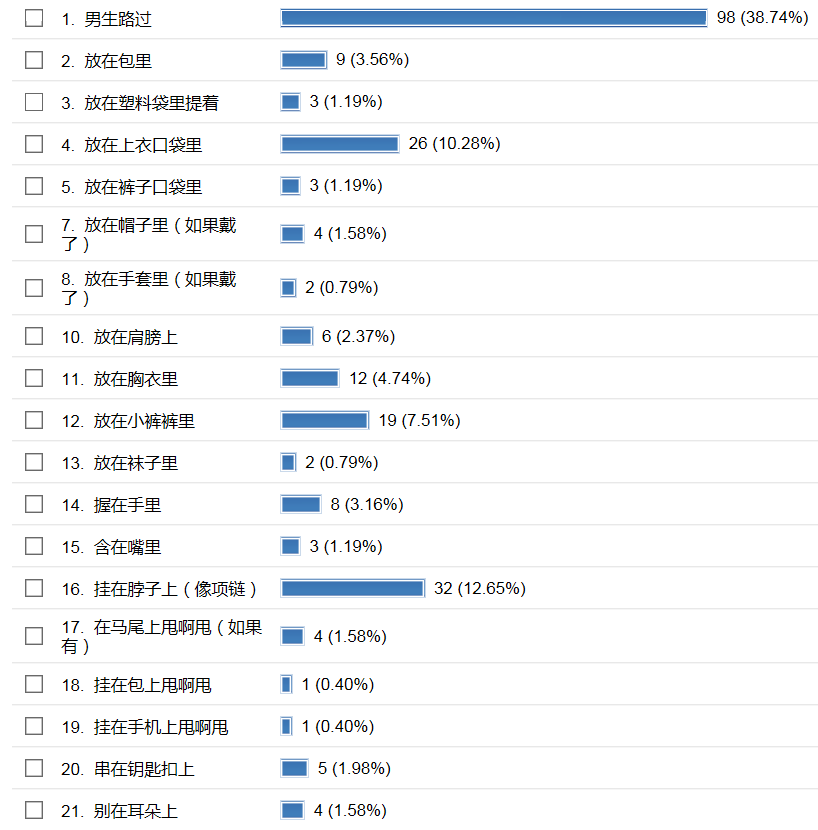

# 在北师大论坛上对女生做了一次有关GTS的调查

作者：百川归来

TID：23071

<title>1</title> <link href="../Styles/Style.css" type="text/css" rel="stylesheet">

# 1

*本帖最後由 百川归来 於 2017-5-14 13:25 編輯*

调查的题目为：如果BF缩小到3厘米高，一起出门愿意怎样带着他？
共有147名女生参与了调查（对被调查者性别的真实性有质疑的请参考3楼），她们可以从20个选项中选择1个（之前写错写成3个了）最喜欢的选项提交投票，最后的调查结果如下：
<ignore_js_op>

**无标题.png** *(34.88 KB, 下載次數: 10)*

[下載附件](forum.php?mod=attachment&aid=Njc4MzJ8ZDAxOGNmMmN8MTY3NDA2ODgwMnwxODIzMHwyMzA3MQ%3D%3D&nothumb=yes)

2017-5-13 14:41 上傳

从结果可以看出：
女生最喜欢把男友挂在脖子上。因为这样既显得亲密，又保持了男友和自己私密部位的距离。
人气排第2的选项是放在上衣口袋，看来很大一部分女生和她们男友依然保持一定的距离。
令人不可描述的是人气排第3的选项：放在小裤裤里。原来北师大的女生这么开放啊！
并且紧随其后的是放在胸衣里。天哪，你们真的太开放了。
最绝情的是，居然有3位女生选择放在塑料袋里提着。她们的男朋友一定没有好好对待她们。
还有2位女生选择放在袜子里，3位女生选择含在嘴里。不知道是出于什么心态。

<title>2</title> <link href="../Styles/Style.css" type="text/css" rel="stylesheet">

# 2

*本帖最後由 wqr 於 2017-5-13 14:47 編輯*

貌似赶上直播了，坐个沙发先。
我是这样认为的，虽然很残酷，但是我认为那些不可描述的选项也有很大的可能性是男生选的啊。毕竟看到上面第一个选项，这个调查并非仅对女生进行。。当然，如果女生真的那么开放，往GTS化方向发展就容易多了。
<title>3</title> <link href="../Styles/Style.css" type="text/css" rel="stylesheet">

# 3

> [wqr 發表於 2017-5-13 14:45](https://giantessnight.cf/gnforum2012/forum.php?mod=redirect&goto=findpost&pid=332056&ptid=23071)
> 貌似赶上直播了，坐个沙发先。
> 我是这样认为的，虽然很残酷，但是我认为那些不可描述的选项也有很大的可能 ...

我看了下，做调查的男女比例（98:147）基本符合北师大的全校的男女比例，所以近似认为没有男生选下面的选项。
<title>4</title> <link href="../Styles/Style.css" type="text/css" rel="stylesheet">

# 4

你是怎么确定男女的，明明很多男的还伪装成女的。。。。 <title>5</title> <link href="../Styles/Style.css" type="text/css" rel="stylesheet">

# 5

> [网络菜鸟 發表於 2017-5-13 15:21](https://giantessnight.cf/gnforum2012/forum.php?mod=redirect&goto=findpost&pid=332060&ptid=23071)
> 你是怎么确定男女的，明明很多男的还伪装成女的。。。。

参考3楼                   <title>6</title> <link href="../Styles/Style.css" type="text/css" rel="stylesheet">

# 6

我没有懂你是怎么算男女比例的。。。不是多选可以选3个吗？又不是单选题
除了第一个选项之外加起来才147票吧，98个人选了1之后再投2票都已经能投196票了。。。
也就是说就算完全只有98个男生来投票，也能投成这个结果吧 <title>7</title> <link href="../Styles/Style.css" type="text/css" rel="stylesheet">

# 7

放小裤裤里好啊！放小裤裤里 <title>8</title> <link href="../Styles/Style.css" type="text/css" rel="stylesheet">

# 8

北师的统计学还是有大佬坐镇的，楼主不学统计？ <title>9</title> <link href="../Styles/Style.css" type="text/css" rel="stylesheet">

# 9

怎麼沒其他部位
像是放在鞋子裡面之類的
只是如果寫了一定會暴露喜好就是了... <title>10</title> <link href="../Styles/Style.css" type="text/css" rel="stylesheet">

# 10

> [餃子 發表於 2017-5-13 15:42](https://giantessnight.cf/gnforum2012/forum.php?mod=redirect&goto=findpost&pid=332066&ptid=23071)
> 我没有懂你是怎么算男女比例的。。。不是多选可以选3个吗？又不是单选题
> 除了第一个选项之外加起来才147票 ...

之前写错了，应该是单选。 <title>11</title> <link href="../Styles/Style.css" type="text/css" rel="stylesheet">

# 11

*本帖最後由 百川归来 於 2017-5-14 13:42 編輯*

> [Lanclot 發表於 2017-5-13 16:52](https://giantessnight.cf/gnforum2012/forum.php?mod=redirect&goto=findpost&pid=332074&ptid=23071)
> 北师的统计学还是有大佬坐镇的，楼主不学统计？

就你学统计，你咋不去调查？                         <title>12</title> <link href="../Styles/Style.css" type="text/css" rel="stylesheet">

# 12

这个爱好我身边至少有20个女生知道，而她们都觉得很正常啊。 <title>13</title> <link href="../Styles/Style.css" type="text/css" rel="stylesheet">

# 13

哇，本死宅表示，真的不知道女性会这么想过的说。从来只从男性思考着。。 <title>14</title> <link href="../Styles/Style.css" type="text/css" rel="stylesheet">

# 14

> [百川归来 發表於 2017-5-14 13:26](https://giantessnight.cf/gnforum2012/forum.php?mod=redirect&goto=findpost&pid=332202&ptid=23071)
> 就你学统计，你咋不去调查？

_(:3」∠)_楼主打开方式不对吗？正常回复难道不是：对呀，我学xxxx，然后充斥着欢声笑语
<title>15</title> <link href="../Styles/Style.css" type="text/css" rel="stylesheet">

# 15

会不会被人发现你的意图。 <title>16</title> <link href="../Styles/Style.css" type="text/css" rel="stylesheet">

# 16

放在小裤裤里……小裤裤……chaos，多少个男生选的吧 <title>17</title> <link href="../Styles/Style.css" type="text/css" rel="stylesheet">

# 17

怎么确定投票的是男的还是女的 <title>18</title> <link href="../Styles/Style.css" type="text/css" rel="stylesheet">

# 18

这个调查真的有点意外，我以为放在包包里会比较多呢！ <title>19</title> <link href="../Styles/Style.css" type="text/css" rel="stylesheet">

# 19

天哪……突然觉得GTS多元化很有市场,2333333333~ <title>20</title> <link href="../Styles/Style.css" type="text/css" rel="stylesheet">

# 20

  如果增加一些残酷系的选项呢，比如踩死、握溃等 <title>21</title> <link href="../Styles/Style.css" type="text/css" rel="stylesheet">

# 21

> [wuliaojianke 發表於 2017-6-16 22:45](https://giantessnight.cf/gnforum2012/forum.php?mod=redirect&goto=findpost&pid=335938&ptid=23071)
> 如果增加一些残酷系的选项呢，比如踩死、握溃等

哪有这样对待男朋友的 <title>22</title> <link href="../Styles/Style.css" type="text/css" rel="stylesheet">

# 22

为什么没有出一些比较残酷的选项呢，话说BF是什么意思 <title>23</title> <link href="../Styles/Style.css" type="text/css" rel="stylesheet">

# 23

> [小个子的快乐 發表於 2017-7-15 16:58](https://giantessnight.cf/gnforum2012/forum.php?mod=redirect&goto=findpost&pid=339640&ptid=23071)
> 为什么没有出一些比较残酷的选项呢，话说BF是什么意思

我不喜欢残酷的，BF=boy friend <title>24</title> <link href="../Styles/Style.css" type="text/css" rel="stylesheet">

# 24

反正我身边的人，从亲戚到qq到同学，没有一个是圈内人，有时候会看到圈外人发圈内的图，试探性的说了句基恩，对面问了句啥，我就赶紧收口了。。。 <title>25</title> <link href="../Styles/Style.css" type="text/css" rel="stylesheet">

# 25

> [百川归来 發表於 2017-7-15 23:33](https://giantessnight.cf/gnforum2012/forum.php?mod=redirect&goto=findpost&pid=339696&ptid=23071)
> 我不喜欢残酷的，BF=boy friend

哦，谢谢解答。。。。
<title>26</title> <link href="../Styles/Style.css" type="text/css" rel="stylesheet">

# 26

> [MadlifeSUP 發表於 2017-7-16 05:14](https://giantessnight.cf/gnforum2012/forum.php?mod=redirect&goto=findpost&pid=339712&ptid=23071)
> 反正我身边的人，从亲戚到qq到同学，没有一个是圈内人，有时候会看到圈外人发圈内的图，试探性的说了句基恩 ...

感觉像是接头暗号似的，挺刺激
<title>27</title> <link href="../Styles/Style.css" type="text/css" rel="stylesheet">

# 27

> [小兵 發表於 2017-6-16 22:35](https://giantessnight.cf/gnforum2012/forum.php?mod=redirect&goto=findpost&pid=335935&ptid=23071)
> 天哪……突然觉得GTS多元化很有市场,2333333333~

感觉现在很多年轻人潜意识里都喜欢gts，只不过没人引导他们觉醒而已。不知我的理解是否正确。
<title>28</title> <link href="../Styles/Style.css" type="text/css" rel="stylesheet">

# 28

虽然近来GTS元素越来越多，但个人感觉市场化的扩大在目前来看还是不现实 <title>29</title> <link href="../Styles/Style.css" type="text/css" rel="stylesheet">

# 29

emmmmmm。。。北师大的女生 <title>30</title> <link href="../Styles/Style.css" type="text/css" rel="stylesheet">

# 30

天下之大无奇不有，也许其他人还有更那个啥的想法呢。</ignore_js_op>