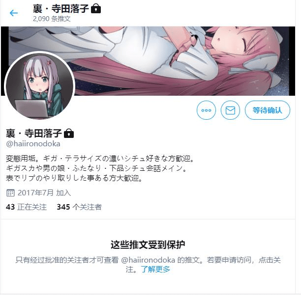

# 在推特上看到了寺田的另一个账号

作者：Nagoya0519

TID：27218

<title>1</title> <link href="../Styles/Style.css" type="text/css" rel="stylesheet">

# 1

<ignore_js_op>

**lalala.jpg** *(47.94 KB, 下載次數: 0)*

[下載附件](forum.php?mod=attachment&aid=NzkzNDh8M2VlZWEzYzl8MTY3NDA2NjUzOXwxODIzMHwyNzIxOA%3D%3D&nothumb=yes)

2019-8-8 08:11 上傳

如图。
我在推特上搜寺田的时候搜出来的。
看介绍好像是寺田的小号之类的，
但里面都是giga级、gt、futa这些比较重口的内容
然后限制了查看
我昨天请求关注，现在还没被通过
是因为寺田不用这个号，还是要满足一些条件？
对里面的内容十分感兴趣
希望有知道详情的大佬能说一下

另外，不要脸地说一句，
如果有大佬已经关注了，
能不能分享一下里面的图呢？

<title>2</title> <link href="../Styles/Style.css" type="text/css" rel="stylesheet">

# 2

我也對這個號很有興趣，我也追中了一兩天了，但還沒同意
<title>3</title> <link href="../Styles/Style.css" type="text/css" rel="stylesheet">

# 3

大概跟白兔一樣根本沒在用吧 我對白兔的追蹤申請已經被放置四年了 給你參考
<title>4</title> <link href="../Styles/Style.css" type="text/css" rel="stylesheet">

# 4

> [3213213210 發表於 2019-8-8 12:54](https://giantessnight.cf/gnforum2012/forum.php?mod=redirect&goto=findpost&pid=411997&ptid=27218)
> 大概跟白兔一樣根本沒在用吧 我對白兔的追蹤申請已經被放置四年了 給你參考
> ...

原來白兔老師有twitter(震驚
twitter的GTS專用帳用了5年 只知道他有個練習用帳號 但裡面都沒有GTS內容 連他有真正帳號都不知道真的慚愧了
不知道大老有沒有連結可以給個
<title>5</title> <link href="../Styles/Style.css" type="text/css" rel="stylesheet">

# 5

> [Nagoya0519 發表於 2019-8-8 13:36](https://giantessnight.cf/gnforum2012/forum.php?mod=redirect&goto=findpost&pid=412004&ptid=27218)
> 原來白兔老師有twitter(震驚
> twitter的GTS專用帳用了5年 只知道他有個練習用帳號 但裡面都沒有GTS內容 連 ...

我也是想原來白兔老師有推特啊
我覺得就算沒再用我也想追蹤一下不知道為啥...
有沒有一些隱藏或冷門的帳號可以給我們追蹤一下的
感恩大大
<title>6</title> <link href="../Styles/Style.css" type="text/css" rel="stylesheet">

# 6

*本帖最後由 Nagoya0519 於 2019-8-10 00:52 編輯*

> [超SizeJKGirl 發表於 2019-8-9 16:20](https://giantessnight.cf/gnforum2012/forum.php?mod=redirect&goto=findpost&pid=412096&ptid=27218)
> 我也是想原來白兔老師有推特啊
> 我覺得就算沒再用我也想追蹤一下不知道為啥...
> 有沒有一些隱藏或冷門的帳 ...

我追的也不是很多啦，而且很多年這樣追下來就會各種發現以前追的人現在都銷聲匿跡了，哀 果然GTS界要持久的還是很少

就稍微整理一些吧
老師類的(本子作者類):
[https://twitter.com/eichi_megumi](https://twitter.com/eichi_megumi) 白兔的練習帳，本帳我也不知道是哪個  [https://twitter.com/hachim_lounge](https://twitter.com/hachim_lounge) hachimitsu大神
[https://twitter.com/anothertomoshib](https://twitter.com/anothertomoshib)有畫一個BB本的那位作者
[https://twitter.com/takaisen](https://twitter.com/takaisen) 高井
[https://twitter.com/dreg_ex](https://twitter.com/dreg_ex) DRE
[https://twitter.com/ruu000000](https://twitter.com/ruu000000) uru
[https://twitter.com/iceman_ht](https://twitter.com/iceman_ht) iceman
[https://twitter.com/kuro_oolong96](https://twitter.com/kuro_oolong96) 黑烏龍(106m)
[https://twitter.com/DS00309](https://twitter.com/DS00309) rakiA
[https://twitter.com/Manzi_ss](https://twitter.com/Manzi_ss) 沒什麼好說的了就manzi大神
[https://twitter.com/Seo_t](https://twitter.com/Seo_t) 就TEDDY-PLAZA
[https://twitter.com/sayame_0](https://twitter.com/sayame_0) 沙弥匁
[https://twitter.com/Lien_57](https://twitter.com/Lien_57) Lien
[https://twitter.com/aonagi_ibane](https://twitter.com/aonagi_ibane)  蒼凪イバネ
[https://twitter.com/ABzome](https://twitter.com/ABzome)
上面都是很有名的而且現在還有在做的老師，反正都找了就順便整理一輪

個人推薦區：

[https://twitter.com/GiantessEatYou](https://twitter.com/GiantessEatYou) 一個作的圖很漂亮的大神
[https://twitter.com/dwarf_590](https://twitter.com/dwarf_590) 一個做真人gts攝影的
[https://twitter.com/NAndeyanenGTS](https://twitter.com/NAndeyanenGTS) NA大老 不過失蹤一段時間了
[https://twitter.com/5nbe](https://twitter.com/5nbe) 新參者 老人可能才知道
[https://twitter.com/noplan4649](https://twitter.com/noplan4649) ttt 常做一些rpg遊戲
[https://twitter.com/piyonaf](https://twitter.com/piyonaf/media) 失蹤很久了 但他的圖很不錯
[https://twitter.com/UtopiaVL](https://twitter.com/UtopiaVL) 這應該算大神區才對的 utopia
[https://twitter.com/nukochigura](https://twitter.com/nukochigura) 猫ちぐら 之前做了一個不錯的遊戲
[https://twitter.com/alicemahou](https://twitter.com/alicemahou) Alicemagic
[https://twitter.com/MMJJMJJ](https://twitter.com/MMJJMJJ/media) resizeme作者之一
[https://twitter.com/aoigai](https://twitter.com/aoigai) resizeme另一位作者 這位圖也畫得很棒
[https://twitter.com/JuneJukes](https://twitter.com/JuneJukes) 這位我也不知道該怎麼形容 但就是很大佬 studio yamato 似乎跟他有關係
************
[https://twitter.com/melcara_kck](https://twitter.com/melcara_kck/media) MeL 我個人私心極推的一個大神，MMD做的圖超級帶感
************
下面三位是在DEVIENTART也有帳號的國外大神
[https://twitter.com/UnseenHarbinger](https://twitter.com/UnseenHarbinger) Unseen Harbinger 做Giants and the city的大老
[https://twitter.com/PolyphiusGTS](https://twitter.com/PolyphiusGTS) Polyphius 作絆愛GTS影片的作者
[https://twitter.com/preesoul](https://twitter.com/preesoul) 韓國高產大老 pixiv的圖幾乎是一天一張的出

以上就是我草略的整理 不知道對你有沒有幫助就是

<title>7</title> <link href="../Styles/Style.css" type="text/css" rel="stylesheet">

# 7

话说寺田的推特号是什么啊，一直都没有找到 <title>8</title> <link href="../Styles/Style.css" type="text/css" rel="stylesheet">

# 8

> BIGDIAO 發表於 2019-9-1 00:55
> 话说寺田的推特号是什么啊，一直都没有找到

就是寺田落子啊 打對應該挺好找的吧？
裏號應該是沒什麼用就別找了

https://twitter.com/teradaochiko <title>9</title> <link href="../Styles/Style.css" type="text/css" rel="stylesheet">

# 9

> Nagoya0519 發表於 2019-9-1 03:06
> 就是寺田落子啊 打對應該挺好找的吧？
> 裏號應該是沒什麼用就別找了

emm，原来是打错了，谢谢大佬 <title>10</title> <link href="../Styles/Style.css" type="text/css" rel="stylesheet">

# 10

> [Nagoya0519 發表於 2019-8-10 00:49](https://giantessnight.cf/gnforum2012/forum.php?mod=redirect&goto=findpost&pid=412131&ptid=27218)
> 我追的也不是很多啦，而且很多年這樣追下來就會各種發現以前追的人現在都銷聲匿跡了，哀 果然GTS界要持久 ...

楼主你知道ttt的大部分游戏该怎么下载吗，看过他的推特，他貌似没贴链接。。。
<title>11</title> <link href="../Styles/Style.css" type="text/css" rel="stylesheet">

# 11

> [头文字G 發表於 2019-9-3 04:32](https://giantessnight.cf/gnforum2012/forum.php?mod=redirect&goto=findpost&pid=413960&ptid=27218)
> 楼主你知道ttt的大部分游戏该怎么下载吗，看过他的推特，他貌似没贴链接。。。
> ...

他大部分的作品都是自己做來練習跟自爽用的 有做好公開的他都會放置頂 <title>12</title> <link href="../Styles/Style.css" type="text/css" rel="stylesheet">

# 12

我觉得想看寺田的图就直接买些本子看吧，推特上的内容也不应该是什么隐藏的讯息之类的.
<title>13</title> <link href="../Styles/Style.css" type="text/css" rel="stylesheet">

# 13

马住这篇，太有用了。。。。</ignore_js_op>