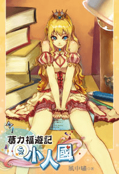

# 在書店發現的一本書

作者：AXEL

TID：7774

<title>1</title> <link href="../Styles/Style.css" type="text/css" rel="stylesheet">

# 1

書名:葛力福遊記之小人國1
出版日期 2010/05/07
這本書的書名引起了我的興趣,本想借來看看的但老闆說有人要借了,看完簡介似乎是一本男巨的小說,以下是上網查的簡介,有興趣的可以去借來看看

十六歲少年葛力福，擁有世上最美的女孩，每天藏在他的屋裡，她只有十一公分高，皮膚雪白，容貌精緻美麗到了極點，比別的洋娃娃要更美得多•••
但災禍來襲，葛力福的父母被人陷害入獄，他也遭到追殺，不得不突破空間，進入到了戀人所在的世界。
那是一個微型人類居住的國度，面對著渡過海峽前來進攻的百萬敵軍，葛力福一怒揮棒，發泰坦巨人之威，震懾天下！ <title>2</title> <link href="../Styles/Style.css" type="text/css" rel="stylesheet">

# 2

斯威夫特的名著《格列佛游记》的同人作么？ <title>3</title> <link href="../Styles/Style.css" type="text/css" rel="stylesheet">

# 3

原來是GT啊。。。。。。。。畫風還是不錯的。。。

[ *本帖最後由 sword0198 於 2010-5-6 16:46 編輯* ] <title>4</title> <link href="../Styles/Style.css" type="text/css" rel="stylesheet">

# 4

不知道大家有沒有看過一個太監闖內宮看作者名稱是應該同一人
當中就有GTS出現的情節 <title>5</title> <link href="../Styles/Style.css" type="text/css" rel="stylesheet">

# 5

不对…………应该是奥特曼的同人作 <title>6</title> <link href="../Styles/Style.css" type="text/css" rel="stylesheet">

# 6

> 原帖由 *sword0198* 於 2010-5-6 16:43 發表 
> 原來是GT啊。。。。。。。。畫風還是不錯的。。。

有图？求图，谢谢！ <title>7</title> <link href="../Styles/Style.css" type="text/css" rel="stylesheet">

# 7

> 原帖由 *xnr* 於 2010-5-6 18:04 發表 
> 
> 有图？求图，谢谢！

百度来的封面图片 <title>8</title> <link href="../Styles/Style.css" type="text/css" rel="stylesheet">

# 8

 <ignore_js_op>[0000001182.jpg](forum.php?mod=attachment&aid=MjAxODZ8NmNhMjY1MmF8MTY3NDA2ODg5NHwxODIzMHw3Nzc0&nothumb=yes) *(57.29 KB, 下載次數: 1)*

[下載附件](forum.php?mod=attachment&aid=MjAxODZ8NmNhMjY1MmF8MTY3NDA2ODg5NHwxODIzMHw3Nzc0&nothumb=yes)

2010-5-6 18:09 上傳  

</ignore_js_op> <title>9</title> <link href="../Styles/Style.css" type="text/css" rel="stylesheet">

# 9

反啦OTZ <title>10</title> <link href="../Styles/Style.css" type="text/css" rel="stylesheet">

# 10

畫中的女角色很不錯   不過如果可以把男女的體型對調那就..... <title>11</title> <link href="../Styles/Style.css" type="text/css" rel="stylesheet">

# 11

 兴许往下就到大人国了。。。。。。。。 <title>12</title> <link href="../Styles/Style.css" type="text/css" rel="stylesheet">

# 12

7的图很不错
果然有图才有真想 <title>13</title> <link href="../Styles/Style.css" type="text/css" rel="stylesheet">

# 13

同意10的观点............