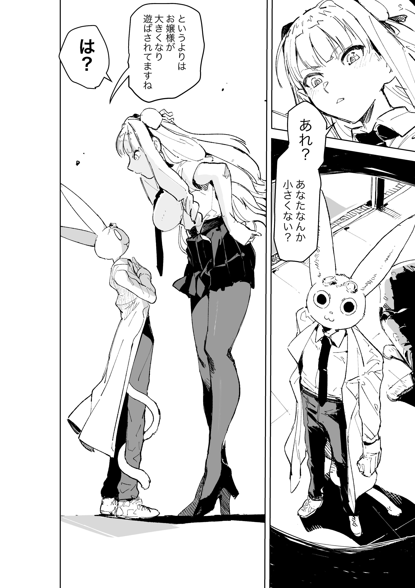
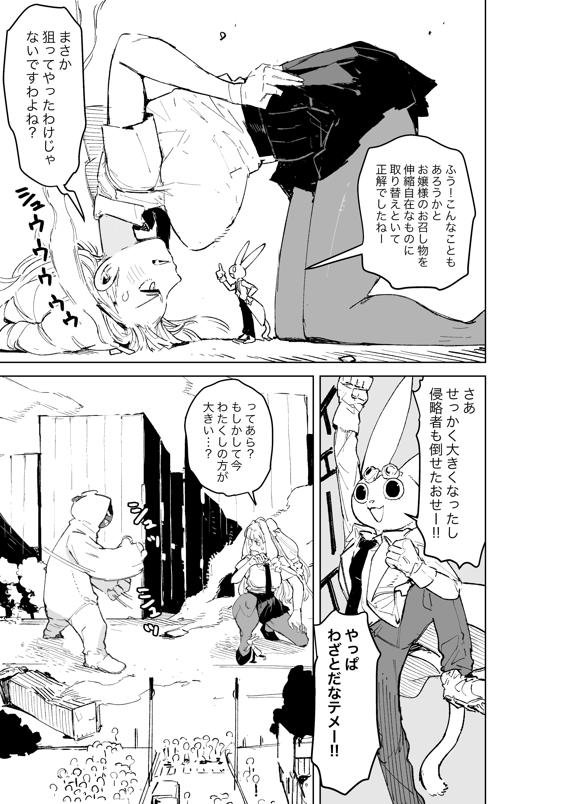
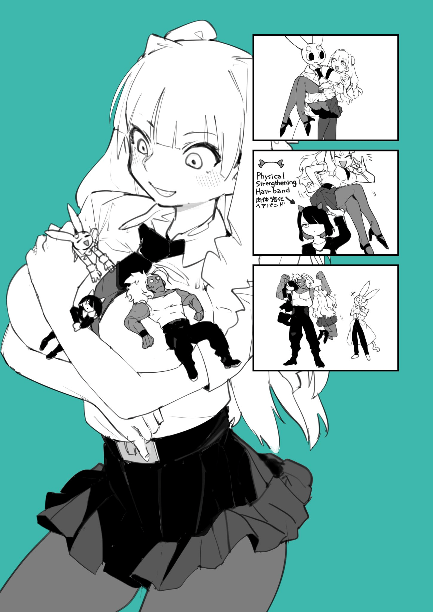
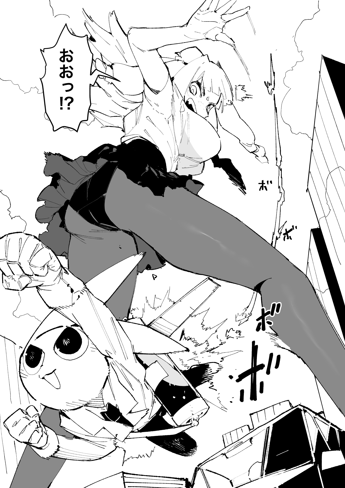
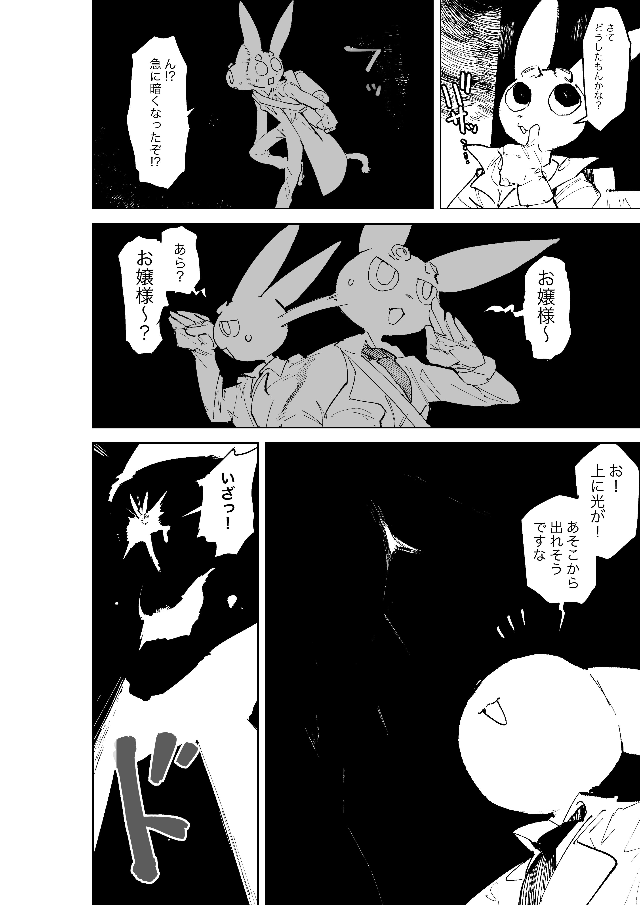
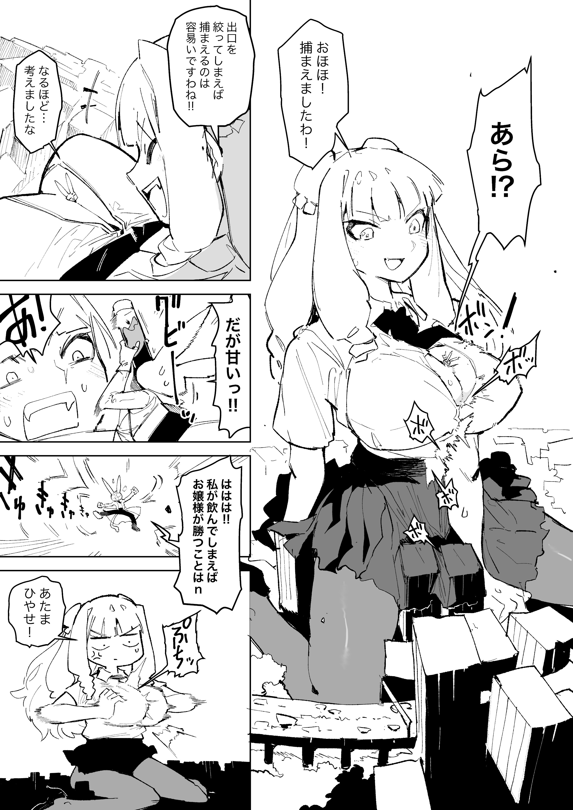

# 在漫畫投稿網站上拿第五名的巨人小姐

作者：哇哩咧

TID：30409

<title>1</title> <link href="../Styles/Style.css" type="text/css" rel="stylesheet">

# 1

原本是在twitter上看到作者畫的第一話，當時還以為就這短篇而已。
<ignore_js_op>

**Epb79DXUYAE5AUc.jpg** *(1.01 MB, 下載次數: 0)*

[下載附件](forum.php?mod=attachment&aid=ODc2MTB8ZWZhMzE1YTR8MTY3NDA2NjEwN3wxODIzMHwzMDQwOQ%3D%3D&nothumb=yes)

2021-2-22 22:21 上傳

<ignore_js_op>

**Epb8NSoU8AAiflQ.jpg** *(1.29 MB, 下載次數: 0)*

[下載附件](forum.php?mod=attachment&aid=ODc2MTF8ZGRlZDk4NDB8MTY3NDA2NjEwN3wxODIzMHwzMDQwOQ%3D%3D&nothumb=yes)

2021-2-22 22:21 上傳

<ignore_js_op>

**Euz2P4zUUAEz8wy.jpg** *(229.6 KB, 下載次數: 0)*

[下載附件](forum.php?mod=attachment&aid=ODc2MTJ8M2YyYjJlMzF8MTY3NDA2NjEwN3wxODIzMHwzMDQwOQ%3D%3D&nothumb=yes)

2021-2-22 22:21 上傳

[https://twitter.com/nikukaiQ/media](https://twitter.com/nikukaiQ/media)

結果後來發現一直在更新，然後還去投稿了

[https://rookie.shonenjump.com/etc/entry/publication202012](https://rookie.shonenjump.com/etc/entry/publication202012)

應該可以期待一波長篇或有漢化組接手

<ignore_js_op>

**EsLD7RrVoAEC_P2.jpg** *(1.07 MB, 下載次數: 0)*

[下載附件](forum.php?mod=attachment&aid=ODc2MTN8NjhmNjljZjJ8MTY3NDA2NjEwN3wxODIzMHwzMDQwOQ%3D%3D&nothumb=yes)

2021-2-22 22:27 上傳

<ignore_js_op>

**EsLEFAAVoAAyavw.jpg** *(730.41 KB, 下載次數: 0)*

[下載附件](forum.php?mod=attachment&aid=ODc2MTR8ZjY3NmI3Y2Z8MTY3NDA2NjEwN3wxODIzMHwzMDQwOQ%3D%3D&nothumb=yes)

2021-2-22 22:27 上傳

<ignore_js_op>

**EsLEF7mUcAQPCkq.jpg** *(1.28 MB, 下載次數: 0)*

[下載附件](forum.php?mod=attachment&aid=ODc2MTV8MDE3YjY1OGV8MTY3NDA2NjEwN3wxODIzMHwzMDQwOQ%3D%3D&nothumb=yes)

2021-2-22 22:27 上傳

<title>2</title> <link href="../Styles/Style.css" type="text/css" rel="stylesheet">

# 2

.
我的視線不由得被那隻鳳凰院兇真兔吸引過去 <title>3</title> <link href="../Styles/Style.css" type="text/css" rel="stylesheet">

# 3

好家伙！希望可以正式出版

以前一些商业gts腰斩真是哭死我了 <title>4</title> <link href="../Styles/Style.css" type="text/css" rel="stylesheet">

# 4

哇可以啊，希望能看到后续呢，之前看推特上gts作者大多都倾向于画一些擦边的散图，要是真的能有一个连载漫画出来就好了 <title>5</title> <link href="../Styles/Style.css" type="text/css" rel="stylesheet">

# 5

> [kale 發表於 2021-2-22 23:20](https://giantessnight.cf/gnforum2012/forum.php?mod=redirect&goto=findpost&pid=460988&ptid=30409)
> 哇可以啊，希望能看到后续呢，之前看推特上gts作者大多都倾向于画一些擦边的散图，要是真的能有一个连载漫 ...

目前连载只有巨少女五重奏吧，希望别腰斩……以前有一些gts都被斩了
<title>6</title> <link href="../Styles/Style.css" type="text/css" rel="stylesheet">

# 6

> [黒茶鯖虎 發表於 2021-2-23 00:03](https://giantessnight.cf/gnforum2012/forum.php?mod=redirect&goto=findpost&pid=460997&ptid=30409)
> 我说哥们，你这帖子根本就是撞车了吧，我记得之前葬儀社大佬有介绍过，你这内容明显重复的。。。。。。我就 ...

感謝提醒，不過我這篇能算後續推廣了吧。
畢竟那時候應該是剛連載還沒進排名。

談天區這裡光看標題沒點進去有時候根本不知道內容一不一樣</ignore_js_op></ignore_js_op></ignore_js_op></ignore_js_op></ignore_js_op></ignore_js_op>