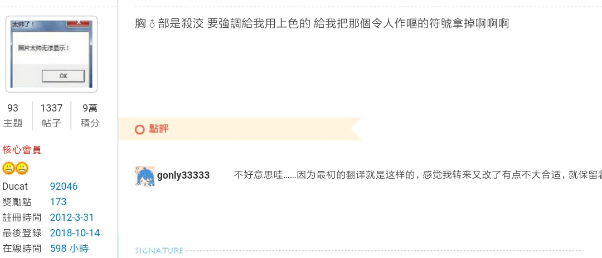
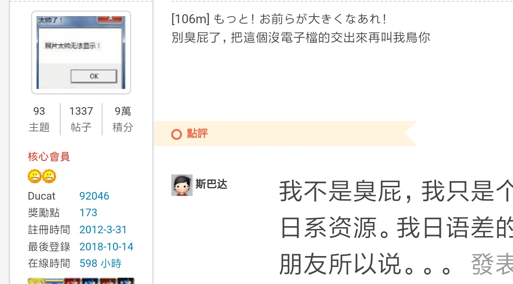

# 在這裡宣導一下關於對於作品的回覆問題

作者：gtshaha

TID：25968

<title>1</title> <link href="../Styles/Style.css" type="text/css" rel="stylesheet">

# 1

首先，今天我先宣布一下，我們論壇痛失了一位優秀的創作者，他本人表示以後不在論壇發表作品了，喜歡的話請到那位作者的個人論壇觀看

再來，關於回覆的問題
灌水是當然不可以的
但是關於讚美或建議
尤其是建議的部分
雖然說很難有好聽話
但是請注意你的言詞
我去查看了給建議的那位壇友的發表作品
其實他自己本身也對於繪圖這個部分完全沒有涉略
但是卻講的頭頭是道，甚至將作品批評的一文不值
這是很不好的行為

說時容易做時難
今天給你一樣的標準，你做得到，才能夠來批判人

你只是個觀眾，你不喜歡，可以選擇不看
你可以給建議，但批評的一文不值
甚至叫別人砍掉重練
我完全不贊同

並不是每個人都想靠畫圖這行吃飯
人人也都有是菜鳥的時期

他拿出很多商業作品來舉例這是很不恰當的
這些老師們都已經畫了幾年出道幾年了，更何況有專業的編輯幫忙審核
不是一夕之間可以辦到的

最後還是說，希望不要再有出現鍵盤俠的情況了
你可以就作品想要的走向給一些建議
但不要全盤否定
再次強調
這是免費的同人社群
沒有收任何一毛錢
看免錢的還嫌？
這是什麼心態
我也希望那位壇友能夠看到這篇自省一下

自己沒有涉略過的領域
請不要隨意批評

尊重 包容 友善

<title>2</title> <link href="../Styles/Style.css" type="text/css" rel="stylesheet">

# 2

早上刚看完贴，等着晚上回家拿电脑下，下午就删帖，绝了。
鉴于在这个堪比《野生的最终BOSS出现了》的加拉尔论坛，我就不占立场了，就读个新闻吧。
“10月9日，成都市郫都区华邑阳光里小区门口的一则“公示”，引来业主驻足观看和讨论。该公示称‘因接到物业通知，有居民投诉在小区内的移动手机信号设备，干扰了部分业主的正常生活，经沟通，解释无果，三大运营商将中断、停止小区内所有移动手机信号设备的运行’” <title>3</title> <link href="../Styles/Style.css" type="text/css" rel="stylesheet">

# 3

有備份或是截圖把他的發言貼出來讓大家看看嗎(？
<title>4</title> <link href="../Styles/Style.css" type="text/css" rel="stylesheet">

# 4

相當支持樓主,雖然我只是萌新但在創作上我也正在努力的道路上。
我很希望能得到意見,但不是那種硬要我政治正確使用簡體阿或寫出政治正確的文章內容。

今天被噴得是我的好朋友,我現在更不會開心,我很不希望有那種自以為是的人自己出來講講,我很討厭那種人,
每個人都有自己的風格,有自己喜歡的,創作自己喜歡的才是ˋ興趣吧? 創作你喜歡的,我為什麼要那麼做?

好! 我這麼做了! 那又會說我不去創作我喜歡的,這作品沒靈魂,這矛盾了啊! 那些自我中心傲慢的人,你們真的會創作嗎?
好! 你創作了! 但我今天辛苦了一天休息時間為什麼不去睡覺休息來寫文? 我喜歡,但我今天累想休息又會被你噴,這是我的自由欸?
你當你誰啊? 論壇上大家都是同好,什麼時候變成我是你的員工了? 還是給你利用的人? 我很不爽那種很喜歡亂噴人的傢伙。

要給,給鼓勵,要給,給真正有用的建議,不是把我們這些朋友和同好,當成是欠你的。
雖然我只會寫文,但我也是創作者,我很能理解,我也忍受了很久,都被以練習的名義去要求寫很多不喜歡的又或是被迫整改,
這是對於創作者而言莫大的侮辱,雖然我不懂畫畫,但我知道那種心情很難受,甚至想揍他。

很多人打著"我吃飯,我評論菜色和廚師的廚藝不代表我一定要懂做菜啊?" 這樣的鳥道理去批評我們,你說就算了,口氣還很差
還很自以為是,可吃飯你有付錢阿,你噴我你可沒付錢,尊重和包容是必須的! 友善更應該有!

那種傲慢的傢伙,有什麼面子在論壇上搞人啊? 每天自以為是大佬噴人很爽嗎? 我自己也忍很久了,對於很多人,
他們或許反過來要我道歉,但我不會,我為何要對了委屈我的人道歉? 就因為我那麼政治不正確? 因為我不懂得討好觀眾大老爺們?
我反而認為那些噴子才該道歉,那些每天都說你噁心我心情,你怎樣怎樣,去噴創作者的傢伙才該道歉吧?

希望那個人看到能反省一下,你抹滅一個人的熱情和興趣,你這是多麼可惡? 你毀掉一個人的喜好這更讓人感到噁心!
我不知道那些人是什麼心態,我更不知道你們是怎麼被教育出這樣噁心的價值觀的,自以為自己是老大ˋ的那種傲慢價值觀,
自以為自己就是王的那種價值觀,這是懂不懂跟人相處啊? 他媽的每天都要我跟你服服貼貼而不是像ˋ個朋友嗎?

要不我叫你們觀眾皇上好了? 我很討厭那些虛偽,作做,自我中心的論壇同好們,不創作,創作,都有,但很多都是自以為巨佬
去噴人,去要求別人寫你喜歡的還一副很厲害的樣子,說著我這是幫你練習阿,我這是幫你拉知名度阿那些鳥話,
只會利用別人,只會說自己爽才好別人爽不爽關我屁事那種人也讓我感到噁心。

我不完全懂我的好友發生了什麼事,但感受我能理解,我很能理解,而且我這麼久以來都有在承受著,
我懂,所以我更憤怒! 我憤怒著那傢伙去毀掉我好友的情緒與熱情! 他很愛創作,他很熱情的人就被你這樣給糟蹋了
你很開心是不是? 嗯? 很開心是嗎? 那麼以後論壇上都不要創作了,都看你的作品好不?

而且還只能搞那些傢伙最喜歡的一言堂喔~ 他可以去批評別人,別人不許批評他,不然就該死,
我這個人只要看到朋友被屈辱,我絕對會出頭,加上今天我也忍很久這種感覺了,有感而發而回覆,
希望不打擾樓主大人與其他優良的朋友們。我不說那些人是誰,希望他們自己能有良心,能改正,他們還有腦袋和智商!
如果還不改,這就說明是腦袋有問題了。  抱歉了 最近有些火爆

<title>5</title> <link href="../Styles/Style.css" type="text/css" rel="stylesheet">

# 5

就我啦

首先，我的確得道歉，昨天被很多事拖延大概4點才睡，今天中午起床火氣莫名比較大
而且因為我接下來有三小時的課要上，所以匆匆寫一寫發文以後就出門了
我在外面的確有想，啊我是在兇什麼，晚點道歉好了
不過看來事情發展的比想像嚴重，看來我的確欠一個詳盡的說明

首先，我兇得很莫名其妙，這我無可反駁
我個性上本來就很直話直說，同時很容易忽略自己因為情緒而在措辭上的改變
這件事我會反省，最基本對自己的要求是我以後不會趕著把東西發出去了

我的立場是，我絕對鼓勵任何人做創作，就算最爛的作品還是遠勝什麼都不做
說實話，說是覺得他畫的爛，我在那篇會有脾氣上來主要是對那個原po的......
......怎麼說，恨鐵不成鋼吧
他幾乎每一篇我都看過回過，但是他犯的錯幾乎沒有變過
我不會因為誰的無知而攻擊一個人，對我來說，「反省改進」是最重要的部分
他花了一年的努力，我只看到比例和陰影上色稍微正常化，情緒就上來了
一個月已經足夠一個完全初學者畫出樂高房子了，他到底是怎麼練習的?
他很努力，但是努力的回報非常不顯眼，對我來說是要修正的事情
我會提到基本功不是要他砍掉重練，應該說他真的想砍也不可能砍掉，
只是要想辦法讓他意識到繪圖的空間性而已
當然，還是不構成我可以講得好像他欠我一樣，但希望大家理解我不是單純看到圖就想嘴砲

至於這個原po，既然針對我看來我也得回一下
我不是對繪畫沒涉獵好嗎，我只是對自己的作品更沒安全感而已
我也會怕我花一整天努力東修西補，最後成品得不到任何認同
我也會怕我丟張圖上來，有人落落長回一段然後我看不懂他在說什麼
然後你只是翻一下我的文，覺得我沒在畫圖，評論就只是「講得頭頭是道」?
你畫這麼久的話要不要講解一下我的評論哪裡是外行人在亂掰?

而且，什麼叫我能做到一樣的事才能否定?
講個用到爛的例子，你需要當上總統才能評論總統的言行嗎?
那些電影影評根本拍不出他們評論的電影，是不是根本沒資格講話?
拿商業作品又怎樣? 我的重點是「你看你永遠比不上這些人所以請放棄」嗎?
我的邏輯又不是「你的漫畫比不上進擊的巨人所以是垃圾」，我拿那個出來只是在講分鏡的閱讀順序而已耶?

再說，我有全盤否定?
雖然我幾乎整篇都在數落，但就算在情緒上我也還是努力夾了鼓勵話語進去
有所長進、看得見非常努力，我還沒做人失敗到把這個當否定
對，他沒收錢，然後嘞? 那我的評論也沒收錢是不是你就沒資格罵了?

總之，我覺得自己那樣講話有問題，但不用講得好像我就是以取笑為樂的廢物
他也不是要封筆，他不喜歡我的意見我也沒辦法，大家就各過各的
如果他還在看的話，對不起，我不知道在兇什麼，如果你還會再發的話我會多檢查幾次自己寫了什麼再回 <title>6</title> <link href="../Styles/Style.css" type="text/css" rel="stylesheet">

# 6

> [3213213210 發表於 2018-10-14 18:33](https://giantessnight.cf/gnforum2012/forum.php?mod=redirect&goto=findpost&pid=389401&ptid=25968)
> 就我啦
> 
> 首先，我的確得道歉，昨天被很多事拖延大概4點才睡，今天中午起床火氣莫名比較大

看得出大老應該不是惡意 不過有時候表達的口氣對於他人的觀感也會有很大的影響看了一下大老之前的回覆或是留言 有時候都會有種
你在兇三小的感覺(x)
可能大老是講話比較直白爽朗那種的 不過網路發言建議還是修飾一些再留言吧
<ignore_js_op>

**IMG_20181014_190004.jpg** *(68.92 KB, 下載次數: 0)*

[下載附件](forum.php?mod=attachment&aid=NzUxODd8ZWE3MWU4NGF8MTY3NDA2Njk4OXwxODIzMHwyNTk2OA%3D%3D&nothumb=yes)

2018-10-14 19:00 上傳

<ignore_js_op>

**IMG_20181014_190026.jpg** *(109.52 KB, 下載次數: 0)*

[下載附件](forum.php?mod=attachment&aid=NzUxODh8NjNkYThmNGN8MTY3NDA2Njk4OXwxODIzMHwyNTk2OA%3D%3D&nothumb=yes)

2018-10-14 19:01 上傳

(上圖為舉例，想表達同樣東西 其實有更委婉或是比較和善或詼諧的說法，「說者無意,聽者有心」,在網路平台上，有時候單單是文字無法真實的把想說的傳遞出去，如果能比平常對話更友善溫和的態度來說的話，相信大家一定不會誤會大老的好意)
<title>7</title> <link href="../Styles/Style.css" type="text/css" rel="stylesheet">

# 7

3213213210的评论很多是火气很大..是要注意一下自己说话的方式了 <title>8</title> <link href="../Styles/Style.css" type="text/css" rel="stylesheet">

# 8

> [danke 發表於 2018-10-14 19:04](https://giantessnight.cf/gnforum2012/forum.php?mod=redirect&goto=findpost&pid=389404&ptid=25968)
> 看得出大老應該不是惡意 不過有時候表達的口氣對於他人的觀感也會有很大的影響看了一下大老之前的回覆或 ...

第二個不是不小心的 那傢伙不但大肆宣傳自己有很多非法抓的商業作品還囂張表示自己什麼都有 超級欠嗆
<title>9</title> <link href="../Styles/Style.css" type="text/css" rel="stylesheet">

# 9

> [3213213210 發表於 2018-10-14 18:33](https://giantessnight.cf/gnforum2012/forum.php?mod=redirect&goto=findpost&pid=389401&ptid=25968)
> 就我啦
> 
> 首先，我的確得道歉，昨天被很多事拖延大概4點才睡，今天中午起床火氣莫名比較大

我就簡單的說了
你是他的誰，你憑什麼為他恨鐵不成剛
憑什麼用這樣高高在上的語氣來指正他
再來，他只是個興趣使然的作者，或許他的作品不符合"社會期待"
那又如何，只要他能夠開心，喜歡的人也開心，那不就是最好的結局了嗎？
既不是靠這行吃飯，也沒有任何營業詐騙，與你何干

最後，畫圖不是時間到了就進步，而是慢慢累積的
有的人一點就通，有的人開竅的慢
或甚至他就想要用這樣的方式走下去(你難道要去批判那些作畫極差的漫畫家？那甚至是商業作品欸！)

如果銅牌經過鍛鍊就不是銅牌，那麼世間上就不用所謂的分工了對吧？
所有的事情給我個兩年，我都能夠辦到
能成為理科天才，能成為發明家，能成為一個農夫？

你自己也說了，有地方進步了，那還有什麼地方可以挑剔的？

我認為可以直話直說，但請記住委婉用詞
今天你奮鬥了好幾個小時的作品，貼出來就被批評的一文不值
滿滿的改進，連一丁點讚美都沒有
更何況這是個極度匱乏的同人創作圈
連長出來的小草，都要被你連根拔起
很抱歉，我不能認同
我相信你如果被一樣到對待
也不會有好的感受的
我看了你有很多的非常"主觀的"文章
只是沒有人去批判罷了，如果你每次發文，第一個總是來批判你
罵你不成材，胡亂塞給一堆意見，自己明明也沒做過，但卻要要求別人高標準
完全無法接受
你說你自己有涉略畫圖
請問多深？深造到你可以這樣批評一個水準比你高的人，用一個導師的姿態俯視他？
我想並沒有
<title>10</title> <link href="../Styles/Style.css" type="text/css" rel="stylesheet">

# 10

对于一个作者来说，鼓励或许很重要，不过适当的批评也是必须的……怎么说呢，迄今为止，我被各种各样的大佬批评过，而且有时候中肯，有时候很难听。

不过批评并不是目的，批评是对对方的缺点和错误提出意见，换言之，批评不是目的而是结果。批评不是为了打击对方的自信之类的，而是为了让对方认识到自己的错误，短板，然后更好的去改进。

比如说我看到某某的一幅画，那些显而易见的，比如说线条不稳的缺点，我提出来是可以有助于对方改善和进步的；又或是我的文里描写不足的问题（这个我一直在试着改），别人提出来同样有助于我进步。

不过批评归批评，台词一定不要像个找茬的流氓一样。也不要莫名其妙的就批判起来。

至于我来说，我不善于发现别人的缺点……所以我不太会明白批判是什么感觉…… <title>11</title> <link href="../Styles/Style.css" type="text/css" rel="stylesheet">

# 11

> [迷途小喵 發表於 2018-10-14 23:34](https://giantessnight.cf/gnforum2012/forum.php?mod=redirect&goto=findpost&pid=389425&ptid=25968)
> 我就簡單的說了
> 你是他的誰，你憑什麼為他恨鐵不成剛
> 憑什麼用這樣高高在上的語氣來指正他

為甚麼我沒資格對他有期望?他畫圖當然很辛苦花了很久，你覺得我寫回覆就是想一句寫一句嗎?
去年10月他私過我問我意見，我還開3D擺拍軟體跟他說明我的意思
我好歹也花了好幾個小時觀察他的畫作然後寫一大堆可以研究的參考資料跟關鍵字，
幾個月前的漫畫我也寫了一堆，他也強調感謝我的意見，過了這麼久卻發現他從來沒聽懂過，我總有資格感到沮喪吧?
今天這篇，我為了跟他說明漫畫的分鏡邏輯特地找兩張可以獨立理解的漫畫頁數，
在上面做標註然後再把他的圖做一樣的處理做AB對照，
如果因為我不是他我就沒資格品頭論足，你又有甚麼立場把我的整理講成垃圾?

再來，他有不聽的自由啊，他不爽我寫的本來就可以不鳥我啊
言論自由三大原則，
1.任何人都可以自己挑時間地點講自己想講的話
2.任何人都可以對他人意見做評論
3.任何人都有拒絕聽別人說的話的自由
他把圖po到了公共空間不就是要讓別人看到?
他有在文章開頭聲明不准批評或攻擊嗎?
他有在論壇裡聲明過自己有躁鬱症等心理疾病嗎?
他po了一串圖，我寫下我對那張圖的看法，這本身不該有任何問題吧?
我說了，我可以為我講話機歪道歉，但你的邏輯根本是「你居然批評他，你哪來的資格」

到底什麼叫「摘幼苗」?
如果我因為你的回應大受傷害，把之前存的四格漫畫草稿刪掉你要不要負責?
對我來說，看到有努力的人卻不去用自己所知來協助跟放幼苗去死沒兩樣
如果他不需要我的協助，假裝沒看到就好，我沒料到他看我的話看得很重，你也不能說是我讀心術沒點夠吧?

實際上他現在就是打算走自己的路啊，他不爽聽我回覆所以他要傳在個人空間不是嗎?
他的圖不是他欠我的，所以我該為我的語氣道歉
那現在是怎樣，他的圖變我欠大家的嗎? 我剝奪了大家看他圖的權利喔?
他做了自己的決定，我也為了幹的事道歉了，你還想抓戰犯是為了甚麼?

我也很明白的告訴你，有人來幹譙我絕對正面迎戰
言之有理我也認同的話，改進自己
言之有理但我無法認同，討論並交換意見
不懂還在那邊講，那就幹到飛起來，只能他刪文不能我投降
感覺不舒服是一回事，對我來說溝通是人類跟社群進化的首要手段
他不喜歡我的標準不是他的錯，也不是我的錯好嗎?
他拒絕溝通一樣是他的自由，輪不到你指指點點

如果你的標準叫「必需能做到一樣程度或更好才能做負面評論」，
那就去把理則學倫理學和分鏡理論通通讀一遍再來跟我說話
講這麼一大串都沒提到我那篇留言到底哪裡寫錯，你到底怎麼哪來自信說我一定只會嘴砲?
<title>12</title> <link href="../Styles/Style.css" type="text/css" rel="stylesheet">

# 12

非常同意，
首先，论坛免费，而且不同于免费商品，作者自创辛苦先不说，一个路人凭什么评头论足，**没有人强迫你去看**
而且，有意见可以，**就不能说话委婉一点吗**，相信每个上过学的人都能做到
有事候一个不好的评论确实会影响一个作者
作者也是人，也想要赞同，而不是路人自命不凡的点评，
如果要提出建议，很简单，比如这样

您好，感谢作者辛苦，您这里（具体指出优点）很好，这里不错，不过这里（提出具体详细的改进方法）要是这样可能会好一点，不知道可不可以。

作者没有义务创作，不喜欢看的话，**滚啊！**

（最近很忙，但是这件事真的让我很生气） <title>13</title> <link href="../Styles/Style.css" type="text/css" rel="stylesheet">

# 13

*本帖最後由 迷途小喵 於 2018-10-15 13:58 編輯*

> [3213213210 發表於 2018-10-15 00:32](https://giantessnight.cf/gnforum2012/forum.php?mod=redirect&goto=findpost&pid=389428&ptid=25968)
> 為甚麼我沒資格對他有期望?他畫圖當然很辛苦花了很久，你覺得我寫回覆就是想一句寫一句嗎?
> 去年10月他私 ...

你想堅持你的立場我無所謂
我只不過是用"你認為沒問題"的方式反過來對你罷了
你如果覺得不舒服你自然知道怎麼做
今天你不欠我們大家一個沒得看的漫畫
我一樣不欠你自己玻璃心刪掉的四格
不要以為世界是以你為中心旋轉的
表現的這麼高高在上沒有人願意聽你的
不過是個沒實力又愛找碴的上司罷了
不要以為讀點書就能為所欲為
實作跟理論可是天差地遠
你既然說讀了這麼多了，所以我說那個作品呢？
沒有完成發布的作品，沒有評分的必要！
我整天在家說自己讀過多少鍵盤打打嘴砲也可以當聖人啊？
你自己"做"的到再說
沒有理由沒有藉口，拿出成果，免得被我瞧不起

你希望以後你每次發文我都來第一個幫你批判嗎？

對他來說，或許只是想找一個能給意見的朋友給一些建議
而不是一個高高在上的聖人導師

<title>14</title> <link href="../Styles/Style.css" type="text/css" rel="stylesheet">

# 14

不管观众出发点是什么，不好听的话总是不好的，这是其一；

只要是作者付出了心力去做出来作品分享出来给人观看，
纵然作品水平再差，缺点再多，或者毫无进步，问题一堆，
作者都是希望作品被认同的，更何况这只是兴趣使然的作品，这是其二；

作为观众的我们，应该怀着一种正常的心态去与作者交流
喜欢，那么可以去和作者做做交流；不喜欢右上角便是
带入个人感情去交流的话，对方为什么要受你的情绪影响呢
人家只是辛辛苦苦做出作品来分享，便要无故受你的气吗，这是其三；

你说你回复也是要时间也是要精力的，那么不说结果先说出发点
作者分享作品到这种公共平台出发点总不是坏的吧  
而观众发表评论的出发点不外乎就是对作者作品的欣赏与否
从出发点上面，不好的评论就糟蹋了作者一番好意的分享
既然你不喜欢何不直接眼不见为净一定要发泄情绪呢
然后说结果，结果作者觉得被打击了作品不再在公共平台放出了，有谁得利了吗
观众如你这般发表意见后，不想看的不想看，那么想看的人呢？是谁吃亏了呢，这是其四；

人都是自私的，你觉得你自己对作者有付出，但是被忽视了你很生气
但是作者是对谁付出？他是为了你的付出而去辛苦创作的吗 在你之前作者的付出难道是为了他自己吗
他放到公共平台来分享是为了他自己能看到而付出吗 更何况这个平台是免费的 作者是没有任何收益的
讲真，有些东西是真的仅凭兴趣来涉猎，不是一定有那个精力或者时间去钻研怎么做的更好
如果作者只是单纯因为自己喜欢来分享自己所喜欢的小创作让大家看到，我们观众又有什么理由去让他难受呢
以上都是我的个人见解，如果我哪里说错了，我也可以为我的错误道歉。
但是说出来的话已经伤害到人了，道歉又能怎么弥补呢。 <title>15</title> <link href="../Styles/Style.css" type="text/css" rel="stylesheet">

# 15

*本帖最後由 3213213210 於 2018-10-15 17:08 編輯*

> [迷途小喵 發表於 2018-10-15 13:55](https://giantessnight.cf/gnforum2012/forum.php?mod=redirect&goto=findpost&pid=389447&ptid=25968)
> 你想堅持你的立場我無所謂
> 我只不過是用"你認為沒問題"的方式反過來對你罷了
> 你如果覺得不舒服你自然知道 ...

別搞錯了，「你對我有意見」這件事本身當然沒問題，有問題的是你的「意見」
對我來說，有人提建議，我就回，就這麼簡單，所以我也跟別人提建議，但我也知道我的標準不能套在所有人身上
啊你嘞? 「至少要做到比對方更好才能批評」，你連自己都做不到還對我指指點點?

如果我被你傷害了你也不欠我，對啊，那我欠誰甚麼?
照你這個邏輯，他連回應都拒絕就直接跑掉不是究極玻璃心?
我講話高高在上，你現在還不是一付倫理學大師的樣子?
用這麼跩的語氣指別人跩是不是哪裡搞錯了? 你還不是覺得我欠你教育?

你很想針對我，那歡迎，以後我發的每一篇文都歡迎你來發表最負面的意見
就來看看是誰會被幹得飛高高

<title>16</title> <link href="../Styles/Style.css" type="text/css" rel="stylesheet">

# 16

> [米莉恩 發表於 2018-10-15 14:50](https://giantessnight.cf/gnforum2012/forum.php?mod=redirect&goto=findpost&pid=389450&ptid=25968)
> 不管观众出发点是什么，不好听的话总是不好的，这是其一；
> 
> 只要是作者付出了心力去做出来作品分 ...

我舉個極端例子好了

1.有人很熱愛環境
2.他去市場買了一堆魚丟到河裡放生
3.但是他買的是海水魚，所以魚通通死光光了
4.旁人提出意見，認為他的手段需要改進
5.這個人因為憂鬱症的壓力自殺了

那麼你覺得這個旁人該負多少責任?

這個當然不能直接類比今天的事，但我的重點在提意見的過程
就算立意再良善，就算心態再純潔，有問題就是有問題，只有提不提的差別
如果只有正面意見可以被提出，你覺得這樣對社群是比較健康的發展法嗎?
我們不會知道對方底線在哪，所以就該預設所有人都有躁鬱症再講話嗎?
你不會想看到魚在河裡死光光，我也不想看到他努力一年還沒搞懂人體結構透視

我說了，語氣不好我認了，但我不認為批評這件事本身有任何問題
你拿「最後結果是有一個人拒絕發文」來攻擊，這叫效益主義，
但是我不是拿單一結果來當行為判准的，我關心的是一個準則能不能造成持續的進步
他當然是抱持好意發圖的，那我就是抱持惡意回覆的嗎?
我花一堆時間整理資料提供關鍵字是因為我想把他打成智障嗎?
對我真的討厭或不想管的人，我根本不會浪費時間好不好
如果我藉由這麼良善的立意提出我的觀點，你憑什麼來讓我難受呢?
這什麼邏輯?

我再說一遍，我為我莫名其妙的攻擊性語氣道歉，
但我並不覺得我發表批評這件事有錯
如果你不懂這是什麼邏輯，就跟你現在做的事一樣，看我的話不順眼所以提意見，這件事本身沒這麼複雜
<title>17</title> <link href="../Styles/Style.css" type="text/css" rel="stylesheet">

# 17

> [彼念 發表於 2018-10-15 13:30](https://giantessnight.cf/gnforum2012/forum.php?mod=redirect&goto=findpost&pid=389445&ptid=25968)
> 非常同意，
> 首先，论坛免费，而且不同于免费商品，作者自创辛苦先不说，一个路人凭什么评头论足，没有人强 ...

首先，論壇免費，而且不是商業作品，評論者辛苦整理資料不說，一個路人憑什麼品頭論足，**沒有人強迫你看評論者的意見**
而且，有意見可以，就不能溫和一點嗎，相信每個上過學的人都能做到
有時候，一個自打臉的意見也是會影響評論者的
評論者也是人，也想要贊同，而不是連評論內容都不知道的人的倫理教育，
如果要提出建議，很簡單，比如這樣

您好，感謝辛苦回覆，您這裡（具體指出優點）很好，這裡不錯，不過這裡（提出具體詳細的改進辦法）要是這樣可能會好一點，不知道可不可以。

評論沒有義務做整理，不喜歡看的話，滾啊！

==================================================

不爽不要看是你說的喔，雖然我也很認同就是了
<title>18</title> <link href="../Styles/Style.css" type="text/css" rel="stylesheet">

# 18

*本帖最後由 噶比 於 2018-10-15 18:42 編輯*

GN似乎是个GTS癖好色情网站来着，不是绘画教学网站 好像。
是在GN搜寻素材教程好还是正经的绘画论坛好，大家都清楚，
与其自己回复挣面子不如把自己的技术提升提升多画几张给大家用，我也是，我拿着不成熟的技术来炫耀，本来就该挨打，我故意躲开了，责任在我，我会滚去修习修基础，但我只是个农民水平的爱好者，我也有和别人理科生差不多的学业和任务。闹剧就这样结束吧，没什么好撕的了， 大佬们就当一苦口婆心绘画老师和一极端玻璃心学生发生矛盾，学生自闭了。 

<title>19</title> <link href="../Styles/Style.css" type="text/css" rel="stylesheet">

# 19

> 噶比 發表於 2018-10-15 18:35
> GN似乎是个GTS癖好色情网站来着，不是绘画教学网站 好像。
> 是在GN搜寻素材教程好还是正经的绘画论坛好，大 ...

(๑•ี_เ•ี๑)这个事情无论是小说还是绘画还是up主还是mmd作者都是很正常的事情，自啥闭啊。我们又不是来解决产生问题的人的，你有改变当然会有人有意见啊，不论是好还是坏，毕竟我们都不懂艺术只是瞎哔哔。
总归它撸的时候感觉不对别到鸡儿了所以来发个火，但你不能因为它一个人拿水枪喷你你就自闭啊，你把它挂出来让我们撸的正爽的喷他不就没事了，你还多点时间去画下张让我们社保，何必自己跟他呕气。
在gn论坛的现状与其说友好的交流多点不如说在灌水成灾的游泳池里对射还比较正常，但至少在这还能用国语和人吹吹水，别一言不合就走吧，群里的大家会很寂寞的。 <title>20</title> <link href="../Styles/Style.css" type="text/css" rel="stylesheet">

# 20

> [噶比 發表於 2018-10-15 18:35](https://giantessnight.cf/gnforum2012/forum.php?mod=redirect&goto=findpost&pid=389457&ptid=25968)
> GN似乎是个GTS癖好色情网站来着，不是绘画教学网站 好像。
> 是在GN搜寻素材教程好还是正经的绘画论坛好，大 ...

逃避不可恥，應該說正常人都不會像我這樣毫無畏懼跟每個人槓上，不想面對就別強迫自己也是生存方法
其實我也早該意識到你的個性了，但我卻決定把那當成自己的錯覺，不管怎樣這次是我有錯在先
雖然我說了不喜歡可以無視，我其實也知道那麼一長串大資訊量的針對性回覆根本無法忽略
玻璃心嗎，或許吧，但我有砸破木頭心的紀錄，別太糾結自己的決定了，你沒有錯
你不欠我，你不欠自己，你不欠這裡任何人，如果興趣都要弄到自己不開心那意義何在?
如果你希望自己能做得更好但找不到方向，我永遠有新的意見能給出來
如果覺得這樣就好，那也絕對沒有任何問題，一切都是你自己的決定
早日康復，然後互相加油吧

<title>21</title> <link href="../Styles/Style.css" type="text/css" rel="stylesheet">

# 21

多事之秋啊~
结合个人自身，好像最近也总被杂事缠身。

不做评价，不做判断，也不站立场。我个人没有这么做的资格。
也不做和事佬。

总之呢，能靠沟通解决的事就靠沟通解决吧。

同时郑重地感谢论坛每一位创作者辛劳的付出。
也由衷佩服坚持与努力的品质。

精砺自身，总是件好事的，对吧。 <title>22</title> <link href="../Styles/Style.css" type="text/css" rel="stylesheet">

# 22

> [3213213210 發表於 2018-10-15 17:00](https://giantessnight.cf/gnforum2012/forum.php?mod=redirect&goto=findpost&pid=389453&ptid=25968)
> 我舉個極端例子好了
> 
> 1.有人很熱愛環境

为什么会觉得是在攻击呢
不同的环境因素导致问题出现以后解决的办法不一样不是很正常吗。
不说你说话方式是不是太过冲火气太过重，来点真实的；
这个论坛是性癖同好一起讨论分享交流没错吧，重点是性癖同好。
而你在帖子内提到的很多内容在你自己看来是很理智的分析和发言，
但是在旁人，也就是我，我只代表我自己，要说：
1，不知道不熟悉的人以为你在呛人，也就是所谓的挑事端，这一点找哪一个路人来看相信都会有这种误会；
2，发言不管是发言的内容还是发言的语气，错了知道要道歉是正确的，但是为什么后面还要额外解释，自己其他没错，有人来发言，自己不怂尽管来呢
如果是脾气暴躁一点的人不是就跟前面的人一样跟你争执起来吗？难道你不说，你其他的就有错了吗？认错不是简简单单说一句我很抱歉但是我其他不认错就行的，该有的态度，该说的话，该反省的地方，这些都有才是道歉，而不是一句话就完事；
3，我一个路人，从看到帖子到大概了解事情起末发表意见，我的发言怎么就是攻击了。难道提到的作者不再发言不再分享，这一后果，在这个以分享交流为主的论坛不是一个坏的结果吗？
4，你强调，你的发言，即你批评这个行为毫无问题，那么我给你捋清楚，在一个以分享交流的论坛里让人不再分享交流，导致这一结果的行为，真的没有问题吗？这里我为什么要花两点来强调这个行为，也是对应你强调的自己善意行为没问题的回应。
5，不是任何人都毫无感情不分青红皂白来看一件事情，我不信你这么多的解释没带上你的个人感情，就好像那个作者说他不再分享不带个人感情一样我照样不信。我这么说希望你能理解，前面那么多人发表意见会附带情绪的肯定也有；
6，平心而论，做好事做坏事，都会因为过程的不同导致结果的不一样。假使提出意见，到后来看见的批评不像你那样的看起来火药味很重的表面，事情绝对不会演变成这个样子，但是事情既然发生了，什么攻击跟批评都不再重要了。我说那么多是为了什么，单纯是一个菜鸟创作者的一点小小感想。并不是有意跟你抬杠，如果这样解释了，你还是认为我带有恶意跟你争吵，那很抱歉，真的很抱歉，但我认为我的行为并没有错。</ignore_js_op></ignore_js_op>