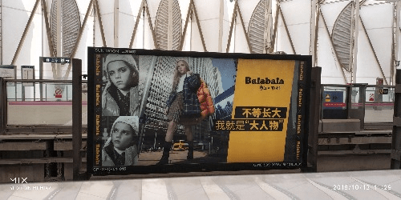
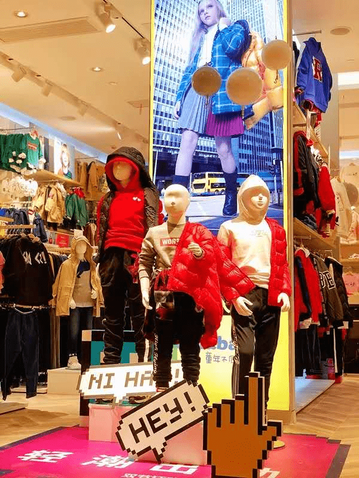

# 地铁边上的广告……

作者：wdz1995714

TID：25972

<title>1</title> <link href="../Styles/Style.css" type="text/css" rel="stylesheet">

# 1

也算是gts吧٩(｡・▽・｡)ρ <title>2</title> <link href="../Styles/Style.css" type="text/css" rel="stylesheet">

# 2

 <ignore_js_op>[IMG_20181013_112957.jpg](forum.php?mod=attachment&aid=NzUxOTZ8NzljOWE1NjR8MTY3NDA2OTgzNnwxODIzMHwyNTk3Mg%3D%3D&nothumb=yes) *(52.69 KB, 下載次數: 11)*

[下載附件](forum.php?mod=attachment&aid=NzUxOTZ8NzljOWE1NjR8MTY3NDA2OTgzNnwxODIzMHwyNTk3Mg%3D%3D&nothumb=yes)

2018-10-16 13:23 上傳  

</ignore_js_op> <title>3</title> <link href="../Styles/Style.css" type="text/css" rel="stylesheet">

# 3

这个只是低视角的缘故吧。。。算是擦了擦边的边 <title>4</title> <link href="../Styles/Style.css" type="text/css" rel="stylesheet">

# 4

这个渣像素- -我觉得不是楼上说的那个低视角的问题，应该是确实用的女巨人。理由是那句“我就是大人物”，应该是用体型的大来对应大人物的大 <title>5</title> <link href="../Styles/Style.css" type="text/css" rel="stylesheet">

# 5

嗯，应该是女巨人呢。

<ignore_js_op>

**20180926234942_1718.jpg** *(70.71 KB, 下載次數: 0)*

[下載附件](forum.php?mod=attachment&aid=NzUyMDN8NDE5OGFlZTd8MTY3NDA2OTgzNnwxODIzMHwyNTk3Mg%3D%3D&nothumb=yes)

2018-10-17 00:49 上傳

<title>6</title> <link href="../Styles/Style.css" type="text/css" rel="stylesheet">

# 6

确实是女巨人，因为同系列另一幅广告里是很明显的男巨人…… <title>7</title> <link href="../Styles/Style.css" type="text/css" rel="stylesheet">

# 7

我看见标题就想到可能是这个
最近13号和4号常见广告</ignore_js_op>