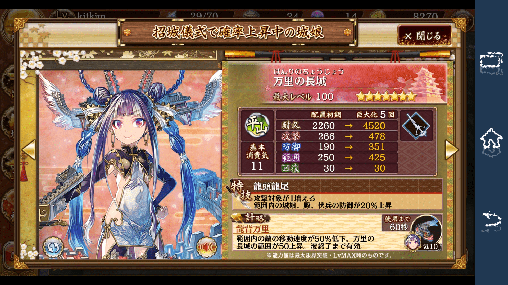

# 城娘：「我還有5次巨大化。」

作者：ckw

TID：23310

<title>1</title> <link href="../Styles/Style.css" type="text/css" rel="stylesheet">

# 1

（此帖大火）

城娘剛開服的時候，因為有DMM帳所以順便一看，大概知道城娘是巨大美少女（By官方）+艦C式介面／收集+守塔戰鬥。但僅是看一下沒有深究下去。

後來城娘變成城娘RE（斬掉重練），再過了Ｎ久直到昨天才看城娘RE的錄播，才知道城娘在戰鬥中還真的能巨大化。
（[http://www.nicovideo.jp/watch/sm31430735](http://www.nicovideo.jp/watch/sm31430735)，因為TAG有巨大娘我才點進去看）

巨大化相當於固有數值永久Powe up+發動技能，Q版城娘也會變大，6~7星城娘巨大化最多達5次。
（剛開服的時候我記只有發動技能，並沒有Powe up，城娘也不會變大。這些該是RE新加入）

……這個設定好像很有道理的樣子(?)。城娘算上進場一下的巨大化，其實是不是6次巨大化？

在打著巨大美少女旗號的遊戲中，城娘RE看來混的還不錯。

對比ラグナストライクエンジェルズ，官方宣稱是「国民的巨大美少女」，但聽日本的說法，巨大美少女要素十分空氣。

ラグナストライクエンジェルズ開服前宣傳簡直空前，深崎O人人設，泡茶翻動畫，遊戲畫面採用3D，連figure也有，野心很大。

但現實是（略） <title>2</title> <link href="../Styles/Style.css" type="text/css" rel="stylesheet">

# 2

弗利萨：我还有两次变身 <title>3</title> <link href="../Styles/Style.css" type="text/css" rel="stylesheet">

# 3

啊啊啊，一百倍界王拳 <title>4</title> <link href="../Styles/Style.css" type="text/css" rel="stylesheet">

# 4

主界面也可以巨大化放置

[http://giantessnight.com/gnforum ... id=22236&extra=](http://giantessnight.com/gnforum2012/forum.php?mod=viewthread&tid=22236&extra=) <title>5</title> <link href="../Styles/Style.css" type="text/css" rel="stylesheet">

# 5

突然间想玩城娘了。。。 <title>6</title> <link href="../Styles/Style.css" type="text/css" rel="stylesheet">

# 6

萬里長城
想想也很有道理
萬里長城不止是城牆，還有要塞一用。
<ignore_js_op>

**0625.jpg** *(752.28 KB, 下載次數: 0)*

[下載附件](forum.php?mod=attachment&aid=Njg0NjZ8NzMzYzk3NTN8MTY3NDA2NzU2NHwxODIzMHwyMzMxMA%3D%3D&nothumb=yes)

2017-6-25 18:15 上傳</ignore_js_op>