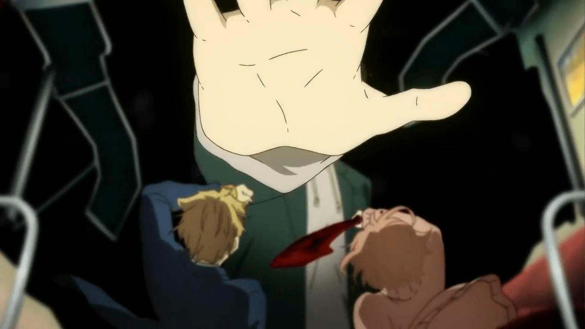
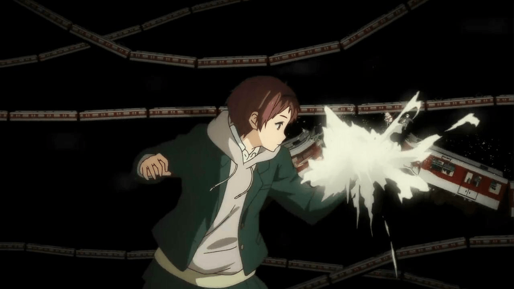

# 境界的彼方04

作者：luffyoo

TID：15437

<title>1</title> <link href="../Styles/Style.css" type="text/css" rel="stylesheet">

# 1

*本文章最後由 Eighteen 於 2013-10-24 18:58 編輯*

7：00 后有GTS（？）情节，在公司没办法发图。

还挺有感觉的，不过纯看gts部分的朋友建议到8：20就果断关掉吧，后面就不忍直视了……

PS:到家了，补图

<ignore_js_op>

**360截图20131024185403044.jpg** *(49.78 KB, 下載次數: 0)*

[下載附件](forum.php?mod=attachment&aid=MzcyODN8ZWJhMTA2ZTh8MTY3NDA2ODIxOHwxODIzMHwxNTQzNw%3D%3D&nothumb=yes)

2013-10-24 18:58 上傳

<ignore_js_op>

**360截图20131024185439432.jpg** *(56.57 KB, 下載次數: 0)*

[下載附件](forum.php?mod=attachment&aid=MzcyODR8YjQxMDBlNjF8MTY3NDA2ODIxOHwxODIzMHwxNTQzNw%3D%3D&nothumb=yes)

2013-10-24 18:58 上傳

<title>2</title> <link href="../Styles/Style.css" type="text/css" rel="stylesheet">

# 2

這個新番沒追
感覺是廢萌 <title>3</title> <link href="../Styles/Style.css" type="text/css" rel="stylesheet">

# 3

18X我想你了。。。 <title>4</title> <link href="../Styles/Style.css" type="text/css" rel="stylesheet">

# 4

这个怎么说呢   很正常的吧   只是单纯的大而已  没啥特别的 <title>5</title> <link href="../Styles/Style.css" type="text/css" rel="stylesheet">

# 5

這個場景不錯
只是那個綠夾克的太中性了，看到穿裙子才確信是女的... <title>6</title> <link href="../Styles/Style.css" type="text/css" rel="stylesheet">

# 6

*本文章最後由 月食 於 2013-10-24 23:36 編輯*

表示被截图吓到了，然后看到楼上才恍悟

然后刚才去看了下，有种被骗的感觉 <title>7</title> <link href="../Styles/Style.css" type="text/css" rel="stylesheet">

# 7

看到5L之前一直以为是GT剧情= = 还以为现充的18爷肿么了 <title>8</title> <link href="../Styles/Style.css" type="text/css" rel="stylesheet">

# 8

自己也追这部番，嘛这个片段确实算是GTS，不过就是后半段真心不忍直视。妖梦要不要弄成这样…… <title>9</title> <link href="../Styles/Style.css" type="text/css" rel="stylesheet">

# 9

 京阿尼作画细致 如果你不在乎量产脸的话。
<title>10</title> <link href="../Styles/Style.css" type="text/css" rel="stylesheet">

# 10

*本文章最後由 861861861 於 2013-10-25 07:49 編輯*

> 7：00 后有GTS（？）情节，在公司没办法发图。

【GTS（？）】看到这个（话说为什么要加问号啊？）、

我还以为是GT、截图里的人穿着和发型太男性了、也看不到裙子、

但是我还是去找了（为什么呢？我也不知道= =）、

恩恩~~~~..

很棒的场景不是嘛~！

可是我看了8：20之后的场景、结果眼睛受伤了T T

<title>11</title> <link href="../Styles/Style.css" type="text/css" rel="stylesheet">

# 11

我的关注点在十八子的签名

> 切，我又變回BG黨了

感觉被背叛了

话说我现在也向着现充之路迈进，装修、开店、搬家、贷款、欺诈老人（?）
连电脑是啥都快不认识了，甚至没几天能好好睡在床上
不过至少给自己打工士气值可以保持在很高水准
像我这种懒虫要是给别人干活绝对各种摸鱼 <title>12</title> <link href="../Styles/Style.css" type="text/css" rel="stylesheet">

# 12

我手欠了 后头变身了 好恐怖。。。
<title>13</title> <link href="../Styles/Style.css" type="text/css" rel="stylesheet">

# 13

几乎每个女的都比她有GTS韵味，偏偏选唯这个女扮男装女开GTS玩笑 <title>14</title> <link href="../Styles/Style.css" type="text/css" rel="stylesheet">

# 14

我就知道这个图会有人发！
今天一上线果然看到了！ <title>15</title> <link href="../Styles/Style.css" type="text/css" rel="stylesheet">

# 15

有點殘念+1 <title>16</title> <link href="../Styles/Style.css" type="text/css" rel="stylesheet">

# 16

看这番的GTS情节的时候没什么感觉啊，而且这个不是废萌吧，这个是中二战斗番而已啦╮(╯▽╰)╭ <title>17</title> <link href="../Styles/Style.css" type="text/css" rel="stylesheet">

# 17

这里的YUI太中性了，看了没有感觉，后面一变实体更没有感觉了_(:з」∠)_ <title>18</title> <link href="../Styles/Style.css" type="text/css" rel="stylesheet">

# 18

當時想發來著，後來想想，太中性了。。沒法 <title>19</title> <link href="../Styles/Style.css" type="text/css" rel="stylesheet">

# 19

没看过，也不知道这动漫名字 <title>20</title> <link href="../Styles/Style.css" type="text/css" rel="stylesheet">

# 20

这发型··完全提不起兴趣 <title>21</title> <link href="../Styles/Style.css" type="text/css" rel="stylesheet">

# 21

。。弄得好好奇、、、莫名其妙的想去看了 <title>22</title> <link href="../Styles/Style.css" type="text/css" rel="stylesheet">

# 22

当时我就吓到了                                                                      <title>23</title> <link href="../Styles/Style.css" type="text/css" rel="stylesheet">

# 23

矣 听说过名字不过没看过</ignore_js_op></ignore_js_op>