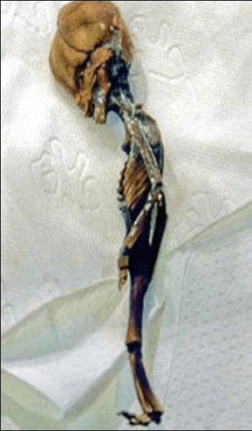
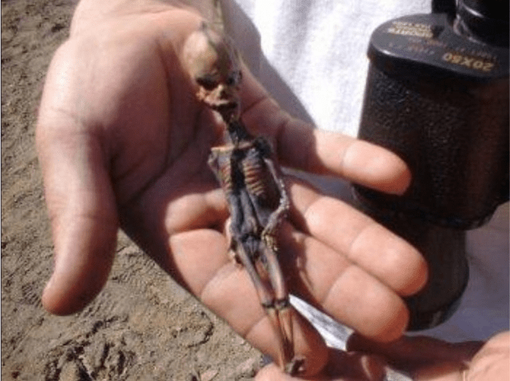

# 墨西哥发现五千年前的12公分高的成年小人骨骼

作者：朱雀

TID：9207

<title>1</title> <link href="../Styles/Style.css" type="text/css" rel="stylesheet">

# 1

墨西哥发现五千年前的12公分高的成年小人骨骼

         柏林大学的法兰兹博士在调查墨西哥中部附近的洞窟时，挖掘出一些奇怪的东西。他最先发现地面有一个奇怪的图案，便试着往地下挖。这一挖可不得了，竟挖出了一些小小小小的生活用品，还有一些小小小小的装饰品，看起来就像玩具一样。挖到最后，终于出现这些东西的主人，一个小人。这一具骸骨约12公分高，重要的是，这绝对不是一个小孩子的尸体，因为骨骼的样子已经是成人。经科学家研究，证实其年代约在五千年前。

[ *本帖最後由 朱雀 於 2011-1-25 10:24 編輯* ] <title>2</title> <link href="../Styles/Style.css" type="text/css" rel="stylesheet">

# 2

 <ignore_js_op>[d3f2640189643498257fb549.jpg](forum.php?mod=attachment&aid=MjI5Nzd8ZGY4NjExOWN8MTY3NDA2ODgxNnwxODIzMHw5MjA3&nothumb=yes) *(57.98 KB, 下載次數: 0)*

[下載附件](forum.php?mod=attachment&aid=MjI5Nzd8ZGY4NjExOWN8MTY3NDA2ODgxNnwxODIzMHw5MjA3&nothumb=yes)

2011-1-25 10:23 上傳  

</ignore_js_op> <ignore_js_op>[47917d2f2be79b761d308949.jpg](forum.php?mod=attachment&aid=MjI5Nzh8M2I1ZDk3MTR8MTY3NDA2ODgxNnwxODIzMHw5MjA3&nothumb=yes) *(30.9 KB, 下載次數: 0)*

[下載附件](forum.php?mod=attachment&aid=MjI5Nzh8M2I1ZDk3MTR8MTY3NDA2ODgxNnwxODIzMHw5MjA3&nothumb=yes)

2011-1-25 10:23 上傳  

</ignore_js_op> <ignore_js_op>[c16564d60d902d6105088b49.jpg](forum.php?mod=attachment&aid=MjI5Nzl8YTg1Y2RhOTd8MTY3NDA2ODgxNnwxODIzMHw5MjA3&nothumb=yes) *(90.48 KB, 下載次數: 0)*

[下載附件](forum.php?mod=attachment&aid=MjI5Nzl8YTg1Y2RhOTd8MTY3NDA2ODgxNnwxODIzMHw5MjA3&nothumb=yes)

2011-1-25 10:24 上傳  

</ignore_js_op> <title>3</title> <link href="../Styles/Style.css" type="text/css" rel="stylesheet">

# 3

长的一张外星人的脸么= = <title>4</title> <link href="../Styles/Style.css" type="text/css" rel="stylesheet">

# 4

燒瓶中的小人...... <title>5</title> <link href="../Styles/Style.css" type="text/css" rel="stylesheet">

# 5

很假啊 <title>6</title> <link href="../Styles/Style.css" type="text/css" rel="stylesheet">

# 6

RT。。。。。没有想象力的人路过。 <title>7</title> <link href="../Styles/Style.css" type="text/css" rel="stylesheet">

# 7

总感觉像个朋克手办  <title>8</title> <link href="../Styles/Style.css" type="text/css" rel="stylesheet">

# 8

看起来不是真的 第三张照片 居然是捧在手里的 如果真的是什么的骨骼不可能那么完整坚固 可以让人捧在手里啊 <title>9</title> <link href="../Styles/Style.css" type="text/css" rel="stylesheet">

# 9

> 原帖由 *archer* 於 2011-1-25 11:41 發表 
> 长的一张外星人的脸么= =

它是外星人,專門寄生在gts愛好者的腦漿裡,令gts愛好者產生幻覺.....