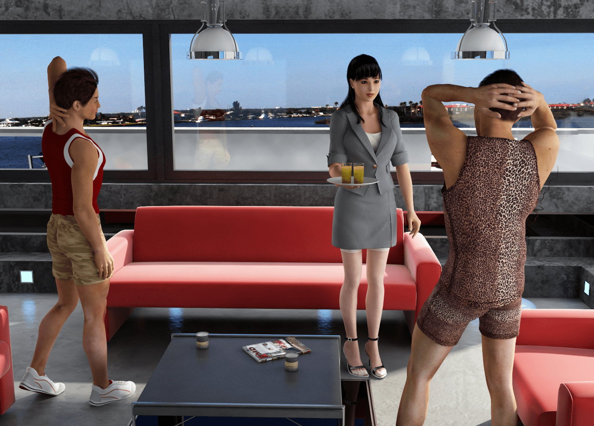
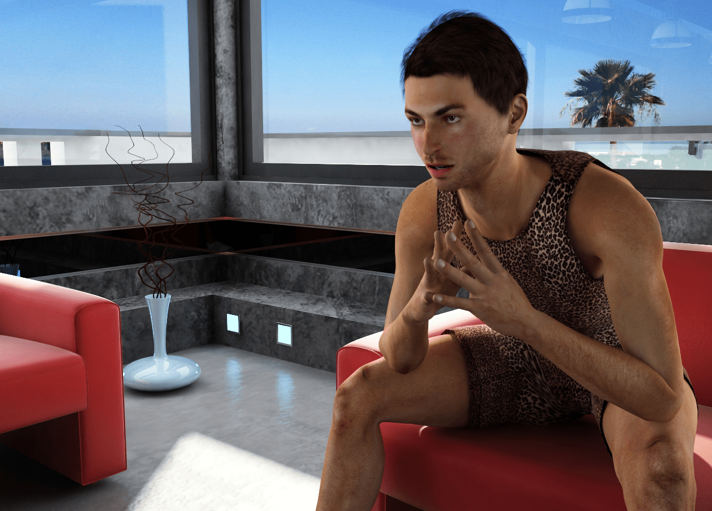
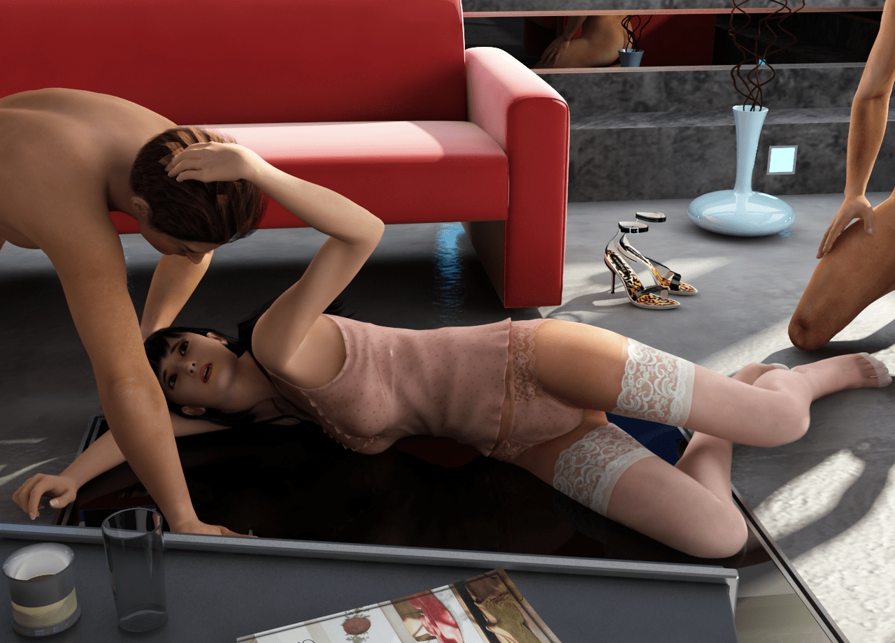
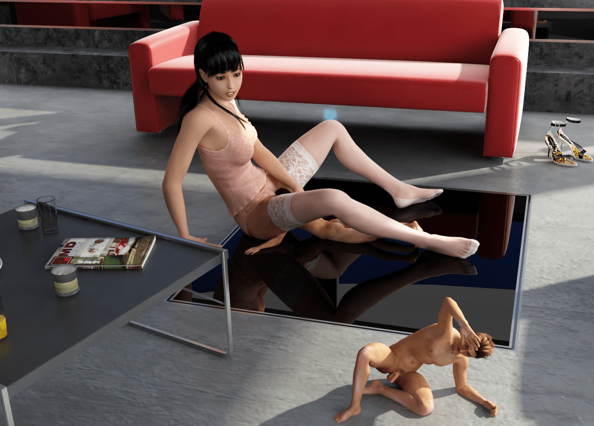
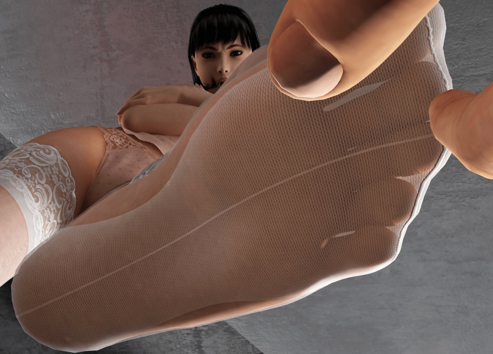
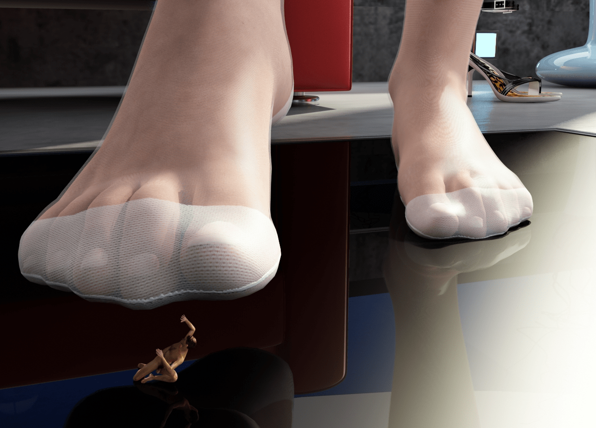

# 复仇第二季部分图片预览！！

作者：qin396830

TID：16348

<title>1</title> <link href="../Styles/Style.css" type="text/css" rel="stylesheet">

# 1

*本帖最後由 awkeygen 於 2014-2-28 15:21 編輯*

1.我们的女主角出发了！！
<ignore_js_op>

**05.jpg** *(809.34 KB, 下載次數: 0)*

[下載附件](forum.php?mod=attachment&aid=NDEyNDJ8MThkZmJmNTV8MTY3NDA2ODMzMHwxODIzMHwxNjM0OA%3D%3D&nothumb=yes)

2014-2-28 15:07 上傳

2.猥琐的男人
<ignore_js_op>

**03.jpg** *(750.14 KB, 下載次數: 0)*

[下載附件](forum.php?mod=attachment&aid=NDEyNDV8Njc2NDg4NDl8MTY3NDA2ODMzMHwxODIzMHwxNjM0OA%3D%3D&nothumb=yes)

2014-2-28 15:09 上傳

3.我们的女主角遇到危险了！
<ignore_js_op>

**16.jpg** *(589.59 KB, 下載次數: 0)*

[下載附件](forum.php?mod=attachment&aid=NDEyNDN8YzBkMGExYzR8MTY3NDA2ODMzMHwxODIzMHwxNjM0OA%3D%3D&nothumb=yes)

2014-2-28 15:07 上傳

4.有miniGTS哦！
<ignore_js_op>

**26.jpg** *(656.94 KB, 下載次數: 0)*

[下載附件](forum.php?mod=attachment&aid=NDEyNDZ8NTgzMmI2Y2N8MTY3NDA2ODMzMHwxODIzMHwxNjM0OA%3D%3D&nothumb=yes)

2014-2-28 15:10 上傳

5.美丽的丝袜POV
<ignore_js_op>

**29.jpg** *(678.65 KB, 下載次數: 0)*

[下載附件](forum.php?mod=attachment&aid=NDEyNDR8NDJkNjQxYTB8MTY3NDA2ODMzMHwxODIzMHwxNjM0OA%3D%3D&nothumb=yes)

2014-2-28 15:08 上傳

6.可怜的小人！
<ignore_js_op>

**37.jpg** *(534.58 KB, 下載次數: 0)*

[下載附件](forum.php?mod=attachment&aid=NDEyNDd8OGMzN2UxZmZ8MTY3NDA2ODMzMHwxODIzMHwxNjM0OA%3D%3D&nothumb=yes)

2014-2-28 15:16 上傳

<title>2</title> <link href="../Styles/Style.css" type="text/css" rel="stylesheet">

# 2

非常喜欢A大的作品，但是您把浏览权限设置的太高了，我辈看不到啊 <title>3</title> <link href="../Styles/Style.css" type="text/css" rel="stylesheet">

# 3

> gts000 發表於 2014-2-28 15:58
> 非常喜欢A大的作品，但是您把浏览权限设置的太高了，我辈看不到啊

已经降回来了 <title>4</title> <link href="../Styles/Style.css" type="text/css" rel="stylesheet">

# 4

看到这贴才回去看第一季，LZ太吊，点赞 <title>5</title> <link href="../Styles/Style.css" type="text/css" rel="stylesheet">

# 5

期待更新第二季，希望能让女主角巨大化，加油 <title>6</title> <link href="../Styles/Style.css" type="text/css" rel="stylesheet">

# 6

楼上提议巨大化也...
那我希望继续保持缩小 - -
不知为啥 一巨大化就没感觉了...
可能是我喜欢独占吧 就是一巨大化就跟整个城市互动了 随随便便就踩死了 没存在感
我还是喜欢温柔系的一对一或者一对几个 <title>7</title> <link href="../Styles/Style.css" type="text/css" rel="stylesheet">

# 7

光是预览图就已经让某K撸出血了（咳……）。

白丝+长腿+践踏+鄙夷的表情（这个才是神来之笔！），激动地滚来滚去……

Wishlist:
1，上次A大说自己是温柔系的……那么复仇还会有残酷系的场景么？
虽然说A大目前的水准已经很让人满意了，但是对不少某K一样的同好来说，少了“破坏”总归会有一点遗憾呢~
不一定要虐杀见血，只是如果能轻易“破坏”一些东西，或许会更能烘托出力量的强大吧？

2，既然已经有变大的药了……期待巨大化的场景！
（虽然不大可能在第二季就出现？

3，女主角秋叶的心态会发生变化吗？
A大作品的表情是我见过的最丰富的的。那么我想这种丰富的情感表现更应该成为本作的优势吧？
如果能让秋叶在剧情中经历思想上的变化，前后心态的反差肯定会为故事增色不少的，也会让剧情显得更有张力（衍生出来的欲望，矛盾等等）。
例如……
温柔女孩到残酷女神的进化史！！（某K的残酷病又发了）

（当然A大也可以选择相反的路线，复仇怨女到成熟圣母的进化史，咳……
（逃…… <title>8</title> <link href="../Styles/Style.css" type="text/css" rel="stylesheet">

# 8

*本帖最後由 pliod 於 2014-2-28 14:42 編輯*

感覺這次大A準備要崩壞了呢!
用不同尺寸的人們模型不容易吧? 太厲害了
然後猥褻男的粉紅豹紋裝真是太搞笑了

小小建議: 但是我個人覺得第二張女角的姿勢有點怪, 因為她在反抗但是手還是輕觸著男人的頭髮

我覺得這次的絲襪非常的真實, 每一網的纖維都很細緻(根據距離還有網狀密度的變化);
再來皮膚真的很真實, 沒有一般render會出現的塑膠感, 真的很人肉!
然後表情感覺非常的到位, 不管是猥褻男露出的有點邪惡的表情,
還有第三張女生無助的臉和第五張女主角憤怒的神情都非常的到位

總之, **太期待了**
<title>9</title> <link href="../Styles/Style.css" type="text/css" rel="stylesheet">

# 9

赞~特别是第五张和第六张...在这里摆一台全景摄像机渲染一下效果一定相当赞~ <title>10</title> <link href="../Styles/Style.css" type="text/css" rel="stylesheet">

# 10

> [karlchen0920 發表於 2014-2-28 21:02](https://giantessnight.cf/gnforum2012/forum.php?mod=redirect&goto=findpost&pid=217101&ptid=16348)
> 光是预览图就已经让某K撸出血了（咳……）。
> 
> 白丝+长腿+践踏+鄙夷的表情（这个才是神来之笔！），激动地滚 ...

巨大话场景必须有，第二季不会出现，要等一等，破坏，残酷系列也必须有，目前已经掌握了破坏场景的制作技术，但是烟雾还是不知道怎么做，摸索中，至于心理变化，不经有秋叶的心理变化，还将有玲子，千奈美，Zero，王宇，卡洛斯等人的心理变化，之后还会有更多人参与进来，剧情会变得复杂且跌宕起伏。
<title>11</title> <link href="../Styles/Style.css" type="text/css" rel="stylesheet">

# 11

> [pliod 發表於 2014-2-28 21:30](https://giantessnight.cf/gnforum2012/forum.php?mod=redirect&goto=findpost&pid=217102&ptid=16348)
> 感覺這次大A準備要崩壞了呢!
> 用不同尺寸的人們模型不容易吧? 太厲害了
> 然後猥褻男的粉紅豹紋裝真是 ...

做了不同尺寸，主要是造福miniGTS同好（突然发现miniGTS也很有感觉的），至于第3张的动作，因为是片段，若是结合前后图片，就合理了。材质方面，a某的确下了很大的功夫。
第二季看着的确有点搞笑，尤其是男配角的表情。
谢谢支持！
<title>12</title> <link href="../Styles/Style.css" type="text/css" rel="stylesheet">

# 12

> [wxy112300 發表於 2014-2-28 23:23](https://giantessnight.cf/gnforum2012/forum.php?mod=redirect&goto=findpost&pid=217117&ptid=16348)
> 赞~特别是第五张和第六张...在这里摆一台全景摄像机渲染一下效果一定相当赞~ ...

谢谢对我作品的一贯支持！PS：棉袜的深度互动还要等等，若是现在增加幅度互动，剧情就乱了，后面会有更真实的棉袜的！
<title>13</title> <link href="../Styles/Style.css" type="text/css" rel="stylesheet">

# 13

好期待，好期待！！！ <title>14</title> <link href="../Styles/Style.css" type="text/css" rel="stylesheet">

# 14

> [awkeygen 發表於 2014-3-1 09:43](https://giantessnight.cf/gnforum2012/forum.php?mod=redirect&goto=findpost&pid=217147&ptid=16348)
> 谢谢对我作品的一贯支持！PS：棉袜的深度互动还要等等，若是现在增加幅度互动，剧情就乱了，后面会有更真 ...

不错~果断继续等下去...烟雾部分在影视后期里一般都是后期合成上去的，但是对于图片来说就容易得多，用PS的烟雾笔刷就可以了，网上都能下载到...如果想更真实些就得动用Fume FX这种插件了..
还有A大说掌握了破坏效果，是用RayFire之类的那种破坏效果吗？
好莱坞电影的那种大型破坏场景都是用RayFire做的破坏动画，然后用Fume FX或After Burn 插件制作烟雾，用粒子系统做碎片，然后再后期合成到一起，调色后效果就和现实一样...
<title>15</title> <link href="../Styles/Style.css" type="text/css" rel="stylesheet">

# 15

> [wxy112300 發表於 2014-3-1 11:47](https://giantessnight.cf/gnforum2012/forum.php?mod=redirect&goto=findpost&pid=217158&ptid=16348)
> 不错~果断继续等下去...烟雾部分在影视后期里一般都是后期合成上去的，但是对于图片来说就容易得多，用PS ...

嗯，rayfire挺好用的，就是模拟的时候a某的显卡有些卡至于烟雾，还没想好怎么做。
烟雾我也决定用用笔刷PS，要是渲染的话，渲染速度也吃不消！

<title>16</title> <link href="../Styles/Style.css" type="text/css" rel="stylesheet">

# 16

文字是还没想好，还是只是预览图所以没放上？从第一季看到女主就觉得高大漂亮非常期待。顺便提一下女主本来就高穿上高跟鞋应该更高才是，楼主在这点有点出入，不过我们主题是gts也不影响。哈哈。 <title>17</title> <link href="../Styles/Style.css" type="text/css" rel="stylesheet">

# 17

> [awkeygen 發表於 2014-3-1 09:38](https://giantessnight.cf/gnforum2012/forum.php?mod=redirect&goto=findpost&pid=217145&ptid=16348)
> 巨大话场景必须有，第二季不会出现，要等一等，破坏，残酷系列也必须有，目前已经掌握了破坏场景的制作技 ...

楼主不着急这么好的作品和故事。慢慢更吧，一定会成为gn的经典之做。故事大就慢慢做一定不能着急结尾。虽然我也很期待但是我能等。
<title>18</title> <link href="../Styles/Style.css" type="text/css" rel="stylesheet">

# 18

> [hy5164180 發表於 2014-3-6 00:28](https://giantessnight.cf/gnforum2012/forum.php?mod=redirect&goto=findpost&pid=217475&ptid=16348)
> 楼主不着急这么好的作品和故事。慢慢更吧，一定会成为gn的经典之做。故事大就慢慢做一定不能着急结尾。虽 ...

是的，有时候恨不得在一季里做完所有元素，可是这样不可取，还是细工出好活吧，但愿复仇系列不仅仅是GTS，更像一个连续剧！谢谢对我作品的支持！
<title>19</title> <link href="../Styles/Style.css" type="text/css" rel="stylesheet">

# 19

哇，越来越棒了，有生之年 <title>20</title> <link href="../Styles/Style.css" type="text/css" rel="stylesheet">

# 20

A大，您能把作品欣赏权限降下么？真心喜欢看阿</ignore_js_op></ignore_js_op></ignore_js_op></ignore_js_op></ignore_js_op></ignore_js_op>