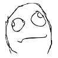

# 夜里无聊又想到了gts，随便说点什么好了。

作者：Jozetto

TID：21539

<title>1</title> <link href="../Styles/Style.css" type="text/css" rel="stylesheet">

# 1

  自己这里一直觉得自己不是个完全的圈内人，因为对gts圈不是很痴迷，但是无聊的时候又往往想到这里。
  我喜欢的东西大概有mini和growth吧，还有就是正常的百米级别啦。还有我是残酷系，但是不是很喜欢超巨大的，因为我觉得超巨大的话快感会少上很多。
  然后喜欢自己做个邪恶的反派角色，带着growth的能力不断变的越来越巨大，让小人们越来越绝望呢。hhh是不是很危险的思想。
  我对gts的兴趣很不稳定，有的时候完全提不起兴趣，但有的时候又很感兴趣，不知道为什么会这样子诶 到最后也不知道自己想说点什么，大概是来看看有没有同类人吧。
<title>2</title> <link href="../Styles/Style.css" type="text/css" rel="stylesheet">

# 2

残酷系。。
有点怕啊。。。 <title>3</title> <link href="../Styles/Style.css" type="text/css" rel="stylesheet">

# 3

感觉很危险啊。。可怕。。 <title>4</title> <link href="../Styles/Style.css" type="text/css" rel="stylesheet">

# 4

> [hsxz 發表於 2016-8-10 01:22](https://giantessnight.cf/gnforum2012/forum.php?mod=redirect&goto=findpost&pid=303231&ptid=21539)
> 残酷系。。
> 有点怕啊。。。

刚刚只是说自己不是一个抖m罢了，没别的意思
<title>5</title> <link href="../Styles/Style.css" type="text/css" rel="stylesheet">

# 5

小人的絕望感是你的糧食吧 
<title>6</title> <link href="../Styles/Style.css" type="text/css" rel="stylesheet">

# 6

可以去文章區或是圖片看一下 那類型的的有感覺

我才不是在賣廣告的 <title>7</title> <link href="../Styles/Style.css" type="text/css" rel="stylesheet">

# 7

 跟你说说我的经历吧。。 我是小学五年级开始入的坑 很久以前就开始幻想自己的老师巨大化 把自己当小熊一样抱着睡觉。。 突然有一天我就想 为什么不自己上网找找女巨人呢 然后就搜了女巨人的视频 找到了那段5分钟的性感女巨人 还有gts这个词 继而发现了gtss吧 从此开始在gts的路上一去不复返   初三的时候 我有了自己的房间和自己的电脑 从此变本加厉。。 找到了booru 恰好贴吧又有人把那个186g的资源放出来了 所以我那时候天天都撸   可惜的是那时候没有手机 又不敢拿爸妈的 没有办法扩大自己的百度网盘 所以等我高三有手机 网盘有2T的时候 在gtslover还是贴吧重新找到了那个种子 但是很多片子都已经被和谐 这是我比较可惜的。。  然后慢慢我也开始在gn这个论坛混了起来  由于自己不喜欢动脑 而且不是很喜欢钻研 至今还是不会翻墙找外面的资源 想写文章文笔也不怎么样 毕竟自己是理科生  就天天看着前辈们的文章自己发电       反派角色的思想很久以前也有过 但是我并不是妹子  后来还是觉得喜欢看这类型的视频和文章自己撸 自身是个臀控 温柔系和残酷系我似乎都能接受 抱着小人睡觉也好 用屁股坐碎小人也好 我都挺有感觉的        呃 就说到这吧 到点看TI比赛了。 <title>8</title> <link href="../Styles/Style.css" type="text/css" rel="stylesheet">

# 8

自己开心就好了啦~至于圈内圈外什么的还是日常生活的占比较大。 来这边的大部分都是寻找同类的吧，毕竟有这个爱好的人不多。
 我是那种比较喜欢妄想的人，对残酷系还是温柔系没有什么特别大的倾向。看别人写的文章时很容易带入进去，看弱小的一方被蹂躏时有种抖M的倾向感觉特别足。
自己写文章时会把自己脑补成gts。想那种很抖S的和一些H的事情~顺便一提我也是growth爱好~越变越大对于小人来说也是一种折磨呢。

唯一在意的事情是在看了但大的文章后感觉自己对gts的体型接受度越来越大了。。。

最早只能接受几百米现在已经进化到几万米对着城市做都有感觉了。。。特别是但大有几篇gts跟整个星球做爱什么的实在是看完欲罢不能= =
也许是脑补能力强的原因吧。
<title>9</title> <link href="../Styles/Style.css" type="text/css" rel="stylesheet">

# 9

> zxc132132 發表於 2016-8-10 01:31
> 小人的絕望感是你的糧食吧

hhh那应该味道还不错呢 <title>10</title> <link href="../Styles/Style.css" type="text/css" rel="stylesheet">

# 10

> 牛逼牛逼 發表於 2016-8-10 01:53
> 跟你说说我的经历吧。。 我是小学五年级开始入的坑 很久以前就开始幻想自己的老师巨大化 把自己 ...

小学五年级...真是好早阿 <title>11</title> <link href="../Styles/Style.css" type="text/css" rel="stylesheet">

# 11

> zlm18800000 發表於 2016-8-10 09:15
> 自己开心就好了啦~至于圈内圈外什么的还是日常生活的占比较大。
> 来这边的大部分都是寻找同类的吧，毕竟有这 ...

成长到超巨大也是正常的嘛 不过你们男生也会幻想自己变成女巨人嘛 <title>12</title> <link href="../Styles/Style.css" type="text/css" rel="stylesheet">

# 12

> [vicky 發表於 2016-8-10 10:50](https://giantessnight.cf/gnforum2012/forum.php?mod=redirect&goto=findpost&pid=303266&ptid=21539)
> 成长到超巨大也是正常的嘛 不过你们男生也会幻想自己变成女巨人嘛

可能是因为我脑洞比较大吧。。
特别是写文章的时候，我是那种不带入角色就根本写不出剧情的人。

所以在描写gts各种踩踏，特别是写福利的时候，不知不觉自己也被带入进去跟着high起来了。。。

<title>13</title> <link href="../Styles/Style.css" type="text/css" rel="stylesheet">

# 13

> zlm18800000 發表於 2016-8-10 10:59
> 可能是因为我脑洞比较大吧。。
> 
> 特别是写文章的时候，我是那种不带入角色就根本写不出剧情的人。

好吧 我的想象力就不怎么样呢 <title>14</title> <link href="../Styles/Style.css" type="text/css" rel="stylesheet">

# 14

*本帖最後由 zlm18800000 於 2016-8-10 11:10 編輯*

> [vicky 發表於 2016-8-10 11:04](https://giantessnight.cf/gnforum2012/forum.php?mod=redirect&goto=findpost&pid=303270&ptid=21539)
> 好吧 我的想象力就不怎么样呢

想象力不够就来看我刚更新的两篇文章吧。（从未见过如此厚颜无耻之徒）

我写的文章是图配文形式，很有感觉的~
<title>15</title> <link href="../Styles/Style.css" type="text/css" rel="stylesheet">

# 15

残酷系......有点可怕 <title>16</title> <link href="../Styles/Style.css" type="text/css" rel="stylesheet">

# 16

总感觉。。。楼主的思想。。。好危险 <title>17</title> <link href="../Styles/Style.css" type="text/css" rel="stylesheet">

# 17

> 滑煞人 發表於 2016-8-10 18:15
> 残酷系......有点可怕

真的有很可怕嘛hhhhhh 那还好我不是真的gts呢。 <title>18</title> <link href="../Styles/Style.css" type="text/css" rel="stylesheet">

# 18

无聊诶...现在有人聊天嘛 <title>19</title> <link href="../Styles/Style.css" type="text/css" rel="stylesheet">

# 19

> [zlm18800000 發表於 2016-8-10 11:09](https://giantessnight.cf/gnforum2012/forum.php?mod=redirect&goto=findpost&pid=303271&ptid=21539)
> 想象力不够就来看我刚更新的两篇文章吧。（从未见过如此厚颜无耻之徒）

然后你就走上了伪娘的不归路
<title>20</title> <link href="../Styles/Style.css" type="text/css" rel="stylesheet">

# 20

> [vicky 發表於 2016-10-6 00:55](https://giantessnight.cf/gnforum2012/forum.php?mod=redirect&goto=findpost&pid=310645&ptid=21539)
> 无聊诶...现在有人聊天嘛

噗，难得有妹子呀【紫薯布丁
<title>21</title> <link href="../Styles/Style.css" type="text/css" rel="stylesheet">

# 21

楼上别跟着瞎说什么“害怕”、“危险”呀，平时高喊着GTS赛高的又是哪些人呀？我作为一个爱好者是很中意被缩小之后被支配的感觉，反过来可能巨大化爱好者就是出于想支配的心态，或许破坏欲也有之，占有欲也有之。大家或多或少都抱有这种心态，妄想巨大化只不过一种表现形式，有什么好害怕的呀w <title>22</title> <link href="../Styles/Style.css" type="text/css" rel="stylesheet">

# 22

最近属于gts欲望较重的情况诶 无聊的时候经常会想到。 <title>23</title> <link href="../Styles/Style.css" type="text/css" rel="stylesheet">

# 23

我到也是喜欢growth这个类型差不多不过我喜欢把咱变小然后再变小其实也是一样的嘛
<title>24</title> <link href="../Styles/Style.css" type="text/css" rel="stylesheet">

# 24

我呢，喜欢变物，尤其是变成女人的生殖器，比如，鼻子是尿道，嘴巴是阴道，左右的脸是阴唇的两瓣 <title>25</title> <link href="../Styles/Style.css" type="text/css" rel="stylesheet">

# 25

妹子因该是主宰欲望比较强烈吧