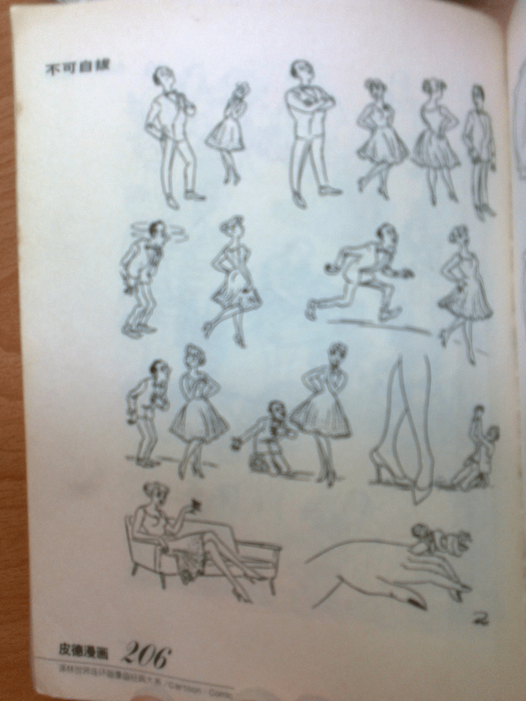
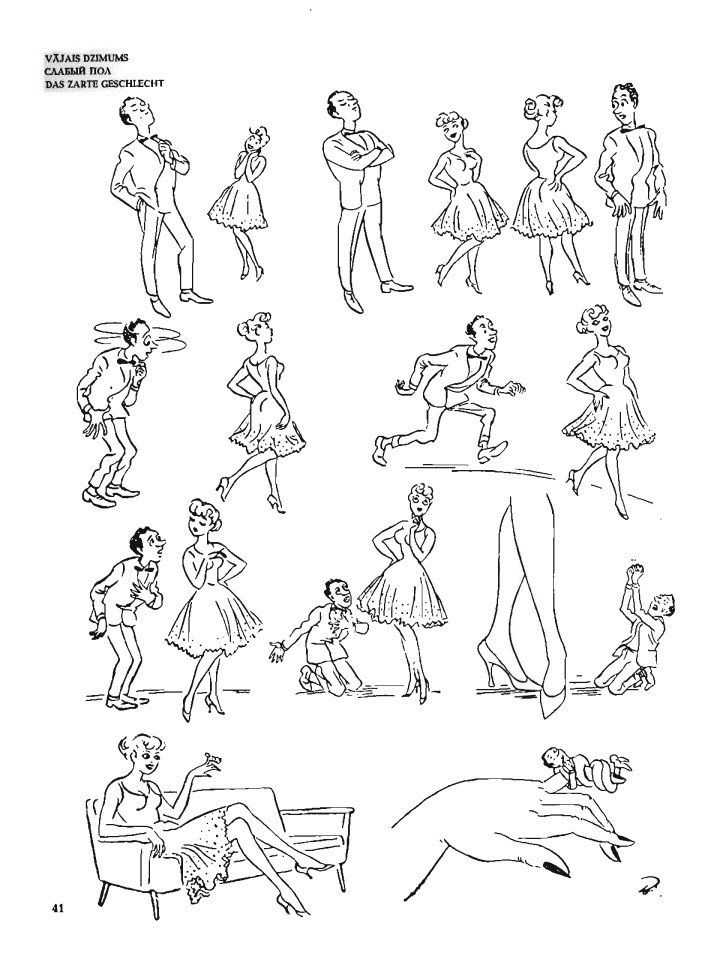

# 大作家的GTS

作者：whrlovexm

TID：13098

<title>1</title> <link href="../Styles/Style.css" type="text/css" rel="stylesheet">

# 1

其实很多大作家都写过与GTS擦边的，比如安徒生，笛福，还有一个大家不熟悉的，谢冰心，她曾经写过一篇童话，是一个小王子的故事，后来他变小了，不知道还有人看过没？ <title>2</title> <link href="../Styles/Style.css" type="text/css" rel="stylesheet">

# 2

唔 印象比较清楚的有尼尔斯骑鹅旅行记
爱丽丝的UNDER WORLD大家都知道也不用说咯。

还有一些不是很著名的童话。
记得有一个是一个农家小女孩，因为不长个子，什么活都干不了所以很郁闷，然后就每天祈祷自己能长大，然后就真的变大了，后来村子里来了强盗，女孩想着自己再长大点就能击退强盗了，结果长得跟房子一样高……

[ *本帖最後由 wobuzhidao 於 2012-8-19 11:14 編輯* ] <title>3</title> <link href="../Styles/Style.css" type="text/css" rel="stylesheet">

# 3

求 谢冰心 小王子的故事 链接，非常感谢！ <title>4</title> <link href="../Styles/Style.css" type="text/css" rel="stylesheet">

# 4

小王子的故事，是[http://wenku.baidu.com/view/4bd4924c2e3f5727a5e962e6.html](http://wenku.baidu.com/view/4bd4924c2e3f5727a5e962e6.html)这个？小时候看过不过没看懂  （不是我脑力不好。。。）没记得有什么gts故事情节啊 <title>5</title> <link href="../Styles/Style.css" type="text/css" rel="stylesheet">

# 5

> 原帖由 *1170484163j* 於 2012-8-19 14:59 發表 
> 小王子的故事，是[http://wenku.baidu.com/view/4bd4924c2e3f5727a5e962e6.html](http://wenku.baidu.com/view/4bd4924c2e3f5727a5e962e6.html)这个？小时候看过不过没看懂  （不是我脑力不好。。。）没记得有 ...

你贴的这个小王子的作者是圣埃克絮佩里 不是LZ说的谢冰心 谢冰心写的那个估计题目也不叫小王子…… <title>6</title> <link href="../Styles/Style.css" type="text/css" rel="stylesheet">

# 6

童话故事

童话故事虽然可能里面有gts内容不过读起来怎么就没有什么感觉似的 <title>7</title> <link href="../Styles/Style.css" type="text/css" rel="stylesheet">

# 7

长不大的小泰莱莎，就是这个 <title>8</title> <link href="../Styles/Style.css" type="text/css" rel="stylesheet">

# 8

前些時候，在下在閱讀米蘭•昆德拉大師的《不能承受的生命之輕》，
有一小段湯瑪斯象徵性的夢境：

唔，終於翻到了呢——

“半夜裏他醒來了，驚訝地發現自己在做著一個又一個的春夢。唯一能回想清楚的是
最後一個：一個巨大的裸體女人，至少是他體積的五倍，仰浮在一個水池裏。從她兩腿
分叉處一直到臍眼的小腹部，都蓋著厚厚的毛。他從池子一邊看著她，亢奮以極。”

P.S:嗯，貌似小時候看見丹麥的漫畫大師赫爾盧夫•皮德斯特魯普也曾經繪製過“有關”GTS的短幅的漫畫
在下翻翻儲物櫃，能翻到吧！ <title>9</title> <link href="../Styles/Style.css" type="text/css" rel="stylesheet">

# 9

您還別說，真給找到了——
唔，相機沒有電量叻，只能手機先行好了，
時間不多——
大概就是這樣吧，好模糊！
在下下次有時間一定會把清晰的圖片補上！
抱歉—— <title>10</title> <link href="../Styles/Style.css" type="text/css" rel="stylesheet">

# 10

 <ignore_js_op>[照片0313.jpg](forum.php?mod=attachment&aid=MzAzMzl8MWEwZDNlNTJ8MTY3NDA2ODU4NHwxODIzMHwxMzA5OA%3D%3D&nothumb=yes) *(404.82 KB, 下載次數: 0)*

[下載附件](forum.php?mod=attachment&aid=MzAzMzl8MWEwZDNlNTJ8MTY3NDA2ODU4NHwxODIzMHwxMzA5OA%3D%3D&nothumb=yes)

2012-8-19 22:05 上傳  

</ignore_js_op> <title>11</title> <link href="../Styles/Style.css" type="text/css" rel="stylesheet">

# 11

赫尔卢夫·皮德斯特鲁普（Herluf Bidstrup），不可自拔的爱
<ignore_js_op>

**2012-08-19.jpg** *(119.25 KB, 下載次數: 0)*

[下載附件](forum.php?mod=attachment&aid=MzAzNDF8YjQxODcxNGV8MTY3NDA2ODU4NHwxODIzMHwxMzA5OA%3D%3D&nothumb=yes)

2012-8-19 22:36 上傳

<title>12</title> <link href="../Styles/Style.css" type="text/css" rel="stylesheet">

# 12

哇，还真有这书啊！冰心写的有吗？ <title>13</title> <link href="../Styles/Style.css" type="text/css" rel="stylesheet">

# 13

记得尼尔斯骑鹅旅行记 我最喜欢的一本书了 <title>14</title> <link href="../Styles/Style.css" type="text/css" rel="stylesheet">

# 14

求相关信息 <title>15</title> <link href="../Styles/Style.css" type="text/css" rel="stylesheet">

# 15

印象中gene wolfe的《The Eyeflash Miracles》有少量gts描寫，
約瑟芬•鐵伊《排隊的人》有男豬夢見少女巨大化的描寫........
他們算是大作家吧.....? <title>16</title> <link href="../Styles/Style.css" type="text/css" rel="stylesheet">

# 16

> 原帖由 *nalu123* 於 2012-8-19 20:49 發表 
> 长不大的小泰莱莎，就是这个

好神 居然还记得啊！</ignore_js_op>