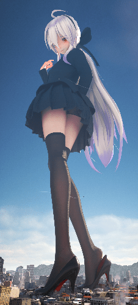
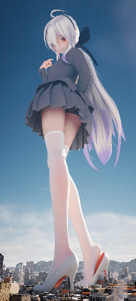

# 大佬们，萌新想学习建模，能不能给点建议...

作者：mdzz233

TID：30790

<title>1</title> <link href="../Styles/Style.css" type="text/css" rel="stylesheet">

# 1

前两天看到D站上的一个作者。我觉得他的建模好精细啊。感觉比SizeBox要好不少。想这种模型都是用什么软件做出来的啊？有没有大佬了解这方面...作为学生党，时间很多很多，家里有一台i7，2060，应该可以满足吧？所以大佬们...有没有人知道这种图片是什么软件做的啊QAQ 学起来需要教材什么的嘛？ <title>2</title> <link href="../Styles/Style.css" type="text/css" rel="stylesheet">

# 2

 <ignore_js_op>[4EB65748-CACE-4B7C-BE88-75CD646910B4.png](forum.php?mod=attachment&aid=ODg1ODF8M2RkNWFhMzR8MTY3NDA2NjAyOXwxODIzMHwzMDc5MA%3D%3D&nothumb=yes) *(222.95 KB, 下載次數: 5)*

[下載附件](forum.php?mod=attachment&aid=ODg1ODF8M2RkNWFhMzR8MTY3NDA2NjAyOXwxODIzMHwzMDc5MA%3D%3D&nothumb=yes)

2021-4-29 12:34 上傳  

</ignore_js_op> <ignore_js_op>[B5A8616C-5815-4100-96EA-90BF7EE1A64B.png](forum.php?mod=attachment&aid=ODg1ODJ8ZDY0MzQxOGJ8MTY3NDA2NjAyOXwxODIzMHwzMDc5MA%3D%3D&nothumb=yes) *(225.66 KB, 下載次數: 6)*

[下載附件](forum.php?mod=attachment&aid=ODg1ODJ8ZDY0MzQxOGJ8MTY3NDA2NjAyOXwxODIzMHwzMDc5MA%3D%3D&nothumb=yes)

2021-4-29 12:34 上傳  

</ignore_js_op> <title>3</title> <link href="../Styles/Style.css" type="text/css" rel="stylesheet">

# 3

MMD或者Blender吧。。并不清楚这位大佬怎么做的，但应该是多个软件结合的成果。 <title>4</title> <link href="../Styles/Style.css" type="text/css" rel="stylesheet">

# 4

「這張圖是用什麼作的」你直接問原作者就好，搞不好人家用MMD擺拍，又丟進PhotoShop裡面合成和加陰影
至於「什麼樣的軟體能做出這樣的圖」，答案很簡單，Blender可以而且免費，你的電腦也跑得動

總之先丟上我以前弄過的Blender教學：
[https://giantessnight.com/gnforu ... hread&tid=28110](https://giantessnight.com/gnforum2012/forum.php?mod=viewthread&tid=28110)
[https://mega.nz/#!h0ERHQ4C!kM8HI ... Vj6OoCobal-356H2gcw](https://mega.nz/#!h0ERHQ4C!kM8HIyyIYtPhg9UIHIc9zH32Vj6OoCobal-356H2gcw)
(PH被整肅過，所以本體另外丟)
然後是角色模型資源整理：
[https://giantessnight.com/gnforu ... hread&tid=27778](https://giantessnight.com/gnforum2012/forum.php?mod=viewthread&tid=27778)

然後回到你的問題，對，Blender也可以拿來建模，只是你得非常非常有耐心
你會覺得那張圖很精緻，其實比起模型本身的精緻度，光影的精緻度影響恐怕比較大，
而光影方面，Blender可以用光追的Cycle直接變出物理正確的光線反射給你，只要場景夠多反光點看起來就會精緻了
自己捏模型當然也是好，不過……
[https://www.youtube.com/playlist ... Pt4FeuFG7ApoRWcOw48](https://www.youtube.com/playlist?list=PLtBH0U-1YxiKRePt4FeuFG7ApoRWcOw48)
這個人製作《輝夜大小姐》裡面的白銀圭的教學，加起來大概八個小時，這還沒考慮到你得一直停下來抄他的動作
所以初學者我一率建議先從別人做的模型開始練習擺拍，再回頭去補基礎課程

基礎課程大概是這種感覺：
從零開始的甜甜圈教學(英文)：
[https://www.youtube.com/watch?v= ... u2MzVgAaHEBt--xLB6U](https://www.youtube.com/watch?v=NyJWoyVx_XI&list=PLjEaoINr3zgEq0u2MzVgAaHEBt--xLB6U)
從零開始的椅子建模教學(英文)：
[https://www.youtube.com/watch?v= ... UjPTLWQhLFAK7wVaRMR](https://www.youtube.com/watch?v=Hf2esGA7vCc&list=PLjEaoINr3zgEL9UjPTLWQhLFAK7wVaRMR)

雖然我自己都看英文的，不過中文圈也有一票愛好者會很樂意帶新手的
如果你真的摸透Blender，可以做出很毀天滅地的東西

[https://gumroad.com/ucup](https://gumroad.com/ucup)

總之先跟我的第一個連結做吧，有問題再問，你時間很多嘛 <title>5</title> <link href="../Styles/Style.css" type="text/css" rel="stylesheet">

# 5

MMD估计很难找到精度这么高的模型，建议你最好还是去问一下原作者 <title>6</title> <link href="../Styles/Style.css" type="text/css" rel="stylesheet">

# 6

最好先问问作者，毕竟这是成品图，而且也要看看你有什么目的，如果你的目的是弄个精致的图的话，是可以多款软件配合使用的，比如mmd+PS也是可以达成目的的。而如果你是想建一个属于自己的模型的话，你可以试试blender，因为这是款开源软件，而且中文圈里也有挺多好的教学视频，或者也可以去油管看看，不过可能会有语言障碍就是了。 <title>7</title> <link href="../Styles/Style.css" type="text/css" rel="stylesheet">

# 7

> [3213213210 發表於 2021-4-29 16:15](https://giantessnight.cf/gnforum2012/forum.php?mod=redirect&goto=findpost&pid=466587&ptid=30790)
> 「這張圖是用什麼作的」你直接問原作者就好，搞不好人家用MMD擺拍，又丟進PhotoShop裡面合成和加陰影
> 至於 ...

这tm竟然不是画出来的!?这么nb的吗 <title>8</title> <link href="../Styles/Style.css" type="text/css" rel="stylesheet">

# 8

*本帖最後由 3213213210 於 2021-4-30 01:01 編輯*

> [leo1223 發表於 2021-4-29 21:53](https://giantessnight.cf/gnforum2012/forum.php?mod=redirect&goto=findpost&pid=466606&ptid=30790)
> 这tm竟然不是画出来的!?这么nb的吗

他是拿別人的2D圖當參考做的啦 但無論如何看起來超不像3D沒錯
我有買他的專案檔下來開 他的材質節點讓人完全看不懂……

<title>9</title> <link href="../Styles/Style.css" type="text/css" rel="stylesheet">

# 9

> 3213213210 發表於 2021-4-29 16:15
> 「這張圖是用什麼作的」你直接問原作者就好，搞不好人家用MMD擺拍，又丟進PhotoShop裡面合成和加陰影
> 至於 ...

谢谢大佬！！！！！我晚上看看。 <title>10</title> <link href="../Styles/Style.css" type="text/css" rel="stylesheet">

# 10

> 3213213210 發表於 2021-4-29 16:15
> 「這張圖是用什麼作的」你直接問原作者就好，搞不好人家用MMD擺拍，又丟進PhotoShop裡面合成和加陰影
> 至於 ...

好家伙，我以为是厚涂涂出来的，没想到是模型，牛批woc <title>11</title> <link href="../Styles/Style.css" type="text/css" rel="stylesheet">

# 11

我自己用的建模软件是blender，关于该软件的介绍上面已经有大佬说明了，我就不掺和了。 <title>12</title> <link href="../Styles/Style.css" type="text/css" rel="stylesheet">

# 12

不过我还是给你一些建议：进行系统性的学习可能有时会感到枯燥，那么这个时候你可以选择做点自己较为感兴趣的事情，比如出几张涩图，k几帧自己脑海里想要的动画等等；如果你不想系统性地学习，而是从自己的需求（做涩图？）入手的话，那么你还是需要了解一下一些基本的知识与软件操作，比如各个渲染引擎之间的不同之处、该选择哪个引擎、怎么调试渲染参数、怎么人物绑骨和摆动作等等，这些都是必要知识，不可不学；最后，我跟你说啊，动力是非常非常重要的，偶尔做一两张涩图给自己看有助于保持自己的学习动力（）