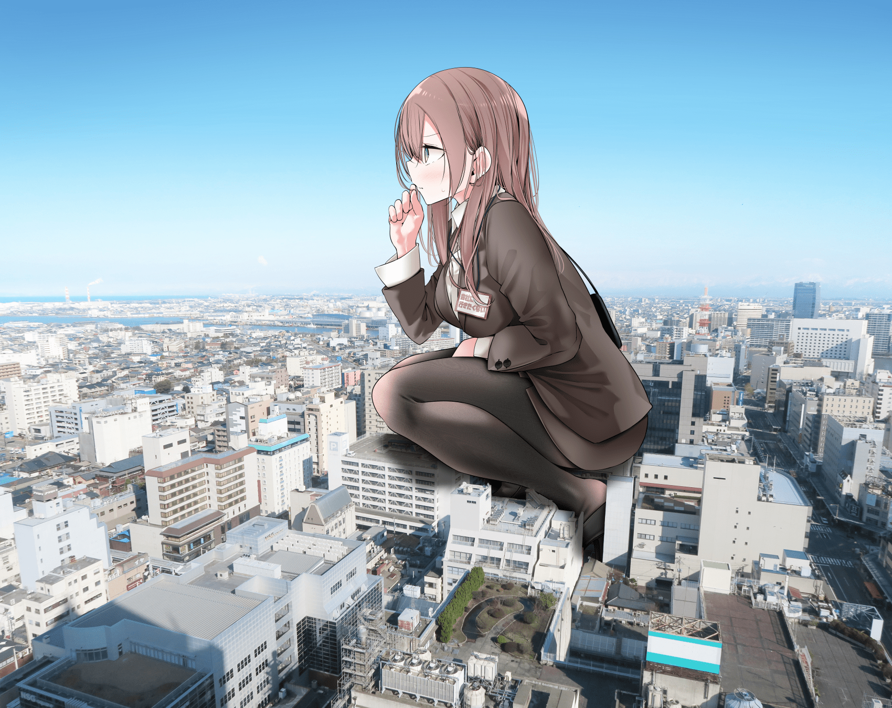

# 大嘘老师新图（？）

作者：libido

TID：34474

<title>1</title> <link href="../Styles/Style.css" type="text/css" rel="stylesheet">

# 1

大嘘老师来b站快一个月后今天发了这张：
[https://t.bilibili.com/733177542100385797](https://t.bilibili.com/733177542100385797)

虽然总感觉之前在论坛里看到过，不过检索了一圈后并没有找到以前的贴，就权当是新图吧（摆

<title>2</title> <link href="../Styles/Style.css" type="text/css" rel="stylesheet">

# 2

 <ignore_js_op>[39fae6a24b1180752ec2a0f9c4edf5223461582476544762.jpg](forum.php?mod=attachment&aid=MTAwNzAxfGJlZWJlMWY2fDE2NzQwNjUyNTh8MTgyMzB8MzQ0NzQ%3D&nothumb=yes) *(2.12 MB, 下載次數: 3)*

[下載附件](forum.php?mod=attachment&aid=MTAwNzAxfGJlZWJlMWY2fDE2NzQwNjUyNTh8MTgyMzB8MzQ0NzQ%3D&nothumb=yes)

2022-11-27 21:58 上傳  

</ignore_js_op> <title>3</title> <link href="../Styles/Style.css" type="text/css" rel="stylesheet">

# 3

好耶！会不会意味着将会有gts作品推出 <title>4</title> <link href="../Styles/Style.css" type="text/css" rel="stylesheet">

# 4

终于！大嘘老师也开始画巨大娘了吗！！！ <title>5</title> <link href="../Styles/Style.css" type="text/css" rel="stylesheet">

# 5

这图不是好早之前就有了嘛，我记得大嘘似乎还有别的图 <title>6</title> <link href="../Styles/Style.css" type="text/css" rel="stylesheet">

# 6

那么问题来了，场景是真实照片，人物是P进去的，这图到底是大嘘自己的还是别人P好安利他的 <title>7</title> <link href="../Styles/Style.css" type="text/css" rel="stylesheet">

# 7

好图。再次进军B站，很可，看回复也不少，整体来说不引起反感就好 <title>8</title> <link href="../Styles/Style.css" type="text/css" rel="stylesheet">

# 8

希望能有更多同好参与进来吧，这个图真的美 <title>9</title> <link href="../Styles/Style.css" type="text/css" rel="stylesheet">

# 9

> [houtizhidu 發表於 2022-11-28 03:03](https://giantessnight.cf/gnforum2012/forum.php?mod=redirect&goto=findpost&pid=520524&ptid=34474)
> 这图不是好早之前就有了嘛，我记得大嘘似乎还有别的图

我也是记得是老图了，然而没搜到......
反正p站上有一年前的这张，应该只是换了个背景：
[https://www.pixiv.net/artworks/93932246](https://www.pixiv.net/artworks/93932246)

<title>10</title> <link href="../Styles/Style.css" type="text/css" rel="stylesheet">

# 10

这个图把二次元和三次元衔接起来了呀，而且转折做的不错