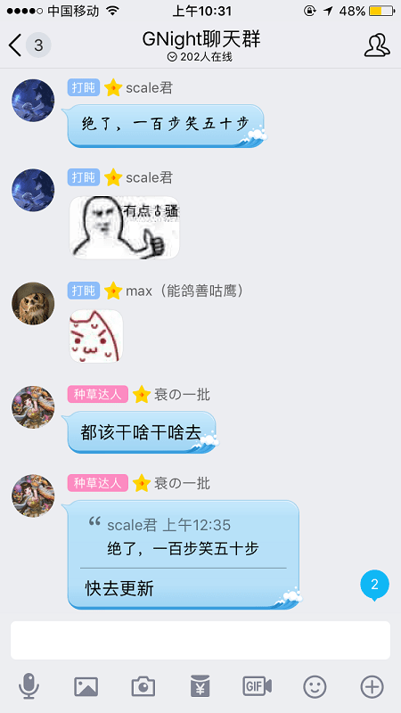

# 大家，再见了

作者：RMB战士

TID：25899

<title>1</title> <link href="../Styles/Style.css" type="text/css" rel="stylesheet">

# 1

*本帖最後由 hsxz 於 2018-9-27 02:44 編輯*

群里一堆乌托邦味道的思想真是可怕，的确混不下去了。

看起来可能只是不改名被踢的小事，但其实是个对于规矩的看法不同而酿成的大事。我会在这里说清我的观点，什么事情都讲规矩的世界是很恐怖的，别把规矩看太神圣了，没有vpn我想很多人也来不得这里。所有规矩都是死的话，人会变成一个机器。（这的确是一个不成熟的想法，没有规矩，人很难在社会中立足。但成熟这个要求对于思考是多余的，大局来看，绝对的规矩是不存在且不应该存在的）

**如果你觉得我这个想法真的是一个糟糕的想法，糟糕到可以质疑我的人品，那是我的错。但如果不是，那么请别攻击我的人格。（**我就当雪风是毒舌性格处理吧）

我想人与人之间的观念不同是很正常的，但就算互相理解做不到，尝试理解是可以做到的。我不遵守规矩没改名 所以踢我，这是一件再正常不过的事情了，但没有理由说我不遵守规矩就可以来质疑我的人品，就可以来喷我。不遵守规矩的小人的确存在，但不要把所有不遵守规矩的人都当成不会自我约束的小人，并加以谴责。改名这样的小事的确不足挂耳，但我一开始所关注的，是大家对于规矩过分的态度。**（规矩必须遵守，话是这么说，但一个所有规矩都被完全遵守的乌托邦世界是没有人情的）（关于这一点莎士比亚在威尼斯商人中体现出来的观点是——必要的时候，就算有倾向性地****按照需求****解释规矩，也不能改变规矩；但有倾向性地解释规矩实际上就是改变了规矩，这只是文字游戏。不过人家好歹要给国家的司法权威一个交代，为了杜绝违法分子，才玩起文字游戏。我们一个群，改名这个规矩，有必要道德绑架吗？我不改名被踢，不会有任何话说。倒不如说不改名没被踢是我的荣幸，不过我也没积过什么德，就算了。但因为我不重视规则，就攻击我的人格，我觉得不合理）**

就结果而言，管理员处理的很棒，喷我的人其实自己id也不符合规矩，因为还看得出是谁就没有关系。这样的法外有情的标准再好不过。但群起而攻乎异端的节奏，让我觉得恐怖。当然这远没有恐怖到让我退圈的程度，但考虑到今后我学业会越来越忙，不会有什么时间做图做视频了，而且这样的癖好实际上早晚也应该戒的，这只是作为一个契机退圈罢了。

蓝胖子请不要难受，我退圈本来也是早晚的事。而且这次原因主要是我的**玻璃心**顶不住他们毒舌烂炸，你的行动完全是正确的。

况且像我这样的垃圾退圈其实对大家也没有一点影响吧。
<title>2</title> <link href="../Styles/Style.css" type="text/css" rel="stylesheet">

# 2

*本帖最後由 hsxz 於 2018-9-28 23:19 編輯*

> [ccccccccccc 發表於 2018-9-28 04:41](https://giantessnight.cf/gnforum2012/forum.php?mod=redirect&goto=findpost&pid=388177&ptid=25899)
> 嗯...現在看來挺好笑的
> 從一開始看的時候就感覺到有一點奇怪的味道
> 名字不改被踢還被群起而攻之

被**踢出群，我看不到记录。这几天整理了一下心情再来看，我有话要说。首先我先描述一下具体情况。****一开始我并不知道有这个群规。他说要对号，我把id给他了问别改可以吗？这并没有任何刁难的意思。然后说gn都快凉了，别那么较真。（这句话其实也是一个对现实状况的抱怨。因为我自己也是一介作者，对于gn人变少的事情感触很深。在gn被墙了以后，人的确少很多，观众少了我固然也很难受。但我说这句话也并没有对任何人持有任何恶意，管理不知道我所站的立场，所以可能会觉得我在骂gn）**
**然后他说gn凉不凉由不得你管，并且很严肃地跟我说 你在GN群就要遵守群规**

**当时我回复的态度还是很诚恳的，但他就用带着火药味的话回复我。于是我才发了张别挑刺的图。**

**不过，发完这张图后，管理也没说话了，也没有继续要盯着我改的意思。**

**既然管理员也没管我，那我也不准备继续讨论这个话题了。本来我也不会再说什么了，但由于我有句特别想说的名言，于是在前面加了“关键是”想作为总结。（这时候已经有群友开始嘲讽我了）**

**然而看到这句话，管理员又开始盯着我改了。（这时，有人说因为我不改名导致他认不出我，然后我当场就改名了。这点可能无法从截图中反应，但应该有办法证实。然而不知道谁还在嘲讽我喷我，于是我又改回去了。）**

**说句实话，我真不觉得改id这是一件原则的事。本来群规就不是那么严肃的存在，很多群时间长了，大家都会比较自由，群规也顶多偶尔提醒一下，很少会咬着不放让你改的。对于我来说，我本来就是先在论坛发了图集，再顺便进的群。我来gn的目的就是为了分享自己做的图，其他版块很少逛，规矩也从没看过，的确不怎么了解。之前我也以为蓝胖子只是我粉丝，根本不知道他是管理，才给他p站号（因为一般都是问我要p站号的），而且仔细看看我之后的回复（请求别改名什么的），其实态度都相当诚恳的，根本没有什么任何自大的表现。*****但反过来说，不管怎么样我也辛辛苦苦在gn更图更视频快2年，你们和我说，“不改就飞了”，“改名就是原则问题”，“让他穿马路，撞死他丫的”这样的没良心的话，是不是有过分了啊。***

**而且管理说的很多其实也是双标，“难道要为了你的心情破群规”。说的好像群规必须严格遵守，但其实很多大佬名字也和gnid不一样，因为他们是大佬所以能开天窗？（然后我说我不是能被随便踢的人，也根本没有威胁的意思。在这种其他大佬名字可以玩花的，我不改名就要被踢的情况下。这句话怎么会有威胁的意思，只是想表达一下有话好好说，同时暗中询问能不能睁一眼闭一眼）但其实我很明白，那些不是开天窗。我一直没说什么“他改我就改这样的话”是因为我认为群规只是为了方便对号认人而存在的，目的达到就好，形式不重要。我id已经发了，已经可以对号了，加个备注括号什么各种各样的方法都可以，没必要一定要那么严格地盯着我改群id。（我id就hsxz4个冰冷的字母，也玩不了花的啊）但可以看一下截图，管理就是斩钉截铁的说改了留，不改滚，完全没有商量的余地。**

**后日谈**
**我觉得这件事主要原因是自己说话方式不妥，容易造成误解。起因是我，我也只能自认。但某些人不断地以第三者的语气，故意恶化他人形象，带节奏这样的习惯我觉得也非常不好。看了大家的评论发现，都是一边倒的，真的心挺累了。本来就是想看看有没有人留我才发这贴的，现在看起来，哪怕我想留下都难，真的心累。**
<title>3</title> <link href="../Styles/Style.css" type="text/css" rel="stylesheet">

# 3

所有圈子只要深入一點基本上都會發生差不多的事情。。。
沒有進任何群(沒有qq)和一直遊離在圈子外的我不清楚由來就不多說了
總之祝你好運一路順風。。。是這樣說吧 <title>4</title> <link href="../Styles/Style.css" type="text/css" rel="stylesheet">

# 4

挺遗憾..如果学业结束想回来的话.我的话.很欢迎你 <title>5</title> <link href="../Styles/Style.css" type="text/css" rel="stylesheet">

# 5

> [huhuhu 發表於 2018-9-27 04:26](https://giantessnight.cf/gnforum2012/forum.php?mod=redirect&goto=findpost&pid=388088&ptid=25899)
> 挺遗憾..如果学业结束想回来的话.我的话.很欢迎你

我已经受够了群里的人身攻击了
<title>6</title> <link href="../Styles/Style.css" type="text/css" rel="stylesheet">

# 6

完全看不出前後發生的事情
不過創作者被圍腳以後退出創作大概是最有力的聲明，總之加油 <title>7</title> <link href="../Styles/Style.css" type="text/css" rel="stylesheet">

# 7

所以為什麽要加群呢？自己一個人玩不好嗎？ <title>8</title> <link href="../Styles/Style.css" type="text/css" rel="stylesheet">

# 8

地球OL里畏畏缩缩的人好不容易找到机会站上个道德高地，自然会毫不吝惜的向下倾泻平日积攒的无能狂怒。
足控作者-1我还是很惋惜的- - <title>9</title> <link href="../Styles/Style.css" type="text/css" rel="stylesheet">

# 9

自己上来就刁难管理员，不配合管理工作硬刚管理员，说话语气蛮横无理，然后开始说劝你改名的人都是在攻击你的人品。这样没理找理还是第一次见。一个明明从一开始就不愿包容别人的人谈包容，一个一开始就“规则就是为了打破”的人去和管理员谈态度，不愧是你，确实很少见，你证明了你的特立独行，你的目的达到了。一个人为圈里做多大贡献和他进群改不改名有什么关系呢，和他有错在先却理智气壮一本正经说别人群起而攻之有什么关系呢？单纯就是为了找茬而找茬，群里的人有目共睹，看了完整记录恐怕会发笑。居然还煞有其事得发了这样一个帖子，不知是博取同情还是想诱导不明真相的群众，自居弱势群体，真是卑劣到了极点，一个滑稽送给你 <title>10</title> <link href="../Styles/Style.css" type="text/css" rel="stylesheet">

# 10

看完之后一脸懵逼。。啥群 什么群？？？  那个群是代表整个圈子吗？ <title>11</title> <link href="../Styles/Style.css" type="text/css" rel="stylesheet">

# 11

原本以為昨天事情結束了沒想到還有round 2
上面幾篇留言如果看到群組截圖風向應該會逆轉就是了(笑) <ignore_js_op>

**94602239b79e9f26384c77fb3e42a19b07869244.jpg** *(38.2 KB, 下載次數: 0)*

[下載附件](forum.php?mod=attachment&aid=NzQ5MDh8YzIyMzgzY2Z8MTY3NDA2ODY5NXwxODIzMHwyNTg5OQ%3D%3D&nothumb=yes)

2018-9-27 10:24 上傳

<title>12</title> <link href="../Styles/Style.css" type="text/css" rel="stylesheet">

# 12

开始要怼的也是你，最后讲包容的也是你，说啥好呢！ <title>13</title> <link href="../Styles/Style.css" type="text/css" rel="stylesheet">

# 13

*本帖最後由 月亮熊 於 2018-9-27 11:24 編輯*

     作为一个搬砖党，我在昨天凌晨3点左右才结束工作，睡前浏览群消息才发现了昨天的群里的一番争论。
     事情起因是12点左右，群管理铜锣烧联系HSXZ，告诉他按照群管理规则需要在群名片更改自己的论坛名，但是HSXZ并不同意更改。至此开始了昨天1小时的争论，一直到凌晨1点左右。
      事件全程，HSXZ抛出了2个观点：1，规矩立下无用，打破规矩才好，你让我改名字我就是不改，我要打破一切瓶瓶罐罐。2，这个社会需要包容，你们需要包容我的行为，我自己呢?对不起，参考第一条，我不管规矩，谢谢。
      然后就是全程的截图。各位可以自己判断，我只是个看客，希望大家在下判断之前也先当个看客。
      多图注意。我本来考虑整理截图对话，后来想想算了，做一个客观的还原比较好      对了，图片请反着看，我的锅，上传的时候没注意。

<title>14</title> <link href="../Styles/Style.css" type="text/css" rel="stylesheet">

# 14

 <ignore_js_op>[IMG_3977.PNG](forum.php?mod=attachment&aid=NzQ5NzF8ZWYwZTM1OGZ8MTY3NDA2ODY5NnwxODIzMHwyNTg5OQ%3D%3D&nothumb=yes) *(156.15 KB, 下載次數: 0)*

[下載附件](forum.php?mod=attachment&aid=NzQ5NzF8ZWYwZTM1OGZ8MTY3NDA2ODY5NnwxODIzMHwyNTg5OQ%3D%3D&nothumb=yes)

2018-9-27 11:14 上傳  

</ignore_js_op> <ignore_js_op>[IMG_3978.PNG](forum.php?mod=attachment&aid=NzQ5NzJ8YmRhYWRhOWJ8MTY3NDA2ODY5NnwxODIzMHwyNTg5OQ%3D%3D&nothumb=yes) *(159.33 KB, 下載次數: 0)*

[下載附件](forum.php?mod=attachment&aid=NzQ5NzJ8YmRhYWRhOWJ8MTY3NDA2ODY5NnwxODIzMHwyNTg5OQ%3D%3D&nothumb=yes)

2018-9-27 11:14 上傳  

</ignore_js_op> <ignore_js_op>[IMG_3979.PNG](forum.php?mod=attachment&aid=NzQ5NzN8OWZiNDg0Njd8MTY3NDA2ODY5NnwxODIzMHwyNTg5OQ%3D%3D&nothumb=yes) *(187.18 KB, 下載次數: 1)*

[下載附件](forum.php?mod=attachment&aid=NzQ5NzN8OWZiNDg0Njd8MTY3NDA2ODY5NnwxODIzMHwyNTg5OQ%3D%3D&nothumb=yes)

2018-9-27 11:14 上傳  

</ignore_js_op> <ignore_js_op>[IMG_3980.PNG](forum.php?mod=attachment&aid=NzQ5NzR8Zjc0NGE3ZjV8MTY3NDA2ODY5NnwxODIzMHwyNTg5OQ%3D%3D&nothumb=yes) *(161.31 KB, 下載次數: 0)*

[下載附件](forum.php?mod=attachment&aid=NzQ5NzR8Zjc0NGE3ZjV8MTY3NDA2ODY5NnwxODIzMHwyNTg5OQ%3D%3D&nothumb=yes)

2018-9-27 11:14 上傳  

</ignore_js_op> <ignore_js_op>[IMG_3981.PNG](forum.php?mod=attachment&aid=NzQ5NzV8OTBkZDkwZDF8MTY3NDA2ODY5NnwxODIzMHwyNTg5OQ%3D%3D&nothumb=yes) *(150.28 KB, 下載次數: 0)*

[下載附件](forum.php?mod=attachment&aid=NzQ5NzV8OTBkZDkwZDF8MTY3NDA2ODY5NnwxODIzMHwyNTg5OQ%3D%3D&nothumb=yes)

2018-9-27 11:14 上傳  

</ignore_js_op> <ignore_js_op>[IMG_3982.PNG](forum.php?mod=attachment&aid=NzQ5NzZ8ZGU2ZjM5MzN8MTY3NDA2ODY5NnwxODIzMHwyNTg5OQ%3D%3D&nothumb=yes) *(146.53 KB, 下載次數: 0)*

[下載附件](forum.php?mod=attachment&aid=NzQ5NzZ8ZGU2ZjM5MzN8MTY3NDA2ODY5NnwxODIzMHwyNTg5OQ%3D%3D&nothumb=yes)

2018-9-27 11:14 上傳  

</ignore_js_op> <ignore_js_op>[IMG_3984.PNG](forum.php?mod=attachment&aid=NzQ5Nzh8ZTZjM2IwYWV8MTY3NDA2ODY5NnwxODIzMHwyNTg5OQ%3D%3D&nothumb=yes) *(183.57 KB, 下載次數: 1)*

[下載附件](forum.php?mod=attachment&aid=NzQ5Nzh8ZTZjM2IwYWV8MTY3NDA2ODY5NnwxODIzMHwyNTg5OQ%3D%3D&nothumb=yes)

2018-9-27 11:14 上傳  

</ignore_js_op> <ignore_js_op>[IMG_3983.PNG](forum.php?mod=attachment&aid=NzQ5Nzd8Mzc2Mjc1YmF8MTY3NDA2ODY5NnwxODIzMHwyNTg5OQ%3D%3D&nothumb=yes) *(193.25 KB, 下載次數: 0)*

[下載附件](forum.php?mod=attachment&aid=NzQ5Nzd8Mzc2Mjc1YmF8MTY3NDA2ODY5NnwxODIzMHwyNTg5OQ%3D%3D&nothumb=yes)

2018-9-27 11:14 上傳  

</ignore_js_op> <ignore_js_op>[IMG_3976.PNG](forum.php?mod=attachment&aid=NzQ5NzB8YTU5YWY2YmF8MTY3NDA2ODY5NnwxODIzMHwyNTg5OQ%3D%3D&nothumb=yes) *(162.19 KB, 下載次數: 0)*

[下載附件](forum.php?mod=attachment&aid=NzQ5NzB8YTU5YWY2YmF8MTY3NDA2ODY5NnwxODIzMHwyNTg5OQ%3D%3D&nothumb=yes)

2018-9-27 11:14 上傳  

</ignore_js_op> <ignore_js_op>[IMG_3975.PNG](forum.php?mod=attachment&aid=NzQ5Njl8N2U4NGVkMzl8MTY3NDA2ODY5NnwxODIzMHwyNTg5OQ%3D%3D&nothumb=yes) *(173.38 KB, 下載次數: 0)*

[下載附件](forum.php?mod=attachment&aid=NzQ5Njl8N2U4NGVkMzl8MTY3NDA2ODY5NnwxODIzMHwyNTg5OQ%3D%3D&nothumb=yes)

2018-9-27 11:14 上傳  

</ignore_js_op> <ignore_js_op>[IMG_3974.PNG](forum.php?mod=attachment&aid=NzQ5Njh8ZWEwZTFhNWR8MTY3NDA2ODY5NnwxODIzMHwyNTg5OQ%3D%3D&nothumb=yes) *(157.17 KB, 下載次數: 1)*

[下載附件](forum.php?mod=attachment&aid=NzQ5Njh8ZWEwZTFhNWR8MTY3NDA2ODY5NnwxODIzMHwyNTg5OQ%3D%3D&nothumb=yes)

2018-9-27 11:14 上傳  

</ignore_js_op> <ignore_js_op>[IMG_3973.PNG](forum.php?mod=attachment&aid=NzQ5Njd8NTZiZGFhNzB8MTY3NDA2ODY5NnwxODIzMHwyNTg5OQ%3D%3D&nothumb=yes) *(178.55 KB, 下載次數: 0)*

[下載附件](forum.php?mod=attachment&aid=NzQ5Njd8NTZiZGFhNzB8MTY3NDA2ODY5NnwxODIzMHwyNTg5OQ%3D%3D&nothumb=yes)

2018-9-27 11:14 上傳  

</ignore_js_op> <ignore_js_op>[IMG_3972.PNG](forum.php?mod=attachment&aid=NzQ5NjZ8ZWVjMmYyMGZ8MTY3NDA2ODY5NnwxODIzMHwyNTg5OQ%3D%3D&nothumb=yes) *(143.42 KB, 下載次數: 0)*

[下載附件](forum.php?mod=attachment&aid=NzQ5NjZ8ZWVjMmYyMGZ8MTY3NDA2ODY5NnwxODIzMHwyNTg5OQ%3D%3D&nothumb=yes)

2018-9-27 11:14 上傳  

</ignore_js_op> <ignore_js_op>[IMG_3971.PNG](forum.php?mod=attachment&aid=NzQ5NjV8MGJkYzUzZGZ8MTY3NDA2ODY5NnwxODIzMHwyNTg5OQ%3D%3D&nothumb=yes) *(175.04 KB, 下載次數: 0)*

[下載附件](forum.php?mod=attachment&aid=NzQ5NjV8MGJkYzUzZGZ8MTY3NDA2ODY5NnwxODIzMHwyNTg5OQ%3D%3D&nothumb=yes)

2018-9-27 11:14 上傳  

</ignore_js_op> <ignore_js_op>[IMG_3970.PNG](forum.php?mod=attachment&aid=NzQ5NjR8ZWY3YzdjYmJ8MTY3NDA2ODY5NnwxODIzMHwyNTg5OQ%3D%3D&nothumb=yes) *(142.17 KB, 下載次數: 0)*

[下載附件](forum.php?mod=attachment&aid=NzQ5NjR8ZWY3YzdjYmJ8MTY3NDA2ODY5NnwxODIzMHwyNTg5OQ%3D%3D&nothumb=yes)

2018-9-27 11:13 上傳  

</ignore_js_op> <ignore_js_op>[IMG_3969.PNG](forum.php?mod=attachment&aid=NzQ5NjN8OWViOWY1N2F8MTY3NDA2ODY5NnwxODIzMHwyNTg5OQ%3D%3D&nothumb=yes) *(163.15 KB, 下載次數: 0)*

[下載附件](forum.php?mod=attachment&aid=NzQ5NjN8OWViOWY1N2F8MTY3NDA2ODY5NnwxODIzMHwyNTg5OQ%3D%3D&nothumb=yes)

2018-9-27 11:13 上傳  

</ignore_js_op> <ignore_js_op>[IMG_3968.PNG](forum.php?mod=attachment&aid=NzQ5NjJ8ODc1YmJkMzJ8MTY3NDA2ODY5NnwxODIzMHwyNTg5OQ%3D%3D&nothumb=yes) *(154.83 KB, 下載次數: 0)*

[下載附件](forum.php?mod=attachment&aid=NzQ5NjJ8ODc1YmJkMzJ8MTY3NDA2ODY5NnwxODIzMHwyNTg5OQ%3D%3D&nothumb=yes)

2018-9-27 11:13 上傳  

</ignore_js_op> <ignore_js_op>[IMG_3967.PNG](forum.php?mod=attachment&aid=NzQ5NjF8MTVjNDZlYWZ8MTY3NDA2ODY5NnwxODIzMHwyNTg5OQ%3D%3D&nothumb=yes) *(172.16 KB, 下載次數: 0)*

[下載附件](forum.php?mod=attachment&aid=NzQ5NjF8MTVjNDZlYWZ8MTY3NDA2ODY5NnwxODIzMHwyNTg5OQ%3D%3D&nothumb=yes)

2018-9-27 11:12 上傳  

</ignore_js_op> <ignore_js_op>[IMG_3966.PNG](forum.php?mod=attachment&aid=NzQ5NjB8Y2QxMWI4N2J8MTY3NDA2ODY5NnwxODIzMHwyNTg5OQ%3D%3D&nothumb=yes) *(196.72 KB, 下載次數: 0)*

[下載附件](forum.php?mod=attachment&aid=NzQ5NjB8Y2QxMWI4N2J8MTY3NDA2ODY5NnwxODIzMHwyNTg5OQ%3D%3D&nothumb=yes)

2018-9-27 11:12 上傳  

</ignore_js_op> <ignore_js_op>[IMG_3965.PNG](forum.php?mod=attachment&aid=NzQ5NTl8NTJiYjYzN2V8MTY3NDA2ODY5NnwxODIzMHwyNTg5OQ%3D%3D&nothumb=yes) *(156.14 KB, 下載次數: 0)*

[下載附件](forum.php?mod=attachment&aid=NzQ5NTl8NTJiYjYzN2V8MTY3NDA2ODY5NnwxODIzMHwyNTg5OQ%3D%3D&nothumb=yes)

2018-9-27 11:12 上傳  

</ignore_js_op> <ignore_js_op>[IMG_3964.PNG](forum.php?mod=attachment&aid=NzQ5NTh8MDY5NjY0ZGZ8MTY3NDA2ODY5NnwxODIzMHwyNTg5OQ%3D%3D&nothumb=yes) *(159.82 KB, 下載次數: 0)*

[下載附件](forum.php?mod=attachment&aid=NzQ5NTh8MDY5NjY0ZGZ8MTY3NDA2ODY5NnwxODIzMHwyNTg5OQ%3D%3D&nothumb=yes)

2018-9-27 11:12 上傳  

</ignore_js_op> <ignore_js_op>[IMG_3963.PNG](forum.php?mod=attachment&aid=NzQ5NTd8YzE5YTUxZTV8MTY3NDA2ODY5NnwxODIzMHwyNTg5OQ%3D%3D&nothumb=yes) *(152.44 KB, 下載次數: 0)*

[下載附件](forum.php?mod=attachment&aid=NzQ5NTd8YzE5YTUxZTV8MTY3NDA2ODY5NnwxODIzMHwyNTg5OQ%3D%3D&nothumb=yes)

2018-9-27 11:12 上傳  

</ignore_js_op> <ignore_js_op>[IMG_3962.PNG](forum.php?mod=attachment&aid=NzQ5NTZ8ZTFlZjRiNDN8MTY3NDA2ODY5NnwxODIzMHwyNTg5OQ%3D%3D&nothumb=yes) *(147.27 KB, 下載次數: 0)*

[下載附件](forum.php?mod=attachment&aid=NzQ5NTZ8ZTFlZjRiNDN8MTY3NDA2ODY5NnwxODIzMHwyNTg5OQ%3D%3D&nothumb=yes)

2018-9-27 11:12 上傳  

</ignore_js_op> <ignore_js_op>[IMG_3961.PNG](forum.php?mod=attachment&aid=NzQ5NTV8Mzg1NTJjNjd8MTY3NDA2ODY5NnwxODIzMHwyNTg5OQ%3D%3D&nothumb=yes) *(157.33 KB, 下載次數: 0)*

[下載附件](forum.php?mod=attachment&aid=NzQ5NTV8Mzg1NTJjNjd8MTY3NDA2ODY5NnwxODIzMHwyNTg5OQ%3D%3D&nothumb=yes)

2018-9-27 11:12 上傳  

</ignore_js_op> <ignore_js_op>[IMG_3960.PNG](forum.php?mod=attachment&aid=NzQ5NTR8MzI1MmQ5ZmF8MTY3NDA2ODY5NnwxODIzMHwyNTg5OQ%3D%3D&nothumb=yes) *(172.08 KB, 下載次數: 0)*

[下載附件](forum.php?mod=attachment&aid=NzQ5NTR8MzI1MmQ5ZmF8MTY3NDA2ODY5NnwxODIzMHwyNTg5OQ%3D%3D&nothumb=yes)

2018-9-27 11:12 上傳  

</ignore_js_op> <ignore_js_op>[IMG_3959.PNG](forum.php?mod=attachment&aid=NzQ5NTN8Yjc1NGUzOTd8MTY3NDA2ODY5NnwxODIzMHwyNTg5OQ%3D%3D&nothumb=yes) *(150.96 KB, 下載次數: 0)*

[下載附件](forum.php?mod=attachment&aid=NzQ5NTN8Yjc1NGUzOTd8MTY3NDA2ODY5NnwxODIzMHwyNTg5OQ%3D%3D&nothumb=yes)

2018-9-27 11:12 上傳  

</ignore_js_op> <ignore_js_op>[IMG_3958.PNG](forum.php?mod=attachment&aid=NzQ5NTJ8M2QxYzZiZGJ8MTY3NDA2ODY5NnwxODIzMHwyNTg5OQ%3D%3D&nothumb=yes) *(174.37 KB, 下載次數: 0)*

[下載附件](forum.php?mod=attachment&aid=NzQ5NTJ8M2QxYzZiZGJ8MTY3NDA2ODY5NnwxODIzMHwyNTg5OQ%3D%3D&nothumb=yes)

2018-9-27 11:11 上傳  

</ignore_js_op> <ignore_js_op>[IMG_3957.PNG](forum.php?mod=attachment&aid=NzQ5NTF8N2RjZjEyODJ8MTY3NDA2ODY5NnwxODIzMHwyNTg5OQ%3D%3D&nothumb=yes) *(158.91 KB, 下載次數: 0)*

[下載附件](forum.php?mod=attachment&aid=NzQ5NTF8N2RjZjEyODJ8MTY3NDA2ODY5NnwxODIzMHwyNTg5OQ%3D%3D&nothumb=yes)

2018-9-27 11:11 上傳  

</ignore_js_op> <ignore_js_op>[IMG_3956.PNG](forum.php?mod=attachment&aid=NzQ5NTB8MDcyYWE4Mjl8MTY3NDA2ODY5NnwxODIzMHwyNTg5OQ%3D%3D&nothumb=yes) *(160.83 KB, 下載次數: 0)*

[下載附件](forum.php?mod=attachment&aid=NzQ5NTB8MDcyYWE4Mjl8MTY3NDA2ODY5NnwxODIzMHwyNTg5OQ%3D%3D&nothumb=yes)

2018-9-27 11:11 上傳  

</ignore_js_op> <ignore_js_op>[IMG_3955.PNG](forum.php?mod=attachment&aid=NzQ5NDl8YjE5YWZhYWJ8MTY3NDA2ODY5NnwxODIzMHwyNTg5OQ%3D%3D&nothumb=yes) *(162.68 KB, 下載次數: 0)*

[下載附件](forum.php?mod=attachment&aid=NzQ5NDl8YjE5YWZhYWJ8MTY3NDA2ODY5NnwxODIzMHwyNTg5OQ%3D%3D&nothumb=yes)

2018-9-27 11:11 上傳  

</ignore_js_op> <ignore_js_op>[IMG_3954.PNG](forum.php?mod=attachment&aid=NzQ5NDh8MDU0YmVkYTJ8MTY3NDA2ODY5NnwxODIzMHwyNTg5OQ%3D%3D&nothumb=yes) *(151.4 KB, 下載次數: 0)*

[下載附件](forum.php?mod=attachment&aid=NzQ5NDh8MDU0YmVkYTJ8MTY3NDA2ODY5NnwxODIzMHwyNTg5OQ%3D%3D&nothumb=yes)

2018-9-27 11:11 上傳  

</ignore_js_op> <ignore_js_op>[IMG_3953.PNG](forum.php?mod=attachment&aid=NzQ5NDd8NzgwOWNhMzd8MTY3NDA2ODY5NnwxODIzMHwyNTg5OQ%3D%3D&nothumb=yes) *(152.02 KB, 下載次數: 0)*

[下載附件](forum.php?mod=attachment&aid=NzQ5NDd8NzgwOWNhMzd8MTY3NDA2ODY5NnwxODIzMHwyNTg5OQ%3D%3D&nothumb=yes)

2018-9-27 11:11 上傳  

</ignore_js_op> <ignore_js_op>[IMG_3952.PNG](forum.php?mod=attachment&aid=NzQ5NDZ8ODQ5N2I2ODl8MTY3NDA2ODY5NnwxODIzMHwyNTg5OQ%3D%3D&nothumb=yes) *(151.18 KB, 下載次數: 0)*

[下載附件](forum.php?mod=attachment&aid=NzQ5NDZ8ODQ5N2I2ODl8MTY3NDA2ODY5NnwxODIzMHwyNTg5OQ%3D%3D&nothumb=yes)

2018-9-27 11:11 上傳  

</ignore_js_op> <ignore_js_op>[IMG_3951.PNG](forum.php?mod=attachment&aid=NzQ5NDV8YTAzMmY5ZTB8MTY3NDA2ODY5NnwxODIzMHwyNTg5OQ%3D%3D&nothumb=yes) *(197.25 KB, 下載次數: 0)*

[下載附件](forum.php?mod=attachment&aid=NzQ5NDV8YTAzMmY5ZTB8MTY3NDA2ODY5NnwxODIzMHwyNTg5OQ%3D%3D&nothumb=yes)

2018-9-27 11:11 上傳  

</ignore_js_op> <ignore_js_op>[IMG_3950.PNG](forum.php?mod=attachment&aid=NzQ5NDR8ZDIyZWY3ZDl8MTY3NDA2ODY5NnwxODIzMHwyNTg5OQ%3D%3D&nothumb=yes) *(183.67 KB, 下載次數: 0)*

[下載附件](forum.php?mod=attachment&aid=NzQ5NDR8ZDIyZWY3ZDl8MTY3NDA2ODY5NnwxODIzMHwyNTg5OQ%3D%3D&nothumb=yes)

2018-9-27 11:11 上傳  

</ignore_js_op> <ignore_js_op>[IMG_3949.PNG](forum.php?mod=attachment&aid=NzQ5NDN8MWRiODRjYTR8MTY3NDA2ODY5NnwxODIzMHwyNTg5OQ%3D%3D&nothumb=yes) *(205.66 KB, 下載次數: 0)*

[下載附件](forum.php?mod=attachment&aid=NzQ5NDN8MWRiODRjYTR8MTY3NDA2ODY5NnwxODIzMHwyNTg5OQ%3D%3D&nothumb=yes)

2018-9-27 11:11 上傳  

</ignore_js_op> <ignore_js_op>[IMG_3948.PNG](forum.php?mod=attachment&aid=NzQ5NDJ8ZDE2OWM3YzV8MTY3NDA2ODY5NnwxODIzMHwyNTg5OQ%3D%3D&nothumb=yes) *(145.87 KB, 下載次數: 0)*

[下載附件](forum.php?mod=attachment&aid=NzQ5NDJ8ZDE2OWM3YzV8MTY3NDA2ODY5NnwxODIzMHwyNTg5OQ%3D%3D&nothumb=yes)

2018-9-27 11:11 上傳  

</ignore_js_op> <ignore_js_op>[IMG_3947.PNG](forum.php?mod=attachment&aid=NzQ5NDF8ODI2MTJlZDl8MTY3NDA2ODY5NnwxODIzMHwyNTg5OQ%3D%3D&nothumb=yes) *(165.72 KB, 下載次數: 0)*

[下載附件](forum.php?mod=attachment&aid=NzQ5NDF8ODI2MTJlZDl8MTY3NDA2ODY5NnwxODIzMHwyNTg5OQ%3D%3D&nothumb=yes)

2018-9-27 11:11 上傳  

</ignore_js_op> <ignore_js_op>[IMG_3946.PNG](forum.php?mod=attachment&aid=NzQ5NDB8MWFjMzI1Zjh8MTY3NDA2ODY5NnwxODIzMHwyNTg5OQ%3D%3D&nothumb=yes) *(153.84 KB, 下載次數: 0)*

[下載附件](forum.php?mod=attachment&aid=NzQ5NDB8MWFjMzI1Zjh8MTY3NDA2ODY5NnwxODIzMHwyNTg5OQ%3D%3D&nothumb=yes)

2018-9-27 11:10 上傳  

</ignore_js_op> <ignore_js_op>[IMG_3945.PNG](forum.php?mod=attachment&aid=NzQ5Mzl8NDQ4YzI0Y2N8MTY3NDA2ODY5NnwxODIzMHwyNTg5OQ%3D%3D&nothumb=yes) *(170.59 KB, 下載次數: 0)*

[下載附件](forum.php?mod=attachment&aid=NzQ5Mzl8NDQ4YzI0Y2N8MTY3NDA2ODY5NnwxODIzMHwyNTg5OQ%3D%3D&nothumb=yes)

2018-9-27 11:10 上傳  

</ignore_js_op> <ignore_js_op>[IMG_3944.PNG](forum.php?mod=attachment&aid=NzQ5Mzh8ZWNhMDIxY2V8MTY3NDA2ODY5NnwxODIzMHwyNTg5OQ%3D%3D&nothumb=yes) *(151.44 KB, 下載次數: 0)*

[下載附件](forum.php?mod=attachment&aid=NzQ5Mzh8ZWNhMDIxY2V8MTY3NDA2ODY5NnwxODIzMHwyNTg5OQ%3D%3D&nothumb=yes)

2018-9-27 11:10 上傳  

</ignore_js_op> <ignore_js_op>[IMG_3943.PNG](forum.php?mod=attachment&aid=NzQ5Mzd8YWUyNjRmNDN8MTY3NDA2ODY5NnwxODIzMHwyNTg5OQ%3D%3D&nothumb=yes) *(165.87 KB, 下載次數: 0)*

[下載附件](forum.php?mod=attachment&aid=NzQ5Mzd8YWUyNjRmNDN8MTY3NDA2ODY5NnwxODIzMHwyNTg5OQ%3D%3D&nothumb=yes)

2018-9-27 11:10 上傳  

</ignore_js_op> <ignore_js_op>[IMG_3942.PNG](forum.php?mod=attachment&aid=NzQ5MzZ8MTA4M2E4ODl8MTY3NDA2ODY5NnwxODIzMHwyNTg5OQ%3D%3D&nothumb=yes) *(184.86 KB, 下載次數: 0)*

[下載附件](forum.php?mod=attachment&aid=NzQ5MzZ8MTA4M2E4ODl8MTY3NDA2ODY5NnwxODIzMHwyNTg5OQ%3D%3D&nothumb=yes)

2018-9-27 11:10 上傳  

</ignore_js_op> <ignore_js_op>[IMG_3941.PNG](forum.php?mod=attachment&aid=NzQ5MzV8NWNkOTNmYzR8MTY3NDA2ODY5NnwxODIzMHwyNTg5OQ%3D%3D&nothumb=yes) *(164.09 KB, 下載次數: 0)*

[下載附件](forum.php?mod=attachment&aid=NzQ5MzV8NWNkOTNmYzR8MTY3NDA2ODY5NnwxODIzMHwyNTg5OQ%3D%3D&nothumb=yes)

2018-9-27 11:10 上傳  

</ignore_js_op> <ignore_js_op>[IMG_3940.PNG](forum.php?mod=attachment&aid=NzQ5MzR8YzcyYjhjMTB8MTY3NDA2ODY5NnwxODIzMHwyNTg5OQ%3D%3D&nothumb=yes) *(176.71 KB, 下載次數: 0)*

[下載附件](forum.php?mod=attachment&aid=NzQ5MzR8YzcyYjhjMTB8MTY3NDA2ODY5NnwxODIzMHwyNTg5OQ%3D%3D&nothumb=yes)

2018-9-27 11:10 上傳  

</ignore_js_op> <ignore_js_op>[IMG_3939.PNG](forum.php?mod=attachment&aid=NzQ5MzN8MjVkYmY0Yjh8MTY3NDA2ODY5NnwxODIzMHwyNTg5OQ%3D%3D&nothumb=yes) *(160.24 KB, 下載次數: 0)*

[下載附件](forum.php?mod=attachment&aid=NzQ5MzN8MjVkYmY0Yjh8MTY3NDA2ODY5NnwxODIzMHwyNTg5OQ%3D%3D&nothumb=yes)

2018-9-27 11:10 上傳  

</ignore_js_op> <ignore_js_op>[IMG_3938.PNG](forum.php?mod=attachment&aid=NzQ5MzJ8NTk0MmMxZDB8MTY3NDA2ODY5NnwxODIzMHwyNTg5OQ%3D%3D&nothumb=yes) *(149.52 KB, 下載次數: 0)*

[下載附件](forum.php?mod=attachment&aid=NzQ5MzJ8NTk0MmMxZDB8MTY3NDA2ODY5NnwxODIzMHwyNTg5OQ%3D%3D&nothumb=yes)

2018-9-27 11:10 上傳  

</ignore_js_op> <ignore_js_op>[IMG_3937.PNG](forum.php?mod=attachment&aid=NzQ5MzF8ZjVhYjZjM2N8MTY3NDA2ODY5NnwxODIzMHwyNTg5OQ%3D%3D&nothumb=yes) *(140.44 KB, 下載次數: 0)*

[下載附件](forum.php?mod=attachment&aid=NzQ5MzF8ZjVhYjZjM2N8MTY3NDA2ODY5NnwxODIzMHwyNTg5OQ%3D%3D&nothumb=yes)

2018-9-27 11:10 上傳  

</ignore_js_op> <ignore_js_op>[IMG_3936.PNG](forum.php?mod=attachment&aid=NzQ5MzB8MWIzZTdiOGJ8MTY3NDA2ODY5NnwxODIzMHwyNTg5OQ%3D%3D&nothumb=yes) *(146.54 KB, 下載次數: 0)*

[下載附件](forum.php?mod=attachment&aid=NzQ5MzB8MWIzZTdiOGJ8MTY3NDA2ODY5NnwxODIzMHwyNTg5OQ%3D%3D&nothumb=yes)

2018-9-27 11:10 上傳  

</ignore_js_op> <ignore_js_op>[IMG_3935.PNG](forum.php?mod=attachment&aid=NzQ5Mjl8NzJlMjAwYzR8MTY3NDA2ODY5NnwxODIzMHwyNTg5OQ%3D%3D&nothumb=yes) *(158.78 KB, 下載次數: 0)*

[下載附件](forum.php?mod=attachment&aid=NzQ5Mjl8NzJlMjAwYzR8MTY3NDA2ODY5NnwxODIzMHwyNTg5OQ%3D%3D&nothumb=yes)

2018-9-27 11:10 上傳  

</ignore_js_op> <ignore_js_op>[IMG_3934.PNG](forum.php?mod=attachment&aid=NzQ5Mjh8Yjk3YmE3Yjl8MTY3NDA2ODY5NnwxODIzMHwyNTg5OQ%3D%3D&nothumb=yes) *(175.17 KB, 下載次數: 0)*

[下載附件](forum.php?mod=attachment&aid=NzQ5Mjh8Yjk3YmE3Yjl8MTY3NDA2ODY5NnwxODIzMHwyNTg5OQ%3D%3D&nothumb=yes)

2018-9-27 11:08 上傳  

</ignore_js_op> <ignore_js_op>[IMG_3933.PNG](forum.php?mod=attachment&aid=NzQ5Mjd8ZmEwM2RjMzd8MTY3NDA2ODY5NnwxODIzMHwyNTg5OQ%3D%3D&nothumb=yes) *(196.25 KB, 下載次數: 0)*

[下載附件](forum.php?mod=attachment&aid=NzQ5Mjd8ZmEwM2RjMzd8MTY3NDA2ODY5NnwxODIzMHwyNTg5OQ%3D%3D&nothumb=yes)

2018-9-27 11:08 上傳  

</ignore_js_op> <ignore_js_op>[IMG_3932.PNG](forum.php?mod=attachment&aid=NzQ5MjZ8ZWE0ODMyMWN8MTY3NDA2ODY5NnwxODIzMHwyNTg5OQ%3D%3D&nothumb=yes) *(168.91 KB, 下載次數: 0)*

[下載附件](forum.php?mod=attachment&aid=NzQ5MjZ8ZWE0ODMyMWN8MTY3NDA2ODY5NnwxODIzMHwyNTg5OQ%3D%3D&nothumb=yes)

2018-9-27 11:08 上傳  

</ignore_js_op> <ignore_js_op>[IMG_3931.PNG](forum.php?mod=attachment&aid=NzQ5MjV8Y2ZhMTQxODN8MTY3NDA2ODY5NnwxODIzMHwyNTg5OQ%3D%3D&nothumb=yes) *(163.55 KB, 下載次數: 0)*

[下載附件](forum.php?mod=attachment&aid=NzQ5MjV8Y2ZhMTQxODN8MTY3NDA2ODY5NnwxODIzMHwyNTg5OQ%3D%3D&nothumb=yes)

2018-9-27 11:08 上傳  

</ignore_js_op> <ignore_js_op>[IMG_3930.PNG](forum.php?mod=attachment&aid=NzQ5MjR8ZWI4MzQ1ZjZ8MTY3NDA2ODY5NnwxODIzMHwyNTg5OQ%3D%3D&nothumb=yes) *(149.08 KB, 下載次數: 0)*

[下載附件](forum.php?mod=attachment&aid=NzQ5MjR8ZWI4MzQ1ZjZ8MTY3NDA2ODY5NnwxODIzMHwyNTg5OQ%3D%3D&nothumb=yes)

2018-9-27 11:08 上傳  

</ignore_js_op> <ignore_js_op>[IMG_3929.PNG](forum.php?mod=attachment&aid=NzQ5MjN8NDNjY2RjZGV8MTY3NDA2ODY5NnwxODIzMHwyNTg5OQ%3D%3D&nothumb=yes) *(143.37 KB, 下載次數: 0)*

[下載附件](forum.php?mod=attachment&aid=NzQ5MjN8NDNjY2RjZGV8MTY3NDA2ODY5NnwxODIzMHwyNTg5OQ%3D%3D&nothumb=yes)

2018-9-27 11:08 上傳  

</ignore_js_op> <ignore_js_op>[IMG_3928.PNG](forum.php?mod=attachment&aid=NzQ5MjJ8ZWYyMzBiMDN8MTY3NDA2ODY5NnwxODIzMHwyNTg5OQ%3D%3D&nothumb=yes) *(134.3 KB, 下載次數: 0)*

[下載附件](forum.php?mod=attachment&aid=NzQ5MjJ8ZWYyMzBiMDN8MTY3NDA2ODY5NnwxODIzMHwyNTg5OQ%3D%3D&nothumb=yes)

2018-9-27 11:08 上傳  

</ignore_js_op> <ignore_js_op>[IMG_3927.PNG](forum.php?mod=attachment&aid=NzQ5MjF8ODI2ZmRjMGZ8MTY3NDA2ODY5NnwxODIzMHwyNTg5OQ%3D%3D&nothumb=yes) *(157.38 KB, 下載次數: 0)*

[下載附件](forum.php?mod=attachment&aid=NzQ5MjF8ODI2ZmRjMGZ8MTY3NDA2ODY5NnwxODIzMHwyNTg5OQ%3D%3D&nothumb=yes)

2018-9-27 11:08 上傳  

</ignore_js_op> <ignore_js_op>[IMG_3926.PNG](forum.php?mod=attachment&aid=NzQ5MjB8NDRiNzU0ODB8MTY3NDA2ODY5NnwxODIzMHwyNTg5OQ%3D%3D&nothumb=yes) *(137.3 KB, 下載次數: 0)*

[下載附件](forum.php?mod=attachment&aid=NzQ5MjB8NDRiNzU0ODB8MTY3NDA2ODY5NnwxODIzMHwyNTg5OQ%3D%3D&nothumb=yes)

2018-9-27 11:08 上傳  

</ignore_js_op> <ignore_js_op>[IMG_3925.PNG](forum.php?mod=attachment&aid=NzQ5MTl8ZjQ5NWY1ZDZ8MTY3NDA2ODY5NnwxODIzMHwyNTg5OQ%3D%3D&nothumb=yes) *(156.85 KB, 下載次數: 0)*

[下載附件](forum.php?mod=attachment&aid=NzQ5MTl8ZjQ5NWY1ZDZ8MTY3NDA2ODY5NnwxODIzMHwyNTg5OQ%3D%3D&nothumb=yes)

2018-9-27 11:08 上傳  

</ignore_js_op> <ignore_js_op>[IMG_3924.PNG](forum.php?mod=attachment&aid=NzQ5MTh8MTI2ZmZiYjd8MTY3NDA2ODY5NnwxODIzMHwyNTg5OQ%3D%3D&nothumb=yes) *(171.19 KB, 下載次數: 0)*

[下載附件](forum.php?mod=attachment&aid=NzQ5MTh8MTI2ZmZiYjd8MTY3NDA2ODY5NnwxODIzMHwyNTg5OQ%3D%3D&nothumb=yes)

2018-9-27 11:08 上傳  

</ignore_js_op> <ignore_js_op>[IMG_3923.PNG](forum.php?mod=attachment&aid=NzQ5MTd8YWU5NTI0ODF8MTY3NDA2ODY5NnwxODIzMHwyNTg5OQ%3D%3D&nothumb=yes) *(150.93 KB, 下載次數: 0)*

[下載附件](forum.php?mod=attachment&aid=NzQ5MTd8YWU5NTI0ODF8MTY3NDA2ODY5NnwxODIzMHwyNTg5OQ%3D%3D&nothumb=yes)

2018-9-27 11:07 上傳  

</ignore_js_op> <ignore_js_op>[IMG_3922.PNG](forum.php?mod=attachment&aid=NzQ5MTZ8ZmY1OTM2NjJ8MTY3NDA2ODY5NnwxODIzMHwyNTg5OQ%3D%3D&nothumb=yes) *(143.44 KB, 下載次數: 0)*

[下載附件](forum.php?mod=attachment&aid=NzQ5MTZ8ZmY1OTM2NjJ8MTY3NDA2ODY5NnwxODIzMHwyNTg5OQ%3D%3D&nothumb=yes)

2018-9-27 11:07 上傳  

</ignore_js_op> <ignore_js_op>[IMG_3921.PNG](forum.php?mod=attachment&aid=NzQ5MTV8YWMyY2E4Yzl8MTY3NDA2ODY5NnwxODIzMHwyNTg5OQ%3D%3D&nothumb=yes) *(147.87 KB, 下載次數: 2)*

[下載附件](forum.php?mod=attachment&aid=NzQ5MTV8YWMyY2E4Yzl8MTY3NDA2ODY5NnwxODIzMHwyNTg5OQ%3D%3D&nothumb=yes)

2018-9-27 11:07 上傳  

</ignore_js_op> <ignore_js_op>[IMG_3920.PNG](forum.php?mod=attachment&aid=NzQ5MTR8MzhjM2MwOTl8MTY3NDA2ODY5NnwxODIzMHwyNTg5OQ%3D%3D&nothumb=yes) *(158.24 KB, 下載次數: 0)*

[下載附件](forum.php?mod=attachment&aid=NzQ5MTR8MzhjM2MwOTl8MTY3NDA2ODY5NnwxODIzMHwyNTg5OQ%3D%3D&nothumb=yes)

2018-9-27 11:07 上傳  

</ignore_js_op> <ignore_js_op>[IMG_3919.PNG](forum.php?mod=attachment&aid=NzQ5MTN8MGE2N2I5OWN8MTY3NDA2ODY5NnwxODIzMHwyNTg5OQ%3D%3D&nothumb=yes) *(178.16 KB, 下載次數: 0)*

[下載附件](forum.php?mod=attachment&aid=NzQ5MTN8MGE2N2I5OWN8MTY3NDA2ODY5NnwxODIzMHwyNTg5OQ%3D%3D&nothumb=yes)

2018-9-27 11:07 上傳  

</ignore_js_op> <ignore_js_op>[IMG_3918.PNG](forum.php?mod=attachment&aid=NzQ5MTJ8NTc2Yzk3NzV8MTY3NDA2ODY5NnwxODIzMHwyNTg5OQ%3D%3D&nothumb=yes) *(150.16 KB, 下載次數: 0)*

[下載附件](forum.php?mod=attachment&aid=NzQ5MTJ8NTc2Yzk3NzV8MTY3NDA2ODY5NnwxODIzMHwyNTg5OQ%3D%3D&nothumb=yes)

2018-9-27 11:06 上傳  

</ignore_js_op> <ignore_js_op>[IMG_3917.PNG](forum.php?mod=attachment&aid=NzQ5MTF8MTU0YmFlY2N8MTY3NDA2ODY5NnwxODIzMHwyNTg5OQ%3D%3D&nothumb=yes) *(126.4 KB, 下載次數: 0)*

[下載附件](forum.php?mod=attachment&aid=NzQ5MTF8MTU0YmFlY2N8MTY3NDA2ODY5NnwxODIzMHwyNTg5OQ%3D%3D&nothumb=yes)

2018-9-27 11:06 上傳  

</ignore_js_op> <ignore_js_op>[IMG_3916.PNG](forum.php?mod=attachment&aid=NzQ5MTB8NTA4NTIwNzh8MTY3NDA2ODY5NnwxODIzMHwyNTg5OQ%3D%3D&nothumb=yes) *(113.69 KB, 下載次數: 0)*

[下載附件](forum.php?mod=attachment&aid=NzQ5MTB8NTA4NTIwNzh8MTY3NDA2ODY5NnwxODIzMHwyNTg5OQ%3D%3D&nothumb=yes)

2018-9-27 11:06 上傳  

</ignore_js_op> <ignore_js_op>[IMG_3915.PNG](forum.php?mod=attachment&aid=NzQ5MDl8MDFlMzhjY2J8MTY3NDA2ODY5NnwxODIzMHwyNTg5OQ%3D%3D&nothumb=yes) *(172.04 KB, 下載次數: 0)*

[下載附件](forum.php?mod=attachment&aid=NzQ5MDl8MDFlMzhjY2J8MTY3NDA2ODY5NnwxODIzMHwyNTg5OQ%3D%3D&nothumb=yes)

2018-9-27 11:06 上傳  

</ignore_js_op> <title>15</title> <link href="../Styles/Style.css" type="text/css" rel="stylesheet">

# 15

蓝胖子的原话是怎么说的？   请把id改成gnid或者相关  您不但没有遵守 还发表了『规则就是用来打破的』这样的神奇言论 真是牛逼 <title>16</title> <link href="../Styles/Style.css" type="text/css" rel="stylesheet">

# 16

不改名字  T了呗  简单。BB这么多有意义吗？规矩就是规矩！ <title>17</title> <link href="../Styles/Style.css" type="text/css" rel="stylesheet">

# 17

您为什么不自己想想 之所以会出现你所谓的『群起而攻之』这样的现象 原因是什么吗？ 如果您自己从来没想过 …算了 我都懒得喷你了 请您去找一个能包容你打破规则的地方吧 玩的开心 <title>18</title> <link href="../Styles/Style.css" type="text/css" rel="stylesheet">

# 18

*本帖最後由 gabbit 於 2018-9-27 11:58 編輯*

佛了，俺寻思着gn凉也⑧是你一人说着算的［emoji］辣真的流批，大佬
<title>19</title> <link href="../Styles/Style.css" type="text/css" rel="stylesheet">

# 19

安啦，群里“被欺负”，于是来论坛扮可怜；论坛又吃瘪，只好去贴吧诉苦，我已预见此路，hsxz啥时候主演猴戏第三弹啊，求更新，太好笑了！ <title>20</title> <link href="../Styles/Style.css" type="text/css" rel="stylesheet">

# 20

全程吃瓜还是想说几句 你这么讨厌这个群还说这么多干嘛 自己直接走人完事 我要是管理我就不跟你客气这么多 说一次直接踢了 动不动就又要打破规则又要包容你 公主病吗 <title>21</title> <link href="../Styles/Style.css" type="text/css" rel="stylesheet">

# 21

*本帖最後由 spacewolves 於 2018-9-27 12:47 編輯*

很久不上群而且和妮群有点格格不入的吃瓜群众想问一下............按一下鼠标右键和左键再按下四个字母，实在不行可以按两下括号，然后点一下确定就行了的事情为什么会发展到这副样子？ <title>22</title> <link href="../Styles/Style.css" type="text/css" rel="stylesheet">

# 22

什么情况啊。。。GN群么
大家不是都很友好的么 吃瓜吃瓜 <title>23</title> <link href="../Styles/Style.css" type="text/css" rel="stylesheet">

# 23

> [3213213210 發表於 2018-9-27 05:30](https://giantessnight.cf/gnforum2012/forum.php?mod=redirect&goto=findpost&pid=388091&ptid=25899)
> 完全看不出前後發生的事情
> 不過創作者被圍腳以後退出創作大概是最有力的聲明，總之加油 ...

第二页有截图，可以看看事情前因后果，事情是发生在gn官方群的事情
<title>24</title> <link href="../Styles/Style.css" type="text/css" rel="stylesheet">

# 24

竟然看完了全部对话截图，这种破事居然还需要讨论那么久。

楼主也是挺无耻的，不想遵守群规定话自己退群还能保住一些面子，现在还开贴bb十足一个怨妇似的 <title>25</title> <link href="../Styles/Style.css" type="text/css" rel="stylesheet">

# 25

> [Cae 發表於 2018-9-27 08:20](https://giantessnight.cf/gnforum2012/forum.php?mod=redirect&goto=findpost&pid=388095&ptid=25899)
> 地球OL里畏畏缩缩的人好不容易找到机会站上个道德高地，自然会毫不吝惜的向下倾泻平日积攒的无能狂怒。
> 足 ...

建议不要妄下评论比较好，第二页有截图前因后果都有，gn官方群的各位也不会那么闲到没事集体怼一个没事的人
<title>26</title> <link href="../Styles/Style.css" type="text/css" rel="stylesheet">

# 26

> [archer 發表於 2018-9-27 09:58](https://giantessnight.cf/gnforum2012/forum.php?mod=redirect&goto=findpost&pid=388097&ptid=25899)
> 看完之后一脸懵逼。。啥群 什么群？？？  那个群是代表整个圈子吗？

论坛官方群而已，第二页有截图前因后果，别被随意的就煽动了 <title>27</title> <link href="../Styles/Style.css" type="text/css" rel="stylesheet">

# 27

> [ku96612310 發表於 2018-9-27 13:42](https://giantessnight.cf/gnforum2012/forum.php?mod=redirect&goto=findpost&pid=388114&ptid=25899)
> 什么情况啊。。。GN群么
> 大家不是都很友好的么 吃瓜吃瓜

大家本来也确实没什么啊，具体事情你可以看看楼上截图
<title>28</title> <link href="../Styles/Style.css" type="text/css" rel="stylesheet">

# 28

...感觉同情心被利用了 <title>29</title> <link href="../Styles/Style.css" type="text/css" rel="stylesheet">

# 29

通篇前因后果看完了，请问我可以骂楼主吗？虽然稍微给dalao带来了些麻烦不过这种程度的麻烦dalao不会在意吧 <title>30</title> <link href="../Styles/Style.css" type="text/css" rel="stylesheet">

# 30

> [月亮熊 發表於 2018-9-27 11:18](https://giantessnight.cf/gnforum2012/forum.php?mod=redirect&goto=findpost&pid=388100&ptid=25899)
> 作为一个搬砖党，我在昨天凌晨3点左右才结束工作，睡前浏览群消息才发现了昨天的群里的一番争论。
>     ...

看完了..很年轻.很幼稚.
<title>31</title> <link href="../Styles/Style.css" type="text/css" rel="stylesheet">

# 31

> [maker13 發表於 2018-9-27 14:05](https://giantessnight.cf/gnforum2012/forum.php?mod=redirect&goto=findpost&pid=388117&ptid=25899)
> 建议不要妄下评论比较好，第二页有截图前因后果都有，gn官方群的各位也不会那么闲到没事集体怼一个没事的 ...

也是难为你们了..这种对话的.  我看着都觉得费劲 <title>32</title> <link href="../Styles/Style.css" type="text/css" rel="stylesheet">

# 32

太长了点开vpn流量不一定够用
感谢课代表的内容总结

我只是想问一下lz发这个贴的意义何在
彰显自己的存在还是体现自己的价值
群也好，论坛也好，都是为了方便彼此的交流，不是用来“拽”的
如果不喜欢，右上角。如果看都不想看，退出。
何必弄的这么多事 <title>33</title> <link href="../Styles/Style.css" type="text/css" rel="stylesheet">

# 33

无意中看到这贴，截图看了一半实在是蒙圈了，改名字的话会暴露什么隐私吗还是怎么的？不在群里实在是不懂哈。不过之前确实在一个帖子里和lz有过一点点交集，办事确实挺逗的，可能确实是年幼吧，至少从心智的表现上来看是这样，其实，爱怎怎吧，因为谁也改变不了谁，而这就是规则存在的真谛，借用上古名剧中的一句话：道歉有用的话还要警察干嘛。 <title>34</title> <link href="../Styles/Style.css" type="text/css" rel="stylesheet">

# 34

圖太多 文太長 求個10個字的懶人包 <title>35</title> <link href="../Styles/Style.css" type="text/css" rel="stylesheet">

# 35

樓主，我看了你的內文，也看了群的對話，想告訴你：
烏托邦是理想的世界，你活在現實的世界，規矩只是方便你生存在現實世界的一種指引，讓你可以好好存活在這個世界中。

實際上，這個世界還有很多不講理的潛規則存在，你覺得不守規則不能做為誣蔑你人格的理由時，是否也在制定「規則」呢？

或許你會認為這是一種道德思想，或是基本人權之類的東西，但現實狀況是你的影響力夠大時，才有制定規則的能力，道德與人權都是他人定的一種潛規則。

網路論壇與群組雖然不需要實際面對面就能互相交流，但仍然是現實社會的縮影，並不是烏托邦。

樓主有烏托邦的理想很好，但別忘了你仍活在現實世界，仍需與人或周圍環境交流，有些話不該說，有些內容聽聽看看就好，掌握其中奧妙的話，你會過的更好，不論是在圈內或其他地方。
祝你未來生活順利
<title>36</title> <link href="../Styles/Style.css" type="text/css" rel="stylesheet">

# 36

*本帖最後由 hsxz 於 2018-9-27 23:36 編輯*

**退圈前最后说几句话：
1，规矩就是被打破而存在的，这不是一句笑话。这是一个值得思考的语句。
2，被踢是合理的，但被喷是不合理。
3，自己名字都没改的人，仗着自己的名声，带节奏，甚至把我当成成会闯红灯的人，各种嘲讽谴责。反过来说我100步笑50步？
3.5.我的立场很明确，你名字不改我觉得是对的，不需要每个人都死板地遵守规矩，但请不要血口喷人。
4，人做正确的事不一定是因为规矩存在，人不是被规矩法律胁迫这做善事的。
5，人性可能本恶，但可以否定自我本源，成为伪善。
6，伪善不亚于真善。
7，改不改名是小事，怎么对待规矩大事。我不认同要一五一十地遵守。（举个例子，vpn也是违规的。你用了，被请去喝咖啡，****承担相应责任****，就可以了。但不要道德绑架地说什么用vpn给国家舆论控制带来了麻烦，用了就是叛国）
8，结果而言，我的确是对不起管理的。没自己退是真的怕退了影响到群管，他也说过当初踢了一个大佬很难受，但看到大家的表现我很放心，我仅仅是高估了自己而已。**
**9，仅仅被踢出群我还是会毫无怨言留在这里的，毕竟是我自己选择了不改名。但促使我退圈的是群友的态度，请仔细阅读聊天记录再做出合理的评价。我说出一堆怪癖不被理解的话，被喷其实也是正常的，随便看看你会觉得我只是在狡辩。但如果真的是为了不改名，我完全可以不理群管理。如果你知道我每一句话都是内心真实的想法，再看看群友带的节奏，这不就是痛打落水狗吗？你可以觉得我的想法不成熟，我自己也觉得不成熟，但我对于自己的信念还是十分坚定的。首先我是个异端，其次被攻击，这虽然是再正常不过的事情。但作为没有把自己当做异端的异端来说，这样的攻击是多么伤人。**

<title>37</title> <link href="../Styles/Style.css" type="text/css" rel="stylesheet">

# 37

0 0 毕业以后从来不和别人争论，因为发现没用，不可能改变别人的想法。
慢慢成长吧 <title>38</title> <link href="../Styles/Style.css" type="text/css" rel="stylesheet">

# 38

        看了聊天记录和楼主发言只能说楼主真的是中二病十足啊，要求改名的群多的是，你平时加个班级群公司群哪个不让你实名的？
        管理员定这个规矩也不是故意刁难你，毕竟小圈子敏感话题多，不这么搞，指不定哪天混进来一个人把群里聊天内容公开了，至少要保证群里都是圈内人。
        楼主如果是怕被熟人认出，拿小号加就是了。实在接受不了，大不了直接退群，拿着自以为是的逻辑舌战群儒不就是浪费时间吗？
       其实楼主这类中二病也不是没见过，总以自我为标准怼天怼地，对自我认知绝对自信。一遇到他人反驳，就恼羞成怒，不顾一切地维护自己，拼命想些漏洞百出的逻辑来自圆其说。
        听我一句劝，别老是觉得自己的想法就是对的，也别老是觉得自己有义务让别人接受自己那一套，更不要老是有事没事找人扯淡。大家都很忙的，哪有心思跟你一争高低。 <title>39</title> <link href="../Styles/Style.css" type="text/css" rel="stylesheet">

# 39

淡定呀，睡一觉冷静冷静。。， <title>40</title> <link href="../Styles/Style.css" type="text/css" rel="stylesheet">

# 40

注册十几年的老会员了，虽然总是潜水，但GN伴我一路撸来，你这句“GN要凉了”让我燥了！
<title>41</title> <link href="../Styles/Style.css" type="text/css" rel="stylesheet">

# 41

> [rilongshen 發表於 2018-9-27 23:06](https://giantessnight.cf/gnforum2012/forum.php?mod=redirect&goto=findpost&pid=388150&ptid=25899)
> 看了聊天记录和楼主发言只能说楼主真的是中二病十足啊，要求改名的群多的是，你平时加个班级群公司 ...

不改名并没有什么原因，真不想改，我都不用回复群管理。
我回复，仅仅是交流世界观，但就结果而已，大家都很不友善。
我承认，“规矩就是要被打破而存在的”这句话一直是我内心最想说出的台词之一。
但再此之后是雪风无端的嘲讽，而他自己也没改名。为什么你自己都没遵守好规则还要来嘲笑别人？
普通的嘲讽也就算了，他说的真的和过分。

之后的问题都问的不妥当，所以给出的回答是七零八乱的。
世界上不只有一种正确。规矩是可以改变的，这句话也有他的道理，并不是错的。但我没有说过规矩是没有价值的。
我说奴性是因为对规矩过于重视，但我自身的确也过于藐视，其实两个想法都不对，同时两个想法也都不错。
我说不想被规矩约束，不代表遵守规矩的人都是被约束的人。但似乎我这样一说就让人认为我觉得他们不该遵守规矩一样，而激化矛盾。

打破规矩对我来说是极其美好的存在，巨大少女也是有这样的因素我才会向往。

我阐明自己观点的合理，不代表否认其他人的观点。这样的围攻根本没必要。
<title>42</title> <link href="../Styles/Style.css" type="text/css" rel="stylesheet">

# 42

> [18号 發表於 2018-9-27 23:42](https://giantessnight.cf/gnforum2012/forum.php?mod=redirect&goto=findpost&pid=388156&ptid=25899)
> 注册十几年的老会员了，虽然总是潜水，但GN伴我一路撸来，你这句“GN要凉了”让我燥了！
> ...

对不起，我一开始真不知道蓝胖子是管理，就调侃地说了这么一句
<title>43</title> <link href="../Styles/Style.css" type="text/css" rel="stylesheet">

# 43

> [hsxz 發表於 2018-9-27 23:57](https://giantessnight.cf/gnforum2012/forum.php?mod=redirect&goto=findpost&pid=388159&ptid=25899)
> 对不起，我一开始真不知道蓝胖子是管理，就调侃地说了这么一句

       小伙子，不要太冲动，像GN要凉拉，找个契机退圈拉这样的话以后别在说了，尤其是这么多人看着，包括隔壁！
       我是个粗人，对于电脑啊，写作啊这类的东西都不太能搞懂，所以我很佩服你们这样的人为这个圈子做出的贡献。
       我从来没有降低我对GTS的热爱，我想你应该也是。
这件事情也不要讨论谁对谁错了，尽量降低负面影响，抓紧时间删帖吧。

<title>44</title> <link href="../Styles/Style.css" type="text/css" rel="stylesheet">

# 44

> [18号 發表於 2018-9-28 00:11](https://giantessnight.cf/gnforum2012/forum.php?mod=redirect&goto=findpost&pid=388161&ptid=25899)
> 小伙子，不要太冲动，像GN要凉拉，找个契机退圈拉这样的话以后别在说了，尤其是这么多人看着，包 ...

完全只是开个玩笑啊，这句话有那么过分吗？不过我不知道蓝胖子是管理员，不然不会和他开这个玩笑。

一开始还以为他是一个粉丝，问我要p站号的呢。

本来我就是做了图，找地方发才来gn的，完全不知道什么群规，也不认识什么人，我只是单纯地找个地方分享图而已，哪管那么多规矩。

由于大家喷的地方和这个毫无关系，我是现在才发现的，莫非这句话才是导火索。而且的确是从这里看到火药味的。

后面的一切喷都是因为这句话，而不是因为对我观点的嘲笑吗？
<title>45</title> <link href="../Styles/Style.css" type="text/css" rel="stylesheet">

# 45

樓主，在你說「规矩就是要被打破而存在的」這句話之前，可能要先想像大家為什麼要遵守規矩，還有規矩到底是什麼。

遵守規矩是人自己可以決定的，不想遵守隨時可忽略，但為什麼會做遵守規矩的決定，才是最重要的。

這個世界你可以隨時不遵守任何規矩，根本不需要特別去打破它不是嗎？如果是的話，這句「规矩就是要被打破而存在的」又是什麼意思？值得深思。 <title>46</title> <link href="../Styles/Style.css" type="text/css" rel="stylesheet">

# 46

> [phone2345 發表於 2018-9-28 00:50](https://giantessnight.cf/gnforum2012/forum.php?mod=redirect&goto=findpost&pid=388164&ptid=25899)
> 樓主，在你說「规矩就是要被打破而存在的」這句話之前，可能要先想像大家為什麼要遵守規矩，還有規矩到底是 ...

现在看来大家喷我的原因并不是这句话本身，而是之前造成的误解。
<title>47</title> <link href="../Styles/Style.css" type="text/css" rel="stylesheet">

# 47

*本帖最後由 ccccccccccc 於 2018-9-28 05:49 編輯*

嗯...現在看來挺好笑的
從一開始看的時候就感覺到有一點奇怪的味道
名字不改被踢還被群起而攻之
然後上來宣言退坑
我相信gn的大部分人都不是什麼壞人
所以一定是發生了什麼事
但我不清楚事情來由 所以就盡量不多說
常有發生其實只包含了"有人上來訴苦"這個意思
抱著"好人壞人也好總之態度都好一點吧"心情
現在大致掠過事件由來和樓主的想法
半客觀地總結一下由來
就是GN群有著"進群後請改成GN裡的ID或者備註你GNID是什麼"的規矩
有一天管理員發現了樓主不但沒有改名連備註都沒有 就詢問樓主的GNID並要求樓主改名或備註ID
樓主以為管理員問的是P站ID並給出了P站ID
然後發現問的是GNID時表示給出ID能不改嗎
然後開玩笑地說"GN都快完了"
之後管理員表示不行並要求遵守規矩
樓主拒絕 表示"規矩就是要被打破而存在的" "我極其討厭定死的規矩"
然後群裡開始理論起來了
-----
其實 我真的沒什麼好說的
我只想說
不遵守規則也是一種規則
最後
引用我朋友幫我換電腦時說的一句話
"就算你想不變 世界也會迫你變"
希望樓主畢業之後還能保持這種態度吧
我真的很好奇到時會發生什麼事
-----
再看了一下樓主的文
我覺得最大的問題是樓主表現得太過絕對了
"我極其討厭定死的規矩"
再加上
"不穿馬路是我的態度 法律容許我穿我也不穿"
你當時表現出讓人感受到的態度是"我是不會守規的"
就算有容限 不用完全遵守都我行我素 完全不管
還有"我不是什麼能隨便踢的人" "GN都快涼了"
好像高高在上看下去 GN毫不重要
所以大家才會這麼強烈吧
現在的內文感覺上比當時的言論有著挺大的分別
現在的內文表示"完全遵守規則是不行的"
是，完全遵守是不可能的，但當時樓主的言行帶給我的感覺是
"我是不會遵守任何規矩的，就算會帶給別人麻煩，但人是一定會給別人麻煩的所以沒關係"
這裡就有問題了，就算會帶給別人麻煩，也應該盡量將給別人的麻煩減少，而一部分規矩就是為此而存在的
你說你不是自我中心，但你有在別人的角度去想想如果是你在對面碰到這麼一個"麻煩制造機"你的感覺是什麼樣?更別說當時管理員很累 心情不好了
還有就是不改名的理由 "不想改名 不想遵守規則"
我覺得大部分人在碰到這樣的理由都不會接受的 "改一個群名就這麼難嗎?動動滑鼠打幾個字就可以 連幾分鐘都用不到 這麽一點小事都不做?"
你就上升到奴性的地步 "不做規則的奴隸"
有種讓我覺得你是在自己"眾人皆醉我獨醒" 沈溺在你自己"自由的世界"中
之後的辯解也不合理
管理員已經說過問的是GNID
你說以為他是你粉絲在問你P站ID
連你是誰都不知道還會是你粉絲?
還有不知道他是管理員
我不知道電腦版是不是看不到管理員是誰
但我看圖清清楚楚標示著管理員
最後
如果你不想改名 你又為什麼要進群呢?
就算你不會遵守規矩 也應該會看過群規吧?
-----
最後感覺語氣差了
論述也差
嘛 完全遵守規矩是不行的 但完全不遵守也是不行的
我相信這個理論出到社會會被完全毀滅的(誤
-----
再看了其他回復 樓主也差不多理解了
只是你還在堅持打破規矩啊。。。
只能祝你好運了 不要被抓啊
----------
不對 不行
請無視掉我上面這一大堆東西吧wwwwwww
樓主你成功讓我笑出來了 <title>48</title> <link href="../Styles/Style.css" type="text/css" rel="stylesheet">

# 48

虽然不清楚，但是一开始我觉得楼主可能是因为在QQ上有现实中认识的人，所以不想改自己的名字，让自己的亲朋好友找到自己的爱好之类的。

然后想了想，虽然我用QQ不多，单貌似群里是可以只更改群名片的名字的吧。。。？ <title>49</title> <link href="../Styles/Style.css" type="text/css" rel="stylesheet">

# 49

楼主可能现在初一？
心智不成熟的可怕
散发着浓浓的中二病气息
噫 这点事都能拿出来发帖子
真矫情 <title>50</title> <link href="../Styles/Style.css" type="text/css" rel="stylesheet">

# 50

您怎么还没退圈啊？    <title>51</title> <link href="../Styles/Style.css" type="text/css" rel="stylesheet">

# 51

既然加了人家的群还是要按别人的规矩来了~虽然不清楚具体事情，不过楼主完全可以自己建一个交流群嘛，不受规矩束缚的那种 <title>52</title> <link href="../Styles/Style.css" type="text/css" rel="stylesheet">

# 52

> [ccccccccccc 發表於 2018-9-28 04:41](https://giantessnight.cf/gnforum2012/forum.php?mod=redirect&goto=findpost&pid=388177&ptid=25899)
> 嗯...現在看來挺好笑的
> 從一開始看的時候就感覺到有一點奇怪的味道
> 名字不改被踢還被群起而攻之

关键是一开始我不知道蓝胖子是管理，以为他是我的粉丝问我要id看图的，然后我就自然把p站id给他了。
然后发现他要的是gnid，我看很多人也没改的一模一样，就把id给他，然后说不想改。（语气是有装萌新的意图，但似乎也能理解成高高在上的感觉）

gn快凉了这句话，怎么说，的确是玩笑，但是也是一种叹息。现在的gn只有开vpn才能上，人少了很多，远没有以前那种气氛了。但我没想到这句话会激怒管理。而旁观者站在旁观者的角度不知道我认错人这件事情，这样看我就觉得我故意在和管理员闹。

然后我说了那句名言。对我来说只是一个表态，但其他人看起来我是在怼管理，然后我就被喷了。

被喷地很厉害我才说出我也不是什么能被随便踢的人这句话。当时我并没有察觉自己说错什么了，就被这样喷，真的很受不住。然后就来这里诉苦，看到有人说看到gn凉了这句话就生气，才怀疑是不是这个原因。

<title>53</title> <link href="../Styles/Style.css" type="text/css" rel="stylesheet">

# 53

我也是服了，一个改名还能扯上天啊。规矩是用来打破的这句话可以说我也这样认为并经常这么做。但这都不是理由啊！世界上形形色色的人那么多，交流不过是为了寻找聊得来的人，有一个圈子而已。就算gts的人有千千万，你就如何保证每个人都能和你谈笑风生？别开玩笑了！还有就是，没有什么特别的急需的就不要试图去加群，因为没什么聊的，甚至你自己都不想说话（比如我就是这样），还不如自己一个能得自在？至于因为被怼然后退坑这种，向前看吧，其实群友的意思就是告诉你，想法可以有，话不能乱说。思想可以有，但是不要随便什么地都做。（就因为改名这种乱七八糟喝水都懒得在意的事居然还能扯这么多，我能说，快更新吧，大佬们！） <title>54</title> <link href="../Styles/Style.css" type="text/css" rel="stylesheet">

# 54

*本帖最後由 hsxz 於 2018-9-28 23:19 編輯*

> [ccccccccccc 發表於 2018-9-28 04:41](https://giantessnight.cf/gnforum2012/forum.php?mod=redirect&goto=findpost&pid=388177&ptid=25899)
> 嗯...現在看來挺好笑的
> 從一開始看的時候就感覺到有一點奇怪的味道
> 名字不改被踢還被群起而攻之

被**踢出群，我看不到记录。这几天整理了一下心情再来看，我有话要说。首先我先描述一下具体情况。****一开始我并不知道有这个群规。他说要对号，我把id给他了问别改可以吗？这并没有任何刁难的意思。然后说gn都快凉了，别那么较真。（这句话其实也是一个对现实状况的抱怨。因为我自己也是一介作者，对于gn人变少的事情感触很深。在gn被墙了以后，人的确少很多，观众少了我固然也很难受。但我说这句话也并没有对任何人持有任何恶意，管理不知道我所站的立场，所以可能会觉得我在骂gn）**
**然后他说gn凉不凉由不得你管，并且很严肃地跟我说 你在GN群就要遵守群规**

**当时我回复的态度还是很诚恳的，但他就用带着火药味的话回复我。于是我才发了张别挑刺的图。**

**不过，发完这张图后，管理也没说话了，也没有继续要盯着我改的意思。**

**既然管理员也没管我，那我也不准备继续讨论这个话题了。本来我也不会再说什么了，但由于我有句特别想说的名言，于是在前面加了“关键是”想作为总结。（这时候已经有群友开始嘲讽我了）**

**然而看到这句话，管理员又开始盯着我改了。（这时，有人说因为我不改名导致他认不出我，然后我当场就改名了。这点可能无法从截图中反应，但应该有办法证实。然而不知道谁还在嘲讽我喷我，于是我又改回去了。）**

**说句实话，我真不觉得改id这是一件原则的事。本来群规就不是那么严肃的存在，很多群时间长了，大家都会比较自由，群规也顶多偶尔提醒一下，很少会咬着不放让你改的。对于我来说，我本来就是先在论坛发了图集，再顺便进的群。我来gn的目的就是为了分享自己做的图，其他版块很少逛，规矩也从没看过，的确不怎么了解。之前我也以为蓝胖子只是我粉丝，根本不知道他是管理，才给他p站号（因为一般都是问我要p站号的），而且仔细看看我之后的回复（请求别改名什么的），其实态度都相当诚恳的，根本没有什么任何自大的表现。*****但反过来说，不管怎么样我也辛辛苦苦在gn更图更视频快2年，你们和我说，“不改就飞了”，“改名就是原则问题”，“让他穿马路，撞死他丫的”这样的没良心的话，是不是有过分了啊。***

**而且管理说的很多其实也是双标，“难道要为了你的心情破群规”。说的好像群规必须严格遵守，但其实很多大佬名字也和gnid不一样，因为他们是大佬所以能开天窗？（然后我说我不是能被随便踢的人，也根本没有威胁的意思。在这种其他大佬名字可以玩花的，我不改名就要被踢的情况下。这句话怎么会有威胁的意思，只是想表达一下有话好好说，同时暗中询问能不能睁一眼闭一眼）但其实我很明白，那些不是开天窗。我一直没说什么“他改我就改这样的话”是因为我认为群规只是为了方便对号认人而存在的，目的达到就好，形式不重要。我id已经发了，已经可以对号了，加个备注括号什么各种各样的方法都可以，没必要一定要那么严格地盯着我改群id。（我id就hsxz4个冰冷的字母，也玩不了花的啊）但可以看一下截图，管理就是斩钉截铁的说改了留，不改滚，完全没有商量的余地。**

**后日谈**
**我觉得这件事主要原因是自己说话方式不妥，容易造成误解。起因是我，我也只能自认。但某些人不断地以第三者的语气，故意恶化他人形象，带节奏这样的习惯我觉得也非常不好。看了大家的评论发现，都是一边倒的，真的心挺累了。本来就是想看看有没有人留我才发这贴的，现在看起来，哪怕我想留下都难，真的心累。**
<title>55</title> <link href="../Styles/Style.css" type="text/css" rel="stylesheet">

# 55

> [狐乐 發表於 2018-9-28 05:48](https://giantessnight.cf/gnforum2012/forum.php?mod=redirect&goto=findpost&pid=388178&ptid=25899)
> 虽然不清楚，但是一开始我觉得楼主可能是因为在QQ上有现实中认识的人，所以不想改自己的名字，让自己的亲朋 ...

我这个qq都是小号，并不存在这个原因。主要是，很多大佬名字没改，但就管理盯着你一个人改名。原因仅仅是因为规矩，那么死板。如果有点实际的原因，我还愿意改名。当中有人说了你改名以后都认不出我是谁了，这个时候我改名了，但有人还在冷嘲热讽，我就把名字又改回去。
<title>56</title> <link href="../Styles/Style.css" type="text/css" rel="stylesheet">

# 56

你列几个没改名的大佬出来呗 <title>57</title> <link href="../Styles/Style.css" type="text/css" rel="stylesheet">

# 57

*本帖最後由 ccccccccccc 於 2018-9-29 03:34 編輯*

> [hsxz 發表於 2018-9-28 23:05](https://giantessnight.cf/gnforum2012/forum.php?mod=redirect&goto=findpost&pid=388214&ptid=25899)
> 被踢出群，我看不到记录。这几天整理了一下心情再来看，我有话要说。首先我先描述一下具体情况。一开始我 ...

> 由于我有句特别想说的名言，于是在前面加了“关键是”想作为总结。

> 然而看到这句话，管理员又开始盯着我改了。

emmm...你那句名言再配上"關鍵是"
我覺得正常人看到都會覺得你就是"為打破規則而打破"這個某些情況下是非常不合理也很無聊的想法
對於一個管理員(當時心情還要不太好)而言 你就是一個emmmm 應該可以說是熊孩子一樣的存在吧
你可以想像一個家長在外面工作一整天很累 回家後你家熊孩子還一直添亂 火氣重也正常吧
然後熊孩子說"你公司都快要倒閉了" 被氣得暫時不想理會他 結果熊孩子就跑去把你東西弄壞說"反正這東西以後都會壞沒啥關係吧"
熊孩子的語氣還要好像很理所當然沒有問題 我估計誰都會生氣吧

> 管理就是斩钉截铁的说改了留，不改滚，完全没有商量的余地。

假如你心情很差你還會好好地去和別人談判嗎?又不是工作
-----
從你的角度看你覺得很誠懇啊...
所以說你都說不改名沒有原因了 當初又為什麼不改名呢?
(至於雪風...可能是他前面的名字太長了吧 後面備註的dasers_100的確是他在GN的ID啊... <title>58</title> <link href="../Styles/Style.css" type="text/css" rel="stylesheet">

# 58

1.能進群要珍惜，我也很想進去....

2.管理員沒有營利，靠的是熱忱，不要讓他寒心，多多支持才是 <title>59</title> <link href="../Styles/Style.css" type="text/css" rel="stylesheet">

# 59

通观全篇，不作任何对峙的观点，但多少也想说两句.
1.当需要讨论多样性时，就已彻底否定了所谓的多样性；
2.一切存在皆为必然，有其因，有其果；

世界需要平等，需要稳定，需要爱；也同样需要异端，需要混乱，需要仇恨。
无论立场为何，所作所为如何，其结果只是为了不被淘汰。
没有所谓对或错，没有所谓符合或不符合，没有任何情和理。
当淘汰的那一刻，便是淘汰了。
这是果也是因，是轮回的起终，却又是绕出去的莫比乌斯环。

粗俗点来说
如果是成年人，那就面对一切或因自己所作所为，甚至是莫名其妙从天而降的，无论是好是坏的影响与结果。
如果还是孩子，那就学着面对。 <title>60</title> <link href="../Styles/Style.css" type="text/css" rel="stylesheet">

# 60

楼主你还是太年轻，才能说出“规则死板人就成了机器”“规则本身就是用来打破的”这种幼稚言论。
你可知道社会有两种，一种是文明社会，另一种丛林社会。
文明社会是建立在人的社会属性基础上的，其核心是契约精神和规则意识。在文明社会里，规则是第一位的，违背规则的人就会被惩罚。
而丛林社会是建立在人的动物属性基础上的，其核心是以自我为中心和弱肉强食。规则？对不起，是其次的，个人的需求是第一位的。在这样的社会里，人们更关心你强不强大，而不是关心你做的对不对。强大就是对的，弱小就是错的。

因为没有人真的看重规则。当有人破坏规则时，人们首先想到的不是站出来制止，而是想这和自己有什么关系？所以，他做的再离谱，人们心里再鄙视他，表面上也会保持沉默。
更重要的，当他胡作非为的时候，居然发现那些负责维护规则的人也不会把他怎样。
他第一次闹时，人们或许会让他保持安静；他第二次闹时，人们或会严厉地警告他；但当他不收敛继续闹下去时，人们就会默认和妥协。
人们不会为了一个虚无的规则和他纠缠下去，而是给予他想要的，好让他这个麻烦闭嘴。 
在有些人眼里，规则不重要，问题也不重要，看不见问题最重要。
综上所述，我们天朝就是这样一个丛林社会，当一个比你强大很多很多（花藤？马云？）的人欺负了你的时候，你是没有任何办法能替自己讨回公道的。但是文明社会就不同了，对方再强大，当事情摆到台面上，放到法庭上时，这些强者也只能暗地里去做动作，而不是让你连讨公道的机会都没有。
那么现在，你还喜欢不被规则束缚的世界吗？

<title>61</title> <link href="../Styles/Style.css" type="text/css" rel="stylesheet">

# 61

这个世界太乱。。。
论坛也是，贴吧也是，没一个安分的 <title>62</title> <link href="../Styles/Style.css" type="text/css" rel="stylesheet">

# 62

> [xxHxx 發表於 2018-9-30 04:34](https://giantessnight.cf/gnforum2012/forum.php?mod=redirect&goto=findpost&pid=388287&ptid=25899)
> 楼主你还是太年轻，才能说出“规则死板人就成了机器”“规则本身就是用来打破的”这种幼稚言论。
> 你可知道 ...

从心所欲，不逾矩。。。。。。
<title>63</title> <link href="../Styles/Style.css" type="text/css" rel="stylesheet">

# 63

嘿~你能过的更好!

所以
别再回来...... <title>64</title> <link href="../Styles/Style.css" type="text/css" rel="stylesheet">

# 64

> [hsxz 發表於 2018-9-30 22:56](https://giantessnight.cf/gnforum2012/forum.php?mod=redirect&goto=findpost&pid=388328&ptid=25899)
> 从心所欲，不逾矩。。。。。。

噗~
无语了，那就坚持你的理想吧
<title>65</title> <link href="../Styles/Style.css" type="text/css" rel="stylesheet">

# 65

“况且像我这样的垃圾退圈其实对大家也没有一点影响吧。”这句话太重了，请收回，谢谢 <title>66</title> <link href="../Styles/Style.css" type="text/css" rel="stylesheet">

# 66

> xxHxx 發表於 2018-9-30 04:34
> 楼主你还是太年轻，才能说出“规则死板人就成了机器”“规则本身就是用来打破的”这种幼稚言论。
> 你可知道 ...

准确来说他喜欢的不是没有规则世界，而是一个他就是规则的世界。规则的好处他要有，坏处他一个也不要，怎么有利怎么来，这就是卑劣，还以为自己远离世俗，做到了贤者的境界。 <title>67</title> <link href="../Styles/Style.css" type="text/css" rel="stylesheet">

# 67

> 王正念 發表於 2018-9-29 12:08
> 1.能進群要珍惜，我也很想進去....
> 
> 2.管理員沒有營利，靠的是熱忱，不要讓他寒心，多多支持才是 ...

160980926，进的时候注明论坛id，进入了改群名片就好了 <title>68</title> <link href="../Styles/Style.css" type="text/css" rel="stylesheet">

# 68

抱歉我笑出了声，哈哈哈哈哈哈哈哈哈哈哈哈哈咳咳。你真的理解什么是“从心所欲，不逾矩”？自由是在法律（规则）的范围内。规则是用来打破的，有第一个就一定会有第二个，最后会乱套的。你知道没有规则约束，社会是什么样子的吗，群不就是一个微型社会吗，而且还相对友好的多了。问题儿童吧。你觉得别人没遵守，别人也顶天在规则边缘，而且几乎没有，你就是在横冲直撞啊哈哈哈哈哈哈哈哈。还有，没错，过不过马路是你的自由，但是如果你闯马路那就是你的活该了</ignore_js_op>