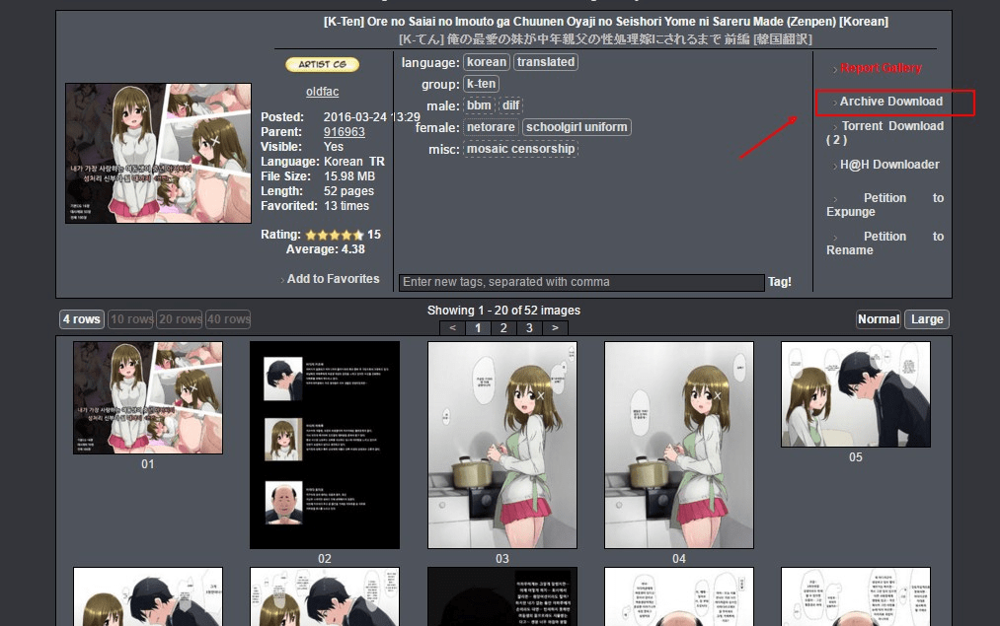

# 大家如果想从E-hentai上拖本子，都是怎么下的？

作者：harlanfred

TID：20820

<title>1</title> <link href="../Styles/Style.css" type="text/css" rel="stylesheet">

# 1

就是说，大家一般是下压缩文件（玩那个页游拿的钱）？还是下种子然后丢迅雷？还是用什么其他方法下本子？

我因为是苹果本，所以基本没什么下种子的方法。。。而那个页游玩起来太吃力了。。。

其他方法的话，之前一直在用E-Hentai Downloader的TamperMonkey脚本。但是最近越来越经常出现一个现象，就是下一个本子经常就1-2页没速度，而明明这些页面是可以在浏览器里打开的。。。

总之最近感觉越来越痛苦。。。已经好久没在E站上顺利的看到本子了。。。 <title>2</title> <link href="../Styles/Style.css" type="text/css" rel="stylesheet">

# 2

换回win系统岂不是更好？
<title>3</title> <link href="../Styles/Style.css" type="text/css" rel="stylesheet">

# 3

點進圖片後按右鍵不就好了..
全抓完就一本啊@@ <title>4</title> <link href="../Styles/Style.css" type="text/css" rel="stylesheet">

# 4

ex的话右键一页一页拖下来，种子的速度简直是慢得不行。 <title>5</title> <link href="../Styles/Style.css" type="text/css" rel="stylesheet">

# 5

直接看就行了。。。。为啥搞那么麻烦。。。 <title>6</title> <link href="../Styles/Style.css" type="text/css" rel="stylesheet">

# 6

谁说苹果本不能拖种子了....
[http://mac.xunlei.com/](http://mac.xunlei.com/) <title>7</title> <link href="../Styles/Style.css" type="text/css" rel="stylesheet">

# 7

用Android手机上的EhViewer下载 <title>8</title> <link href="../Styles/Style.css" type="text/css" rel="stylesheet">

# 8

其实我也很想知道 最近不知道为什么一直进不去 <title>9</title> <link href="../Styles/Style.css" type="text/css" rel="stylesheet">

# 9

<ignore_js_op>

**99999.jpg** *(139.04 KB, 下載次數: 0)*

[下載附件](forum.php?mod=attachment&aid=NjAzMDN8YTMwYWZhNjh8MTY3NDA2ODA0M3wxODIzMHwyMDgyMA%3D%3D&nothumb=yes)

2016-3-25 01:11 上傳

只要有E變態分數的話，就可以下載了
分數獲得法
1.每天上線拿1000多點
2.上傳一篇漫畫，就能拿到好幾萬點
<title>10</title> <link href="../Styles/Style.css" type="text/css" rel="stylesheet">

# 10

我是用種子下載的
不過不嫌麻煩的話可以逐張圖片下載的 <title>11</title> <link href="../Styles/Style.css" type="text/css" rel="stylesheet">

# 11

直接一页一页拖下来~话说最近都连Hantai表网都上不去了 <title>12</title> <link href="../Styles/Style.css" type="text/css" rel="stylesheet">

# 12

> [泡面 發表於 2016-3-24 22:52](https://giantessnight.cf/gnforum2012/forum.php?mod=redirect&goto=findpost&pid=288254&ptid=20820)
> 谁说苹果本不能拖种子了....
> http://mac.xunlei.com/

嗯，试过了，感觉意外的用着很不爽。。。
<title>13</title> <link href="../Styles/Style.css" type="text/css" rel="stylesheet">

# 13

不能用种子就只能一张一张右键了 <title>14</title> <link href="../Styles/Style.css" type="text/css" rel="stylesheet">

# 14

资源抓取脚本...开赛风表示飞快</ignore_js_op>