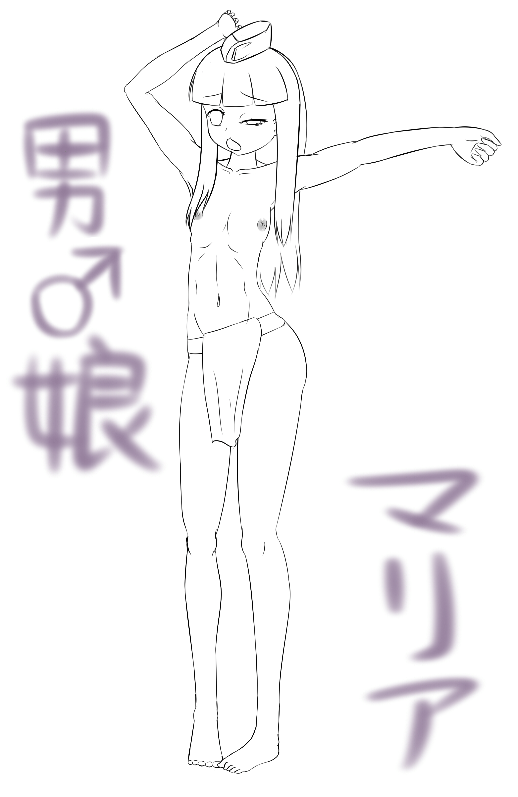

# 大家對於幾倍的女巨人會麻木呢？

作者：马里酋长

TID：21269

<title>1</title> <link href="../Styles/Style.css" type="text/css" rel="stylesheet">

# 1

經偽科學研究顯示
人類對於難以想像的事物無法完整呈現於腦海中
尤其是數字過大的時候
例如錢，東西數目，大小，長度等等

例如說:這裡有1京美元 我已經是無法想像那個量

越遠離自己的生活 越難以想像出來

而女巨人的大小也是有極限的嗎?
我自己覺得
"相對"的大小超過10兆左右 就已經無法想像了
假如以我能具體看見的東西為例:太陽
而太陽系這個假想的範圍就已經有點難以想像了
所以說只要超過太陽的10兆倍之後
其實反而會因為無法想像而無感

有沒有人也有這樣的經驗呢?

喔對了 我最近開始放假了 可能預定放假期間
一天畫個1.2張不等
就可以頻繁的更新這邊的文章了

順便副上目前最新的一張圖
一樣是沒有麼關聯
單純只是最近一直看烏龍派出所
想畫一下而已
<ignore_js_op>

**麻里愛.jpg** *(1.21 MB, 下載次數: 0)*

[下載附件](forum.php?mod=attachment&aid=NjE4NzN8ZWNkYjJjYTh8MTY3NDA2NzI3OHwxODIzMHwyMTI2OQ%3D%3D&nothumb=yes)

2016-6-24 03:41 上傳

<title>2</title> <link href="../Styles/Style.css" type="text/css" rel="stylesheet">

# 2

1000倍是極限

再大就沒有感覺 <title>3</title> <link href="../Styles/Style.css" type="text/css" rel="stylesheet">

# 3

100万倍，大于此倍数以后任何形式的互动都将微乎其微。 <title>4</title> <link href="../Styles/Style.css" type="text/css" rel="stylesheet">

# 4

我也认为100万倍是与人互动的极限,不过在往上还可以和星球,和星系,和星系群团,乃至整个宇宙互动,不过里面的人应该不会有感觉(或者是没时间产生感觉)了 <title>5</title> <link href="../Styles/Style.css" type="text/css" rel="stylesheet">

# 5

没啊，完全没有（诶嘿？
对于喜欢场景感的人来说，应该没有那种感觉吧
（这个病重的家伙曾经设定过以宇宙为最小单位的逐步向上世界观 <title>6</title> <link href="../Styles/Style.css" type="text/css" rel="stylesheet">

# 6

这方面窝好像没有极限呢，别说什么星体级、星云级，超越宇宙超越空间甚至超越维度都吃得下，不如说越大越兴奋……

反过来，如果小于40M，顿时好感度-10086.

Giga是浪漫~
<ignore_js_op></ignore_js_op> **5090b325c553280f8644f900.jpg** *(236.1 KB, 下載次數: 0)*

[下載附件](forum.php?mod=attachment&aid=NjE4NzV8YWNjYTZkZTN8MTY3NDA2NzI3OHwxODIzMHwyMTI2OQ%3D%3D&nothumb=yes)

2016-6-24 11:47 上傳 
<title>7</title> <link href="../Styles/Style.css" type="text/css" rel="stylesheet">

# 7

我在女巨人眼里小于1毫米就没兴趣 这样根本没法互动
纯粹就跟怪兽没什么差了 <title>8</title> <link href="../Styles/Style.css" type="text/css" rel="stylesheet">

# 8

*本帖最後由 Lemones 於 2016-6-24 14:23 編輯*

手指掐栋楼，脚缝藏城市
玉唇衔岛屿，阴蒂置九洲
乳头碰地球，乳腺吸人世
阴道吞银河，菊洞灌宇宙
大于MEGA级，老朽才接受 <title>9</title> <link href="../Styles/Style.css" type="text/css" rel="stylesheet">

# 9

无法互动便无感的程度吧。
<title>10</title> <link href="../Styles/Style.css" type="text/css" rel="stylesheet">

# 10

表示只有大到没有东西可以比了才没有感觉 <title>11</title> <link href="../Styles/Style.css" type="text/css" rel="stylesheet">

# 11

几倍不清楚，大概是正好能把小人当做自x棒的程度。 <title>12</title> <link href="../Styles/Style.css" type="text/css" rel="stylesheet">

# 12

去d战看看，很多都是次元级别的互动 <title>13</title> <link href="../Styles/Style.css" type="text/css" rel="stylesheet">

# 13

个人觉得…三厘米差太多了… <title>14</title> <link href="../Styles/Style.css" type="text/css" rel="stylesheet">

# 14

> [52gtss 發表於 2016-6-24 18:24](https://giantessnight.cf/gnforum2012/forum.php?mod=redirect&goto=findpost&pid=297476&ptid=21269)
> 去d战看看，很多都是次元级别的互动

额……d站是什么？
<title>15</title> <link href="../Styles/Style.css" type="text/css" rel="stylesheet">

# 15

感觉无法互动就没什么感觉了 <title>16</title> <link href="../Styles/Style.css" type="text/css" rel="stylesheet">

# 16

反倒认为越大越兴奋的我是没就了么。。 <title>17</title> <link href="../Styles/Style.css" type="text/css" rel="stylesheet">

# 17

50倍吧，太大了感觉不科学，毕竟比细胞还小什么的……┌( ´_ゝ` )┐ <title>18</title> <link href="../Styles/Style.css" type="text/css" rel="stylesheet">

# 18

當整個銀河系能像蟲子依樣輕易抹去的時候 <title>19</title> <link href="../Styles/Style.css" type="text/css" rel="stylesheet">

# 19

我是会对着细胞核撸的人 <title>20</title> <link href="../Styles/Style.css" type="text/css" rel="stylesheet">

# 20

沒得比就無感了。

沒得比究竟有多大?這個就是哲學的範圍了呢嗯嗯... <title>21</title> <link href="../Styles/Style.css" type="text/css" rel="stylesheet">

# 21

一般来说细胞级就没什么感觉了吧 <title>22</title> <link href="../Styles/Style.css" type="text/css" rel="stylesheet">

# 22

看不清脸开始就应该无感了吧…毕竟要知道对方是谁呀 <title>23</title> <link href="../Styles/Style.css" type="text/css" rel="stylesheet">

# 23

100倍。。。不然就太大了 <title>24</title> <link href="../Styles/Style.css" type="text/css" rel="stylesheet">

# 24

越大越好，没有上线，越大越有感觉 <title>25</title> <link href="../Styles/Style.css" type="text/css" rel="stylesheet">

# 25

星系级别吧     看不见       <title>26</title> <link href="../Styles/Style.css" type="text/css" rel="stylesheet">

# 26

喜欢缩小系的，缩小到1mm以下就无感了。 <title>27</title> <link href="../Styles/Style.css" type="text/css" rel="stylesheet">

# 27

麻木倒说不上，只是有时候看到细菌级或者星系级，会想到“后续剧情该怎么展开阿”。与其说麻木，不如说新鲜吧 <title>28</title> <link href="../Styles/Style.css" type="text/css" rel="stylesheet">

# 28

如果大到看其他人都如同看蚂蚁，那就没有意思了。。。。。 <title>29</title> <link href="../Styles/Style.css" type="text/css" rel="stylesheet">

# 29

既然故事是虛構的,女巨人的視力也能看到極微小的東西,200公里女巨人,能看到手上普通人身上的汗毛,
極少食物,即能生存,甚至不必食物,女巨人吃人純粹為她的支配慾,
女巨人都可以有心靈感應能力,可以知道人的心思,也可以傳達她的心思給我們,在互動上沒有音速330m/s的障礙 <title>30</title> <link href="../Styles/Style.css" type="text/css" rel="stylesheet">

# 30

應該是...1000倍左右吧.. <title>31</title> <link href="../Styles/Style.css" type="text/css" rel="stylesheet">

# 31

对小于十倍的会麻木
大的话,无上限 <title>32</title> <link href="../Styles/Style.css" type="text/css" rel="stylesheet">

# 32

对千米及以上的基本会麻木，因为不是很好想象。。。。。 <title>33</title> <link href="../Styles/Style.css" type="text/css" rel="stylesheet">

# 33

感觉对象好看就行了，个人喜好是大于10000倍。我觉得单向互动也是可以的，当然双向或多向互动会更好些。最好在被缩得太小时，如100万分之一或更小时，可以有些像瞬移机之类的装备，不然很难探索完整个女巨人。而去不到所有想去的地方会感到很无奈，得不到满足。 <title>34</title> <link href="../Styles/Style.css" type="text/css" rel="stylesheet">

# 34

没有上限，只要大于40M就行 <title>35</title> <link href="../Styles/Style.css" type="text/css" rel="stylesheet">

# 35

我是千分之一是极限，再大互动就没意思了 <title>36</title> <link href="../Styles/Style.css" type="text/css" rel="stylesheet">

# 36

giga以上就莫名的想引入gt……啊啊啊不能这么重口啊！(躺 <title>37</title> <link href="../Styles/Style.css" type="text/css" rel="stylesheet">

# 37

越大越兴奋，100万倍起底 <title>38</title> <link href="../Styles/Style.css" type="text/css" rel="stylesheet">

# 38

我樣覺得小人小到看不見或是迷你巨大娘那種會沒感覺吧
但是微米級的那種有特別放大的話就沒差
沒放大
在畫面上又看不到的話根本不知道在哪
多少要標示一下
其他就沒差了
我覺得GTS尺寸是相對性的
普通大小要跟小人比
太大要跟房子比
如果是縮小可能就要找物品做比較
可能鞋子或什麼 <title>39</title> <link href="../Styles/Style.css" type="text/css" rel="stylesheet">

# 39

大概是百亿以上就没感觉了 <title>40</title> <link href="../Styles/Style.css" type="text/css" rel="stylesheet">

# 40

那种一口吞下几个星系啊啥的就没感觉了 <title>41</title> <link href="../Styles/Style.css" type="text/css" rel="stylesheet">

# 41

大概到星系的时候无感，同时也对和小人城市互动到与星体互动之间无感 <title>42</title> <link href="../Styles/Style.css" type="text/css" rel="stylesheet">

# 42

只要向上望时看不清她的脸就让我无感了，也就是说相差超过10倍以上就不爱了。 <title>43</title> <link href="../Styles/Style.css" type="text/css" rel="stylesheet">

# 43

> [q67837474 發表於 2017-4-9 01:20](https://giantessnight.cf/gnforum2012/forum.php?mod=redirect&goto=findpost&pid=328833&ptid=21269)
> 这和大船上的蚂蚁一样，地球已经很大了 ，再大可怕只有破坏力极强的核武器，能和她互动了 ...

地球直徑約1萬3千公里,体比地球大的女人,就先假設17萬公里,氫彈破壞力約半徑10公里,
也只不過炸掉個毛孔大小,</ignore_js_op>