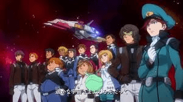
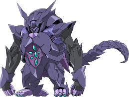

# 大家是否愿意在小妹的文章中客串一下？

作者：dirty

TID：12908

<title>1</title> <link href="../Styles/Style.css" type="text/css" rel="stylesheet">

# 1

天傲国角色
角色1 天傲国军队总指挥
角色2 天傲国星战总指挥
角色3 某媛媛女神主人
角色4 中立星战军总指挥
角色5 各种小兵...（有几个能创造奇迹留名文章）
-------------------------------------------------------------------------
帝国角色
角色1 帝国武士
角色2 帝国新军队总指挥
角色3 帝国“狼王”星际战舰军团总指挥
角色4 中立装甲军队总指挥
角色5 各种小兵...（纯属龙套...） <title>2</title> <link href="../Styles/Style.css" type="text/css" rel="stylesheet">

# 2

 至于媛媛姐姐的那个... 大家要悠着点...万一她老人家不高兴了 她的主人就有可能成为龙套了... <title>3</title> <link href="../Styles/Style.css" type="text/css" rel="stylesheet">

# 3

好吧 就按我的ID客串吧 士兵训练 1 2 3 4 正步走 1 2 3 4 <title>4</title> <link href="../Styles/Style.css" type="text/css" rel="stylesheet">

# 4

有沒有不是軍人的角色啊……打仗這玩意太可怕，我還是當平民好了…… <title>5</title> <link href="../Styles/Style.css" type="text/css" rel="stylesheet">

# 5

我报个名啊 给我客串个好不。名字就用我的ID吧。 <title>6</title> <link href="../Styles/Style.css" type="text/css" rel="stylesheet">

# 6

= = 那我就冒个险来客串一下 = =
爱娃
 <title>7</title> <link href="../Styles/Style.css" type="text/css" rel="stylesheet">

# 7

我也要！我的是小柯吧！
差点忘了要活的长……久最好了

[ *本帖最後由 kele5456 於 2012-7-27 17:28 編輯* ] <title>8</title> <link href="../Styles/Style.css" type="text/css" rel="stylesheet">

# 8

无所谓的路过····· <title>9</title> <link href="../Styles/Style.css" type="text/css" rel="stylesheet">

# 9

 让我让我！
我要当参谋总长！ <title>10</title> <link href="../Styles/Style.css" type="text/css" rel="stylesheet">

# 10

其实，我是一位演员
求盒饭 <title>11</title> <link href="../Styles/Style.css" type="text/css" rel="stylesheet">

# 11

其實我是來圍觀的，
啥，不讓圍觀？
嗯，那我走了（遁 <title>12</title> <link href="../Styles/Style.css" type="text/css" rel="stylesheet">

# 12

其实，我是尾行蛋白来的
求便当 <title>13</title> <link href="../Styles/Style.css" type="text/css" rel="stylesheet">

# 13

来来来，我来试试我的任意门，等会什么招演员我这是穿越到哪里了好机会啊 仔细看看角色再想想，唉算了我还是走吧，接着试任意门去 <title>14</title> <link href="../Styles/Style.css" type="text/css" rel="stylesheet">

# 14

嗯，求个不领盒饭的角色 <title>15</title> <link href="../Styles/Style.css" type="text/css" rel="stylesheet">

# 15

> 原帖由 *Eighteen* 於 2012-7-27 16:12 發表 
> 有沒有不是軍人的角色啊……打仗這玩意太可怕，我還是當平民好了……

戰爭時代，哪有不願當兵的平民?來，參軍!來，看!時代的眼淚!
<ignore_js_op>

**乂.jpg** *(9.79 KB, 下載次數: 0)*

[下載附件](forum.php?mod=attachment&aid=Mjk5MzN8ZjI0MTNlMTR8MTY3NDA2ODU0NnwxODIzMHwxMjkwOA%3D%3D&nothumb=yes)

2012-7-27 20:23 上傳

「不知道參軍能不能夠駕駛MS-8191 LINDA-GTS呢?」
Long-leg
Intelligent
Not-virtual-animated
Duel-capable
Android
GTS

「同學，乃駕駛的是............
<ignore_js_op>

**大.jpg** *(9.22 KB, 下載次數: 0)*

[下載附件](forum.php?mod=attachment&aid=Mjk5MzR8NTg1Y2IzZmV8MTY3NDA2ODU0NnwxODIzMHwxMjkwOA%3D%3D&nothumb=yes)

2012-7-27 20:23 上傳

。
以上。」

[ *本帖最後由 wtman 於 2012-7-27 20:25 編輯* ] <title>16</title> <link href="../Styles/Style.css" type="text/css" rel="stylesheet">

# 16

积极参与，望L导给个龙套角色~~ <title>17</title> <link href="../Styles/Style.css" type="text/css" rel="stylesheet">

# 17

积极参与，望L导给一个龙套角色，任何都可以啊~~ <title>18</title> <link href="../Styles/Style.css" type="text/css" rel="stylesheet">

# 18

求炮灰甲角色，死在某美丽女巨人乳沟中。
    如果能有互动戏份就更好啦~
    什么？还有一句台词？！
    什么？群众演员盒饭居然还加蛋？！ <title>19</title> <link href="../Styles/Style.css" type="text/css" rel="stylesheet">

# 19

路过。。纯给个活得久一点的提高知名度吧＝ ＝ <title>20</title> <link href="../Styles/Style.css" type="text/css" rel="stylesheet">

# 20

發現都是想多活一段時間的。。。。
嘛，我也可以客串一把。。。
嘛，不弱智的角色就行了。。。。。 <title>21</title> <link href="../Styles/Style.css" type="text/css" rel="stylesheet">

# 21

副指揮官一個！

話說真真有這麼多的便當可以發？ <title>22</title> <link href="../Styles/Style.css" type="text/css" rel="stylesheet">

# 22

 linda女神可否让贱奴我扮演 女神面前伺候的小人啊  求最后被美丽巨大的脚趾甲切成两半啊

小A就行了 叫我小A啊！！  女神！ <title>23</title> <link href="../Styles/Style.css" type="text/css" rel="stylesheet">

# 23

其实吧，我表示选什么目测都会被linda小妹妹发便当，鉴于本人比较喜欢挑战，就选天傲国角色3吧，是不是可以得到l导演和媛媛的两份盒饭？我不贪心的，盒饭不用加鸡腿了，加鸡蛋即可 <title>24</title> <link href="../Styles/Style.css" type="text/css" rel="stylesheet">

# 24

 大家要想好啊 帝国是二十世纪的日本鬼子... <title>25</title> <link href="../Styles/Style.css" type="text/css" rel="stylesheet">

# 25

 透露一下天傲是中国....另外军事和金融科技已经超过美国（美利坚帝国）五千世纪了... <title>26</title> <link href="../Styles/Style.css" type="text/css" rel="stylesheet">

# 26

这。。。
科技领先这么多，还有女神相助，帝国还玩个锤子
不过无所谓啦，gts类文章好像就没有双方实力对等过 <title>27</title> <link href="../Styles/Style.css" type="text/css" rel="stylesheet">

# 27

剧情，背景什么都无所谓了。
能出现在女神脚下已是鄙人毕生心愿~~
客串何等角色都可以，希望临死之前有些对话就好。
小J敬上~~ <title>28</title> <link href="../Styles/Style.css" type="text/css" rel="stylesheet">

# 28

让我当一个犯贱的虫子就好了，我小名是小宇 <title>29</title> <link href="../Styles/Style.css" type="text/css" rel="stylesheet">

# 29

自願當個剛插下死亡FLAG就立刻掛的路人
希望能早點看到啊 <title>30</title> <link href="../Styles/Style.css" type="text/css" rel="stylesheet">

# 30

話說一個超越了5000世紀的文明應該是Kardashev scale Type V文明了，還玩神馬戰爭 ??
戰爭雖然可以提升一個文明的科技，繼而增強它的生存能力，但是........不利於長期發展啊，看看爾等地球種族..........
吾人還是交上幾個人的名字當天傲小兵..........
1.影武者
2.boysgts
3.ken3552012
4.sy18sun

吾人還是當個圍觀的敲碗眾

還有，吾人發現一個問題，怎麼沒有天傲領導人和帝國大帝?難道天傲領導人=帝國大帝=linda大大?!兩個文明的戰爭只不過是一個90後少女因為日子苦悶而搞成的消閒娛樂而已?!
果然linda才是終極大魔王，最後會不會有 終極大魔王超巨大化flag?!

[ *本帖最後由 wtman 於 2012-7-28 19:43 編輯* ] <title>31</title> <link href="../Styles/Style.css" type="text/css" rel="stylesheet">

# 31

可以是可以，但如果不是足部和袜子PLAY不依啊，角色不重要重要的是内容 <title>32</title> <link href="../Styles/Style.css" type="text/css" rel="stylesheet">

# 32

求小龙套（不是说穿平民装留长发，一脸坚韧，犀利双眼的人就是主角的吗，这不科学） <title>33</title> <link href="../Styles/Style.css" type="text/css" rel="stylesheet">

# 33

= =!
Freelycat你这样会便当的⋯⋯ <title>34</title> <link href="../Styles/Style.css" type="text/css" rel="stylesheet">

# 34

我也报名！我要做主角！。。。。可以么？ <title>35</title> <link href="../Styles/Style.css" type="text/css" rel="stylesheet">

# 35

我我我，名字就叫纯默吧！谢谢姐姐啦！ <title>36</title> <link href="../Styles/Style.css" type="text/css" rel="stylesheet">

# 36

我也要，名字用我的ID，我希望被虐一次 <title>37</title> <link href="../Styles/Style.css" type="text/css" rel="stylesheet">

# 37

can i participate now? <title>38</title> <link href="../Styles/Style.css" type="text/css" rel="stylesheet">

# 38

有几个能创造奇迹留名文章

就他了，各種死了活，活了死~

 申請加入啦~四娃 <title>39</title> <link href="../Styles/Style.css" type="text/css" rel="stylesheet">

# 39

在你文里面悲剧了无数次的本人做出一个艰难的决定，我要逃出去！ <title>40</title> <link href="../Styles/Style.css" type="text/css" rel="stylesheet">

# 40

我也來報名吧
就算是當個打醬油的也沒所謂
就來客串一下 <title>41</title> <link href="../Styles/Style.css" type="text/css" rel="stylesheet">

# 41

我来当枪兵</ignore_js_op></ignore_js_op>