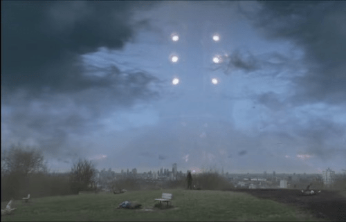

# 大家有看过漫威电影永恒族的吗

作者：freepenguin2

TID：33734

<title>1</title> <link href="../Styles/Style.css" type="text/css" rel="stylesheet">

# 1

圈里的文有的巨大娘是比星球还大的，但是我一直无法在脑中构想出站在地球上普通人的视角的景象。这个电影里最后的一个画面就是比地球还大的天神组成员近距离观向地球人类视角的画面，真的非常震撼。 <title>2</title> <link href="../Styles/Style.css" type="text/css" rel="stylesheet">

# 2

 <ignore_js_op>[IMG_20220723_035543.jpg](forum.php?mod=attachment&aid=OTc3ODl8NTIzMTQ5YzJ8MTY3NDA2NTQ4MXwxODIzMHwzMzczNA%3D%3D&nothumb=yes) *(21.56 KB, 下載次數: 0)*

[下載附件](forum.php?mod=attachment&aid=OTc3ODl8NTIzMTQ5YzJ8MTY3NDA2NTQ4MXwxODIzMHwzMzczNA%3D%3D&nothumb=yes)

2022-7-23 03:58 上傳  

</ignore_js_op> <title>3</title> <link href="../Styles/Style.css" type="text/css" rel="stylesheet">

# 3

强大的气流虽然吹开了云，但是因为还是隔着大气的缘故地球外的人像还是有些模糊。 <title>4</title> <link href="../Styles/Style.css" type="text/css" rel="stylesheet">

# 4

你永远可以相信认知屏障（划掉），但如果不查的话对这个篇完全没印象，回头酌情补一下 <title>5</title> <link href="../Styles/Style.css" type="text/css" rel="stylesheet">

# 5

但是不是巨大娘而是gt啊，还是有点无感，诶 <title>6</title> <link href="../Styles/Style.css" type="text/css" rel="stylesheet">

# 6

> freepenguin2 發表於 2022-7-23 10:49
> 但是不是巨大娘而是gt啊，还是有点无感，诶

嗯 不是gts画面，我想表达的是这种震撼的视角我之前想不出来。 <title>7</title> <link href="../Styles/Style.css" type="text/css" rel="stylesheet">

# 7

> [触碰不到的笑 發表於 2022-7-23 17:51](https://giantessnight.cf/gnforum2012/forum.php?mod=redirect&goto=findpost&pid=510247&ptid=33734)
> 嗯 不是gts画面，我想表达的是这种震撼的视角我之前想不出来。

有一说一，可能我一下说不出来，但感觉这种星球级别的怪物啊，一般都是gt向的。像什么黑衣人，西游降魔篇，全都是gt，而且大的不可理喻。就是感觉高质量gt挺多，但没有同级的gts而已吧..
<title>8</title> <link href="../Styles/Style.css" type="text/css" rel="stylesheet">

# 8

> freepenguin2 發表於 2022-7-23 20:33
> 有一说一，可能我一下说不出来，但感觉这种星球级别的怪物啊，一般都是gt向的。像什么黑衣人，西游降魔篇 ...

是的，就是这样！就仿佛各种影视创造者有意避开女巨人这个元素一样。 我想应该是女巨人真的很色吧，影响不好。 <title>9</title> <link href="../Styles/Style.css" type="text/css" rel="stylesheet">

# 9

讲一句在更早的银河护卫队中星爵他妈就被星球艹了，并且根据剧情介绍他爸什么种族都有过一夜情想夸张点这格局不就打开了。 <title>10</title> <link href="../Styles/Style.css" type="text/css" rel="stylesheet">

# 10

> [触碰不到的笑 發表於 2022-7-23 21:08](https://giantessnight.cf/gnforum2012/forum.php?mod=redirect&goto=findpost&pid=510268&ptid=33734)
> 是的，就是这样！就仿佛各种影视创造者有意避开女巨人这个元素一样。 我想应该是女巨人真的很色吧，影响 ...

一应该是最基本的，就是最大正派和反派都是男的，这种超巨大化基本就是这两种人了，所以 就不太可能有gts。其次吧，确实是涩，大了就什么都大了，怕不是不想让gn会员骤增一百万（doge）
<title>11</title> <link href="../Styles/Style.css" type="text/css" rel="stylesheet">

# 11

> freepenguin2 發表於 2022-7-24 07:35
> 一应该是最基本的，就是最大正派和反派都是男的，这种超巨大化基本就是这两种人了，所以 就不太可能有gts ...

gn我没接触过，gn圈里也大多都是男的吗？ 有些不可理喻。 <title>12</title> <link href="../Styles/Style.css" type="text/css" rel="stylesheet">

# 12

> [触碰不到的笑 發表於 2022-7-24 19:39](https://giantessnight.cf/gnforum2012/forum.php?mod=redirect&goto=findpost&pid=510348&ptid=33734)
> gn我没接触过，gn圈里也大多都是男的吗？ 有些不可理喻。

我是真的笑飞了哥，你去查查gn是什么（捂脸）。我觉得gn很好理解的哈哈
<title>13</title> <link href="../Styles/Style.css" type="text/css" rel="stylesheet">

# 13

> freepenguin2 發表於 2022-7-25 06:57
> 我是真的笑飞了哥，你去查查gn是什么（捂脸）。我觉得gn很好理解的哈哈
> ...

啊 我和那个gt搞混了。另外gn是什么？ 百度了一下，没看见正经解释的。但是能知道类似于变态或者SM差不多？ <title>14</title> <link href="../Styles/Style.css" type="text/css" rel="stylesheet">

# 14

> [触碰不到的笑 發表於 2022-7-25 20:37](https://giantessnight.cf/gnforum2012/forum.php?mod=redirect&goto=findpost&pid=510455&ptid=33734)
> 啊 我和那个gt搞混了。另外gn是什么？ 百度了一下，没看见正经解释的。但是能知道类似于变态或者SM差不多 ...

gn就是giantessnight，论坛本身啊。哈哈。咱俩聊天氵了好几次了经验了，针不戳（doge）
<title>15</title> <link href="../Styles/Style.css" type="text/css" rel="stylesheet">

# 15

> freepenguin2 發表於 2022-7-25 21:50
> gn就是giantessnight，论坛本身啊。哈哈。咱俩聊天氵了好几次了经验了，针不戳（doge）
> ...

在圈外gn有别的意思的，我看到过好几次了。比如：“gn收收味”。我第一次看见时还惊了一下，以为gts圈子相关的内容。刚才仔细的查了一下，是这样的：gn是 国男 的拼音缩写，指我们国家的男性，这是个贬义词。这个词源于b站上女权对反女权的男性的称呼。
另外我才1千多积分，非常喜欢一本正经的闲聊。＃滑稽＃ <title>16</title> <link href="../Styles/Style.css" type="text/css" rel="stylesheet">

# 16

> [触碰不到的笑 發表於 2022-7-26 02:01](https://giantessnight.cf/gnforum2012/forum.php?mod=redirect&goto=findpost&pid=510493&ptid=33734)
> 在圈外gn有别的意思的，我看到过好几次了。比如：“gn收收味”。我第一次看见时还惊了一下，以为gts圈子 ...

原来如此，主要是GN我以为已经是耳熟能详的两个首字母组合了。至于简写嘛，肯定有一堆可选择意思，郭楠，倒真像那么回事。然后，一直氵经验其实不好吧（雾）。唉，我16年进的网，断断续续玩了几年，后面退坑（只是退论坛，不是gts坑），应该是因为被墙了，然后等到至于再回来，活跃的时候，回复一次只有15经验了...之前明明是五十的。如果按之前的加分标准，我都高级会员了..唉，时不待我。
<title>17</title> <link href="../Styles/Style.css" type="text/css" rel="stylesheet">

# 17

不知道现在还有没有星空观测的题目…就是那种给你在某一时刻抬头看天星空的样子，让你选出这个时刻各个天体的相对位置是怎么样的题目，或者是给相对位置选择观测到的星空。这种题目做得好应该还是能够想象得出来的吧…实在不行也可以用各种渲染软件模拟一下，构造一个球，在球表面塞上一台摄像机，球边上放个下载下来的人模，让摄像机对着人模拍，渲染出来的图片就差不多是这样的效果。