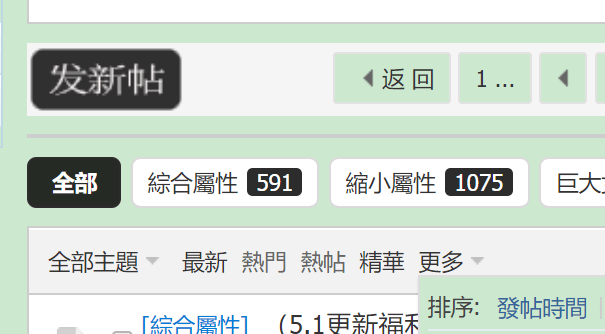

# 大家知道怎么在文章区直接搜索精品文章吗

作者：触碰不到的笑

TID：32653

<title>1</title> <link href="../Styles/Style.css" type="text/css" rel="stylesheet">

# 1

就是只浏览精品文章，有这个功能吗？对了。也请推荐我一些缩小城市文，谢谢。 <title>2</title> <link href="../Styles/Style.css" type="text/css" rel="stylesheet">

# 2

缩小城市的文像是漂流城市以及同人作钝角还有表白这些的比较经典 <title>3</title> <link href="../Styles/Style.css" type="text/css" rel="stylesheet">

# 3

<ignore_js_op>

**QQ截图20220214214137.png** *(38.76 KB, 下載次數: 0)*

[下載附件](forum.php?mod=attachment&aid=OTM4NTN8ZTcwYTM4OTJ8MTY3NDA2NTYzMHwxODIzMHwzMjY1Mw%3D%3D&nothumb=yes)

2022-2-14 21:41 上傳

“精華”然後“更多”按“發帖時間”排序
<title>4</title> <link href="../Styles/Style.css" type="text/css" rel="stylesheet">

# 4

> eventually 發表於 2022-2-14 21:42
> “精華”然後“更多”按“發帖時間”排序

草，我一直都没有注意这个按钮，还想设精华的意义在哪…… <title>5</title> <link href="../Styles/Style.css" type="text/css" rel="stylesheet">

# 5

> eventually 發表於 2022-2-14 21:42
> “精華”然後“更多”按“發帖時間”排序

咱们俩的界面完全不一样啊。。 是浏览器的原因还是我论坛登记低显示的不一样啊  我用的是手机端谷歌浏览器 <title>6</title> <link href="../Styles/Style.css" type="text/css" rel="stylesheet">

# 6

 <ignore_js_op>[Screenshot_2022-02-25-03-15-22-653_com.android.chrome.jpg](forum.php?mod=attachment&aid=OTQwNDF8ZjFjMjY4ZjF8MTY3NDA2NTYzMHwxODIzMHwzMjY1Mw%3D%3D&nothumb=yes) *(47.93 KB, 下載次數: 0)*

[下載附件](forum.php?mod=attachment&aid=OTQwNDF8ZjFjMjY4ZjF8MTY3NDA2NTYzMHwxODIzMHwzMjY1Mw%3D%3D&nothumb=yes)

2022-2-25 03:15 上傳  

</ignore_js_op> <title>7</title> <link href="../Styles/Style.css" type="text/css" rel="stylesheet">

# 7

> [触碰不到的笑 發表於 2022-2-25 03:16](https://giantessnight.cf/gnforum2012/forum.php?mod=redirect&goto=findpost&pid=495809&ptid=32653)
> 咱们俩的界面完全不一样啊。。 是浏览器的原因还是我论坛登记低显示的不一样啊  我用的是手机端谷歌浏览 ...

用电脑登录gn就是那个界面了，用手机的话想看到那个功能完整的界面可以拉到界面最下点击电脑版，或开启手机浏览器的电脑模式</ignore_js_op>