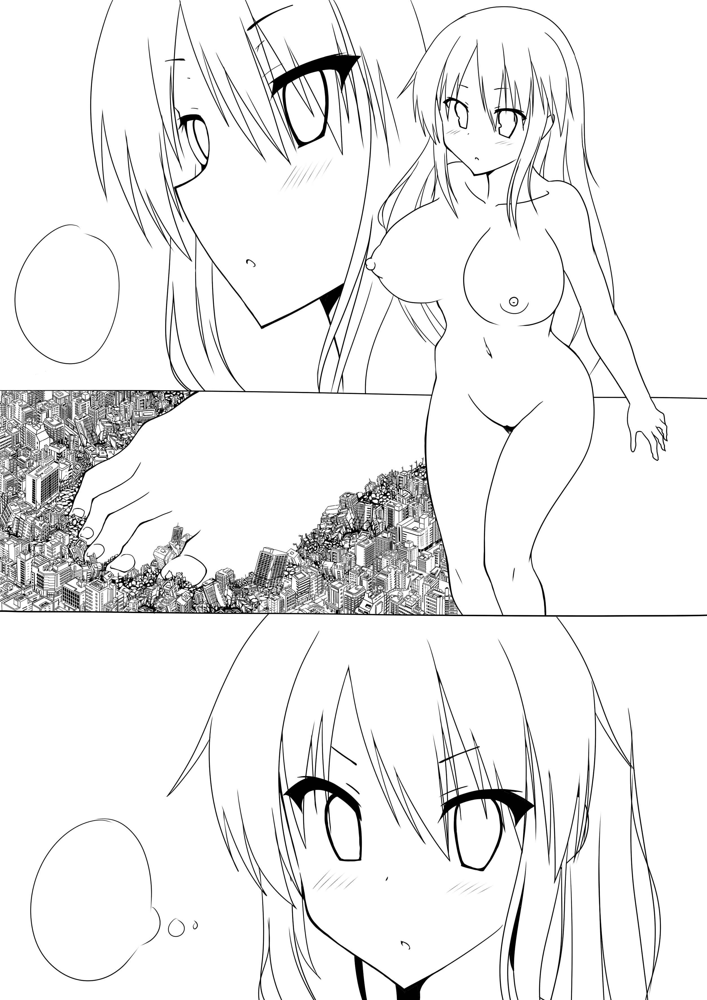

# 大家都喜欢多少倍的巨大女

作者：hzy431227

TID：20479

<title>1</title> <link href="../Styles/Style.css" type="text/css" rel="stylesheet">

# 1

我喜欢百倍以下的巨女，想写个体格差的文章，但又作文水平低下，好纠结。 <title>2</title> <link href="../Styles/Style.css" type="text/css" rel="stylesheet">

# 2

我和楼主的口味一样，不过我喜欢growth的 <title>3</title> <link href="../Styles/Style.css" type="text/css" rel="stylesheet">

# 3

倍數不是問題
只要有萌的溫柔系GTS就好
<title>4</title> <link href="../Styles/Style.css" type="text/css" rel="stylesheet">

# 4

這種size不錯

<ignore_js_op>

**momimomi-Twitterにあげてた落書き.jpg** *(657.57 KB, 下載次數: 0)*

[下載附件](forum.php?mod=attachment&aid=NTg4NzJ8YmRmZjNlMmN8MTY3NDA2ODAzNHwxODIzMHwyMDQ3OQ%3D%3D&nothumb=yes)

2016-1-25 21:29 上傳

<title>5</title> <link href="../Styles/Style.css" type="text/css" rel="stylesheet">

# 5

size太大没法互动弄一下就死了木有看点，最好还是百倍差，千倍也行 <title>6</title> <link href="../Styles/Style.css" type="text/css" rel="stylesheet">

# 6

个人来说倒是不喜欢太大的 大概是一个玩偶比一个正常人大小就差不多（妹子正常人大小） <title>7</title> <link href="../Styles/Style.css" type="text/css" rel="stylesheet">

# 7

我覺得是20~100倍之間
大小大概是按摩棒和跳蛋之間
剛好可以被玩弄
可以很自然地放在體內 <title>8</title> <link href="../Styles/Style.css" type="text/css" rel="stylesheet">

# 8

我感觉如果女主太大了就会察觉不到男主的存在，就不会有所谓的互动。 <title>9</title> <link href="../Styles/Style.css" type="text/css" rel="stylesheet">

# 9

> [nijack89 發表於 2016-1-25 21:27](https://giantessnight.cf/gnforum2012/forum.php?mod=redirect&goto=findpost&pid=281263&ptid=20479)
> 倍數不是問題
> 只要有萌的溫柔系GTS就好

倍数太大的话，小人们怎么去感受巨女的萌和温柔？

<title>10</title> <link href="../Styles/Style.css" type="text/css" rel="stylesheet">

# 10

> [kuso魚 發表於 2016-1-25 21:48](https://giantessnight.cf/gnforum2012/forum.php?mod=redirect&goto=findpost&pid=281276&ptid=20479)
> 我覺得是20~100倍之間
> 大小大概是按摩棒和跳蛋之間
> 剛好可以被玩弄

跟我的想法差不多，总有一种色色的念头跳出来！
<title>11</title> <link href="../Styles/Style.css" type="text/css" rel="stylesheet">

# 11

参见这两个投票帖子：

GTS体形大小喜好大调查
[http://giantessnight.com/gnforum ... thread&tid=2668](http://giantessnight.com/gnforum2012/forum.php?mod=viewthread&tid=2668)

是否喜欢并接受“无意识”互动的投票
[http://giantessnight.com/gnforum ... hread&tid=13258](http://giantessnight.com/gnforum2012/forum.php?mod=viewthread&tid=13258) <title>12</title> <link href="../Styles/Style.css" type="text/css" rel="stylesheet">

# 12

> [srx00000 發表於 2016-1-25 21:29](https://giantessnight.cf/gnforum2012/forum.php?mod=redirect&goto=findpost&pid=281264&ptid=20479)
> 這種size不錯

图片出处是twitter ？求链接，是制作中的漫画吗？
<title>13</title> <link href="../Styles/Style.css" type="text/css" rel="stylesheet">

# 13

大概百倍十 或幾十倍的
在她們眼中 我們是十公分或一公分多的存在 被當成寵物 玩具養著什麼的最棒了
<title>14</title> <link href="../Styles/Style.css" type="text/css" rel="stylesheet">

# 14

喜欢growth  当然是越长越大的那种有感觉 最后是GIGA级~~@！ <title>15</title> <link href="../Styles/Style.css" type="text/css" rel="stylesheet">

# 15

1V1的话、1000倍左右、
有城市的话、比较喜欢10万倍的、 <title>16</title> <link href="../Styles/Style.css" type="text/css" rel="stylesheet">

# 16

果然是喜欢GROWTH系的那种啦【10-1000】
太大的话变成女神就高大上了啦qwq <title>17</title> <link href="../Styles/Style.css" type="text/css" rel="stylesheet">

# 17

传说中的自动震动器的SIZE？？？？？ <title>18</title> <link href="../Styles/Style.css" type="text/css" rel="stylesheet">

# 18

对百倍以下不是很感兴趣 或许比起互动 无意识更适合 感觉GIGA挺好的…… <title>19</title> <link href="../Styles/Style.css" type="text/css" rel="stylesheet">

# 19

还是比较喜欢giga，不过一千倍也是非常好的啦 <title>20</title> <link href="../Styles/Style.css" type="text/css" rel="stylesheet">

# 20

*本帖最後由 lawajej 於 2016-1-26 04:27 編輯*

太大的那种跟地球一样的就没感觉啦！太大了，怎么去玩呢对吧！
<title>21</title> <link href="../Styles/Style.css" type="text/css" rel="stylesheet">

# 21

。。。。千倍Σ( ° △ °|||)︴ <title>22</title> <link href="../Styles/Style.css" type="text/css" rel="stylesheet">

# 22

> sjh2892241 發表於 2016-1-25 22:19
> 倍数太大的话，小人们怎么去感受巨女的萌和温柔？

把整个城市放在掌心，享受女神爱抚
想想都很带感 <title>23</title> <link href="../Styles/Style.css" type="text/css" rel="stylesheet">

# 23

> [xnr 發表於 2016-1-25 22:50](https://giantessnight.cf/gnforum2012/forum.php?mod=redirect&goto=findpost&pid=281287&ptid=20479)
> 图片出处是twitter ？求链接，是制作中的漫画吗？

GS上的END的作品,当然最先发的似乎是推特
[http://gs-uploader.jpn.org/upld-index.php?uname=end](http://gs-uploader.jpn.org/upld-index.php?uname=end)

<title>24</title> <link href="../Styles/Style.css" type="text/css" rel="stylesheet">

# 24

总的来说越大越好
不能小于30倍 <title>25</title> <link href="../Styles/Style.css" type="text/css" rel="stylesheet">

# 25

蚂蚁的大小，正好塞进脚趾缝 <title>26</title> <link href="../Styles/Style.css" type="text/css" rel="stylesheet">

# 26

個人偏好三到十倍左右的大小
可以卿卿我我的感覺最棒了

不過像縮小O園那種，一百倍左右的差距

令人絕望的無力感也很吸引我

(雖然是為了劇情需要，但一個「偵探」能「擊退」比自己大上一百倍的女巨人還是讓我覺得很奇怪)

一千倍的尺寸應該是我所能接受的最大極限

比方說像[巨大娘専用高等学校](http://gs-uploader.jpn.org/upld-view-document.php?file=/documents/hearthiel/kyogaku.htm&dl=Got9ddrenvg&t=1438227047&c=1426360910&r=1f)

再往上的就沒有任何感覺了

<title>27</title> <link href="../Styles/Style.css" type="text/css" rel="stylesheet">

# 27

太大了也不好，像是动不动捏爆耻球的，不过说到底还是看画得怎么样，本来我也是接受不了一脚十几个楼房的比例的，直到火山杨改变了我的看法... <title>28</title> <link href="../Styles/Style.css" type="text/css" rel="stylesheet">

# 28

温柔系我喜欢100～1000，破坏系我喜欢10万倍，无意识没怎么看过 <title>29</title> <link href="../Styles/Style.css" type="text/css" rel="stylesheet">

# 29

越大越好，10万倍起步，往上基本都能接受。 <title>30</title> <link href="../Styles/Style.css" type="text/css" rel="stylesheet">

# 30

太大或太小的都很無感
最好是小人能到巨大女的腳踝的大小 <title>31</title> <link href="../Styles/Style.css" type="text/css" rel="stylesheet">

# 31

> [xnr 發表於 2016-1-25 22:50](https://giantessnight.cf/gnforum2012/forum.php?mod=redirect&goto=findpost&pid=281287&ptid=20479)
> 图片出处是twitter ？求链接，是制作中的漫画吗？

图片出自gs-uploader，作者是えどわーど
<title>32</title> <link href="../Styles/Style.css" type="text/css" rel="stylesheet">

# 32

比較喜歡大一點的倍率
太小了會沒感覺 <title>33</title> <link href="../Styles/Style.css" type="text/css" rel="stylesheet">

# 33

10-15倍吧，本人喜欢吞食，这个大小可以被女巨人的胃部紧紧包裹着挤压和消化 <title>34</title> <link href="../Styles/Style.css" type="text/css" rel="stylesheet">

# 34

30倍吧，就是奧特曼的size，太大就沒有互動 <title>35</title> <link href="../Styles/Style.css" type="text/css" rel="stylesheet">

# 35

....我好像不是很挑，而且我还挺喜欢阶段缩小的
10倍的可以互动多点
50倍以上基本没法互动了（当然可以靠脑补优化，就像文章里一样4,5厘米还各种互动不死，现实不可能就是了）
最大的话，1000吧，互动就别想了，纯靠场景剧了233

再往上，看文章或者MMD什么的还可以，让我去想象，有点缺乏实感
<title>36</title> <link href="../Styles/Style.css" type="text/css" rel="stylesheet">

# 36

giga赛高，但是宇宙级别的就算了吧 <title>37</title> <link href="../Styles/Style.css" type="text/css" rel="stylesheet">

# 37

不知道，反正这设定上对方比自身要大是肯定的 <title>38</title> <link href="../Styles/Style.css" type="text/css" rel="stylesheet">

# 38

> [a031997 發表於 2016-1-28 04:06](https://giantessnight.cf/gnforum2012/forum.php?mod=redirect&goto=findpost&pid=281544&ptid=20479)
> giga赛高，但是宇宙级别的就算了吧

是啊，宇宙级的都是天体，我等凡人怎么能看出来是巨大女呢。
<title>39</title> <link href="../Styles/Style.css" type="text/css" rel="stylesheet">

# 39

> [a1b1c1d1 發表於 2016-1-28 02:00](https://giantessnight.cf/gnforum2012/forum.php?mod=redirect&goto=findpost&pid=281540&ptid=20479)
> 30倍吧，就是奧特曼的size，太大就沒有互動

看来都喜欢互动啊，毕竟巨大女对应的是小人。
<title>40</title> <link href="../Styles/Style.css" type="text/css" rel="stylesheet">

# 40

> [michael 發表於 2016-1-28 02:25](https://giantessnight.cf/gnforum2012/forum.php?mod=redirect&goto=findpost&pid=281541&ptid=20479)
> ....我好像不是很挑，而且我还挺喜欢阶段缩小的
> 10倍的可以互动多点
> 50倍以上基本没法互动了（当然可以靠脑 ...

如果小人的身体强化了是可以互动的。
<title>41</title> <link href="../Styles/Style.css" type="text/css" rel="stylesheet">

# 41

我就喜欢非常大的，很有feel啊 <title>42</title> <link href="../Styles/Style.css" type="text/css" rel="stylesheet">

# 42

当然是mini啊啊啊啊啊啊 2倍到5倍最好了!!! <title>43</title> <link href="../Styles/Style.css" type="text/css" rel="stylesheet">

# 43

20-30吧...                   <title>44</title> <link href="../Styles/Style.css" type="text/css" rel="stylesheet">

# 44

100
每次都是以100开始想的 <title>45</title> <link href="../Styles/Style.css" type="text/css" rel="stylesheet">

# 45

100
+1
但最好能控制大小
大小控制其實不好拿捏
也說不太準 <title>46</title> <link href="../Styles/Style.css" type="text/css" rel="stylesheet">

# 46

20倍左右最好了，要比脚小那么一点，比舌头大那么一点 <title>47</title> <link href="../Styles/Style.css" type="text/css" rel="stylesheet">

# 47

20~100倍大小，严重同意，差距太大就没意思了 <title>48</title> <link href="../Styles/Style.css" type="text/css" rel="stylesheet">

# 48

20~100倍大小，严重同意，差距太大就没意思了 <title>49</title> <link href="../Styles/Style.css" type="text/css" rel="stylesheet">

# 49

能恰好塞进去的大小，太大了没意思 <title>50</title> <link href="../Styles/Style.css" type="text/css" rel="stylesheet">

# 50

只要够萌，最好是温柔系的。然后当然是越大越好了。当然最小怎么也得有个几十倍吧，小点了个人感觉真心无爱 <title>51</title> <link href="../Styles/Style.css" type="text/css" rel="stylesheet">

# 51

1.5~10倍   我喜欢mini系。。。。。。。 <title>52</title> <link href="../Styles/Style.css" type="text/css" rel="stylesheet">

# 52

而且我喜欢 growth  就像GTS artists  从1.5倍开始长到3倍 <title>53</title> <link href="../Styles/Style.css" type="text/css" rel="stylesheet">

# 53

感觉男的缩小会好一点，保留互动的最佳体型是十倍吧。 <title>54</title> <link href="../Styles/Style.css" type="text/css" rel="stylesheet">

# 54

千倍差距，micro最爱，那种无力感，啧啧啧 <title>55</title> <link href="../Styles/Style.css" type="text/css" rel="stylesheet">

# 55

二十倍左右的吧。。。
互动好而且足够小。。。 <title>56</title> <link href="../Styles/Style.css" type="text/css" rel="stylesheet">

# 56

公里级别到无限，不然没感觉 <title>57</title> <link href="../Styles/Style.css" type="text/css" rel="stylesheet">

# 57

100左右   超大系的也喜欢               <title>58</title> <link href="../Styles/Style.css" type="text/css" rel="stylesheet">

# 58

…很难回答啊…只要是1000倍以上都行 <title>59</title> <link href="../Styles/Style.css" type="text/css" rel="stylesheet">

# 59

迷你+growth吧，其实lz可以多看看文章，有很大帮助的</ignore_js_op>