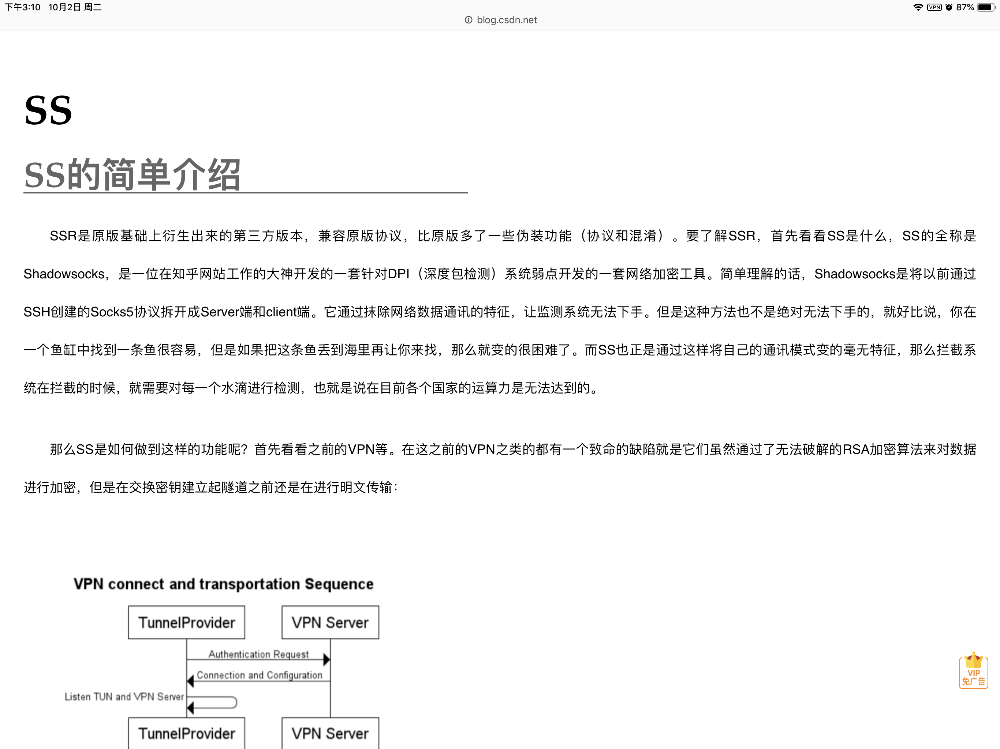

# 大家都用的什么VPN啊

作者：franky

TID：25916

<title>1</title> <link href="../Styles/Style.css" type="text/css" rel="stylesheet">

# 1

ios，找不到好用的VPN很苦恼
另外论坛越来越不活跃了也是因为被墙吗… <title>2</title> <link href="../Styles/Style.css" type="text/css" rel="stylesheet">

# 2

其实网比较好的话 换DNS就没问题了
VPN不是必要的，不活跃有被墙的原因也有其他原因~
 <title>3</title> <link href="../Styles/Style.css" type="text/css" rel="stylesheet">

# 3

电脑我在用无界上网，手机的话就挑免费的vpn用 <title>4</title> <link href="../Styles/Style.css" type="text/css" rel="stylesheet">

# 4

PC我用的789VPN   主要还需要上YOUTUBE和推特   <title>5</title> <link href="../Styles/Style.css" type="text/css" rel="stylesheet">

# 5

用的一个小vpn，15块一个月100g流量，网站上还写了不准往外宣传，用了3年了稳的一塌糊涂 <title>6</title> <link href="../Styles/Style.css" type="text/css" rel="stylesheet">

# 6

VPN不少都凉了，现在在用SSR，百度搜 酸酸乳吧，里面找一个有自己网站的ssr，这样比较保险，为避免打广告嫌疑我就不贴具体网站了，总之价格都很便宜，我用的是每月50G流量10元，还有更便宜的5元20G。稳定性安全性都比VPN好

<title>7</title> <link href="../Styles/Style.css" type="text/css" rel="stylesheet">

# 7

 <ignore_js_op>[3BCB8854-C8E6-4051-900E-9E422B6CC569.png](forum.php?mod=attachment&aid=NzUwMDR8MmZmZDBlNGN8MTY3NDA2NjkwOXwxODIzMHwyNTkxNg%3D%3D&nothumb=yes) *(808.84 KB, 下載次數: 0)*

[下載附件](forum.php?mod=attachment&aid=NzUwMDR8MmZmZDBlNGN8MTY3NDA2NjkwOXwxODIzMHwyNTkxNg%3D%3D&nothumb=yes)

2018-10-2 15:16 上傳  

</ignore_js_op> <title>8</title> <link href="../Styles/Style.css" type="text/css" rel="stylesheet">

# 8

而且一个账号可以同时登陆电脑和手机平板哦，ios去应用商店下载一个叫shadowrocket的app就行了 <title>9</title> <link href="../Styles/Style.css" type="text/css" rel="stylesheet">

# 9

我用的自建ssr，自建目前来说还是最保险的方式吧 <title>10</title> <link href="../Styles/Style.css" type="text/css" rel="stylesheet">

# 10

[https://gcat.ml/auth/register?co ... cLY7akc9S0TC6huR4JK](https://gcat.ml/auth/register?code=2PUSPjDJ7MFEkcLY7akc9S0TC6huR4JK)
我用的这个SS ↑
（是的 从这个链接你就能看出是我的邀请链接 <title>11</title> <link href="../Styles/Style.css" type="text/css" rel="stylesheet">

# 11

> 餃子 發表於 2018-10-2 22:06
> https://gcat.ml/auth/register?code=2PUSPjDJ7MFEkcLY7akc9S0TC6huR4JK
> 我用的这个SS ↑
> （是的 从这个链 ...

提醒老哥一下，连付费域名都不想出的ss服务商，稳定性肯定是打问号的。
当然不排除是为了把成本都用在服务器上???? <title>12</title> <link href="../Styles/Style.css" type="text/css" rel="stylesheet">

# 12

中国蓝灯挺不错的，一买就买了一年，毕竟是买的，所以相当的稳。穿行加速器也用过一段时间，不过没蓝灯好用就是了 <title>13</title> <link href="../Styles/Style.css" type="text/css" rel="stylesheet">

# 13

> [Chtholly 發表於 2018-10-3 19:38](https://giantessnight.cf/gnforum2012/forum.php?mod=redirect&goto=findpost&pid=388583&ptid=25916)
> 提醒老哥一下，连付费域名都不想出的ss服务商，稳定性肯定是打问号的。
> 当然不排除是为了把成本都用在服 ...

因为真的炒鸡便宜啦，VIP2就挺快了，才8元一个月你敢信？甚至VIP1就5元一个月。。。而且都可以一个月一个月付
真的挂了我再换一家

<title>14</title> <link href="../Styles/Style.css" type="text/css" rel="stylesheet">

# 14

天行vpn，1小时断一次(摊手) <title>15</title> <link href="../Styles/Style.css" type="text/css" rel="stylesheet">

# 15

ssr，vpn还是很便宜的，我这个不限时间 <title>16</title> <link href="../Styles/Style.css" type="text/css" rel="stylesheet">

# 16

> [米莉恩 發表於 2018-10-1 15:18](https://giantessnight.cf/gnforum2012/forum.php?mod=redirect&goto=findpost&pid=388367&ptid=25916)
> 其实网比较好的话 换DNS就没问题了
> VPN不是必要的，不活跃有被墙的原因也有其他原因~
> ...

求教程求指导
<title>17</title> <link href="../Styles/Style.css" type="text/css" rel="stylesheet">

# 17

手机用小明vpn，免费，很好用 <title>18</title> <link href="../Styles/Style.css" type="text/css" rel="stylesheet">

# 18

.ssrgo.net/ 用著不錯 11塊一個月 70G基本上用不到一半 <title>19</title> <link href="../Styles/Style.css" type="text/css" rel="stylesheet">

# 19

google chrome 电脑端的扩展应用