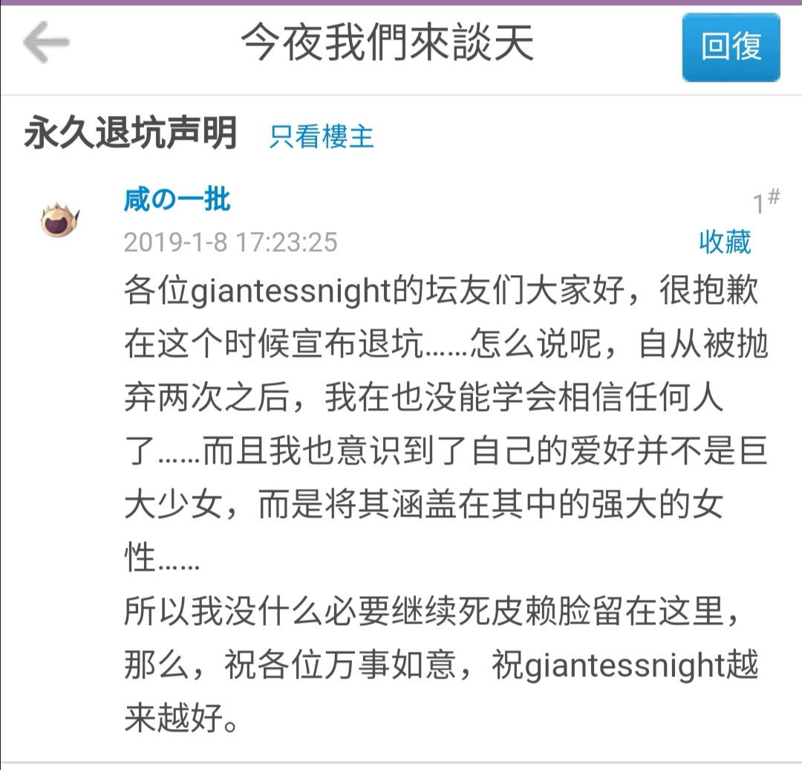

# 大抵这年头，看不到优秀的破坏文章了

作者：wanjingle

TID：30227

<title>1</title> <link href="../Styles/Style.css" type="text/css" rel="stylesheet">

# 1

**被墙之后，文章区是一天凉比一天，看看将近春天；我整天的看着外文，也须用上翻译了。一天的下半天，没有一篇合心的文章，我正合了眼坐着。忽然间看得一个标签，“破坏”，这标签虽然极短，却很醒目。看时又全没有巨大男。点进去一望，那文章开篇便是城市里搞起了破坏。那文章环境描写极其欠缺，已经不成样子；写几句台词，弄几段心里话，随便弄几个动作，用各种形容词在少女身上挂住；我看完，又看到，“破坏”。朋友也伸出头去，一面说，“一批么，你还欠十九个坑呢！”我一边看一边颓唐地答道，“这……下回填坑罢。这一回想看好文，要破坏。”朋友仍然同平常一样，笑着对我说，“一批，你这回又开新坑了！”但这回却不十分分辩，单说了一句“不要取笑！”“取笑？要是不开坑，怎么会写不动？”我低声说道，“没时间、没灵感’”我的眼色，很像恳求朋友，不要再提。此时已经聚集了几个观众，便和朋友都笑了。我看了文，写了几个字，放在草稿上。观众从破衣袋里摸出四篇链接，放在我手里，见标签都有巨大化，原来都是巨大系。不一会，我看完文，便又在旁人的说笑声中，坐着用这手慢慢点关闭去了。**
**自此以后，又长久没有看见优秀的破坏类文章。到了GN，观众取下VPN说，“一批还欠十九个坑呢！”到第二年，又说“一批还欠十九个坑呢！”到初春可是没有说，再到年关也没有看见一批填坑。**
**我到现在终于没有见——大约我再也见不到优秀的破坏类文章了——大约一批是真的不想写文了……**

**工作繁忙，过年大概会更新一下，或者翻新一些老坑**

<title>2</title> <link href="../Styles/Style.css" type="text/css" rel="stylesheet">

# 2

大佬啊，我馋你的9724号文章啊，拿出来给大伙瞅瞅呗 <title>3</title> <link href="../Styles/Style.css" type="text/css" rel="stylesheet">

# 3

啊这......我记得一批你当初不是写破坏文起家的啊……最近是迷上了破坏文么 <title>4</title> <link href="../Styles/Style.css" type="text/css" rel="stylesheet">

# 4

盲猜一波，感觉题主写的话有点鲁迅的味道 <title>5</title> <link href="../Styles/Style.css" type="text/css" rel="stylesheet">

# 5

能体会到大佬看不到想看文章的心情，但是这一段黑体加粗字里“看时又全没有巨大男”这一段，我就不太懂了 <title>6</title> <link href="../Styles/Style.css" type="text/css" rel="stylesheet">

# 6

被墙了真是遗憾得不得了……变得冷清多了 <title>7</title> <link href="../Styles/Style.css" type="text/css" rel="stylesheet">

# 7

*本帖最後由 1q1q1q1q1q 於 2021-1-29 11:49 編輯*

雖然很少看破壞系
但還是希望大大不要完全放棄熱情
看到這篇還是想試寫一段

我從十二年前起，便在網上的女巨人之夜里當會員，心裡說，文筆太差，怕寫不了長篇文章，就只能回文讚好罷。回文時的限制，雖然沒什麼要求，但嘮嘮叨叨纏夾不清的也很不少。網友們往往要親眼看著支持從心底裡發出，看過字句有重覆沒有，又親看發表回文的時間間距，然後放心：在這嚴重監督下，灌水也很為難。所以過了幾天，心裡又說我幹不了這事。幸虧自己的面皮厚，不易退縮，便改為專門潛水混分的一種潛水員了。

是為了仿照孔乙己，會有一點生搬硬套，意思不必當真 <title>8</title> <link href="../Styles/Style.css" type="text/css" rel="stylesheet">

# 8

那一批老师写几篇教教我们破坏文的四种写法呗 <title>9</title> <link href="../Styles/Style.css" type="text/css" rel="stylesheet">

# 9

> [小六 發表於 2021-1-29 09:47](https://giantessnight.cf/gnforum2012/forum.php?mod=redirect&goto=findpost&pid=458154&ptid=30227)
> 盲猜一波，感觉题主写的话有点鲁迅的味道

是孔乙己的模板啦，定型文
<title>10</title> <link href="../Styles/Style.css" type="text/css" rel="stylesheet">

# 10

<ignore_js_op>

**Screenshot_20210129_131232.jpg** *(199 KB, 下載次數: 0)*

[下載附件](forum.php?mod=attachment&aid=ODcwMzF8MTY3ZTdiZTB8MTY3NDA2NjE3MHwxODIzMHwzMDIyNw%3D%3D&nothumb=yes)

2021-1-29 13:13 上傳

………
<title>11</title> <link href="../Styles/Style.css" type="text/css" rel="stylesheet">

# 11

噗，一批乙己还行，绝了wwww，话说感觉今天有不少人啊 <title>12</title> <link href="../Styles/Style.css" type="text/css" rel="stylesheet">

# 12

嗯，以前我第一次接触gn还是在百度上直接搜索gts就可以出来的了，可惜现在很多新人都不知道gn这个论坛了</ignore_js_op>