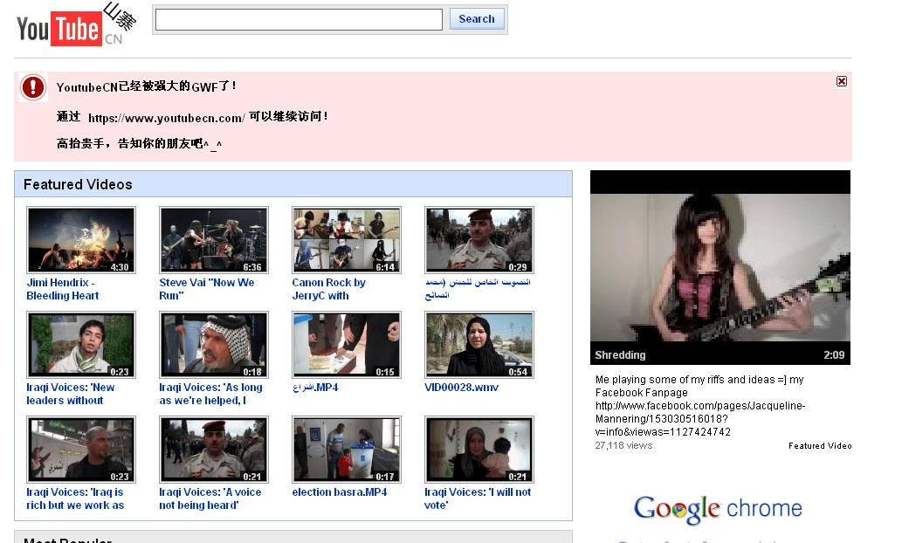
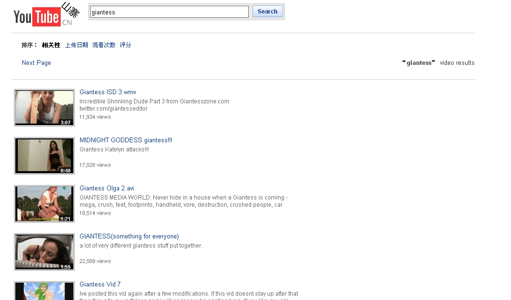

# 天朝威武，山寨YouTube还是被和谐了……

作者：ohyathelarry

TID：7048

<title>1</title> <link href="../Styles/Style.css" type="text/css" rel="stylesheet">

# 1

[https://www.youtubecn.com/](https://www.youtubecn.com/)

不解释，搜索giantess自己试

貌似有些站友不能看啊
附图先

<ignore_js_op>

**youtubcn1.jpg** *(324.02 KB, 下載次數: 1)*

[下載附件](forum.php?mod=attachment&aid=MTgxOTd8NGQyMmM5Mzh8MTY3NDA2ODkxNXwxODIzMHw3MDQ4&nothumb=yes)

2010-3-9 23:54 上傳

<ignore_js_op>

**youtubcn.jpg** *(158.02 KB, 下載次數: 0)*

[下載附件](forum.php?mod=attachment&aid=MTgxOTZ8NzA3YWJiOTh8MTY3NDA2ODkxNXwxODIzMHw3MDQ4&nothumb=yes)

2010-3-9 23:54 上傳

[ *本帖最後由 sdidy 於 2010-3-14 17:09 編輯* ] <title>2</title> <link href="../Styles/Style.css" type="text/css" rel="stylesheet">

# 2

lz你强大了，多谢分享！！
【为什么我上网搜到了山寨都是被河蟹的XTX】 <title>3</title> <link href="../Styles/Style.css" type="text/css" rel="stylesheet">

# 3

山寨果然犀利........... <title>4</title> <link href="../Styles/Style.css" type="text/css" rel="stylesheet">

# 4

太牛了，山寨无敌！ <title>5</title> <link href="../Styles/Style.css" type="text/css" rel="stylesheet">

# 5

 强啊~ <title>6</title> <link href="../Styles/Style.css" type="text/css" rel="stylesheet">

# 6

为什么视频都显示找不到？ <title>7</title> <link href="../Styles/Style.css" type="text/css" rel="stylesheet">

# 7

太好了..感谢楼主..我要去山寨落草 <title>8</title> <link href="../Styles/Style.css" type="text/css" rel="stylesheet">

# 8

山寨有时候挺吸引人眼球的。。。真的
不过 咋看不了。。。点了没反应啊- -

[ *本帖最後由 小小丸子 於 2010-3-9 23:49 編輯* ] <title>9</title> <link href="../Styles/Style.css" type="text/css" rel="stylesheet">

# 9

还有谁不能看？

南京电信应该没问题 <title>10</title> <link href="../Styles/Style.css" type="text/css" rel="stylesheet">

# 10

这个必须顶  太强了 <title>11</title> <link href="../Styles/Style.css" type="text/css" rel="stylesheet">

# 11

强....可以看...... <title>12</title> <link href="../Styles/Style.css" type="text/css" rel="stylesheet">

# 12

我還以為是指犀利哥(誤) <title>13</title> <link href="../Styles/Style.css" type="text/css" rel="stylesheet">

# 13

太神奇了..........
果然河蟹与绿坝娘都被山寨击败了 <title>14</title> <link href="../Styles/Style.css" type="text/css" rel="stylesheet">

# 14

真是人才啊！！楼主到哪儿去找的这种好东东? <title>15</title> <link href="../Styles/Style.css" type="text/css" rel="stylesheet">

# 15

能打开看不了 <title>16</title> <link href="../Styles/Style.css" type="text/css" rel="stylesheet">

# 16

楼主太爱你了无限福音啊 <title>17</title> <link href="../Styles/Style.css" type="text/css" rel="stylesheet">

# 17

LZ，首先我要謝謝你，我是大陸我現在終於能看了，太爽了。 <title>18</title> <link href="../Styles/Style.css" type="text/css" rel="stylesheet">

# 18

 好东西。。我顶了。。 <title>19</title> <link href="../Styles/Style.css" type="text/css" rel="stylesheet">

# 19

我草  楼主我爱死你了
终于可以不用翻墙了  楼主万岁 <title>20</title> <link href="../Styles/Style.css" type="text/css" rel="stylesheet">

# 20

ohmygod  这实在是太和谐了！！！ <title>21</title> <link href="../Styles/Style.css" type="text/css" rel="stylesheet">

# 21

视频我怎么看不了。。。  
  进度条死也不动。。。。 <title>22</title> <link href="../Styles/Style.css" type="text/css" rel="stylesheet">

# 22

嗯，谢谢露珠了
露珠绝对有小寂寂 <title>23</title> <link href="../Styles/Style.css" type="text/css" rel="stylesheet">

# 23

我XXXXX。顶啊。。。 <title>24</title> <link href="../Styles/Style.css" type="text/css" rel="stylesheet">

# 24

  我也顶  就是看不了郁闷 <title>25</title> <link href="../Styles/Style.css" type="text/css" rel="stylesheet">

# 25

  太感谢楼主了 <title>26</title> <link href="../Styles/Style.css" type="text/css" rel="stylesheet">

# 26

实在是太棒了 楼主谢谢你 <title>27</title> <link href="../Styles/Style.css" type="text/css" rel="stylesheet">

# 27

 天啊，视频看不了 只有大黑框 <title>28</title> <link href="../Styles/Style.css" type="text/css" rel="stylesheet">

# 28

好東西!!! <title>29</title> <link href="../Styles/Style.css" type="text/css" rel="stylesheet">

# 29

河南人民致以哀悼 <title>30</title> <link href="../Styles/Style.css" type="text/css" rel="stylesheet">

# 30

杯具了</ignore_js_op></ignore_js_op>