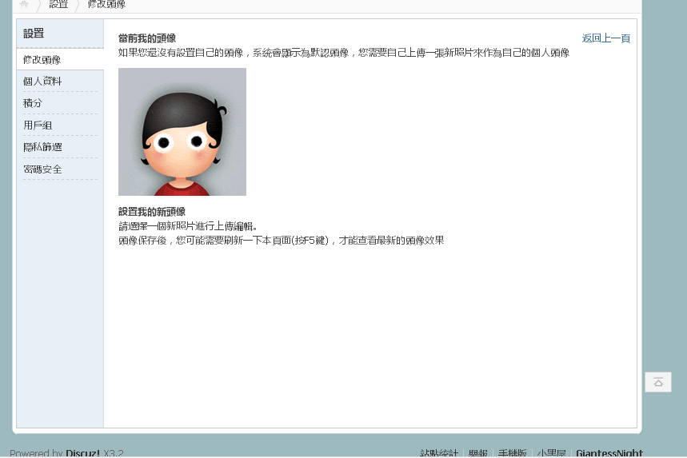

# 太可怕了呜呜呜

作者：C-aki

TID：22468

<title>1</title> <link href="../Styles/Style.css" type="text/css" rel="stylesheet">

# 1

终于凑了2000积分，可以去漫画区了，然后瞬间变成1000（普通用户），呜呜呜
<title>2</title> <link href="../Styles/Style.css" type="text/css" rel="stylesheet">

# 2

前排惨案 <ignore_js_op>

**-19cbe5ac83b482ec.jpg** *(3.04 KB, 下載次數: 0)*

[下載附件](forum.php?mod=attachment&aid=NjY0OTF8OGYyZjgxOWZ8MTY3NDA2NzYxNnwxODIzMHwyMjQ2OA%3D%3D&nothumb=yes)

2017-1-19 21:29 上傳

<title>3</title> <link href="../Styles/Style.css" type="text/css" rel="stylesheet">

# 3

人類總是要重覆同樣的錯誤

漫畫區不會跑掉。也真的用不著急著進去 <title>4</title> <link href="../Styles/Style.css" type="text/css" rel="stylesheet">

# 4

为新人默哀，谁都有过这种事 <title>5</title> <link href="../Styles/Style.css" type="text/css" rel="stylesheet">

# 5

 话说这已经是第几位了？ <title>6</title> <link href="../Styles/Style.css" type="text/css" rel="stylesheet">

# 6

好多人中过招哦。。。。 <title>7</title> <link href="../Styles/Style.css" type="text/css" rel="stylesheet">

# 7

我只是来看看我的积分的，潜水好久了 <title>8</title> <link href="../Styles/Style.css" type="text/css" rel="stylesheet">

# 8

已经不知道是第几位了,我已经麻木 <title>9</title> <link href="../Styles/Style.css" type="text/css" rel="stylesheet">

# 9

说起来……吾辈之前距离核心会员仅76分呢……因为一年没发主题外加屡次购买勋章让我离目标愈加远……好多次有创作欲望也在判断为随笔不如不写而流产呢。 <title>10</title> <link href="../Styles/Style.css" type="text/css" rel="stylesheet">

# 10

作为前辈，深表同情，在此致意，默默等待下一位中招者 <title>11</title> <link href="../Styles/Style.css" type="text/css" rel="stylesheet">

# 11

論壇常有的事情，看過很多，所以只能說歷史永遠在笑
不過還有E紳士（略 <title>12</title> <link href="../Styles/Style.css" type="text/css" rel="stylesheet">

# 12

...我记得好像置顶帖还特意说了一下这个问题来着... <title>13</title> <link href="../Styles/Style.css" type="text/css" rel="stylesheet">

# 13

。。。要不设置个强控得5000积分才让买勋章吧。。。 <title>14</title> <link href="../Styles/Style.css" type="text/css" rel="stylesheet">

# 14

当年的惨案历历在目~！ <title>15</title> <link href="../Styles/Style.css" type="text/css" rel="stylesheet">

# 15

中枪人很多，置顶帖为了解决这个问题说过3000买吧，已麻木 <title>16</title> <link href="../Styles/Style.css" type="text/css" rel="stylesheet">

# 16

多回复就有积分了
或者发资源，一般会有人给你奖励点的 <title>17</title> <link href="../Styles/Style.css" type="text/css" rel="stylesheet">

# 17

基本每个人都会经历一次的惨案……支持一下不要灰心 <title>18</title> <link href="../Styles/Style.css" type="text/css" rel="stylesheet">

# 18

哈哈哈哈哈哈哈哈哈哈哈哈哈哈哈哈哈……我之前也是没有节制买了好几年把自己搞成初级会员了……现在努力回升中。。你看，50Ducat还是很好赚的 <title>19</title> <link href="../Styles/Style.css" type="text/css" rel="stylesheet">

# 19

我肯定不会中招了 <title>20</title> <link href="../Styles/Style.css" type="text/css" rel="stylesheet">

# 20

深表同情.....这惨剧发生好多次了 <title>21</title> <link href="../Styles/Style.css" type="text/css" rel="stylesheet">

# 21

哈哈！一直在银卡和普通会员挣扎！ <title>22</title> <link href="../Styles/Style.css" type="text/css" rel="stylesheet">

# 22

我记得以前是8000来着？ <title>23</title> <link href="../Styles/Style.css" type="text/css" rel="stylesheet">

# 23

还好之前看到过同样遭遇的人，不然我2000的时候肯定也会买的…… <title>24</title> <link href="../Styles/Style.css" type="text/css" rel="stylesheet">

# 24

我也扯点这样，幸亏看了公告 <title>25</title> <link href="../Styles/Style.css" type="text/css" rel="stylesheet">

# 25

謝謝提醒   看來等到3000分在去漫畫區好了 <title>26</title> <link href="../Styles/Style.css" type="text/css" rel="stylesheet">

# 26

看看公告的说。。坐等下一位 <title>27</title> <link href="../Styles/Style.css" type="text/css" rel="stylesheet">

# 27

> [紫色欧石楠 發表於 2017-1-19 21:30](https://giantessnight.cf/gnforum2012/forum.php?mod=redirect&goto=findpost&pid=320781&ptid=22468)
> 前排惨案

不开心，居然没有人告诉我。。。

<title>28</title> <link href="../Styles/Style.css" type="text/css" rel="stylesheet">

# 28

> [葬儀社 發表於 2017-1-19 21:32](https://giantessnight.cf/gnforum2012/forum.php?mod=redirect&goto=findpost&pid=320782&ptid=22468)
> 人類總是要重覆同樣的錯誤
> 
> 漫畫區不會跑掉。也真的用不著急著進去

虽然是这么说，，但是我现在急切的想去看看有什么，所以就忍不住想进去看看的，然后，然后，，，木有然后呢

<title>29</title> <link href="../Styles/Style.css" type="text/css" rel="stylesheet">

# 29

> [RMB战士 發表於 2017-1-19 22:05](https://giantessnight.cf/gnforum2012/forum.php?mod=redirect&goto=findpost&pid=320788&ptid=22468)
> 话说这已经是第几位了？

之前有人有过吗，，为什么都没有什么帖子提个醒什么的。。。

<title>30</title> <link href="../Styles/Style.css" type="text/css" rel="stylesheet">

# 30

> [chazi8 發表於 2017-1-19 22:27](https://giantessnight.cf/gnforum2012/forum.php?mod=redirect&goto=findpost&pid=320791&ptid=22468)
> 我只是来看看我的积分的，潜水好久了

你的头像。。难道是一只想被踩的hentai吗

<title>31</title> <link href="../Styles/Style.css" type="text/css" rel="stylesheet">

# 31

> [foronly 發表於 2017-1-20 02:18](https://giantessnight.cf/gnforum2012/forum.php?mod=redirect&goto=findpost&pid=320813&ptid=22468)
> ...我记得好像置顶帖还特意说了一下这个问题来着...

我是知道买了会降级用户，但是漫画区什么20权限 30权限 50权限。。

<title>32</title> <link href="../Styles/Style.css" type="text/css" rel="stylesheet">

# 32

> [C-aki 發表於 2017-1-23 13:28](https://giantessnight.cf/gnforum2012/forum.php?mod=redirect&goto=findpost&pid=321222&ptid=22468)
> 你的头像。。难道是一只想被踩的hentai吗

写作HENTAI读作足控圣水控
<title>33</title> <link href="../Styles/Style.css" type="text/css" rel="stylesheet">

# 33

很坑啊这种事情。。。。。 <title>34</title> <link href="../Styles/Style.css" type="text/css" rel="stylesheet">

# 34

下次应该先看看说明在买啊 <title>35</title> <link href="../Styles/Style.css" type="text/css" rel="stylesheet">

# 35

谢谢提醒，不然我还打算等二级之后就去买 <title>36</title> <link href="../Styles/Style.css" type="text/css" rel="stylesheet">

# 36

虽然积分还远远不够，不过我看见了大字的建议3000分以上再买。 <title>37</title> <link href="../Styles/Style.css" type="text/css" rel="stylesheet">

# 37

感谢提醒，这才害怕的去看了一下公告 <title>38</title> <link href="../Styles/Style.css" type="text/css" rel="stylesheet">

# 38

我记得哪个帖子提醒过的，还好我看到了= =默哀。

努力的话4个小时就能赚回来 <title>39</title> <link href="../Styles/Style.css" type="text/css" rel="stylesheet">

# 39

您的头像如何更换啊？我在设置里面的头像中看不到更换的选项 <title>40</title> <link href="../Styles/Style.css" type="text/css" rel="stylesheet">

# 40

 <ignore_js_op>[QQ截图20170510134107.png](forum.php?mod=attachment&aid=Njc4MTR8NmU1ZDlkZTR8MTY3NDA2NzYzNXwxODIzMHwyMjQ2OA%3D%3D&nothumb=yes) *(77.57 KB, 下載次數: 0)*

[下載附件](forum.php?mod=attachment&aid=Njc4MTR8NmU1ZDlkZTR8MTY3NDA2NzYzNXwxODIzMHwyMjQ2OA%3D%3D&nothumb=yes)

2017-5-10 13:41 上傳  

</ignore_js_op> <title>41</title> <link href="../Styles/Style.css" type="text/css" rel="stylesheet">

# 41

> [281314672 發表於 2017-5-10 13:41](https://giantessnight.cf/gnforum2012/forum.php?mod=redirect&goto=findpost&pid=331774&ptid=22468)
> 您的头像如何更换啊？我在设置里面的头像中看不到更换的选项

前一阵子可以换吧，貌似</ignore_js_op>