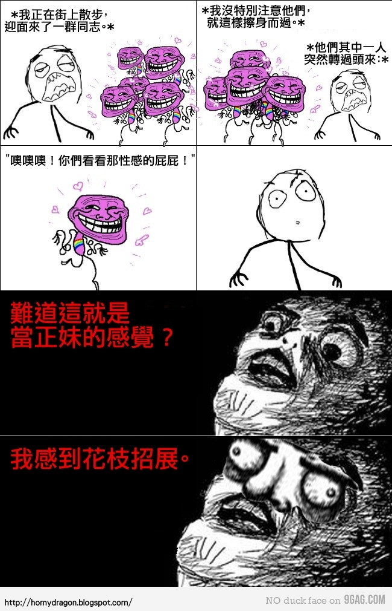

# 女生對GTS怎麽看

作者：乘风破浪

TID：48

<title>1</title> <link href="../Styles/Style.css" type="text/css" rel="stylesheet">

# 1

大家誰有跟女孩子說過整個，尤其是對那些有GTS形象的女生，她們怎麽看 <title>2</title> <link href="../Styles/Style.css" type="text/css" rel="stylesheet">

# 2

此問題
有請V姐(拜

對了
雨辰跟V姐好像都沒加耶 <title>3</title> <link href="../Styles/Style.css" type="text/css" rel="stylesheet">

# 3

他們不知道去哪了………
女神論壇也沒看過他們的影子:( <title>4</title> <link href="../Styles/Style.css" type="text/css" rel="stylesheet">

# 4

如果告訴一個女孩子她自己可以成爲GTS，她會怎麽想 <title>5</title> <link href="../Styles/Style.css" type="text/css" rel="stylesheet">

# 5

GTS這個領域真的很少有女生加入,比較難討論吧!GTS這個領域比較類似女王領域的感覺,但是GTS幻想因素比起女王還要多出很多,可能會很少人理解吧! <title>6</title> <link href="../Styles/Style.css" type="text/css" rel="stylesheet">

# 6

BOY兄沒有跟女生說過嘛？
估計她們會不會覺得好玩 <title>7</title> <link href="../Styles/Style.css" type="text/css" rel="stylesheet">

# 7

說不定有些女生對成爲GTS感興趣那。因爲她們可以統治小人。。。。 <title>8</title> <link href="../Styles/Style.css" type="text/css" rel="stylesheet">

# 8

跟女生說喔，不知道會不會被當成心理不正常= =.......
要是有好看的女孩子肯接受.....那我應該也不用幻想了吧，直接來=ˇ= <title>9</title> <link href="../Styles/Style.css" type="text/css" rel="stylesheet">

# 9

恐怕真会被当成心里不正常 <title>10</title> <link href="../Styles/Style.css" type="text/css" rel="stylesheet">

# 10

别说女孩了,就是男的我周围似乎也没有发现同好.... <title>11</title> <link href="../Styles/Style.css" type="text/css" rel="stylesheet">

# 11

> 原帖由 *Dante* 於 2007-3-28 14:59 發表 
> 他們不知道去哪了………
> 女神論壇也沒看過他們的影子:(

好怀念V姐啊 ,现在在国外的网站看到她的作品旧会想起她:'( :'( :'( <title>12</title> <link href="../Styles/Style.css" type="text/css" rel="stylesheet">

# 12

你們怎麽不知道周圍沒有同好的，其實好多那，只不過有時大家因爲面子不表露。日本和歐美整個東西已經開放了。可是在華人世界里還是不被公開允許。其實大家潜意識里都有拉。我們整個論壇如此火爆就是證明。是不是儒家思想影啊。。。 <title>13</title> <link href="../Styles/Style.css" type="text/css" rel="stylesheet">

# 13

有一次，在某論壇看到過一個帖子，有個人將gts的愛好告訴給他的女友了，結果被罵變態………… <title>14</title> <link href="../Styles/Style.css" type="text/css" rel="stylesheet">

# 14

該怎麼說呢
大概是因為華人地區 起步較晚
就像同性戀一樣
一開始也是不太能接受
在其他地區已經發展趨熟
華人地區也只是遲早會開始接受
到時候就會有更多同好囉^^ <title>15</title> <link href="../Styles/Style.css" type="text/css" rel="stylesheet">

# 15

這怎麽能叫變態那。我覺得一種藝術啊，大家都有自己的愛好。那個女也真是的，不過那個女的也真是。說不定她也具有GTS氣質那∼:) 只要好好說，可以使一些女同好加入。 <title>16</title> <link href="../Styles/Style.css" type="text/css" rel="stylesheet">

# 16

我完全同意15楼兄弟的说法 <title>17</title> <link href="../Styles/Style.css" type="text/css" rel="stylesheet">

# 17

女孩子有成爲GTS的欲望哦 <title>18</title> <link href="../Styles/Style.css" type="text/css" rel="stylesheet">

# 18

歐美比較開放，在giantess city上，曾看過一些人說他們結婚後，把GTS興趣讓另一半知道，而且也能獲得理解。有的甚至願意跟老公玩起那種模擬遊戲。

該不該羨慕這些人呢？ <title>19</title> <link href="../Styles/Style.css" type="text/css" rel="stylesheet">

# 19

對於GTS，女性怎麽看，正如男性怎麽看一般。10000個男人中會有1個喜歡GTS的話，女性無非是數量較之更少而已。
個人猜測：喜歡GTS的女性，大多數是青春期單身。 <title>20</title> <link href="../Styles/Style.css" type="text/css" rel="stylesheet">

# 20

我個人知道的一些喜歡GTS的女生，是把自己想像成女巨人，渴望自己變大 <title>21</title> <link href="../Styles/Style.css" type="text/css" rel="stylesheet">

# 21

是嗎?也許真的。不過，男性朋友們都這麼保守了，女性同胞們應該更加的保守吧。要找到異性同好真的很困難。(感表達的) <title>22</title> <link href="../Styles/Style.css" type="text/css" rel="stylesheet">

# 22

大陆女生更加含蓄，连普通的激情镜头都很难说，这种爱好好像
感觉在网络上的女生更放得开，还是以网络传播为主吧 <title>23</title> <link href="../Styles/Style.css" type="text/css" rel="stylesheet">

# 23

我大概有透一點相關訊息給我女友知道!!
現在想起，來那時超有種的!!! <title>24</title> <link href="../Styles/Style.css" type="text/css" rel="stylesheet">

# 24

我确 肯定有 遇到 <title>25</title> <link href="../Styles/Style.css" type="text/css" rel="stylesheet">

# 25

我有个女同学 她说她希望去小人国
因为她老受我班同学欺负
但我估计 她会认为GTS很变态的 <title>26</title> <link href="../Styles/Style.css" type="text/css" rel="stylesheet">

# 26

肯定有女生想成为GTS,我小学跟女孩玩类似GTS游戏，她说自己是世界上最大的人，成为巨人很自豪，
对于小人来说力大无穷，基本无敌状态的说。 <title>27</title> <link href="../Styles/Style.css" type="text/css" rel="stylesheet">

# 27

我跟我前任女朋友说这事，得到的回复是：哈!那还不得好好欺负你...现实中我一米九她一米六，这貌似听上去是很解气...
我跟一个关系比较好的女生说这事，得到的结论是：把我关笼子里，当仓鼠养了...她还跟我说过，自己家住高层往下看，偷偷穿高跟鞋这些时候，都有一种把世界踩在脚下的快感....
我还跟我十一岁的小表妹说过这事，得到的回复就很简单了：干脆一脚踩死... <title>28</title> <link href="../Styles/Style.css" type="text/css" rel="stylesheet">

# 28

表妹都不放过。。。太狠了 <title>29</title> <link href="../Styles/Style.css" type="text/css" rel="stylesheet">

# 29

唉，多少人当中才会有一个同好呢？ 100：1？ 1000:1？ 10000:1？

总之现实里我是从没遇见过啦  <title>30</title> <link href="../Styles/Style.css" type="text/css" rel="stylesheet">

# 30

 一般跟女性朋友说会被骂变态的吧 <title>31</title> <link href="../Styles/Style.css" type="text/css" rel="stylesheet">

# 31

这个难说的很啊 估计差不多 <title>32</title> <link href="../Styles/Style.css" type="text/css" rel="stylesheet">

# 32

我嘗試了 結果變成變態  ==
不過她好像慢慢接受了XD~ <title>33</title> <link href="../Styles/Style.css" type="text/css" rel="stylesheet">

# 33

首先要不露胖次不爆衣 <title>34</title> <link href="../Styles/Style.css" type="text/css" rel="stylesheet">

# 34

赞同12L说的，面子问题，敢想不敢说呀。 <title>35</title> <link href="../Styles/Style.css" type="text/css" rel="stylesheet">

# 35

女孩子有媛媛姐和v姐啊 <title>36</title> <link href="../Styles/Style.css" type="text/css" rel="stylesheet">

# 36

感覺女生 對GTS什麼的都沒興趣

男生也一樣 同好難找阿 攤手 <title>37</title> <link href="../Styles/Style.css" type="text/css" rel="stylesheet">

# 37

感觉每个女人内心深出或多或少都有点把 看挖不挖掘的关系 <title>38</title> <link href="../Styles/Style.css" type="text/css" rel="stylesheet">

# 38

跟女朋友讲过，很遗憾，她不真心喜欢。但有时候高兴了也会模拟着跟我说说玩玩。但是非真心的，感觉不到真实的感觉。反而觉得不得劲 <title>39</title> <link href="../Styles/Style.css" type="text/css" rel="stylesheet">

# 39

這個問題，我覺得關鍵之處並非「女生喜不喜歡GTS遊戲」，而是**「女生喜歡的是什麼形式的GTS」**。

如果你直接跑到MM面前說「啊你喜歡GTS嗎？」「你想成為巨人嗎？」「你喜歡變大嗎？」「啊我是M男我好像變成螞蟻被你踩死」「女神踩死我吧」諸如此類的，我想哪怕是圈內的MM，都不會有多少人能接受得了，更別說圈外了。被罵變態很正常。

所以，我們首先就不要拘泥于GTS這個概念，更不要試圖給圈外的女生一次性灌輸這些看起來很奇怪很變態的遊戲。

我們只要想一下，在大眾女生喜歡的事物里，有沒有是包含了符合咱們圈子里「GTS」這種要素的存在呢？

[http://www.baidu.com/s?bs=5cm&f=8&rsv_bp=1&wd=5cm%B5%C4XXX&inputT=2120](http://www.baidu.com/s?bs=5cm&f=8&rsv_bp=1&wd=5cm%B5%C4XXX&inputT=2120)
這是一個在社交網里比較經典的文字遊戲，5cm的XXX，參與者絕大部分是女生。

[http://www.pixiv.net/search.php?s_mode=s_tc&word=%E6%89%8B%E4%B9%97%E3%82%8A](http://www.pixiv.net/search.php?s_mode=s_tc&word=%E6%89%8B%E4%B9%97%E3%82%8A)
用關鍵字「手乗り」搜P站，3000+個結果，比「巨大娘」還多，作者絕大部分也是女生（雖然有不少是腐女啦），而且還有不少作者直接在介紹裏大發花癡「啊啊啊啊啊縮小了的XX君好卡哇伊啊卡哇伊我很想要一隻啊啊啊啊啊！！！！！」。

如果你經常關注女生向動漫論壇或者貼吧的話，你會發現有很多很多「男主角某一天突然變小了，被女主角（或者男二號- -）當成寵物圈養」的同人文。
這如此多的文章、圖畫，都是實實在在包含了GTS的重大元素之——————把人縮小，然後互動
只是她們並不是把這些稱為GTS而已。

如此看來，其實擁有**泛**GTS情結的MM，並沒有大家想像中的這麼少，只是她們的口味要比我們要輕，夾雜著充滿女生特色的可愛萌和溫柔系。
你這樣問一個MM，假如給她一個這樣的機會，能把自己喜歡的動畫（或者連續劇）角色縮小成可愛的5cm人兒，拐帶回家養，她願不願意這麼做？我估計即使是圈外人，也會獲得相當多的肯定答案了吧。否則5CM遊戲就不會這麼火了。

[ *本帖最後由 18X 於 2012-5-14 21:35 編輯* ] <title>40</title> <link href="../Styles/Style.css" type="text/css" rel="stylesheet">

# 40

还是比例太少，Giantess City也不就几万人。 <title>41</title> <link href="../Styles/Style.css" type="text/css" rel="stylesheet">

# 41

> 原帖由 *18X* 於 2012-5-14 21:17 發表 
> 能把自己喜歡的動畫（或者連續劇）角色縮小成可愛的5cm人兒，拐帶回家養，她願不願意這麼做？我估計即使是圈外人，也會獲得相當多的肯定答案了吧。否則5CM遊戲就不會這麼火了。
> 
> ...

听起来好像变成芭比娃娃游戏了。。。这个是女生的养成游戏吧   =  =         <title>42</title> <link href="../Styles/Style.css" type="text/css" rel="stylesheet">

# 42

經過生活上的經驗
我最近終於弄懂一件事
是我們把喜歡的女孩子幻想成GTS
並不能要求不喜歡妳的女孩子去接受GTS
如果哪個女孩天生喜歡GTS我也覺得滿怪的...
感覺就好像我們見到GT或是我們當GT一樣
我底下放個在網路上看到的漫畫給你們看一下

<ignore_js_op>

**RsKA5.jpg** *(166.86 KB, 下載次數: 0)*

[下載附件](forum.php?mod=attachment&aid=Mjg2Njd8YmMzMzYzMDN8MTY3NDA2ODY4M3wxODIzMHw0OA%3D%3D&nothumb=yes)

2012-5-27 21:15 上傳

所以我覺得如果是喜歡我的女孩(也就是女朋友)
對方的接受度會比較高
畢竟對方願意讓你享受這種
對她們來說是一種特殊的性幻想服務
畢竟這也牽扯到性
而且你喜歡的是那個女孩子的身體某個部位或是她使用過的鞋 衣 物
然後再經由你的幻想來變得很巨大
我本身戀物癖
實際一點就只能偷聞女孩子的高跟鞋或學生鞋了
我交到女朋友的話大概也只能當戀足和戀鞋者了
如果能縮小她又願意用腳趾或鞋子玩我的話
那一生大概就無憾了
她在玩的時候可能會有點無聊就是了
在我的溫柔系GTS裡面因該算是我自己單方面地享受吧 (我猜...)

[ *本帖最後由 s77512sf 於 2012-5-27 21:17 編輯* ] <title>43</title> <link href="../Styles/Style.css" type="text/css" rel="stylesheet">

# 43

实际点还是有想法的时候上上论坛享受一下就行，至少我别说是女性就算关系最铁的兄弟我也没这个勇气去说，我和老婆结婚快两年了，有时候她开玩笑也会让我闻脚，不过始终没有胆量开口哎 <title>44</title> <link href="../Styles/Style.css" type="text/css" rel="stylesheet">

# 44

同意大大的說法
我自己也不太敢說
連朋友問我的A片看啥我都沒跟他們說
但是我覺得你們都結婚那麼多年了
雖然講了也許會對生活有影響
但是也許能增加夫妻情趣也說不定
但是畢竟GTS算是單方面享受的事情
就像聞她的腳或是鞋子一樣
對方因該不會為此感到快樂吧
只會覺得我們很怪
如果你的太太能接受的話那就好好愛她吧
也許找不到下一個可以接受你嗜好的女人了
我現在都沒機會享受女人的肉體(不管是巨大或正常的 )
有女人真好... <title>45</title> <link href="../Styles/Style.css" type="text/css" rel="stylesheet">

# 45

说不定过个10几20年gts会被其他人认可就像现在国外对同性恋一样，不过那时候我们可能膝盖埋土了已经，不然的话我打算把这嗜好带进棺材了……最后祝楼上早日找到自己的归宿，巨大的没有找个正常的就ok了，nnd打两遍真吃力

[ *本帖最後由 forstnove 於 2012-5-28 21:38 編輯* ] <title>46</title> <link href="../Styles/Style.css" type="text/css" rel="stylesheet">

# 46

悲剧早点找个女朋友吧，可以充分发挥幻想的空间，我喜欢口交，边添边幻想变小的场景，很有感觉 <title>47</title> <link href="../Styles/Style.css" type="text/css" rel="stylesheet">

# 47

实际问过的路过了
其实一般人都只是不理解而以..不会像我们想象的一样觉得我们变态
甚至有些人会觉得蛮有趣,不过涉及到血腥内容就会却步了.
当然XX什么我的不可能问==
另外就是……
我突然忘了要说啥了。。想起来在更新。 <title>48</title> <link href="../Styles/Style.css" type="text/css" rel="stylesheet">

# 48

其實我會認為對方有排斥觀念是因為
之前新聞有撥一群女的把兔子和貓踩到噴血之後死亡的影片
我看那個不太能享受耶...
因為我自己都不能接受了
還滿火的
因為我自己是主打溫柔、不死、不見血
連我朋友和我爸媽看到那影片都在罵了
踩蟲子噴汁的我也不能接受
太寫實了...
幻想總是美妙滴 <title>49</title> <link href="../Styles/Style.css" type="text/css" rel="stylesheet">

# 49

> 原帖由 *s77512sf* 於 2012-5-30 19:48 發表 
> 其實我會認為對方有排斥觀念是因為
> 之前新聞有撥一群女的把兔子和貓踩到噴血之後死亡的影片
> 我看那個不太能享受耶...
> 因為我自己都不能接受了
> 還滿火的
> 因為我自己是主打溫柔、不死、不見血
> 連我朋友和我爸媽看 ...

手机打字中先默念三声春哥……
昨天又问了几个女生，大概可以说，她们不能接受的原因是自己太过与众不同。很多人都告诉我她们会想办法把自己变回去。愿意接受自己与众不同高于众生的大概都比较女王向吧。
其实正如前面提到的，这世界上既然有咱们这个群体，难保没有GT爱好者，如果他们问你的话你恐怕也接受不了……
也有些女生说她们想踩扁自己不喜欢的人，但是还是少数。
另外就是我会把与妹子的对话翻译整理发布的… <title>50</title> <link href="../Styles/Style.css" type="text/css" rel="stylesheet">

# 50

求围观楼上与妹子们的对话内容 <title>51</title> <link href="../Styles/Style.css" type="text/css" rel="stylesheet">

# 51

你怎么看待GT 她们就怎么看待GTS <title>52</title> <link href="../Styles/Style.css" type="text/css" rel="stylesheet">

# 52

> 原帖由 *六六* 於 2012-6-1 03:26 發表 
> 你怎么看待GT 她们就怎么看待GTS

这说的不太对了
首先咱们是GTS爱好者，大多数人对GT都是身痛恶决
其次男性和女性的心理也是不同的，女性倾向于被保护，男性则会提供这种保护
也就是说女性对GTS排斥可能大于男性对GT排斥
当然我们圈内人是感觉不到的
只是打个比方 <title>53</title> <link href="../Styles/Style.css" type="text/css" rel="stylesheet">

# 53

話說之前女朋友說 招數好少 只有縮小 進入 虐待= =~~然後又是溫柔系
所以...她覺得很無聊 <title>54</title> <link href="../Styles/Style.css" type="text/css" rel="stylesheet">

# 54

做为学校心理学的通达者 在对女友进行测试时用过这一类问题 如果你成为女神变大1000倍 你会做什么 想什么 她说会将人踩死 她喜欢刺激的东西 喜欢破坏 但她不会那样做 不过如果她真的是女神的话 她需要走路 她会穿着蓝丝袜白色的10厘米高跟（应该是100米才对 她的个人个人喜好）高傲的踩死路上的人 因为她需要走路 我问她那你不会觉得被踩死的人很可怜吗？她的回答是 我是女神 人在我眼里和蚂蚁没什么不同 我平时走路时不知踩死多少蚂蚁了（和她一起走 有时发现她有意无意的老往蚂蚁多的地方踩 没事也喜欢踩没被扔到垃圾桶里的烟盒（无德人较多乱扔垃圾）老是被我说脚痒）让我心喜的是她是校里最高的女生174 嘻嘻…… <title>55</title> <link href="../Styles/Style.css" type="text/css" rel="stylesheet">

# 55

不过女生天生有“弱小”的基因 天生的的被保护欲 使她们不喜欢这话题吧 或者做为心理题可能比较雕钻 还没问完她就不想说了 再问看似要哭 就不敢问了 <title>56</title> <link href="../Styles/Style.css" type="text/css" rel="stylesheet">

# 56

18大那个5cmXXX的倒是很有趣，我想玩玩</ignore_js_op>