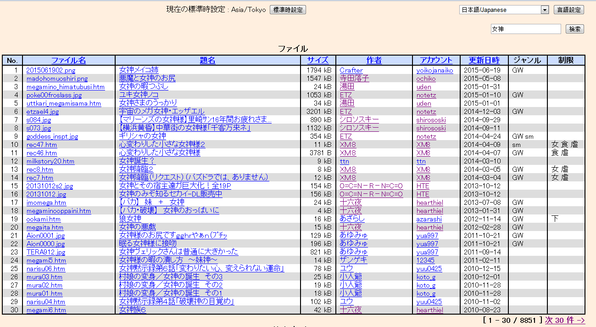

# 女神思想及其意义浅谈v1.0

作者：BAss926

TID：19476

<title>1</title> <link href="../Styles/Style.css" type="text/css" rel="stylesheet">

# 1

【以下一切都是我狂妄自大的任意揣测，如果有朋友有其他看法，欢迎以各种姿势打脸】
“女神”这两个字，代表的是一种思想，有很多人喜欢用这个词，也有很多人讨厌这个词。
这个词的发源已经不可考证了，不过据我无知地揣测，它应该是表达的一种崇拜思想，将巨大化的女生以神这个字来表达出一种高等的感觉。
这个词的使用原因很多，我来狂妄自大地总结一下：
1-方便
对于一个作者来说，女神这个词很方便，女主巨大化了？女神的能力。女主把别人缩小了？女神的能力。女主吃了核弹毫发无损？女神的能力。女主在宇宙里自由活动？女神的能力……一切不科学的，科学的设定全部可以推给这两个字，画鬼最易嘛。
但是这个词对于作者来说，也是极度不负责任的一个词，因为它让作者偷懒，让作者不去思考任何设定，这对于一个有责任感的作者来说无疑是不可接受的，而对于功能文来说，它又是最好用的。
2-好听
我们来对比以下句子
静儿抬起她的脚
女神抬起她的脚
女巨人抬起她的脚
巨大娘抬起她的脚
gts抬起的脚
最好听的当然是第一句（？），其次就是第二句了，女巨人总是带给人一种野蛮粗暴的感觉，巨大娘的话不是国人的表达方式，而且女神还有一种高人一等的感觉。
此外，叫一个女生女神，她总是会开心的，无论她在嘴上多么抵制。
3-崇拜
这里要稍微谈到神这个字了，本身我是不信有神的，但是神这个词多代表圣洁，强大，高等，因此使用这个词，可以很好的衬托出抖m的心理。

所谓的女神思想，在我看来是真正的女权主义，叫着女神不代表有女神思想。实际上，圈内很多人叫着女神，实际上把女生当做发泄的工具而已。而还有一些人虽然嘴上不叫，但是是却有着这种思想。
当然我不是来给大家洗脑的，所以v1暂时到这里，今天回家会很晚，希望明天可以打补丁。 <title>2</title> <link href="../Styles/Style.css" type="text/css" rel="stylesheet">

# 2

如果从我个人的角度来看，假设我个人使用这词单纯是或者说70%是顺口罢了，就我自己来说我都不爱直接这么裸着用。然后像巨大娘啊巨人啊什么的放在文字里去讲怎么读怎么别扭，作为概念使用还好，作为指定人称就差点劲了，就跟直接称呼一个人为人类似的，别扭。有名字最好还是直接用名字来代替的好，除非没名字，那我宁可用特征比如说金发啊，黑长直啊，或者说皮靴啊之类的去指代。

至于信仰么，我觉得基本都有信仰吧，在圈子里的人，无论是屈服感啊屈辱感啊，或者是因为无力而产生的崇拜感啊等等等等我觉得在最初就具有，特意去用女神来增加庄严感的话我虽然不否认，但是貌似这种想法并不明显吧，仅代表个人。 <title>3</title> <link href="../Styles/Style.css" type="text/css" rel="stylesheet">

# 3

说句无关的，其实我并不怎么见到 「女神（めがみ）」 这种叫法 <title>4</title> <link href="../Styles/Style.css" type="text/css" rel="stylesheet">

# 4

*本帖最後由 michael 於 2015-7-22 12:27 編輯*

> [taroxd 發表於 2015-7-22 12:04](https://giantessnight.cf/gnforum2012/forum.php?mod=redirect&goto=findpost&pid=262747&ptid=19476)
> 说句无关的，其实我并不怎么见到 「女神（めがみ）」 这种叫法

<ignore_js_op>

**QQ图片20150722122243.png** *(54 KB, 下載次數: 0)*

[下載附件](forum.php?mod=attachment&aid=NTM0NTh8OGU3OWQ1NmV8MTY3NDA2ODIxM3wxODIzMHwxOTQ3Ng%3D%3D&nothumb=yes)

2015-7-22 12:22 上傳

没有吧，很多啊，随便翻一下能找到一堆。

<title>5</title> <link href="../Styles/Style.css" type="text/css" rel="stylesheet">

# 5

比起女神这种说法  我更喜欢女王这个称呼  神这个词说白了还是太飘渺遥远了    <title>6</title> <link href="../Styles/Style.css" type="text/css" rel="stylesheet">

# 6

喜欢温柔系的我觉得，女神嘛，不一定要高高在上，也可以是很亲切的一种昵称呢 <title>7</title> <link href="../Styles/Style.css" type="text/css" rel="stylesheet">

# 7

女神？要么是被过度美化的某个女性，要么是讽刺某个女性。神算个球，我嘛，根本不相信神，但相信有恶魔，有堕渊者，然后我会被静儿大小姐绑在十字架上烧死吗？咦为啥是疑问句？ <title>8</title> <link href="../Styles/Style.css" type="text/css" rel="stylesheet">

# 8

其实还是女神读着有感觉，别的都很通俗，没有盛气凌人的感觉。。。 <title>9</title> <link href="../Styles/Style.css" type="text/css" rel="stylesheet">

# 9

说的好，不过还是无法把女神和足控联系起来。
所以某些方面还是不明白 <title>10</title> <link href="../Styles/Style.css" type="text/css" rel="stylesheet">

# 10

发泄。。？不懂。。。

女神。。？好像我也没有这样叫过别人。。。

我的抖M属性展现出来的时候是我叫我前女友女王大人的时候.. <title>11</title> <link href="../Styles/Style.css" type="text/css" rel="stylesheet">

# 11

> [bikaqiu8 發表於 2015-7-23 01:39](https://giantessnight.cf/gnforum2012/forum.php?mod=redirect&goto=findpost&pid=262862&ptid=19476)
> 发泄。。？不懂。。。
> 
> 女神。。？好像我也没有这样叫过别人。。。

很多作品直白看來好像是女神在展現他的威嚴和力量

但實際上也不過是依照男方的理想及慾望在行動而已

我不知道真正的女生是不是真的會想要把小人塞進自己的穴裡玩弄

然而嘴巴稱其為女神，結果卻把她描寫成欲求不滿的大淫娃

這種做法當然沒有不對，只是個人非常不喜歡這樣
<title>12</title> <link href="../Styles/Style.css" type="text/css" rel="stylesheet">

# 12

把个子高的姑娘成为女神，是因为她们与其他人不同——称呼者有着把被称呼者摁到墙上的冲动…… <title>13</title> <link href="../Styles/Style.css" type="text/css" rel="stylesheet">

# 13

> [bikaqiu8 發表於 2015-7-23 01:39](https://giantessnight.cf/gnforum2012/forum.php?mod=redirect&goto=findpost&pid=262862&ptid=19476)
> 发泄。。？不懂。。。
> 
> 女神。。？好像我也没有这样叫过别人。。。

就像戲劇小說的強人一樣,強人的所做所為,都是編劇或作者的安排,但不損強人角色. <title>14</title> <link href="../Styles/Style.css" type="text/css" rel="stylesheet">

# 14

因應物理定論,所以体型超巨大必須幻想成女神,身高上百公里女巨人,我們在她腳下說話,按音速她90秒才會聽到,所以她必須有別人想什麼,她就知道的能力,才能與人互動.也因為巨大所以必須極少食量就能生存。</ignore_js_op>