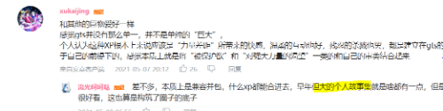

# 好家伙这次是真出圈了

作者：wunder

TID：30852

<title>1</title> <link href="../Styles/Style.css" type="text/css" rel="stylesheet">

# 1

**B站的管人VUP组合今天发了个专讲GTS内容的视频**

**越大的女孩越招人爱吗？（虚研会058）**
[https://www.bilibili.com/video/BV17K4y1N7hu](https://www.bilibili.com/video/BV17K4y1N7hu)

甚至以为文案有内鬼）怎么那么清楚
<ignore_js_op>

**QQ图片20210507155443.png** *(61.77 KB, 下載次數: 0)*

[下載附件](forum.php?mod=attachment&aid=ODg2Njl8MjViYzY5OGR8MTY3NDA2OTM2MHwxODIzMHwzMDg1Mg%3D%3D&nothumb=yes)

2021-5-7 14:55 上傳

<title>2</title> <link href="../Styles/Style.css" type="text/css" rel="stylesheet">

# 2

希桃属于从出道看到现在了，今天更新了gts内容属实给我吓了一跳，不过现在gts圈在墙内的生存空间是越来越小了啊 <title>3</title> <link href="../Styles/Style.css" type="text/css" rel="stylesheet">

# 3

> [zhong 發表於 2021-5-7 15:00](https://giantessnight.cf/gnforum2012/forum.php?mod=redirect&goto=findpost&pid=467637&ptid=30852)
> 希桃属于从出道看到现在了，今天更新了gts内容属实给我吓了一跳，不过现在gts圈在墙内的生存空间是越来越小 ...

她们以前也有变gts的视频，我以为是擦边或者巨人梗，结果没想是编剧内部肯定有内鬼）
<title>4</title> <link href="../Styles/Style.css" type="text/css" rel="stylesheet">

# 4

> neroskl 發表於 2021-5-7 15:06
> 她们以前也有变gts的视频，我以为是擦边或者巨人梗，结果没想是编剧内部肯定有内鬼）
> ...

不过看自己的小众xp被一本正经的分析还是挺羞耻的，进圈子快八年了还没让圈外人知道我有这个爱好来着 <title>5</title> <link href="../Styles/Style.css" type="text/css" rel="stylesheet">

# 5

毕竟各种作品也藏了好多年了，被挖出来也正常，就是不喜欢非圈的直男女品头论足。。 <title>6</title> <link href="../Styles/Style.css" type="text/css" rel="stylesheet">

# 6

hhhhhh头皮发麻 感觉XP系统给扫了一遍
以前也有变GTS的视频能不能细说一下 <title>7</title> <link href="../Styles/Style.css" type="text/css" rel="stylesheet">

# 7

这，居然是圈外50多w粉的up主，不过也还好吧，基本上就是介绍一下，然后贴一些各种影视动漫的相关内容，看了看他们以前内容也差不多。
不涉及圈内贴吧论坛啥的，基本上不算出圈了，毕竟也是二次元萌文化的一种了 <title>8</title> <link href="../Styles/Style.css" type="text/css" rel="stylesheet">

# 8

*本帖最後由 呜啊啊123 於 2021-5-7 16:14 編輯*

> [妈的智障 發表於 2021-5-7 15:55](https://giantessnight.cf/gnforum2012/forum.php?mod=redirect&goto=findpost&pid=467649&ptid=30852)
> hhhhhh头皮发麻 感觉XP系统给扫了一遍
> 以前也有变GTS的视频能不能细说一下 ...

那期说宝可梦的片段有小桃极巨化的片段，不过一开始还想着只是玩梗，现在看来可能是私货了

这期我觉得还挺危险的，巨大娘再怎么说也确实不算主流xp，而且基本离不开丸吞，番茄酱这种带guro的环节

只能希望小鬼不会把这些东西变成所谓的梗，然后多一堆粗制滥造的低创来劣币驱逐良币了，不过看弹幕风向好像没这个方向的想法。

另一个方向的话，她们最后那段不会把他们画成巨大娘的那段台词基本可以说是在明示二创了。

说不定会有类似冰糖缩小药的那种作品出来啥的（好像作者也在这个论坛来着。） <title>9</title> <link href="../Styles/Style.css" type="text/css" rel="stylesheet">

# 9

这绝对有内鬼的，内容讲的有点不太像圈外人能了解到的 <title>10</title> <link href="../Styles/Style.css" type="text/css" rel="stylesheet">

# 10

我严重怀疑认为导演就在论坛里???? <title>11</title> <link href="../Styles/Style.css" type="text/css" rel="stylesheet">

# 11

我本来还想水一贴的，还是你们快啊
话说回来，很早之前就关注小希小桃了，这波没有内鬼我是不信的，而且这尺度把握的非常好，属于圈内圈外都好看的内容
破圈的担忧属实没必要，他们这么多年了都不火的5555 <title>12</title> <link href="../Styles/Style.css" type="text/css" rel="stylesheet">

# 12

> [lwx1997 發表於 2021-5-7 17:20](https://giantessnight.cf/gnforum2012/forum.php?mod=redirect&goto=findpost&pid=467669&ptid=30852)
> 我本来还想水一贴的，还是你们快啊
> 话说回来，很早之前就关注小希小桃了，这波没有内鬼我是不信的，而且这 ...

想水一贴+1www
说实话自己二十年来挺感慨的，看着心里的小众xp一步一步向外试探着前进，便开始期待也许有一天我可以在同学聚会的时候直言“我喜欢GTS”（做梦

<title>13</title> <link href="../Styles/Style.css" type="text/css" rel="stylesheet">

# 13

确实，太离谱了……希望不要引到污流吧，小众圈子还是圈地自萌好一些 <title>14</title> <link href="../Styles/Style.css" type="text/css" rel="stylesheet">

# 14

> [neroskl 發表於 2021-5-7 15:06](https://giantessnight.cf/gnforum2012/forum.php?mod=redirect&goto=findpost&pid=467638&ptid=30852)
> 她们以前也有变gts的视频，我以为是擦边或者巨人梗，结果没想是编剧内部肯定有内鬼）
> ...

[https://www.bilibili.com/video/BV1wJ411e7jR?](https://www.bilibili.com/video/BV1wJ411e7jR?)回错了不好意思
<title>15</title> <link href="../Styles/Style.css" type="text/css" rel="stylesheet">

# 15

> [妈的智障 發表於 2021-5-7 15:55](https://giantessnight.cf/gnforum2012/forum.php?mod=redirect&goto=findpost&pid=467649&ptid=30852)
> hhhhhh头皮发麻 感觉XP系统给扫了一遍
> 以前也有变GTS的视频能不能细说一下 ...

[https://www.bilibili.com/video/BV1wJ411e7jR?](https://www.bilibili.com/video/BV1wJ411e7jR?)

<title>16</title> <link href="../Styles/Style.css" type="text/css" rel="stylesheet">

# 16

yysy，这么深透，真不像圈外人能说出来的 <title>17</title> <link href="../Styles/Style.css" type="text/css" rel="stylesheet">

# 17

噗，早就怀疑虚研村有GTS内鬼wwwww
但是也只敢怀疑，总觉得不太可能www
但这次肯定是了，因为，讲得太详细了wwww <title>18</title> <link href="../Styles/Style.css" type="text/css" rel="stylesheet">

# 18

> [无语的天命之子 發表於 2021-5-7 17:14](https://giantessnight.cf/gnforum2012/forum.php?mod=redirect&goto=findpost&pid=467667&ptid=30852)
> 我严重怀疑认为导演就在论坛里????

我也怀疑导演和编剧绝对有逛论坛的，能不能出来冒个泡（
<title>19</title> <link href="../Styles/Style.css" type="text/css" rel="stylesheet">

# 19

?绝对内鬼，没有内鬼我当场把这个电脑屏幕吃下去 <title>20</title> <link href="../Styles/Style.css" type="text/css" rel="stylesheet">

# 20

看了视频，这……这也太内行了吧！！感觉好羞耻啊！！ <title>21</title> <link href="../Styles/Style.css" type="text/css" rel="stylesheet">

# 21

所以说二创ok？那么我朋友想要一张图 <title>22</title> <link href="../Styles/Style.css" type="text/css" rel="stylesheet">

# 22

那视频底下现在简直圈内聚会……首届gts线上聚会活动？ <title>23</title> <link href="../Styles/Style.css" type="text/css" rel="stylesheet">

# 23

绝对的内鬼 这内容已经硬核到一定地步了 绝对是懂得都懂的懂王了 <title>24</title> <link href="../Styles/Style.css" type="text/css" rel="stylesheet">

# 24

感觉他很懂啊，甚至参考了之前几次论坛投票讨论帖子的部分结论。

感觉是自己人 <title>25</title> <link href="../Styles/Style.css" type="text/css" rel="stylesheet">

# 25

感觉是自己人是没错，就是让人担心这次出圈会有啥后果没 <title>26</title> <link href="../Styles/Style.css" type="text/css" rel="stylesheet">

# 26

一言难尽，夏虫不可语冰，凡人是无法理解这种美妙的xp的，就像细菌无法理解他们生存的大陆只是女孩子的脚丫。
能够喜欢上gts的人，当他看到任意动漫的gta内容，就会直接觉醒了吧，或者像我，没见过gts内容的情况下就开始yy自己变小了，所以给圈外人介绍实在是没有意义的行为。

做这种视频，理论上的好处，除了up赚钱和没有用的圈子宣传外，就是扩大圈外认同了吧，人们对于没听过的xp第一反应是你xp好jb怪，听过的会觉得自己知道所以可以理解。但这种认同从本质上讲也是没什么实际作用的

<title>27</title> <link href="../Styles/Style.css" type="text/css" rel="stylesheet">

# 27

无所谓了，互联网时代什么奇怪的爱好都能找到 <title>28</title> <link href="../Styles/Style.css" type="text/css" rel="stylesheet">

# 28

> [thelast 發表於 2021-5-7 21:12](https://giantessnight.cf/gnforum2012/forum.php?mod=redirect&goto=findpost&pid=467704&ptid=30852)
> 感觉是自己人是没错，就是让人担心这次出圈会有啥后果没

一般只有负面消息才会带来不良后果，比方说黄暴图或政治敏感图，都会让小圈子遭受灭顶之灾
普通一点的，只会被当做奇幻吧
<title>29</title> <link href="../Styles/Style.css" type="text/css" rel="stylesheet">

# 29

这不是虚研会这档节目第一次做萌属性内容，之前还做过人外和性转
不过这一期文案不太像是经过数周调研出来的，更像是在圈里泡了一会儿写出来的
要知道这可是个周播节目 <title>30</title> <link href="../Styles/Style.css" type="text/css" rel="stylesheet">

# 30

可能会被更多人了解吧，新人应该会变多，不理解的也会有，希望他们就像我们不理解其他xp，不打扰最好 <title>31</title> <link href="../Styles/Style.css" type="text/css" rel="stylesheet">

# 31

> [择一鞋终老 發表於 2021-5-7 21:32](https://giantessnight.cf/gnforum2012/forum.php?mod=redirect&goto=findpost&pid=467709&ptid=30852)
> 一言难尽，夏虫不可语冰，凡人是无法理解这种美妙的xp的，就像细菌无法理解他们生存的大陆只是女孩子的脚丫 ...

或者让一些不知道自己有这个xp的人觉醒吧

想当初我一开始也不知道自己为啥喜欢（可能10岁就开始有点预兆了，那时好像对哆啦A梦的缩小灯片段很有兴趣）
<title>32</title> <link href="../Styles/Style.css" type="text/css" rel="stylesheet">

# 32

整體來看介紹的還算不差呀，這樣的內容我覺得沒有啥大問題，即使是破壞城市這種劇情也順理成章的說成是怪獸幻想了，不是轉的挺好的嗎? <title>33</title> <link href="../Styles/Style.css" type="text/css" rel="stylesheet">

# 33

> [择一鞋终老 發表於 2021-5-7 21:32](https://giantessnight.cf/gnforum2012/forum.php?mod=redirect&goto=findpost&pid=467709&ptid=30852)
> 一言难尽，夏虫不可语冰，凡人是无法理解这种美妙的xp的，就像细菌无法理解他们生存的大陆只是女孩子的脚丫 ...

草，你这个怎么有一股中二味
<title>34</title> <link href="../Styles/Style.css" type="text/css" rel="stylesheet">

# 34

是没什么问题，就是没什么问题才更有点担心……整个看过一遍这真的不是圈内人写的吗… <title>35</title> <link href="../Styles/Style.css" type="text/css" rel="stylesheet">

# 35

说真的，我们这种真的算是小众吗？感觉出现频率挺高的，难道是因为各位都喜欢遮遮掩掩？ <title>36</title> <link href="../Styles/Style.css" type="text/css" rel="stylesheet">

# 36

多一個活着的公開渠道來發聲也是挺好的…至少不用擔心她們的對線能力

其實她們先前大火的奧特曼那期已經幫圈外人打了根預防針，然後又說了一期鬼怪偏見增加了圈外的接受能力，最後才襯熱打鐡來介紹gts，若果編劇不是圈內人，是絕對把握不了這時機的 <title>37</title> <link href="../Styles/Style.css" type="text/css" rel="stylesheet">

# 37

新人多了话就会有新的大佬产粮，凡事都要往好处想 <title>38</title> <link href="../Styles/Style.css" type="text/css" rel="stylesheet">

# 38

> [zhong 發表於 2021-5-7 15:11](https://giantessnight.cf/gnforum2012/forum.php?mod=redirect&goto=findpost&pid=467639&ptid=30852)
> 不过看自己的小众xp被一本正经的分析还是挺羞耻的，进圈子快八年了还没让圈外人知道我有这个爱好来着 ...

哈哈哈对啊，我也是，圈内随便说说，圈外就总怕他们觉得我奇怪，所以到现在都没跟任何人说过
<title>39</title> <link href="../Styles/Style.css" type="text/css" rel="stylesheet">

# 39

也不必怎么害怕吧，现在大家伙的接受能力都挺高的，很多人都会说一些夸张的xp，我觉得是人变得越来越猎奇了 <title>40</title> <link href="../Styles/Style.css" type="text/css" rel="stylesheet">

# 40

害 虽然感觉评论区大部分人都还是同好但感觉自己xp被这么拿来讲还是很羞耻???????? <title>41</title> <link href="../Styles/Style.css" type="text/css" rel="stylesheet">

# 41

看完了，介绍的很全面，虽然最后面的那段影片容易让人误解成“这样也没关系吗”
另外评论区留言虽然没关系，但还请诸位不要暴露国人作者，以防魔怔人爆破（非国人作者无妨）
另外我试着搜了一下，用百度、搜狗、必应、360和谷歌搜索“giantess”都找不到该论坛（不过world、zone、city之类的网站全部暴露，连带着一堆Bilibili视频（我挺好奇某些人是怎么上传寺田落子的漫画视频并过审的）），所以大可放心 <title>42</title> <link href="../Styles/Style.css" type="text/css" rel="stylesheet">

# 42

> [孤翼寡言的白鹭 發表於 2021-5-8 06:38](https://giantessnight.cf/gnforum2012/forum.php?mod=redirect&goto=findpost&pid=467766&ptid=30852)
> 看完了，介绍的很全面，虽然最后面的那段影片容易让人误解成“这样也没关系吗”
> 另外评论区留言虽然没关系 ...

论坛还是有墙的（各种意义上），问题不大。
<title>43</title> <link href="../Styles/Style.css" type="text/css" rel="stylesheet">

# 43

今天看了，只要没有过激反应，应该出不了什么风浪。评论里也很离谱，守口如瓶可不是说着玩的。 <title>44</title> <link href="../Styles/Style.css" type="text/css" rel="stylesheet">

# 44

以前觉得xp还得藏着掖着好像怪丢人的，现在仔细想想才发现还是小圈子自己玩好 <title>45</title> <link href="../Styles/Style.css" type="text/css" rel="stylesheet">

# 45

也不知道能不能联系到作者，希望大家确定一下作者有没有真正的gts癖好 <title>46</title> <link href="../Styles/Style.css" type="text/css" rel="stylesheet">

# 46

看了视频，反响一般般，没什么离谱的，当然这可能和up主没提到残酷系有关系…… <title>47</title> <link href="../Styles/Style.css" type="text/css" rel="stylesheet">

# 47

太tm离谱了，这波绝对内鬼，破坏，宇宙级都提到了，我是真的没有想到啊 <title>48</title> <link href="../Styles/Style.css" type="text/css" rel="stylesheet">

# 48

看了视频，这个绝逼是有同好或者内鬼策划的，大家知道了也不全是坏事我觉得 <title>49</title> <link href="../Styles/Style.css" type="text/css" rel="stylesheet">

# 49

之前动漫之家不是也有人上传关于gts的漫画，呃这回是知道的人会更多 <title>50</title> <link href="../Styles/Style.css" type="text/css" rel="stylesheet">

# 50

可能熟人很快就会在论坛上出现了 <title>51</title> <link href="../Styles/Style.css" type="text/css" rel="stylesheet">

# 51

希望还是不要出圈为好，否则以这尿性我们以后更看不到了 <title>52</title> <link href="../Styles/Style.css" type="text/css" rel="stylesheet">

# 52

> [awds713 發表於 2021-5-8 07:04](https://giantessnight.cf/gnforum2012/forum.php?mod=redirect&goto=findpost&pid=467768&ptid=30852)
> 论坛还是有墙的（各种意义上），问题不大。

我一直觉得墙成这样有点离谱

奇怪的是我在大马居然谷歌都只能无法直接看到论坛？不想其他论坛（臭鼬等，m系,macro等）甚至可以看到帖子

多少还是希望可以改变，多少容易拉多一点新人进来的
<title>53</title> <link href="../Styles/Style.css" type="text/css" rel="stylesheet">

# 53

墙内一切不是它们允许的东西，都越来越少了 <title>54</title> <link href="../Styles/Style.css" type="text/css" rel="stylesheet">

# 54

理性讨论，我看过不少出圈贴，大众对于破坏系GTS恶意很多，我认为还是小众XP比较好，人类总是会对异于常人的东西展开猛烈的攻击，比如同性恋，人类本身就是这种生物 <title>55</title> <link href="../Styles/Style.css" type="text/css" rel="stylesheet">

# 55

咱们这个早就已经出圈了，b站一堆咱们相关的视频（隔壁ub和vore更惨，已经泛滥到遍地都是了） <title>56</title> <link href="../Styles/Style.css" type="text/css" rel="stylesheet">

# 56

15w播放了 评论还炸出一堆圈内的人 太强了 原来这么多人关注过 <title>57</title> <link href="../Styles/Style.css" type="text/css" rel="stylesheet">

# 57

芜湖
“你做得好，你做得好啊！” <title>58</title> <link href="../Styles/Style.css" type="text/css" rel="stylesheet">

# 58

好家伙，我居然是在这儿才知道小希小桃搞了这么个大新闻
不过也不意外吧，以前就出现过好多元素23333 <title>59</title> <link href="../Styles/Style.css" type="text/css" rel="stylesheet">

# 59

出圈本身没问题，看你怎么控制热度和评论风向了，像我的话直接等待时间过去就没事了
但是月底有新电脑来的时候我就做一些正常向的剧情，多出来的R18就丢在fanbox什么的，
就很好控制来源 <title>60</title> <link href="../Styles/Style.css" type="text/css" rel="stylesheet">

# 60

阿哲，我真的在考虑要不要点进去看一下 <title>61</title> <link href="../Styles/Style.css" type="text/css" rel="stylesheet">

# 61

确实羞耻爆满，看晕了，没有内鬼我是不信的 <title>62</title> <link href="../Styles/Style.css" type="text/css" rel="stylesheet">

# 62

这好多圈内的词汇，说擦边我都不信，但是我觉得小众爱好出圈不是很好吧，一般人的感觉大概会是觉得奇葩或者恶心。 <title>63</title> <link href="../Styles/Style.css" type="text/css" rel="stylesheet">

# 63

有一说一，小希小桃在vup里也不属于最火的那一档，gts更是小众性癖，所以根本不用担心出圈引小鬼。不过我倒是越来越好奇虚研社里的各位员工到底有多少种xp了 <title>64</title> <link href="../Styles/Style.css" type="text/css" rel="stylesheet">

# 64

这万一火了出圈子了就不是一点半点的问题了，咱们这圈子就该遭受灭顶之灾了 <title>65</title> <link href="../Styles/Style.css" type="text/css" rel="stylesheet">

# 65

不管是不是内鬼，讲的好，还能在B站发出，就很厉害。这下能有更多的人了解我们了哈哈哈哈 <title>66</title> <link href="../Styles/Style.css" type="text/css" rel="stylesheet">

# 66

看得我脚趾抠地板，看一半关了又开反反复复才看完 <title>67</title> <link href="../Styles/Style.css" type="text/css" rel="stylesheet">

# 67

画重点！！！看得我虎躯一震，内鬼就在我们中间！ <title>68</title> <link href="../Styles/Style.css" type="text/css" rel="stylesheet">

# 68

 <ignore_js_op>[mmexport1622037157093.png](forum.php?mod=attachment&aid=ODg5NDN8NjAzNDJkM2V8MTY3NDA2OTQxOHwxODIzMHwzMDg1Mg%3D%3D&nothumb=yes) *(49.26 KB, 下載次數: 4)*

[下載附件](forum.php?mod=attachment&aid=ODg5NDN8NjAzNDJkM2V8MTY3NDA2OTQxOHwxODIzMHwzMDg1Mg%3D%3D&nothumb=yes)

2021-5-26 21:52 上傳  

</ignore_js_op> <title>69</title> <link href="../Styles/Style.css" type="text/css" rel="stylesheet">

# 69

其实B站早年也有一些人搬运GTS视频，就那几个比较经典的MMD
萌百也有巨大少女 介绍词条…… <title>70</title> <link href="../Styles/Style.css" type="text/css" rel="stylesheet">

# 70

要说接触个皮毛也就算了，但是前前后后讲的都感觉太详细了吧
<title>71</title> <link href="../Styles/Style.css" type="text/css" rel="stylesheet">

# 71

感觉gts的人哪里都有哈哈，一点也不像一个小圈子
<title>72</title> <link href="../Styles/Style.css" type="text/css" rel="stylesheet">

# 72

好家伙，感觉这个人比我了解的还清楚</ignore_js_op>