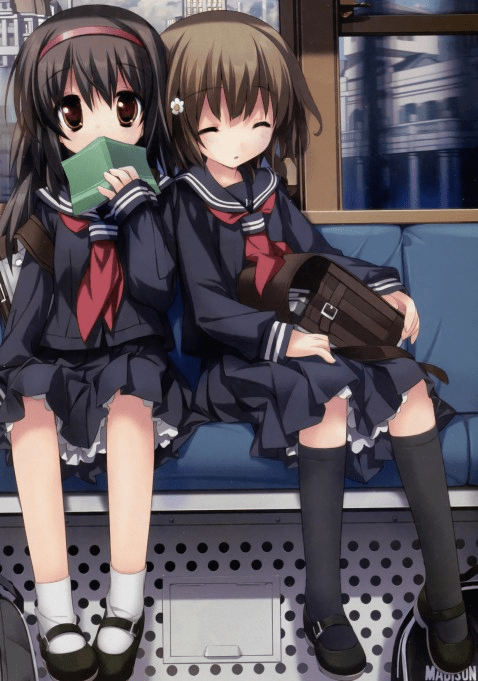

# 如何在文章创作的内容中营造小人的屈辱感？

作者：Yagami_ray

TID：17646

<title>1</title> <link href="../Styles/Style.css" type="text/css" rel="stylesheet">

# 1

*本帖最後由 冰西瓜 於 2014-8-25 10:47 編輯*

我做过一些尝试，但是都失败了，希望大家帮忙指点
<title>2</title> <link href="../Styles/Style.css" type="text/css" rel="stylesheet">

# 2

 <ignore_js_op>[QQ图片20140825102757.jpg](forum.php?mod=attachment&aid=NDU5NTF8NzlmY2RkMzZ8MTY3NDA2ODE3N3wxODIzMHwxNzY0Ng%3D%3D&nothumb=yes) *(88.3 KB, 下載次數: 24)*

[下載附件](forum.php?mod=attachment&aid=NDU5NTF8NzlmY2RkMzZ8MTY3NDA2ODE3N3wxODIzMHwxNzY0Ng%3D%3D&nothumb=yes)

2014-8-25 10:29 上傳  

</ignore_js_op> <title>3</title> <link href="../Styles/Style.css" type="text/css" rel="stylesheet">

# 3

ancaiko 写的 薛媛 1（连接梦婷16）系列：
[http://giantessnight.com/gnforum ... w=me&from=space](http://giantessnight.com/gnforum2012/home.php?mod=space&uid=2426&do=thread&view=me&from=space)

这里是文章（从梦婷十一开始看），屈辱感描写的比较好，供你参考：
[http://giantessnight.com/gnforum ... ;extra=&page=31](http://giantessnight.com/gnforum2012/forum.php?mod=viewthread&tid=9581&extra=&page=31) <title>4</title> <link href="../Styles/Style.css" type="text/css" rel="stylesheet">

# 4

嗯……仔细回想一下，我的文里并没有这种体现，不过倒是有办法……
利用身份的差距，比如贵族【小人】和平民【巨人】、平时欺负人的【小人】和平时被欺负的【巨人】、吸血鬼【小人】和人类【巨人】，甚至是平时是巨人【小人】和平时是小人或者普通人【巨人】，这样的话屈辱感会很明显也很容易代入。
再有就是力量上的差距吧，试想一个剑圣被小女孩玩弄，强大的魔王被普通人类玩弄，屈辱感同样惊人。
最后，如果小人服从了，巨人的羞辱也会很带感。另：那个图片和主题有什么关系吗==
<title>5</title> <link href="../Styles/Style.css" type="text/css" rel="stylesheet">

# 5

让小人和虫子搏斗再把虫子踩死 <title>6</title> <link href="../Styles/Style.css" type="text/css" rel="stylesheet">

# 6

> [十六夜咲月 發表於 2014-8-25 13:14](https://giantessnight.cf/gnforum2012/forum.php?mod=redirect&goto=findpost&pid=232852&ptid=17646)
> 嗯……仔细回想一下，我的文里并没有这种体现，不过倒是有办法……
> 利用身份的差距，比如贵族【小人】和平 ...

这张图片给我带来了强烈的崇拜感，但我说不清为什么。。

<title>7</title> <link href="../Styles/Style.css" type="text/css" rel="stylesheet">

# 7

> [xnr 發表於 2014-8-25 12:03](https://giantessnight.cf/gnforum2012/forum.php?mod=redirect&goto=findpost&pid=232847&ptid=17646)
> ancaiko 写的 薛媛 1（连接梦婷16）系列：
> http://giantessnight.com/gnforum2012/home.php?mod=space&uid= ...

你的回复对我起到了帮助，谢谢你。
<title>8</title> <link href="../Styles/Style.css" type="text/css" rel="stylesheet">

# 8

好像没什么经验，不过好好想想的话，我觉得在正常大小的时候与女主角发生冲突或者是口角，总之就是各种不服，然后女主角再把她（女S女才更有味道）变小，进行惩罚和玩弄，把她当作自己的玩具发泄，而小人也在不断地求饶，并且对玩弄进行无力的反抗，哭泣，挣扎，可以有情节是放在排泄物或者是袜子鞋子里不管着力描写小人 <title>9</title> <link href="../Styles/Style.css" type="text/css" rel="stylesheet">

# 9

冰西瓜我可以说我对着你的文撸了很多次嘛！！我觉得各种描写已经很屈辱了，特别是气味系描写，请毫无顾忌的更加重口吧！要我说更加屈辱的话，恐怕是主角拼命挣扎着要逃脱，结果被口水，被碾碎腿，被嘲笑，最后被扔进鞋里假装要穿，眼泪流干后放它一点活的希望，但最后还是被折磨到死吧。可能语言的嘲笑和身体肮脏部位反而变的伟大的对比比较屈辱吧。 <title>10</title> <link href="../Styles/Style.css" type="text/css" rel="stylesheet">

# 10

*本帖最後由 冰西瓜 於 2014-8-27 01:02 編輯*

> [xiongzhiyao 發表於 2014-8-26 23:22](https://giantessnight.cf/gnforum2012/forum.php?mod=redirect&goto=findpost&pid=233026&ptid=17646)
> 冰西瓜我可以说我对着你的文撸了很多次嘛！！我觉得各种描写已经很屈辱了，特别是气味系描写，请毫无顾忌的 ...

没什么比这更让我振奋的了，没什么比读者对着我的文撸更令我高兴的了，我十分愿意为你这样的读者而创作。
我接受“毫无顾忌的更加重口”的建议，谢谢。
语言的嘲笑我很难做，具体苦衷我在GN聊天群里提到过，但是我不清楚你是否在。一旦技术攻关有所突破，一定会大力引用，但是目前还尚不成熟
原本我已经打算完全放弃这一描述方式，但是目前看来，既然重要，我觉得我可以尽量加一些用来调味。
非常感谢你的评价和建议，而且我愿意随时收到任何反馈，而且希望读者在评论的时候不要有所顾忌，我愿意听到最真实的声音。
至于屈辱，我的目标是，有一天，我笔下的小女孩将会彻底踏碎小人的尊严和灵魂，连一丝一缕都不在脚下存留。

<title>11</title> <link href="../Styles/Style.css" type="text/css" rel="stylesheet">

# 11

个人认为屈辱是由感受到无法接受的事实或行为却无力去阻止、不得不接受的一种感觉，就gts文章而言，我看到的很多能感受到屈辱的细节都是借无能为力的悔恨与绝望来体现的（或许有些以偏概全了）
举几个简单的例子。861861861这位..呃..头像绅士的强力妹控写的《被妹妹调教日记》（[http://giantessnight.com/gnforum ... 15163&extra=&page=1](http://giantessnight.com/gnforum2012/forum.php?mod=viewthread&tid=15163&extra=&page=1)）或许就很能体现出你想要的感觉，他主要以分镜多视角第一人称描写为主，好处就是你可以从哥哥的心理活动里感受到对境况的绝望，对妹妹强大的惊惧，以及命运被她人掌控玩弄的无力。再换至妹妹视角从而体现出哥哥的弱小，从这种强弱对比来体现出这种感觉。我个人认为最能体现这种感觉的是74楼的第四章，第五章，第九章。我个人很喜欢这文章的啦！估计你也看过...重复，这位作者的头像很绅士！
另一个例子你可以参考但丁巨巨的文章，入站前看的主要就是但大的文章了，估计你也看过。说实话但大的文章与其说是gts文不如更像是小说多一些（个人感觉，没有贬义XD）他构建的世界观有一部分是从种族这种先天条件来划分上位存在、下位存在与蝼蚁的，这种设定就势必造成上位者相对于下位这的强势地位，但这未必会有屈辱感，因为如果上下位者尽早接触最后无非就是上位者统治下位者，最多不过是成为一个强大的统治者，而下位者接受这一点，从而就不会有屈辱感了。这里但大用三个（或更多）巧妙的设定或手法改变了这一点。笼统地来说，其一就是接触时间的滞后，很多象限的星球接触神女是在其拥有一定发达程度的本地文明之后才发现或遇见了神女，而如果是残酷系的话，其结果就是本地文明的覆灭（顺带一提这里大概感觉但大是不折不扣的giga控..大概..所以必须顶一个）这样就与先前所说截然不同。下位者拥有自己的世界观，价值观，他们有自己想要或希望能守护的生活，但面临上位者他们只能亲眼看着这一切毁灭而无能为力，进而他们经历数世纪所创造的文明也步其后尘，他们的灭亡只在一瞬之间，这种对比尤为凸显这种感觉。换一种说法，如果下位者认为自己理所应当是这样的，或者什么想法都没有，那么就很难感受到屈辱，而如果他们有自己想要保留的事物，有想要反抗上位者得理由却无力反抗，只是单方面被虐杀被破坏，那么就会有屈辱的感觉（大概）。但大这方面的刻画很多，而且文章都很耐看（不是吐槽长度！），都看看是很不错的，这里我单独说一个印象比较深的吧，你可以参考一下《锅盖里的战争》，由于术谱的存在使得商会的很多神女都在入侵凱維蘭帝IV后为该星球的人做了60年的义工，而当蝼蚁级得人们习惯使御这些上位者后这个术谱却消失了“當某件早已成為日常生活一部分的事物消失時，很奇妙的，人們很難在第一時間就去注意到。他們會維持平常的動作，過著平常的日子，直到那事物的消失開始產生影響為止。

一旦到了那時，代價也許是很沉重的。”正如文中所写，代价的确沉重，又是文明的崩溃（其实但大的文章总会欺负星球呀文明啥的）这里我想说的是一种落差感。举个简单的例子，日漫里经常会有某某某贫弱的高中生因为性格软弱或其他原因受到欺负而不敢反抗，长期如此。突然有一天他受到某种帮助开始鼓起勇气奋起反抗并取得阶段性成功，这时反派们作为欺负他的一方很常见的一句台词就是“区区xxxx而已，居然...”或“不过是xxxx而已，居然...”这时就能感觉到其中屈辱的感觉（大概），换一个思路，如果你每天都殴打的一个抱枕站起来把你按在地上打，而你毫无还手之力，这种时候不会感觉屈辱吗？或者当你意识到你曾经能随意殴打这个抱枕，但自这之后就再也无法做到，这也会是屈辱的。再甚者，如果这一切都发生在你所爱的人面前，这会变得更令人悲伤。扯得有点远了，回到正题，这里但大用到的便是这个（我认为）当人类认为自己掌控了神女开始自由支配使御她们时，她们却用强力的打脸狠狠的击溃了人类的一切，让人类意识到他们什么也不是，不过是碰巧遇到了受术谱干涉的神女这一机遇使然而已。这使得人类的立场从支配者直接掉入了被支配者甚至什么都不是的行列，连同位者都做不到，这种地位的落差或许也会有你想要的感觉。最后一点不得不说里斯本水手这个出彩的设定，他使得神女的出现多了一种选择，既后天进化（暂时就这么称呼吧）红狱名单上的神女多是这样，印象比较深的就如哀想音符中的小可怜，以及其他红狱名单上的神女，她们都曾与其他人一样脆弱（感觉通常以被社会黑暗压迫的病娇为主..）但因为一些机缘而突然成为了上位者，并用虐杀与破坏来报复那个为她们带来了痛苦的世界，这样社会乃至文明本身就从施暴一方转变为了被施暴一方，而人类也不过是社会中的单个细胞罢了，这样就有一种宏观的屈辱感（大概）另外其他方面，但大的文章也会换多个角度同时推剧情或福利剧情什么的，比如至黑之夜中的贾维斯（好像叫这个）不可否认当你以从下方向上仰视的人的视角进行描写刻画的时候最能体现这种悬殊的力量差距，而且仰视者的性格也和读者的感受有关。如果一个超乐观的人从下方一边吐槽一边仰视着占据了天空乃至他全部世界的赤足，那给读者的感觉一下就会不正经起来甚至瞬间出戏，对于屈辱之类的感觉是不会有帮助的。啊...不得不睡了..抱歉，希望对你有帮助，另外向但大和861861861两外道歉一下..未经允许引用了你们的文章，请见谅。说实话论坛里有很多其他很好的文章的，楼主大可多看一看，会有帮助的。最后补充一下..上位者不经意的举动对下位者产生巨大乃至毁灭性的影响，这就会有一种卑微感，这中卑微感也会导致屈辱感得产生。呃，希望能帮得上楼主！ ： ）
最后祝论坛各位晚安，做个好梦。
<title>12</title> <link href="../Styles/Style.css" type="text/css" rel="stylesheet">

# 12

屈辱感什么的。。。一次次的希望被破坏，明明不可能失败却被强行打倒在地，被困在高墙像家畜一般苟活什么的。。。。。。 <title>13</title> <link href="../Styles/Style.css" type="text/css" rel="stylesheet">

# 13

相对于我来说喜欢看那些纯粹是无意识的那种，小人带有探险性质的比如说<> <title>14</title> <link href="../Styles/Style.css" type="text/css" rel="stylesheet">

# 14

屈辱感应该就是心理崩溃吧，从两者互相的动作和思想对比来写。细节能给读者带入感，创造一个合适的氛围，让人感受到，就是暗示吧。说起来简单写起来老费劲了。。。。 <title>15</title> <link href="../Styles/Style.css" type="text/css" rel="stylesheet">

# 15

那些不寻常的事 - 茜篇
巨人的微笑
懦弱的小明
致命游戏

皆为上等 <title>16</title> <link href="../Styles/Style.css" type="text/css" rel="stylesheet">

# 16

楼上好资深昂，不明觉厉，，顶一个 <title>17</title> <link href="../Styles/Style.css" type="text/css" rel="stylesheet">

# 17

虽然我没有发表过什么文章，但大神们的文章几乎都看了。我感觉所谓屈辱感是女生在做她日常所做的事。但这件事可能会让你失去生命。或是举个比较重口的例子：我被姐姐活吞了。在她的胃里，我和其他的食物没什么两样。只能等待被这巨大的胃消化。我却毫无为力，庆幸的是我没有被消化，随着这些食物残渣流过小肠最后在大肠。我和其他食物残渣裹在一起。成了等待排出的大便。。。这整个过程主人公的姐姐完全没有因为他而去改变任何。也没有把主人公当成人看。在我看来这就是所谓的屈辱感。 <title>18</title> <link href="../Styles/Style.css" type="text/css" rel="stylesheet">

# 18

被当作消耗品。被游戏。我觉得都能传达出来屈辱感把。 <title>19</title> <link href="../Styles/Style.css" type="text/css" rel="stylesheet">

# 19

这种营造可以参考文艺复兴及之后革命时期的著作，比如说像《巴黎圣母院》，甚至还有古希腊的奥林匹斯众神故事，看看名著是怎么刻画贫民们的屈辱感的，毕竟成为名著文笔还是很好的。或者你可以看看中国前一百年之间描写人间生活的作品，像鲁迅先生的《祥林嫂》，《彷徨》等，都有对屈辱感的描写，虽然估计要花很多时间就是。 <title>20</title> <link href="../Styles/Style.css" type="text/css" rel="stylesheet">

# 20

我觉得冰西瓜桑的文已经很有屈辱感了。

我的话，我认为反差可以制造屈辱。让一个人相信自己的强大，再打破它。
<title>21</title> <link href="../Styles/Style.css" type="text/css" rel="stylesheet">

# 21

即使反抗也无能为力的感觉哦 <title>22</title> <link href="../Styles/Style.css" type="text/css" rel="stylesheet">

# 22

我觉得对您来说是不可能有屈辱感了，因为您已经把屈辱感转化为日常了。 <title>23</title> <link href="../Styles/Style.css" type="text/css" rel="stylesheet">

# 23

关于屈辱感，感觉西瓜已经写的挺好了，继续加油 <title>24</title> <link href="../Styles/Style.css" type="text/css" rel="stylesheet">

# 24

西瓜在这方面做的已经挺好了，继续加油
<title>25</title> <link href="../Styles/Style.css" type="text/css" rel="stylesheet">

# 25

> [songxingyu 發表於 2014-8-25 14:56](https://giantessnight.cf/gnforum2012/forum.php?mod=redirect&goto=findpost&pid=232867&ptid=17646)
> 让小人和虫子搏斗再把虫子踩死

前提是小人被虫子打的狼狈不堪