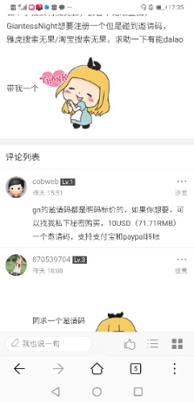

# 如何看待gn邀请码明码标价71RMB？

作者：黒茶鯖虎

TID：29749

<title>1</title> <link href="../Styles/Style.css" type="text/css" rel="stylesheet">

# 1

一个邀请码价值71RMB，真香。 <title>2</title> <link href="../Styles/Style.css" type="text/css" rel="stylesheet">

# 2

 <ignore_js_op>[Screenshot_20201102_123541_com.huawei.browser.jpg](forum.php?mod=attachment&aid=ODU4MDJ8NDc1ZmQ3YWJ8MTY3NDA2ODU0NHwxODIzMHwyOTc0OQ%3D%3D&nothumb=yes) *(25.61 KB, 下載次數: 14)*

[下載附件](forum.php?mod=attachment&aid=ODU4MDJ8NDc1ZmQ3YWJ8MTY3NDA2ODU0NHwxODIzMHwyOTc0OQ%3D%3D&nothumb=yes)

2020-11-2 12:37 上傳  

</ignore_js_op> <title>3</title> <link href="../Styles/Style.css" type="text/css" rel="stylesheet">

# 3

哇浪，这么厉害（后跳）哪里能买到呢 <title>4</title> <link href="../Styles/Style.css" type="text/css" rel="stylesheet">

# 4

*本帖最後由 AK45 於 2020-11-2 13:00 編輯*

在隔壁，买到就是赚到，多买多送。 <title>5</title> <link href="../Styles/Style.css" type="text/css" rel="stylesheet">

# 5

个人觉得在邀请码制度不能放宽的情况下，积分多的大佬们用20到30块钱去隔壁打价格战。71块钱还是太贵了，把价格打下来的话萌新也能接受的。 <title>6</title> <link href="../Styles/Style.css" type="text/css" rel="stylesheet">

# 6

因为现实就是存在萌新不认识有积分的大佬，只能去隔壁买。然而隔壁价格太高，有像是点被垄断了。这里只是建议大佬出售邀请码的价格低点，把价格打下来，让花钱买的萌新好受一些。 <title>7</title> <link href="../Styles/Style.css" type="text/css" rel="stylesheet">

# 7

要是这个帖子能让隔壁老哥把71块降价到70块钱的话，也算是有1点意义的帖子了吧。 <title>8</title> <link href="../Styles/Style.css" type="text/css" rel="stylesheet">

# 8

话说回来，如果那些想用积分换钱的大佬把邀请码发给了伪装成萌新的挑事者，不是两个人号都没了吗？
所以说实在的，我有些怀疑那些高价卖邀请码的所谓“大佬”会不会自己的积分来路都见不得光呢！？ <title>9</title> <link href="../Styles/Style.css" type="text/css" rel="stylesheet">

# 9

现在价格是71块，所以挑事的人买邀请码成本太大，一般是萌新。要是价格低了话，挑事者的成本就低了，也会买，所以建议把价格调整到20到50这个区间，让萌新好受些，同时挑事者看到价格不是那么便宜，也大概率不会买了。 <title>10</title> <link href="../Styles/Style.css" type="text/css" rel="stylesheet">

# 10

截图里的那个账号我专门去看了下，5月份注册，没发过任何主题，目前发且仅发表过这一次回复。很可能是准备捞一笔就删号的骗子小号。。。
<title>11</title> <link href="../Styles/Style.css" type="text/css" rel="stylesheet">

# 11

所以有人有tgfun的邀请码吗 <title>12</title> <link href="../Styles/Style.css" type="text/css" rel="stylesheet">

# 12

啊？那我发财了（棒读） <title>13</title> <link href="../Styles/Style.css" type="text/css" rel="stylesheet">

# 13

头一次听这个邀请码还能这样操作。。 <title>14</title> <link href="../Styles/Style.css" type="text/css" rel="stylesheet">

# 14

发财了 这就卖注册码（狗头）

不会吧，这种东西也在那边卖，隔壁那帮人也太恶心了 <title>15</title> <link href="../Styles/Style.css" type="text/css" rel="stylesheet">

# 15

官方聲明：如果有查到售賣邀請碼的話，那麼該賬號和買到的ID一同封禁 <title>16</title> <link href="../Styles/Style.css" type="text/css" rel="stylesheet">

# 16

这么久了从来不知道有邀请码，怎么卖邀请码，我是从2000年就跟着但大的 <title>17</title> <link href="../Styles/Style.css" type="text/css" rel="stylesheet">

# 17

我都免费送了三个邀请码出去了 <title>18</title> <link href="../Styles/Style.css" type="text/css" rel="stylesheet">

# 18

这件事本身就违反版规，但很难举证就是了。
如果买的人是个正常人，正常发帖啥的倒也没差，风险他自己承担。

如果买的人只想要搜刮GN资源，并以各种方式高级灌水，发挑拨言论让自己加入话题，发盗版资源卖钱等违法洽分，最后大概也没得好下场，管理一抓就血本无归了。
<title>19</title> <link href="../Styles/Style.css" type="text/css" rel="stylesheet">

# 19

讲真的，GN什么时候收紧注册了。。。现在看来我还挺庆幸注册的早哈哈 <title>20</title> <link href="../Styles/Style.css" type="text/css" rel="stylesheet">

# 20

哪裏有需求
哪裏就有炒賣

不過個人覺得門檻是高了點，沒熟人帶路很難進來 <title>21</title> <link href="../Styles/Style.css" type="text/css" rel="stylesheet">

# 21

> [紫色欧石楠 發表於 2020-11-2 12:53](https://giantessnight.cf/gnforum2012/forum.php?mod=redirect&goto=findpost&pid=451036&ptid=29749)
> 哇浪，这么厉害（后跳）哪里能买到呢

巧了，我身上就有一粒，看你敢不敢磕了？
<title>22</title> <link href="../Styles/Style.css" type="text/css" rel="stylesheet">

# 22

现在原创文章区开新帖，写一篇不少于1200字，规定上不水的短文给20积分
普通会员2000积分=一个兑换码=明码标价71块，也就是说
71块=100篇文
算一篇文就正好1200字不多不少
71块=120000字
五味杂陈

<title>23</title> <link href="../Styles/Style.css" type="text/css" rel="stylesheet">

# 23

> [紫色欧石楠 發表於 2020-11-2 12:53](https://giantessnight.cf/gnforum2012/forum.php?mod=redirect&goto=findpost&pid=451036&ptid=29749)
> 哇浪，这么厉害（后跳）哪里能买到呢

潮学suki

-----一般通过木毛饼干
<title>24</title> <link href="../Styles/Style.css" type="text/css" rel="stylesheet">

# 24

明码标价？
我觉得不这么样 你要是官方的号来卖还行 至少可以当服务器的经费（
像这种就是纯恰烂????或者是骗子 <title>25</title> <link href="../Styles/Style.css" type="text/css" rel="stylesheet">

# 25

啥邀请码（来自不明所以的吃瓜群众） <title>26</title> <link href="../Styles/Style.css" type="text/css" rel="stylesheet">

# 26

在现场，我就是那个求邀请码的人，我当时差点就自闭了，好在有好心人帮助，目前收集素材，
缩小本还肝的下去。 <title>27</title> <link href="../Styles/Style.css" type="text/css" rel="stylesheet">

# 27

> [violetsnow 發表於 2020-11-14 14:56](https://giantessnight.cf/gnforum2012/forum.php?mod=redirect&goto=findpost&pid=451774&ptid=29749)
> 版规里面有这样一条吗？或者论坛规定。

这种事不用多想吧。。。今天你官方默认这种行为合法，明天就有看上这71RMB的人开脚本或是手动屠版混分换钱，一个漫画区勋章就已经炸出一堆水怪，何况是能换真金白银的邀请码
<title>28</title> <link href="../Styles/Style.css" type="text/css" rel="stylesheet">

# 28

居然还有这种操作，服了服了 <title>29</title> <link href="../Styles/Style.css" type="text/css" rel="stylesheet">

# 29

阿哲，gn现在已经要邀请码才能注册了吗