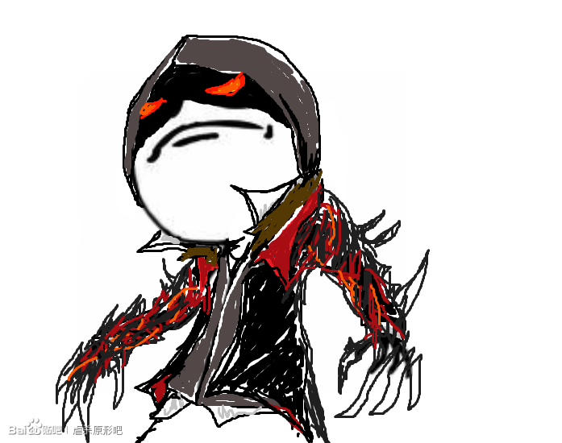
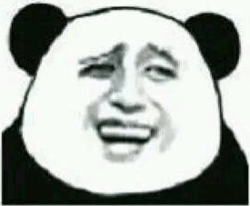
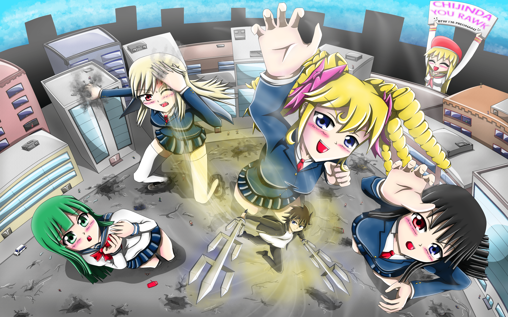

# 如果你是地仁田，你要怎麼擊敗比自己大上100倍的女巨人？

作者：雪鸮吟游诗人

TID：21625

<title>1</title> <link href="../Styles/Style.css" type="text/css" rel="stylesheet">

# 1

打倒，擊退，戰勝，隨便你們喜歡用什麼詞

反正只要能讓自己脫離女巨人的威脅都算

另外這裡指的是遊戲中期，除了自己以外的東西都很巨大的那種狀態

所以雖然不限定只能使用遊戲中出現的武器，但請儘量符合自己的身體大小

我很想吐槽這種比例大小根本戰都不必戰，那些女孩子光是一腳就能把地仁田踩成肉醬了
而且地仁田明明只是偵探，卻有這種不合常理的生存及戰鬥能力

我覺得他應該改行開國術館才對

<title>2</title> <link href="../Styles/Style.css" type="text/css" rel="stylesheet">

# 2

*本帖最後由 a8071504 於 2016-8-20 16:34 編輯*

。。。不知道楼主玩过斗兽棋没有，我记得老鼠是可以吃大象的。。。

可参考老鼠是如何战胜大象的，貌似是，钻到鼻子里？

话说《缩学》本身就是不科学的，实际可行的方法估计也就是钻到五官内了。。。
<title>3</title> <link href="../Styles/Style.css" type="text/css" rel="stylesheet">

# 3

这还用想....当然是....下跪求饶QAQ <title>4</title> <link href="../Styles/Style.css" type="text/css" rel="stylesheet">

# 4

和她们约会！让她们娇羞！ <title>5</title> <link href="../Styles/Style.css" type="text/css" rel="stylesheet">

# 5

渣田：现在投降还能给你留个全尸
<ignore_js_op>

**1371446081-697x550.png** *(83.46 KB, 下載次數: 0)*

[下載附件](forum.php?mod=attachment&aid=NjMyMTJ8YzI3OGM3ZTl8MTY3NDA2Nzg1NnwxODIzMHwyMTYyNQ%3D%3D&nothumb=yes)

2016-8-20 17:32 上傳

什么？你不投降？还想踩我？

着法宝
<ignore_js_op>

**QQ图片20160820172950.png** *(13.11 KB, 下載次數: 0)*

[下載附件](forum.php?mod=attachment&aid=NjMyMTR8YTAzNzBkNjl8MTY3NDA2Nzg1NnwxODIzMHwyMTYyNQ%3D%3D&nothumb=yes)

2016-8-20 17:33 上傳

怕了吧，少废话，把我放到乳沟里
<ignore_js_op>

**QQ截图20160820173210.png** *(52.36 KB, 下載次數: 0)*

[下載附件](forum.php?mod=attachment&aid=NjMyMTN8NmVjNWM4ZTB8MTY3NDA2Nzg1NnwxODIzMHwyMTYyNQ%3D%3D&nothumb=yes)

2016-8-20 17:33 上傳

<title>6</title> <link href="../Styles/Style.css" type="text/css" rel="stylesheet">

# 6

> [，，，， 發表於 2016-8-20 17:27](https://giantessnight.cf/gnforum2012/forum.php?mod=redirect&goto=findpost&pid=304963&ptid=21625)
> 和她们约会！让她们娇羞！

    一个没玩好  再让她们反转就不好了
<title>7</title> <link href="../Styles/Style.css" type="text/css" rel="stylesheet">

# 7

应该先刷上个好装备吧，我可是很爱惜自己的生命的呀 <title>8</title> <link href="../Styles/Style.css" type="text/css" rel="stylesheet">

# 8

理論上無線睡+毒慢慢耗死。但是實際上人類連鞋子都登不上去更別說扎了…… <title>9</title> <link href="../Styles/Style.css" type="text/css" rel="stylesheet">

# 9

怎么击败？当然是用拳头打，不过无故打女生毕竟不是好的行为，女生大100倍也一样 <title>10</title> <link href="../Styles/Style.css" type="text/css" rel="stylesheet">

# 10

帝王神     无所畏惧 <title>11</title> <link href="../Styles/Style.css" type="text/css" rel="stylesheet">

# 11

用JJ轮死………………………… <title>12</title> <link href="../Styles/Style.css" type="text/css" rel="stylesheet">

# 12

我想说对于这么小的人来说 女生身上的衣物尤其是坚硬的皮鞋对于战斗来说简直难以攻破 尤其是武器问题难以解决 据就算把手枪缩小100倍 我觉得也难以对鞋子造成严重的伤害 <title>13</title> <link href="../Styles/Style.css" type="text/css" rel="stylesheet">

# 13

*本帖最後由 dragon1230 於 2016-8-20 19:32 編輯*

还是不要打了，毕竟体型差距造成一定的劣势。
如果有个传送门飞来飞去那就好了。印度神油是必须有的提升精神的必备品
<title>14</title> <link href="../Styles/Style.css" type="text/css" rel="stylesheet">

# 14

人靠衣装马靠鞍，有一套超级神装估计才能在女巨人脚下生存，神装起码得+10 <title>15</title> <link href="../Styles/Style.css" type="text/css" rel="stylesheet">

# 15

把她們全收進后宮
簡單直接 <title>16</title> <link href="../Styles/Style.css" type="text/css" rel="stylesheet">

# 16

先把防御提上去，打不死；再把攻击提上去，一招秒，纯粹的等级数字计算问题。实在不行上死亡笔记 <title>17</title> <link href="../Styles/Style.css" type="text/css" rel="stylesheet">

# 17

*本帖最後由 zlm18800000 於 2016-8-20 20:59 編輯*

这话题正好能吐槽我多年的脑洞~
1.凑齐神装，学好超能力，然后就硬怼。
2.用力怼！给女孩子们留下深刻印象。
 3.回复身体再向她们认怂，博取同情。对这些残酷系的妹子灌酒约会软硬皆施，统统调教成温柔系的软妹。
 4.小人状态推倒一次。再用正常身体推倒一次，彻底攻略~

地仁田算是我印象最深刻的男主之一了，虽然在游戏里各种死。。。但是仔细想想还是很帅气啊。要是立绘再帅气点就好了。

被缩小后一般人肯定都想着找地方躲起来苟活，这家伙还执着于拯救世界。果然是有颗大英雄的心才能攻略巨大少女呢

顺便安利这张图。
脑补起来怎么看都是地仁田把所有妹子都攻略后，力战四天王各种调教，把妹子们弄得脸红心跳，怎么看怎么帅

<ignore_js_op></ignore_js_op> **181247b9l020yaag22072e.jpg** *(5.23 MB, 下載次數: 0)*

[下載附件](forum.php?mod=attachment&aid=NjMyMzB8ODViMjI2NDd8MTY3NDA2Nzg2MXwxODIzMHwyMTYyNQ%3D%3D&nothumb=yes)

2016-8-20 20:35 上傳 

那么问题来了~大家心目中的地仁田正妻是谁呢？

看完外传的我表示黑成慧实在太可怕了，傲娇副部长正妻赛高~

<title>18</title> <link href="../Styles/Style.css" type="text/css" rel="stylesheet">

# 18

當然是找成惠來幫忙
然後自己找空隙補刀
<title>19</title> <link href="../Styles/Style.css" type="text/css" rel="stylesheet">

# 19

...弱者为何要战斗！？ <title>20</title> <link href="../Styles/Style.css" type="text/css" rel="stylesheet">

# 20

> [，，，， 發表於 2016-8-20 17:27](https://giantessnight.cf/gnforum2012/forum.php?mod=redirect&goto=findpost&pid=304963&ptid=21625)
> 和她们约会！让她们娇羞！

Date a live梗?

說到擊敗，在這種力量差距下，活下來就是勝了。
要讓自己活下來，首先要讓對方覺得你死了很可惜，所以要迎合對方喜好，避免向以強欺弱的路線走;
如果對方只是個虐殺控，那就要讓她覺得讓你活著她能虐殺更多人;
可行的話，儘可能引發她的母性保護慾，取得安全後，再一一克服其他人...

太累了，還是給我個痛快吧！(躺
<title>21</title> <link href="../Styles/Style.css" type="text/css" rel="stylesheet">

# 21

只有偷偷进入巨人，下面然后再考虑了 <title>22</title> <link href="../Styles/Style.css" type="text/css" rel="stylesheet">

# 22

不要打架不要打架
我有金坷垃 <title>23</title> <link href="../Styles/Style.css" type="text/css" rel="stylesheet">

# 23

把巨大娘收進后宮 用小人的身軀 讓女孩子徹底愛上
(如果先攻略部長或副部長這兩個好女孩 然後其他的就知道這傢伙是重要人士的寵物 所以不會殺死)
<title>24</title> <link href="../Styles/Style.css" type="text/css" rel="stylesheet">

# 24

实际上在我玩所学的时候有一个装备叫帝王神 一打打一队自带麻痹效果，学了双持之后还能上毒···
基本上都是直接碾过去的 <title>25</title> <link href="../Styles/Style.css" type="text/css" rel="stylesheet">

# 25

death note扩展一下就是最强的凶器，神都可以秒 <title>26</title> <link href="../Styles/Style.css" type="text/css" rel="stylesheet">

# 26

帝王神加笔记，不怕    <title>27</title> <link href="../Styles/Style.css" type="text/css" rel="stylesheet">

# 27

直接躺在地上，被踩死不就好了 <title>28</title> <link href="../Styles/Style.css" type="text/css" rel="stylesheet">

# 28

毒杀比较好吧，破坏敌人内部。（前提是进去的时候还活着）。 <title>29</title> <link href="../Styles/Style.css" type="text/css" rel="stylesheet">

# 29

求饶才是关键，没有能力跟外传假地仁田一样，秒躺。。。 <title>30</title> <link href="../Styles/Style.css" type="text/css" rel="stylesheet">

# 30

溜金哇开呀酷裂！
正常情况下缩小100倍的话完全没胜算嘛... <title>31</title> <link href="../Styles/Style.css" type="text/css" rel="stylesheet">

# 31

如果说单纯缩小一百倍，身体密度不变的话完虐女巨人，一拳就够了 <title>32</title> <link href="../Styles/Style.css" type="text/css" rel="stylesheet">

# 32

普通手掌或是赤足，闪避踩踏后用利刃慢慢刺。 穿鞋的无非相当于穿个护甲。 后期属性攻击就很容易了。 然而这一切都只能由自带主角光环和无限读档的地仁田才能完成。... <title>33</title> <link href="../Styles/Style.css" type="text/css" rel="stylesheet">

# 33

不是有超能力设定嘛
说来感觉这个大小的战斗，男主根本没必要有HP槽。。。只有闪避成功和死亡两种可能吧 <title>34</title> <link href="../Styles/Style.css" type="text/css" rel="stylesheet">

# 34

> [無邊落木 發表於 2016-8-20 22:56](https://giantessnight.cf/gnforum2012/forum.php?mod=redirect&goto=findpost&pid=305034&ptid=21625)
> Date a live梗?

对，我玩的就是约炮大作战的梗。
可是现实世界中，这种人几乎是不存在的，我们应该认清现实。
但如果是我的话，我想我可以做到（认真）。
我会承担起拯救世界的责任的！所以你们都别动，放着我来！
<title>35</title> <link href="../Styles/Style.css" type="text/css" rel="stylesheet">

# 35

> [zlm18800000 發表於 2016-8-20 20:54](https://giantessnight.cf/gnforum2012/forum.php?mod=redirect&goto=findpost&pid=305008&ptid=21625)
> 这话题正好能吐槽我多年的脑洞~
> 1.凑齐神装，学好超能力，然后就硬怼。

层主所见略同。这游戏还有个小遗憾就是缩小时地仁田没和副部长对战打。只是被踩过。。
<title>36</title> <link href="../Styles/Style.css" type="text/css" rel="stylesheet">

# 36

装备妹控炮和彻甲弹打观测射击。 <title>37</title> <link href="../Styles/Style.css" type="text/css" rel="stylesheet">

# 37

很简单，正常情况下，缩小100倍，身形不变的话力量就不会缩小太多，速度也变得非常快，同时跳跃力也变强 <title>38</title> <link href="../Styles/Style.css" type="text/css" rel="stylesheet">

# 38

> [a8071504 發表於 2016-8-20 16:30](https://giantessnight.cf/gnforum2012/forum.php?mod=redirect&goto=findpost&pid=304957&ptid=21625)
> 。。。不知道楼主玩过斗兽棋没有，我记得老鼠是可以吃大象的。。。
> 
> 可参考老鼠是如何战胜大象的，貌似是， ...

其实，如果较真，老鼠是不可能钻进大象的鼻子里的。别的动物先不说，老鼠肯定是不会让大象怕
<title>39</title> <link href="../Styles/Style.css" type="text/css" rel="stylesheet">

# 39

攻略女巨人不就得了2333 <title>40</title> <link href="../Styles/Style.css" type="text/css" rel="stylesheet">

# 40

認真說
這傢伙有超能力素質
精神力夠強的話
光靠念動力(テレキネシス)跟超能壁障(サイコバリア)應該是能抵擋即死攻擊
另外不管對手多大
理論上小型黑洞(デスボール)一招就能秒殺敵人
殺不死最少也能把腳蒸發掉

所以遊戲本篇的地仁田其實都手下留情了(誤

沒超能力的結果就是參考成惠日記...... <title>41</title> <link href="../Styles/Style.css" type="text/css" rel="stylesheet">

# 41

我选择狗带 怎么想都弄不到黑科技或者超能力 但是如果是地仁田的话主角光环不就是最好的武器么。什么奇奇怪怪的东西都能搞到。 <title>42</title> <link href="../Styles/Style.css" type="text/css" rel="stylesheet">

# 42

给我一个主角光环，多大的女巨人都不在话下（手动滑稽） <title>43</title> <link href="../Styles/Style.css" type="text/css" rel="stylesheet">

# 43

干嘛非要打败
被女生当宠物养起来不好吗 <title>44</title> <link href="../Styles/Style.css" type="text/css" rel="stylesheet">

# 44

再来找一个一万倍的，踩！ <title>45</title> <link href="../Styles/Style.css" type="text/css" rel="stylesheet">

# 45

我要发挥我理工科的思维了。
假设物体缩小后弹性系数和模量都不变，质量以长度的立方减小，身体内肌肉的横截面（假设肌肉横截面宽度和力气大小有关）就会按照长度的平方减小。这样一来缩小的人类应该是更加有效率的一种生存单位（具体参考蚂蚁）。好好利用其体积小隐蔽都高的优势，完全可以进行潜行+下毒的作战，因为不管多大的身体对剧毒的忍耐力都是很低的... （不过这样太不绅士了，果然好是要找一些不会致死但是会让人失去战斗力的好药物，请化工的同学们来答题。） <title>46</title> <link href="../Styles/Style.css" type="text/css" rel="stylesheet">

# 46

讲道理，玩的时候就有想，他就不能到化学部哪里偷些氰化物下毒吗，这种东西微量就能致命，拿的动，还安全</ignore_js_op></ignore_js_op></ignore_js_op>