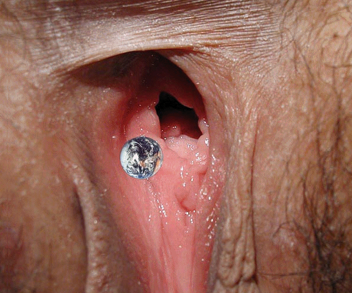

# 如果地球被超級巨屄吞了..

作者：拉斯特洛熙

TID：10069

<title>1</title> <link href="../Styles/Style.css" type="text/css" rel="stylesheet">

# 1

如果超級女巨人的陰道直徑是地球十倍以上,把地球吸進去,
那地球還沒被吞進去之前,受引力影響,會發生什麼天災? <title>2</title> <link href="../Styles/Style.css" type="text/css" rel="stylesheet">

# 2

很难想象 <title>3</title> <link href="../Styles/Style.css" type="text/css" rel="stylesheet">

# 3

洗洗更健康瞬间全球脱销！ <title>4</title> <link href="../Styles/Style.css" type="text/css" rel="stylesheet">

# 4

全民凍僵
然後全民被強大引力吸離地球，去到巨屄裡.................
 <title>5</title> <link href="../Styles/Style.css" type="text/css" rel="stylesheet">

# 5

引力？不得用手指头顶么！ <title>6</title> <link href="../Styles/Style.css" type="text/css" rel="stylesheet">

# 6

地球在进去前就会被这个gts身上的引力给撕成碎片的。 <title>7</title> <link href="../Styles/Style.css" type="text/css" rel="stylesheet">

# 7

距離這麼遠會造成巨大引力本身就是一個疑問...
嘛 我只知道最後大家都活不了 <title>8</title> <link href="../Styles/Style.css" type="text/css" rel="stylesheet">

# 8

唔……
那样的话地球会变成全是粘液的世界 <title>9</title> <link href="../Styles/Style.css" type="text/css" rel="stylesheet">

# 9

如果进到里面去的话 引力的方向就是向内 那么在巨大的引力下，地球上的所有东西都会被压缩到原来体积的几亿分之一……（很不负责任地说 <title>10</title> <link href="../Styles/Style.css" type="text/css" rel="stylesheet">

# 10

粉碎應該不會,
應該會有超級大地震、超級海嘯、
地震可能讓整座山震垮,
但即使地面破爛不堪,但程度這和粉碎離很遠,
因為世界第一高峰,只不過是地球半徑1/700而已 <title>11</title> <link href="../Styles/Style.css" type="text/css" rel="stylesheet">

# 11

話說封閉空間沒有場的... <title>12</title> <link href="../Styles/Style.css" type="text/css" rel="stylesheet">

# 12

你先告诉大家伙这个超级巨大无比的女巨人身体密度是多少？我才能算出来引力场多大？还有你这个假设前提不存在，你不能那虚幻的东西和现实世界的物理定律混杂一起来判断，你可以想像成为这个是黑洞或者其它大天体。
这个问题答案就是你希望有什么样的结果那就是什么样子。 <title>13</title> <link href="../Styles/Style.css" type="text/css" rel="stylesheet">

# 13

這是...高斯原理? <title>14</title> <link href="../Styles/Style.css" type="text/css" rel="stylesheet">

# 14

我才没想过整天泡在粘液里生活呢！！！混蛋…… <title>15</title> <link href="../Styles/Style.css" type="text/css" rel="stylesheet">

# 15

記得樓主之前有張比這個尺寸還巨大的圖

嗯...這完全只有人禍而已吧~ <title>16</title> <link href="../Styles/Style.css" type="text/css" rel="stylesheet">

# 16

「还有你这个假设前提不存在，你不能那虚幻的东西和现实世界的物理定律混杂一起来判断，」
你可以說假設-推論不合邏輯，但不能說一個假設不存在，因為你如何定義不存在呢?
對14世紀的人來說，人類可以足不出戶購物是不可能，因為人類可以不親身到達店舖的這個假設是不存在的，於是
「你不能將那虚幻的东西和现实世界的物理定律混杂一起来判断!」 <title>17</title> <link href="../Styles/Style.css" type="text/css" rel="stylesheet">

# 17

地球，会塌缩么？还是会磁极颠倒，偏离航道。
人类，乃至整个生物，（可能有些微生物能活下来），全部从宇宙中被抹去地一干二净~ <title>18</title> <link href="../Styles/Style.css" type="text/css" rel="stylesheet">

# 18

地球变水球  人比细菌还要小  细菌的体积跟恐龙差不多了 汗  全灭的结果 <title>19</title> <link href="../Styles/Style.css" type="text/css" rel="stylesheet">

# 19

很难现象... 会世界末日吗？ <title>20</title> <link href="../Styles/Style.css" type="text/css" rel="stylesheet">

# 20

不幸的话，地球将变成血的世界  <title>21</title> <link href="../Styles/Style.css" type="text/css" rel="stylesheet">

# 21

有图无真相…………………… <title>22</title> <link href="../Styles/Style.css" type="text/css" rel="stylesheet">

# 22

 <ignore_js_op>[20080614_67023b13e315493c9aafJLmViBoMlQlc.gif](forum.php?mod=attachment&aid=MjkwODZ8NmNkOWUwY2R8MTY3NDA2ODY4MnwxODIzMHwxMDA2OQ%3D%3D&nothumb=yes) *(222.91 KB, 下載次數: 13)*

[下載附件](forum.php?mod=attachment&aid=MjkwODZ8NmNkOWUwY2R8MTY3NDA2ODY4MnwxODIzMHwxMDA2OQ%3D%3D&nothumb=yes)

2012-6-25 23:15 上傳  

</ignore_js_op> <title>23</title> <link href="../Styles/Style.css" type="text/css" rel="stylesheet">

# 23

我觉得在到女巨人嘴里之前  人先被洗过大气层 估计都烧成灰了