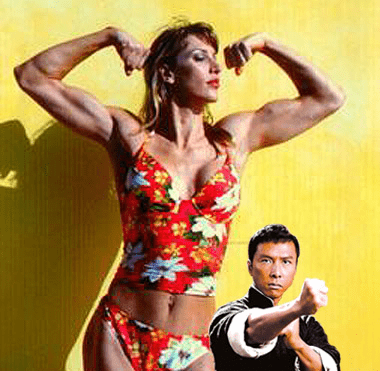

# 如果葉問和210cm肌肉女隻揪

作者：chatina

TID：8150

<title>1</title> <link href="../Styles/Style.css" type="text/css" rel="stylesheet">

# 1

210cm肌肉女
三圍47-34-44
体重105kg

葉問本人應該只有150cm,
甄子丹本身就矮了,但還比葉問本人高一個頭。

如果葉問在30歲的時候,打得過210cm肌肉女嗎? <title>2</title> <link href="../Styles/Style.css" type="text/css" rel="stylesheet">

# 2

 <ignore_js_op>[Untitled-1.jpg](forum.php?mod=attachment&aid=MjA5MTB8Yjc0NDllMjd8MTY3NDA3MDM5N3wxODIzMHw4MTUw&nothumb=yes) *(66.6 KB, 下載次數: 32)*

[下載附件](forum.php?mod=attachment&aid=MjA5MTB8Yjc0NDllMjd8MTY3NDA3MDM5N3wxODIzMHw4MTUw&nothumb=yes)

2010-6-12 13:10 上傳  

</ignore_js_op> <title>3</title> <link href="../Styles/Style.css" type="text/css" rel="stylesheet">

# 3

- -没可比性好伐……
咱可不想看到甄子丹跟MM对打的糟糕场面…… <title>4</title> <link href="../Styles/Style.css" type="text/css" rel="stylesheet">

# 4

老實說，我被那女的嚇傻了。 <title>5</title> <link href="../Styles/Style.css" type="text/css" rel="stylesheet">

# 5

電影把葉問和詠春都神化了，葉問出走到香港原因是原本葉問層經在國民黨內工作，怕被共產黨清算所以逃亡。但為了中國市場，電影公司改了葉被日軍迫害......... <title>6</title> <link href="../Styles/Style.css" type="text/css" rel="stylesheet">

# 6

好大的違和感 <title>7</title> <link href="../Styles/Style.css" type="text/css" rel="stylesheet">

# 7

还是让叶问赢吧，这女的 <title>8</title> <link href="../Styles/Style.css" type="text/css" rel="stylesheet">

# 8

- -算了吧。。这女的打得过拳王再说吧。。 <title>9</title> <link href="../Styles/Style.css" type="text/css" rel="stylesheet">

# 9

如果被她夹在胯下 我想他一定想死... <title>10</title> <link href="../Styles/Style.css" type="text/css" rel="stylesheet">

# 10

    躲在一边无言中……