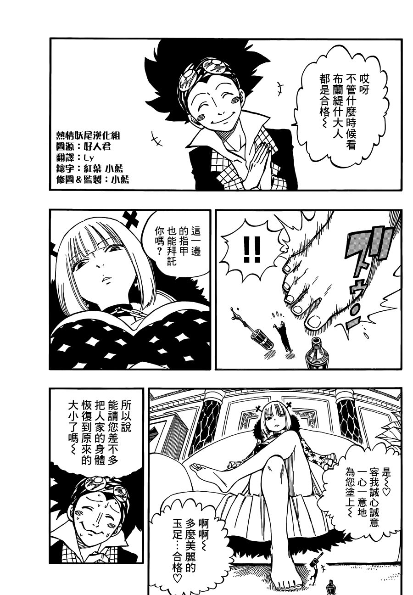
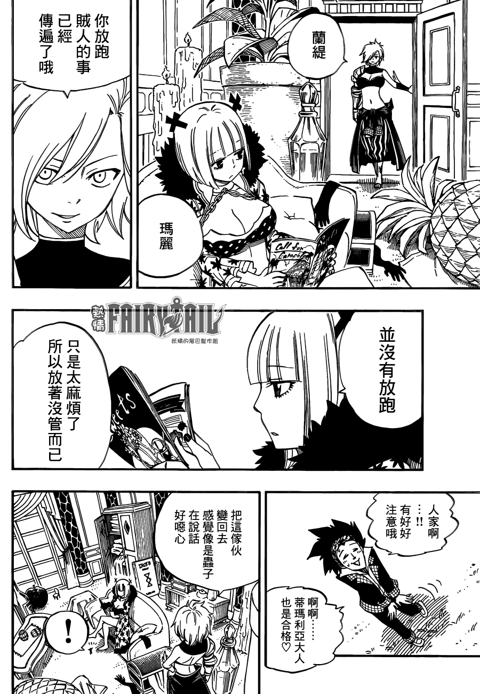
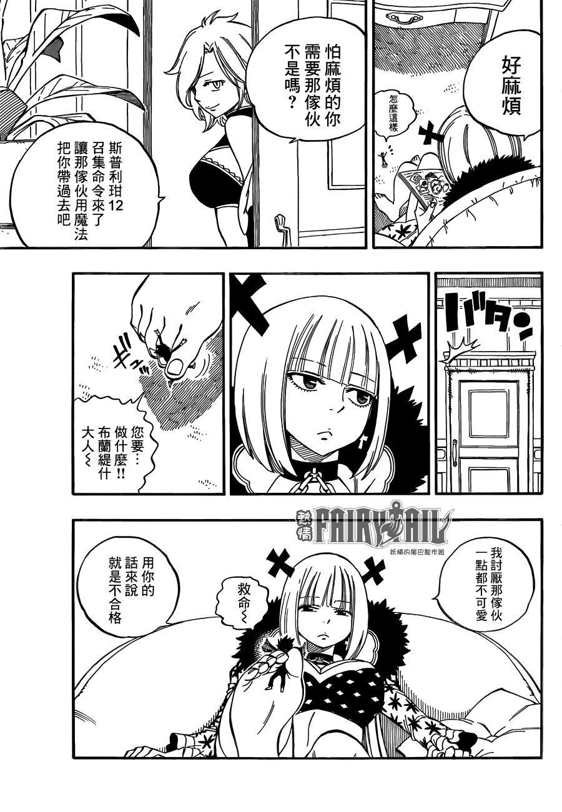

# 妖精的尾巴中的足控向擦边球

作者：我只是路过

TID：19841

<title>1</title> <link href="../Styles/Style.css" type="text/css" rel="stylesheet">

# 1

如题，妖尾真是让我无语了

<ignore_js_op>

**JOJO_002.png** *(141.79 KB, 下載次數: 0)*

[下載附件](forum.php?mod=attachment&aid=NTQ1Mjl8ZTFiZjVhYzN8MTY3NDA2ODg3M3wxODIzMHwxOTg0MQ%3D%3D&nothumb=yes)

2015-9-23 13:31 上傳

<ignore_js_op>

**JOJO_003.png** *(228.37 KB, 下載次數: 0)*

[下載附件](forum.php?mod=attachment&aid=NTQ1MzB8YWY2YTk0N2R8MTY3NDA2ODg3M3wxODIzMHwxOTg0MQ%3D%3D&nothumb=yes)

2015-9-23 13:31 上傳

<ignore_js_op>

**JOJO_004.png** *(169.23 KB, 下載次數: 0)*

[下載附件](forum.php?mod=attachment&aid=NTQ1MzF8ZmI1MzA4YTJ8MTY3NDA2ODg3M3wxODIzMHwxOTg0MQ%3D%3D&nothumb=yes)

2015-9-23 13:31 上傳

<title>2</title> <link href="../Styles/Style.css" type="text/css" rel="stylesheet">

# 2

[http://giantessnight.com/gnforum ... 4%E5%B0%BE%E5%B7%B4](http://giantessnight.com/gnforum2012/forum.php?mod=viewthread&tid=19801&highlight=%E5%A6%96%E7%B2%BE%E7%9A%84%E5%B0%BE%E5%B7%B4) <title>3</title> <link href="../Styles/Style.css" type="text/css" rel="stylesheet">

# 3

你是第3个发这个帖子的人。。。致远星战况如何？ <title>4</title> <link href="../Styles/Style.css" type="text/css" rel="stylesheet">

# 4

虽然是碰巧的gts情节   但是意外地不错啊 <title>5</title> <link href="../Styles/Style.css" type="text/css" rel="stylesheet">

# 5

已经是第三个说这件事的人了吧=3=虽然的确很棒吧~ <title>6</title> <link href="../Styles/Style.css" type="text/css" rel="stylesheet">

# 6

这个确实看到好几遍了-0- <title>7</title> <link href="../Styles/Style.css" type="text/css" rel="stylesheet">

# 7

确实很棒啊，最喜欢的动漫也有如此情节！ <title>8</title> <link href="../Styles/Style.css" type="text/css" rel="stylesheet">

# 8

楼主本想撞车的结果追尾都没赶上，尾灯都看不到了哈哈哈 <title>9</title> <link href="../Styles/Style.css" type="text/css" rel="stylesheet">

# 9

FAIRY TAIL終於也出現GTS了呢!!!! <title>10</title> <link href="../Styles/Style.css" type="text/css" rel="stylesheet">

# 10

连环车祸事故 哈哈哈！ <title>11</title> <link href="../Styles/Style.css" type="text/css" rel="stylesheet">

# 11

大赞，大爱，这真是极好的 <title>12</title> <link href="../Styles/Style.css" type="text/css" rel="stylesheet">

# 12

就情节而言，确实是很不错，足控的福利 <title>13</title> <link href="../Styles/Style.css" type="text/css" rel="stylesheet">

# 13

这等擦边已然不易，不禁更想看之后的发展，果然撞车系列 <title>14</title> <link href="../Styles/Style.css" type="text/css" rel="stylesheet">

# 14

问下楼主 动画出到这里了吗？ <title>15</title> <link href="../Styles/Style.css" type="text/css" rel="stylesheet">

# 15

> [曜月天狼 發表於 2016-2-2 10:27](https://giantessnight.cf/gnforum2012/forum.php?mod=redirect&goto=findpost&pid=282262&ptid=19841)
> 问下楼主 动画出到这里了吗？

漫画才刚到这里不久 动画还差得远呢 不要急 <title>16</title> <link href="../Styles/Style.css" type="text/css" rel="stylesheet">

# 16

目前就只有这一次…… <title>17</title> <link href="../Styles/Style.css" type="text/css" rel="stylesheet">

# 17

我的天啊啊啊啊啊啊啊好棒啊 <title>18</title> <link href="../Styles/Style.css" type="text/css" rel="stylesheet">

# 18

不错，谢谢楼主。。。。。。。 <title>19</title> <link href="../Styles/Style.css" type="text/css" rel="stylesheet">

# 19

好久以前就有人发了吧~~
花式撞车</ignore_js_op></ignore_js_op></ignore_js_op>