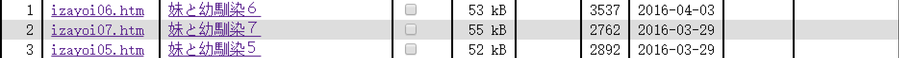

# 妹と幼馴染系列更新到8.9.10

作者：devil145

TID：20896

<title>1</title> <link href="../Styles/Style.css" type="text/css" rel="stylesheet">

# 1

*本帖最後由 雨天de纸飞机 於 2016-4-24 00:36 編輯*

三月底的更新最近一次上gs才注意到。又是[妹と幼馴染](http://gs-uploader.jpn.org/upld-view-document.php?file=/documents/hearthiel/izayoi06.htm)系列，5是城市文，6是一千倍缩小男文，7是minigts(?)嗯，如果有野生的翻译君接坑就太棒了

补充：第八章城市文，第九章放尿，第十章是幼驯染回合的缩小文。

<title>2</title> <link href="../Styles/Style.css" type="text/css" rel="stylesheet">

# 2

 <ignore_js_op>[捕获.PNG](forum.php?mod=attachment&aid=NjA2MTd8Y2MwYjgwMTV8MTY3NDA2ODk0M3wxODIzMHwyMDg5Ng%3D%3D&nothumb=yes) *(14.8 KB, 下載次數: 22)*

[下載附件](forum.php?mod=attachment&aid=NjA2MTd8Y2MwYjgwMTV8MTY3NDA2ODk0M3wxODIzMHwyMDg5Ng%3D%3D&nothumb=yes)

2016-4-7 22:27 上傳  

</ignore_js_op> <title>3</title> <link href="../Styles/Style.css" type="text/css" rel="stylesheet">

# 3

好的译者已经走了 <title>4</title> <link href="../Styles/Style.css" type="text/css" rel="stylesheet">

# 4

楼主你这个帖子我还以为今天又更新啦。。。。。。  原来是上次的。  用软件翻译凑合看了下 <title>5</title> <link href="../Styles/Style.css" type="text/css" rel="stylesheet">

# 5

才不给你翻译呢哼~ <title>6</title> <link href="../Styles/Style.css" type="text/css" rel="stylesheet">

# 6

全程無足控福利，感覺十六夜桑你變了嗯ヾ(｡｀Д´｡) <title>7</title> <link href="../Styles/Style.css" type="text/css" rel="stylesheet">

# 7

哦吼！想看！紫薯布丁~ <title>8</title> <link href="../Styles/Style.css" type="text/css" rel="stylesheet">

# 8

太棒了，十六夜又更新了，虽然自己不懂，但是还是借助机翻试试吧。 <title>9</title> <link href="../Styles/Style.css" type="text/css" rel="stylesheet">

# 9

翻译是很难的啊，机翻的很难看懂 <title>10</title> <link href="../Styles/Style.css" type="text/css" rel="stylesheet">

# 10

坐等翻译君啊 话说翻译了1到4章的是同一位翻译君吧？ <title>11</title> <link href="../Styles/Style.css" type="text/css" rel="stylesheet">

# 11

足控之泪。。。。。。。 <title>12</title> <link href="../Styles/Style.css" type="text/css" rel="stylesheet">

# 12

太棒了，等了好久终于又更新了 <title>13</title> <link href="../Styles/Style.css" type="text/css" rel="stylesheet">

# 13

我总觉得5就是特典233与主线毫无关系 <title>14</title> <link href="../Styles/Style.css" type="text/css" rel="stylesheet">

# 14

期待6.7翻译。大神们加油 <title>15</title> <link href="../Styles/Style.css" type="text/css" rel="stylesheet">

# 15

> [yiren19970902 發表於 2016-4-23 18:26](https://giantessnight.cf/gnforum2012/forum.php?mod=redirect&goto=findpost&pid=291360&ptid=20896)
> 幼馴染到底是什么意思。。。

是日文词汇，意思是 青梅竹马
<title>16</title> <link href="../Styles/Style.css" type="text/css" rel="stylesheet">

# 16

看不懂得  只能等翻译