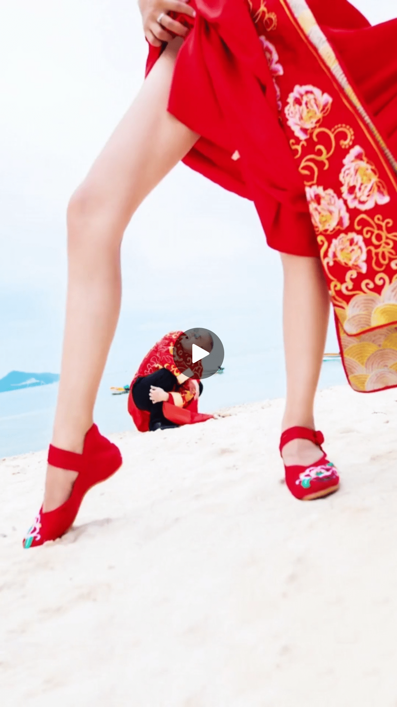
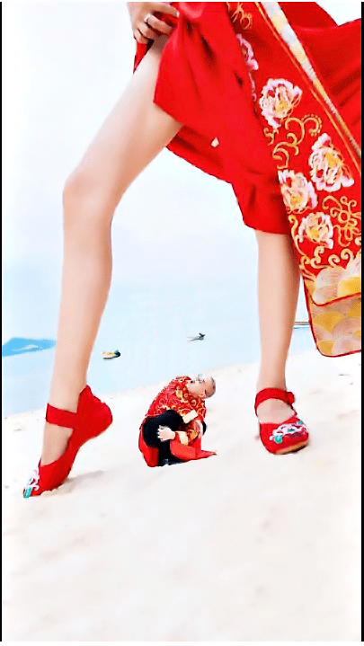
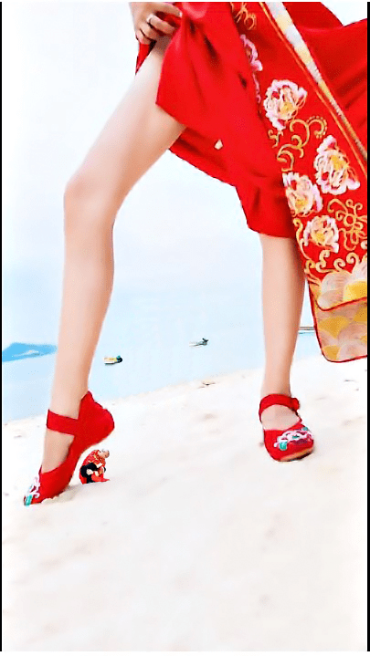

# 婚纱照 擦边球巨人

作者：龙影

TID：25813

<title>1</title> <link href="../Styles/Style.css" type="text/css" rel="stylesheet">

# 1

*本帖最後由 龙影 於 2018-9-11 11:34 編輯*

[http://post.mp.qq.com/kan/video/ ... 980&time=1535870897](http://post.mp.qq.com/kan/video/201123027-8915b8b87b1161aj-rKC6rZ.html?_wv=2281701505&sig=53a9981a3da27bb7ba74ef5b7330d980&time=1535870897)
效果出来那一刻震惊了
<ignore_js_op>

**Screenshot_2018-09-11-11-33-12-652_com.tencent.mtt.png** *(1.13 MB, 下載次數: 2)*

[下載附件](forum.php?mod=attachment&aid=NzQyOTN8N2E1MTJjYmR8MTY3NDA2NzAwOXwxODIzMHwyNTgxMw%3D%3D&nothumb=yes)

2018-9-11 11:34 上傳

<title>2</title> <link href="../Styles/Style.css" type="text/css" rel="stylesheet">

# 2

这个水平一般，他要是把地面拍成一条直线会更好
<title>3</title> <link href="../Styles/Style.css" type="text/css" rel="stylesheet">

# 3

我记得这个 还有个错位拍摄 新娘吞新郎的效果照 <title>4</title> <link href="../Styles/Style.css" type="text/css" rel="stylesheet">

# 4

我觉得他要是拍的时候错位拍成新郎在新娘抬着的那只脚下就更棒了 <title>5</title> <link href="../Styles/Style.css" type="text/css" rel="stylesheet">

# 5

<ignore_js_op>

**1.jpg** *(197.03 KB, 下載次數: 0)*

[下載附件](forum.php?mod=attachment&aid=NzQ1MDh8MjllYjc0NGF8MTY3NDA2NzAwOXwxODIzMHwyNTgxMw%3D%3D&nothumb=yes)

2018-9-12 19:02 上傳

<ignore_js_op>

**0.jpg** *(187.58 KB, 下載次數: 0)*

[下載附件](forum.php?mod=attachment&aid=NzQ1MDd8MGE5YzdiNmR8MTY3NDA2NzAwOXwxODIzMHwyNTgxMw%3D%3D&nothumb=yes)

2018-9-12 19:02 上傳

稍微P了一下，我忽然也想弄这么一套婚纱照。
<title>6</title> <link href="../Styles/Style.css" type="text/css" rel="stylesheet">

# 6

有点厉害.............................. <title>7</title> <link href="../Styles/Style.css" type="text/css" rel="stylesheet">

# 7

我在想，以后结婚的时候直接拍一张GTS的婚纱照吧，我老婆和站在他手心里的我亲亲的照片 <title>8</title> <link href="../Styles/Style.css" type="text/css" rel="stylesheet">

# 8

这类照片拍摄比较简单吧 <title>9</title> <link href="../Styles/Style.css" type="text/css" rel="stylesheet">

# 9

感觉离得远点男的拍的更小比较好，可以在脚后跟那里。</ignore_js_op></ignore_js_op></ignore_js_op>